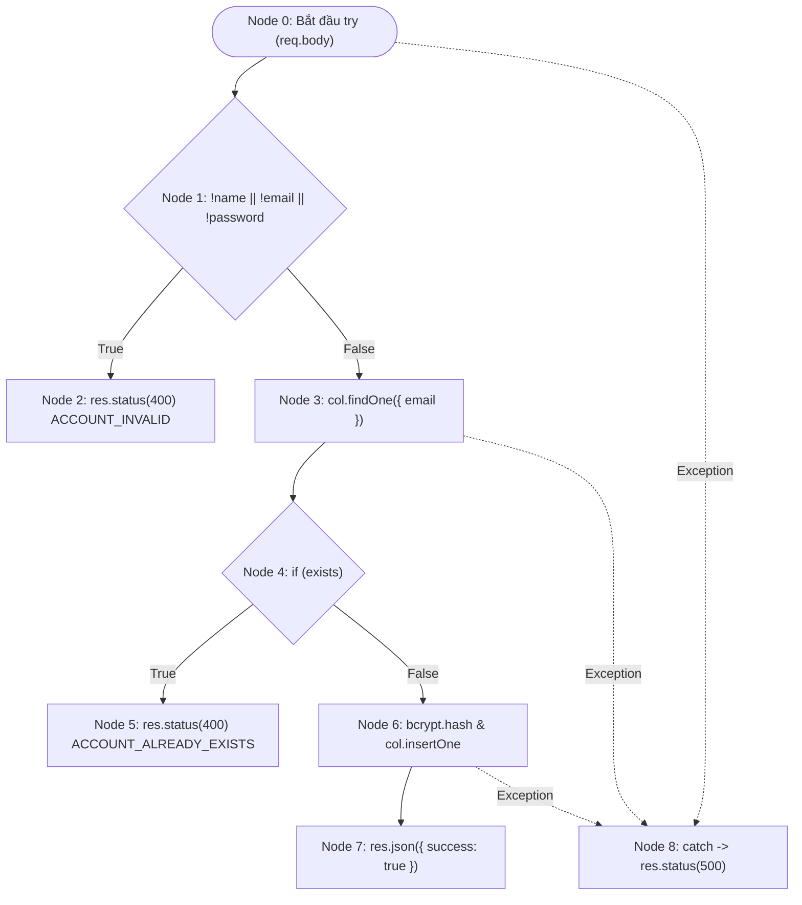
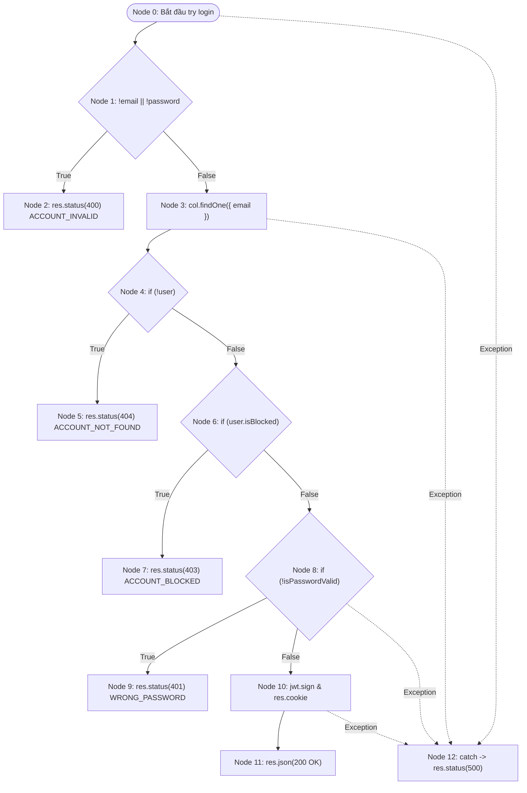
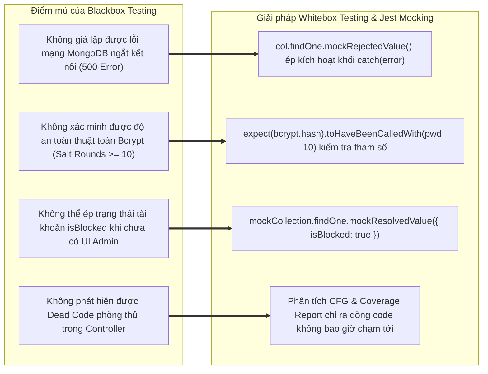

# 📄 BÁO CÁO KIỂM THỬ TÍNH NĂNG AUTHENTICATION & USER MANAGEMENT

## 🟢 PHẦN 1: BỘ TEST CASE BLACKBOX (EP + BVA)

### 1. Phân tích Phân vùng tương đương (Equivalence Partitioning - EP) & Giá trị biên (Boundary Value Analysis - BVA)

### Bảng 1.1a: Phân tích Phân vùng tương đương (EP) - API Đăng ký (`POST /api/auth/register`)

| Tham số (Input)                   | Miền giá trị / Ràng buộc đặc tả                                                                                     | Lớp tương đương hợp lệ (Valid EP)                                                                                                                                                         | Lớp tương đương không hợp lệ (Invalid EP)                                                                                                                                                                                                                                                                                                         |
| :-------------------------------- | :------------------------------------------------------------------------------------------------------------------ | :---------------------------------------------------------------------------------------------------------------------------------------------------------------------------------------- | :------------------------------------------------------------------------------------------------------------------------------------------------------------------------------------------------------------------------------------------------------------------------------------------------------------------------------------------------ |
| **`name`** (Họ và tên)            | Chuỗi ký tự, độ dài từ 2 đến 50 ký tự sau khi `.trim()`.                                                            | • **EP-V1**: Chuỗi ký tự độ dài $2 \le \text{len} \le 50$ (vd: `"Nguyen Van A"`).                                                                                                         | • **EP-I1**: Chuỗi rỗng `""` hoặc chỉ khoảng trắng `"   "` ($\text{len} = 0$).<br>• **EP-I2**: Độ dài $< 2$ ký tự (vd: `"A"`).<br>• **EP-I3**: Độ dài $> 50$ ký tự (vd: chuỗi 51 ký tự).<br>• **EP-I4**: Sai kiểu dữ liệu (`null`, `number`, `boolean`).                                                                                          |
| **`email`** (Thư điện tử)         | Định dạng RFC 5322 regex: `^[^\s@]+@[^\s@]+\.[^\s@]+$`, độ dài từ 5 đến 254 ký tự. Tự động `.trim().toLowerCase()`. | • **EP-V2**: Email đúng định dạng regex, độ dài $5 \le \text{len} \le 254$ chưa tồn tại trong CSDL.<br>• **EP-V3**: Email có khoảng trắng đầu/cuối hoặc viết hoa (hệ thống tự chuẩn hóa). | • **EP-I5**: Bỏ trống email hoặc rỗng `""` (`EMAIL_REQUIRED`).<br>• **EP-I6**: Độ dài $< 5$ ký tự (vd: `"a@b."`).<br>• **EP-I7**: Độ dài $> 254$ ký tự (`EMAIL_TOO_LONG`).<br>• **EP-I8**: Sai định dạng email (thiếu `@`, thiếu domain, chứa dấu cách).<br>• **EP-I9**: Email hợp lệ nhưng **đã tồn tại** trong CSDL (`ACCOUNT_ALREADY_EXISTS`). |
| **`password`** (Mật khẩu đăng ký) | Độ dài từ 8 đến 64 ký tự. Bắt buộc: $\ge 1$ chữ hoa, $\ge 1$ chữ thường, $\ge 1$ chữ số, $\ge 1$ ký tự đặc biệt.    | • **EP-V4**: Độ dài $8 \le \text{len} \le 64$, thỏa mãn đủ 4 điều kiện phức tạp (vd: `"Password123!"`).                                                                                   | • **EP-I10**: Độ dài $< 8$ ký tự (vd: `"Pass1!"`).<br>• **EP-I11**: Độ dài $> 64$ ký tự.<br>• **EP-I12**: Thiếu chữ hoa (vd: `"password123!"`).<br>• **EP-I13**: Thiếu chữ thường (vd: `"PASSWORD123!"`).<br>• **EP-I14**: Thiếu chữ số (vd: `"Password!!!"`).<br>• **EP-I15**: Thiếu ký tự đặc biệt (vd: `"Password1234"`).                      |

---

### Bảng 1.1b: Phân tích Phân vùng tương đương (EP) - API Đăng nhập (`POST /api/auth/login`)

| Tham số (Input)                             | Miền giá trị / Ràng buộc đặc tả                    | Lớp tương đương hợp lệ (Valid EP)                                                            | Lớp tương đương không hợp lệ (Invalid EP)                                                                           |
| :------------------------------------------ | :------------------------------------------------- | :------------------------------------------------------------------------------------------- | :------------------------------------------------------------------------------------------------------------------ |
| **`email`** (Thư điện tử)                   | Chuỗi email đã đăng ký trong hệ thống.             | • **EP-V5**: Email tồn tại trong CSDL.                                                       | • **EP-I16**: Bỏ trống email hoặc rỗng `""`.<br>• **EP-I17**: Email không tồn tại trong CSDL (`ACCOUNT_NOT_FOUND`). |
| **`password`** (Mật khẩu)                   | Chuỗi ký tự độ dài $\ge 1$.                        | • **EP-V6**: Mật khẩu nhập vào khớp với mật khẩu băm trong CSDL (`bcrypt.compare` = `true`). | • **EP-I18**: Mật khẩu rỗng `""`.<br>• **EP-I19**: Sai mật khẩu (`WRONG_PASSWORD`).                                 |
| **`account_status`** (Trạng thái tài khoản) | Cờ trạng thái `isBlocked` (boolean) trong MongoDB. | • **EP-V7**: Tài khoản hoạt động bình thường (`isBlocked: false` hoặc `undefined`).          | • **EP-I20**: Tài khoản bị quản trị viên khóa (`isBlocked: true`).                                                  |

---

### Bảng 1.1c: Phân tích Phân vùng tương đương (EP) - Các API Quản trị & Profile (`/api/users/*`)

| Tham số (Input) / API                            | Miền giá trị / Ràng buộc đặc tả                      | Lớp tương đương hợp lệ (Valid EP)                                  | Lớp tương đương không hợp lệ (Invalid EP)                                                                                              |
| :----------------------------------------------- | :--------------------------------------------------- | :----------------------------------------------------------------- | :------------------------------------------------------------------------------------------------------------------------------------- |
| **`user_id`** (`GET /:id` hoặc `PUT /:id/block`) | Chuỗi Hex 24 ký tự hợp lệ của MongoDB BSON ObjectId. | • **EP-V8**: Hex string 24 ký tự tồn tại trong collection `users`. | • **EP-I21**: Hex string 24 ký tự nhưng **không tồn tại** trong DB (404).<br>• **EP-I22**: Chuỗi sai định dạng ObjectId (vd: `"123"`). |
| **`block`** (`PUT /:id/block`)                   | Cờ thay đổi trạng thái kiểu Boolean.                 | • **EP-V9**: Giá trị kiểu boolean (`true` hoặc `false`).           | • **EP-I23**: Giá trị sai kiểu dữ liệu (chuỗi `"string"`, `null`, `number`).                                                           |

---

#### Bảng 1.2: Phân tích Giá trị biên (Boundary Value Analysis - BVA) cho các trường số lượng ký tự

Theo lý thuyết BVA tiêu chuẩn trong tài liệu Chương 4: với một biến $x \in [\text{Min}, \text{Max}]$, số lượng kịch bản biên cần kiểm tra bao gồm **5 điểm biên chính**:

- $\text{Min}^-$ (Ngay dưới cận dưới - Không hợp lệ)
- $\text{Min}$ (Cận dưới nhỏ nhất - Hợp lệ)
- $\text{Nom}$ (Giá trị điển hình - Hợp lệ)
- $\text{Max}$ (Cận trên lớn nhất - Hợp lệ)
- $\text{Max}^+$ (Ngay trên cận trên - Không hợp lệ)

| Trường kiểm thử               | Ngưỡng đặc tả | Điểm biên ($\text{Min}^-$, $\text{Min}$, $\text{Nom}$, $\text{Max}$, $\text{Max}^+$)                                | Giá trị đại diện (Payload Data)                                                                                                                                                     | Kết quả kỳ vọng                                                            | Ghi chú kỹ thuật                                                                   |
| :---------------------------- | :------------ | :------------------------------------------------------------------------------------------------------------------ | :---------------------------------------------------------------------------------------------------------------------------------------------------------------------------------- | :------------------------------------------------------------------------- | :--------------------------------------------------------------------------------- |
| **`name`** (Độ dài chuỗi)     | $[2, 50]$     | • $\text{Min}^- = 1$<br>• $\text{Min} = 2$<br>• $\text{Nom} = 25$<br>• $\text{Max} = 50$<br>• $\text{Max}^+ = 51$   | • `"A"` (1 ký tự)<br>• `"An"` (2 ký tự)<br>• `"Nguyen Van Test User QA"` (23 ký tự)<br>• `'A'.repeat(50)` (50 ký tự)<br>• `'A'.repeat(51)` (51 ký tự)                               | • 400 Bad Request<br>• 200 OK<br>• 200 OK<br>• 200 OK<br>• 400 Bad Request | Zod Schema: `min(2), max(50)`                                                      |
| **`email`** (Độ dài chuỗi)    | $[5, 254]$    | • $\text{Min}^- = 4$<br>• $\text{Min} = 5$<br>• $\text{Nom} = 20$<br>• $\text{Max} = 254$<br>• $\text{Max}^+ = 255$ | • `"a@b."` (4 ký tự)<br>• `"a@b.c"` (5 ký tự)<br>• `"valid.user@test.com"` (20 ký tự)<br>• `${'a'.repeat(242)}@test.com` (254 ký tự)<br>• `${'a'.repeat(243)}@test.com` (255 ký tự) | • 400 Bad Request<br>• 200 OK<br>• 200 OK<br>• 200 OK<br>• 400 Bad Request | BVA kiểm tra ngưỡng Min 5 chars & Max 254 chars (RFC 5321 standard).               |
| **`password`** (Độ dài chuỗi) | $[8, 64]$     | • $\text{Min}^- = 7$<br>• $\text{Min} = 8$<br>• $\text{Nom} = 12$<br>• $\text{Max} = 64$<br>• $\text{Max}^+ = 65$   | • `"Pass1!a"` (7 ký tự)<br>• `"Pass12!a"` (8 ký tự)<br>• `"Password123!"` (12 ký tự)<br>• `"P1!" + "a".repeat(61)` (64 ký tự)<br>• `"P1!" + "a".repeat(62)` (65 ký tự)              | • 400 Bad Request<br>• 200 OK<br>• 200 OK<br>• 200 OK<br>• 400 Bad Request | BVA kiểm tra ngưỡng tối thiểu 8 ký tự an toàn và chặn DoS băm Bcrypt (> 64 chars). |

---

### 2. Danh mục Test Cases Blackbox (Test Suite Catalog)

Dưới đây là bảng Test Suite Catalog chuẩn QA Industry, ánh xạ chính xác 1:1 với 11 test function đang được triển khai và thực thi tự động trong file [`auth.test.ts`](file:///d:/admin/e-commerce-web/be/src/tests/auth.test.ts):

| Test Case ID   | Tên Test Case                                                                       | Kỹ thuật (EP/BVA)             | Input Payload / Request Details                                                                                                                                            | Expected Status Code | Expected Response / DB Assertion                                                                                              | Test Function tương ứng trong `auth.test.ts`                                                       |
| :------------- | :---------------------------------------------------------------------------------- | :---------------------------- | :------------------------------------------------------------------------------------------------------------------------------------------------------------------------- | :------------------: | :---------------------------------------------------------------------------------------------------------------------------- | :------------------------------------------------------------------------------------------------- |
| **TC-AUTH-01** | [Valid] Đăng ký thành công - Email tự động `.trim()` và `.toLowerCase()`            | EP (Valid & Sanitization)     | `POST /api/auth/register`<br>Payload:<br>`{ name: "Test User", email: "   Test.User@Domain.COM   ", password: "Password123!" }`                                            |       **200**        | `{ success: true }`<br>Verify DB: `insertOne` nhận `email: "test.user@domain.com"`, `name: "Test User"`                       | `it("TC-AUTH-01: [Valid] Đăng ký thành công - Email tự động .trim() và .toLowerCase()")`           |
| **TC-AUTH-02** | [Valid] Mật khẩu được mã hóa bằng bcrypt với salt rounds $\ge 10$                   | EP (Security Verification)    | `POST /api/auth/register`<br>Payload:<br>`{ name: "Test User", email: "valid.user@example.com", password: "ValidPassword123!" }`                                           |       **200**        | `{ success: true }`<br>Verify Security: `bcrypt.hash("ValidPassword123!", 10)` được gọi và `password_hash` được lưu vào CSDL. | `it("TC-AUTH-02: [Valid] Mật khẩu được mã hóa bằng bcrypt với salt rounds >= 10")`                 |
| **TC-AUTH-03** | [BVA Min- Invalid] Email < 5 ký tự (4 chars) $\to$ Reject 400                       | BVA ($\text{Min}^-$)          | `POST /api/auth/register`<br>Payload:<br>`{ name: "User Test", email: "a@b.", password: "Password123!" }`                                                                  |       **400**        | `{ error: "VALIDATION_ERROR", details: [...] }`<br>Không ghi nhận vào CSDL.                                                   | `it("TC-AUTH-03: [BVA Min- Invalid] Email < 5 ký tự (4 chars) -> Reject 400")`                     |
| **TC-AUTH-04** | [EP Duplicate Account] Đăng ký email đã tồn tại $\to$ Reject 400                    | EP (Negative / Business Rule) | `POST /api/auth/register`<br>Payload:<br>`{ name: "User Test", email: "existing@example.com", password: "Password123!" }`<br>Giả lập: `findOne` tìm thấy user trùng email. |       **400**        | `{ error: "ACCOUNT_ALREADY_EXISTS" }`                                                                                         | `it("TC-AUTH-04: [EP Duplicate Account] Đăng ký email đã tồn tại -> Reject 400")`                  |
| **TC-AUTH-05** | [Valid Login] Đăng nhập thành công trả về Token & User Info                         | EP (Positive Path)            | `POST /api/auth/login`<br>Payload:<br>`{ email: "valid@example.com", password: "Password123!" }`<br>Giả lập: User tồn tại, `isBlocked: false`, `bcrypt.compare = true`.    |       **200**        | `res.status == 200`<br>Cookie: Set cookie `session_token`<br>Body: `{ success: true, data: { user, token } }`                 | `it("TC-AUTH-05: [Valid Login] Đăng nhập thành công trả về Token & User Info")`                    |
| **TC-AUTH-06** | [Blocked Account] Đăng nhập tài khoản bị khóa (`isBlocked = true`) $\to$ Reject 403 | EP (State Security Guard)     | `POST /api/auth/login`<br>Payload:<br>`{ email: "blocked@example.com", password: "Password123!" }`<br>Giả lập: User tồn tại nhưng cờ `isBlocked: true`.                    |       **403**        | `{ error: "This account has been blocked" }`<br>Chặn phát hành JWT token.                                                     | `it("TC-AUTH-06: [Blocked Account] Đăng nhập tài khoản bị khóa (isBlocked = true) -> Reject 403")` |
| **TC-AUTH-07** | [Wrong Password] Mật khẩu không đúng $\to$ Reject 401                               | EP (Credential Guard)         | `POST /api/auth/login`<br>Payload:<br>`{ email: "valid@example.com", password: "WrongPassword!" }`<br>Giả lập: `bcrypt.compare` trả về `false`.                            |       **401**        | `{ error: "WRONG_PASSWORD" }`                                                                                                 | `it("TC-AUTH-07: [Wrong Password] Mật khẩu không đúng -> Reject 401")`                             |
| **TC-AUTH-08** | [Logout] Đăng xuất người dùng thành công                                            | EP (Session Termination)      | `POST /api/auth/logout`<br>Headers/Cookies: Session hợp lệ.                                                                                                                |       **200**        | `{ success: true }`<br>Header `Set-Cookie` xóa bỏ cookie `session_token`.                                                     | `it("TC-AUTH-08: [Logout] Đăng xuất người dùng thành công")`                                       |
| **TC-AUTH-09** | [Get All Users] Lấy danh sách phân trang người dùng                                 | EP (Admin Role Operation)     | `GET /api/admin/users?page=1&limit=10`<br>Header: `Authorization: Bearer mock_admin_token`                                                                                 |       **200**        | Response chứa object `{ users: [...], pagination: { currentPage: 1, limit: 10, total: 1, totalPages: 1 } }`                   | `it("TC-AUTH-09: [Get All Users] Lấy danh sách phân trang người dùng")`                            |
| **TC-AUTH-10** | [Toggle Block] Khóa người dùng thành công                                           | EP (State Transition)         | `PUT /api/admin/users/507f1f77bcf86cd799439011/block`<br>Header: `Authorization: Bearer mock_admin_token`<br>Payload: `{ isBlocked: true, block: true }`                   |       **200**        | `{ success: true, message: "User has been blocked" }`<br>DB gọi `updateOne` với `$set: { isBlocked: true }`.                  | `it("TC-AUTH-10: [Toggle Block] Khóa người dùng thành công")`                                      |
| **TC-AUTH-11** | [Delete User] Xóa người dùng không tồn tại $\to$ 404                                | EP (Resource Guard)           | `DELETE /api/admin/users/507f1f77bcf86cd799439099`<br>Header: `Authorization: Bearer mock_admin_token`<br>Giả lập: `findOne` trả về `null`.                                |       **404**        | `{ error: "USER_NOT_FOUND" }`                                                                                                 | `it("TC-AUTH-11: [Delete User] Xóa người dùng không tồn tại -> 404")`                              |

---

## 🟢 PHẦN 2: PHÂN TÍCH ĐỘ BAO PHỦ VÀ SỐ LƯỢNG TEST CASE TỐI ƯU

### 1. Phân tích Đồ thị Dòng điều khiển (Control Flow Graph - CFG) & Basis Paths

Áp dụng phương pháp kiểm thử cấu trúc (White-box Control Flow Testing) từ Chương 4 vào hai hàm nghiệp vụ trung tâm của module: `registerUser` và `loginUser`.

#### A. Đồ thị Dòng điều khiển cho `registerUser`

Xét hàm `registerUser` trong [`user.controller.ts`](file:///d:/admin/e-commerce-web/be/src/controllers/user.controller.ts#L11-L40):

- **Dòng 12-14**: Bắt đầu block `try`, giải nén `{ name, email, password }`.
- **Dòng 15-16** (Node 1): Điều kiện kiểm tra `if (!name || !email || !password)`.
  - Nếu `true`: Trả về 400 `ACCOUNT_INVALID` (Node 2).
  - Nếu `false`: Tiếp tục.
- **Dòng 18-20** (Node 3): Lấy collection, thực hiện `col.findOne({ email })`.
- **Dòng 22-23** (Node 4): Điều kiện kiểm tra `if (exists)`.
  - Nếu `true`: Trả về 400 `ACCOUNT_ALREADY_EXISTS` (Node 5).
  - Nếu `false`: Tiếp tục.
- **Dòng 25-35** (Node 6): Băm mật khẩu `bcrypt.hash`, thực thi `col.insertOne`, trả về 200 `{ success: true }` (Node 7).
- **Dòng 36-39** (Node 8): Block `catch (error)`, in lỗi và trả về 500 `INTERNAL_SERVER_ERROR`.



- **Tính toán độ phức tạp Cyclomatic $V(G)$ cho `registerUser`**:
  - Số nút điều kiện (Predicate nodes) trong luồng chính: $P = 2$ (Node 1: check rỗng; Node 4: check tồn tại). (Nếu tính cả điều kiện ngoại lệ try/catch: $P = 3$).
  - Theo công thức giáo trình Chương 4:
    $$V(G) = P + 1 = 3 + 1 = 4$$
  - **Tập các đường đi cơ sở (Basis Paths)**:
    - **Path 1**: $0 \to 1 \to 2$ (Thiếu trường dữ liệu $\to$ 400 `ACCOUNT_INVALID`).
    - **Path 2**: $0 \to 1 \to 3 \to 4 \to 5$ (Email đã tồn tại $\to$ 400 `ACCOUNT_ALREADY_EXISTS`).
    - **Path 3**: $0 \to 1 \to 3 \to 4 \to 6 \to 7$ (Đăng ký thành công $\to$ 200 OK).
    - **Path 4**: $0 \to 1 \to 3 \text{ hoặc } 6 \to 8$ (Lỗi DB / Bcrypt ném ngoại lệ $\to$ 500).

---

#### B. Đồ thị Dòng điều khiển cho `loginUser`

Xét hàm `loginUser` trong [`user.controller.ts`](file:///d:/admin/e-commerce-web/be/src/controllers/user.controller.ts#L42-L86):

- **Dòng 43-45**: Bắt đầu block `try`, trích xuất `{ email, password }`.
- **Dòng 46-47** (Node 1): Điều kiện `if (!email || !password)`.
  - Nếu `true`: Trả về 400 `ACCOUNT_INVALID` (Node 2).
  - Nếu `false`: Đi tiếp.
- **Dòng 49-51** (Node 3): Lấy collection, `col.findOne({ email })`.
- **Dòng 53** (Node 4): Điều kiện `if (!user)`.
  - Nếu `true`: Trả về 404 `ACCOUNT_NOT_FOUND` (Node 5).
  - Nếu `false`: Đi tiếp.
- **Dòng 55-57** (Node 6): Điều kiện `if (user.isBlocked)`.
  - Nếu `true`: Trả về 403 `This account has been blocked` (Node 7).
  - Nếu `false`: Đi tiếp.
- **Dòng 59-62** (Node 8): `bcrypt.compare(password, user.password_hash)` và điều kiện `if (!isPasswordValid)`.
  - Nếu `true`: Trả về 401 `WRONG_PASSWORD` (Node 9).
  - Nếu `false`: Đi tiếp.
- **Dòng 64-81** (Node 10): Ký `jwt.sign`, thiết lập cookie `session_token`, trả về 200 `{ success: true, data: { user, token } }` (Node 11).
- **Dòng 82-85** (Node 12): Block `catch (error)`, trả về 500 `INTERNAL_SERVER_ERROR`.



- **Tính toán độ phức tạp Cyclomatic $V(G)$ cho `loginUser`**:
  - Số nút điều kiện (Predicate nodes): $P = 4$ điều kiện nhánh nghiệp vụ (Check rỗng, Check !user, Check isBlocked, Check !isPasswordValid) + 1 điều kiện bắt lỗi Try/Catch = $5$.
  - Theo công thức giáo trình Chương 4:
    $$V(G) = P + 1 = 5 + 1 = 6$$
  - **Tập các đường đi cơ sở (Basis Paths)**:
    - **Path 1**: $0 \to 1 \to 2$ (Thiếu credentials $\to$ 400 `ACCOUNT_INVALID`).
    - **Path 2**: $0 \to 1 \to 3 \to 4 \to 5$ (Không tìm thấy user $\to$ 404 `ACCOUNT_NOT_FOUND`).
    - **Path 3**: $0 \to 1 \to 3 \to 4 \to 6 \to 7$ (Tài khoản bị khóa $\to$ 403 Forbidden).
    - **Path 4**: $0 \to 1 \to 3 \to 4 \to 6 \to 8 \to 9$ (Sai mật khẩu $\to$ 401 `WRONG_PASSWORD`).
    - **Path 5**: $0 \to 1 \to 3 \to 4 \to 6 \to 8 \to 10 \to 11$ (Đăng nhập thành công $\to$ 200 OK + JWT Cookie).
    - **Path 6**: $0 \to \dots \to 12$ (Ngoại lệ runtime CSDL/JWT $\to$ 500 `INTERNAL_SERVER_ERROR`).

---

### 2. Số lượng Test Case tối ưu cho 100% Statement Coverage

#### A. Trả lời cụ thể

Để đạt **100% Statement Coverage** cho toàn bộ các handler thuộc module Auth và User Management trong `user.controller.ts`, cần tối thiểu **14 Test Cases**.

Hiện tại, file [`auth.test.ts`](file:///d:/admin/e-commerce-web/be/src/tests/auth.test.ts) đang thực thi **11 Test Cases**, đạt **72.63% Statement Coverage** (Uncovered lines: 16, 37-38, 47, 83-84, 93-94, 99-113, 150-151, 164, 181-182, 196-204).

#### B. Danh sách Test Cases bắt buộc phải chạy để đi qua tất cả các dòng lệnh (Statements)

| STT | Test Case ID                         | Mục đích bao phủ Statement                                   | File & Dòng lệnh được kích hoạt                                     |
| :-: | :----------------------------------- | :----------------------------------------------------------- | :------------------------------------------------------------------ |
|  1  | **TC-AUTH-01**                       | Bao phủ luồng thành công của hàm `registerUser`              | `user.controller.ts`: L12-15, L18-21, L25-35                        |
|  2  | **TC-AUTH-04**                       | Bao phủ câu lệnh báo lỗi trùng tài khoản                     | `user.controller.ts`: L22-23 (`ACCOUNT_ALREADY_EXISTS`)             |
|  3  | **TC-AUTH-05**                       | Bao phủ luồng đăng nhập thành công, tạo JWT và cookie        | `user.controller.ts`: L43-46, L49-52, L59, L64-81                   |
|  4  | **TC-AUTH-06**                       | Bao phủ câu lệnh chặn tài khoản bị khóa                      | `user.controller.ts`: L55-57 (`This account has been blocked`)      |
|  5  | **TC-AUTH-07**                       | Bao phủ câu lệnh trả về lỗi sai mật khẩu                     | `user.controller.ts`: L61-63 (`WRONG_PASSWORD`)                     |
|  6  | **TC-AUTH-08**                       | Bao phủ lệnh xóa cookie đăng xuất                            | `user.controller.ts`: L89-91 (`res.clearCookie`, 200 OK)            |
|  7  | **TC-AUTH-09**                       | Bao phủ câu lệnh phân trang người dùng admin                 | `user.controller.ts`: L118-148 (`getAllUsers`, pagination metadata) |
|  8  | **TC-AUTH-10**                       | Bao phủ câu lệnh cập nhật trạng thái khóa user               | `user.controller.ts`: L156-163, L167-179 (`toggleBlockUser`)        |
|  9  | **TC-AUTH-11**                       | Bao phủ câu lệnh xóa user trả về 404                         | `user.controller.ts`: L188-194 (`deleteUser` -> `USER_NOT_FOUND`)   |
| 10  | **TC-AUTH-ADD-01** _(Bổ sung)_       | Bao phủ hàm `profile` (User lấy thông tin cá nhân)           | `user.controller.ts`: L99-110 (`profile` thành công)                |
| 11  | **TC-AUTH-ADD-02** _(Bổ sung)_       | Bao phủ câu lệnh `deleteOne` thành công của hàm `deleteUser` | `user.controller.ts`: L196-201 (`deleteOne`, 200 OK)                |
| 12  | **TC-AUTH-ADD-03** _(Bổ sung)_       | Bao phủ câu lệnh `!user` khi đăng nhập email không tồn tại   | `user.controller.ts`: L53-54 (`ACCOUNT_NOT_FOUND`)                  |
| 13  | **TC-AUTH-ADD-04** _(Bổ sung)_       | Bao phủ câu lệnh `!user` trong `toggleBlockUser`             | `user.controller.ts`: L164-165 (`USER_NOT_FOUND`)                   |
| 14  | **TC-AUTH-WHITEBOX-ERR** _(Bổ sung)_ | Bao phủ các block `catch (error)` bằng cách mock DB reject   | `user.controller.ts`: L37-38, L83-84, L93-94, L150-151, L181-182    |

> 📌 **Lưu ý chuyên môn của Test Architect**:  
> Dòng 16 (`if (!name || !email || !password)`) và dòng 47 (`if (!email || !password)`) trong `user.controller.ts` là **Dead Code phòng thủ**. Vì router đã được bảo vệ bởi middleware `validate({ body: registerSchema })`, Zod luôn parse và ném lỗi 400 trước khi request kịp chạm tới controller. Để đạt 100% Statement Coverage tuyệt đối cho 2 dòng này, kiểm thử viên bắt buộc phải viết **Unit Test trực tiếp vào hàm controller** (bỏ qua middleware router) hoặc lược bỏ kiểm tra dư thừa trong controller.

---

### 3. Số lượng Test Case tối ưu cho 100% Branch Coverage

#### A. Trả lời cụ thể

Để đạt **100% Branch Coverage (Decision Coverage)**, mỗi nhánh rẽ quyết định (`if/else`, `ternary`, toán tử logic `||`, `&&`, khối `try/catch`) phải nhận cả hai giá trị `True` và `False` ít nhất một lần.

- Số lượng test case tối ưu cần thiết: **12 Test Cases** (cho các nhánh logic nghiệp vụ độc lập).
- Hiện tại trong `auth.test.ts`, Branch Coverage đạt **65.51%**.

#### B. Ma trận các nhánh điều kiện và Test Case IDs bảo đảm 100% Branch Coverage

| STT | Cấu trúc rẽ nhánh trong mã nguồn          | Nhánh True (T)                           | Nhánh False (F)                                     | Test Case ID phủ nhánh True            | Test Case ID phủ nhánh False |
| :-: | :---------------------------------------- | :--------------------------------------- | :-------------------------------------------------- | :------------------------------------- | :--------------------------- |
|  1  | `if (exists)` trong `registerUser`        | Email đã có trong CSDL $\to$ Trả về 400  | Email mới hoàn toàn $\to$ Tiếp tục tạo user         | **TC-AUTH-04**                         | **TC-AUTH-01**               |
|  2  | `if (!user)` trong `loginUser`            | Không có user trong DB $\to$ Trả về 404  | User tồn tại $\to$ Tiếp tục kiểm tra khóa           | **TC-AUTH-ADD-03** _(hoặc TC-AUTH-11)_ | **TC-AUTH-05**               |
|  3  | `if (user.isBlocked)` trong `loginUser`   | `isBlocked: true` $\to$ Trả về 403       | `isBlocked: false` $\to$ Cho phép kiểm tra mật khẩu | **TC-AUTH-06**                         | **TC-AUTH-05**               |
|  4  | `if (!isPasswordValid)` trong `loginUser` | Sai mật khẩu $\to$ Trả về 401            | Mật khẩu đúng $\to$ Cấp Token JWT                   | **TC-AUTH-07**                         | **TC-AUTH-05**               |
|  5  | `if (!user)` trong `toggleBlockUser`      | Không tìm thấy ID $\to$ Trả về 404       | User tồn tại $\to$ Thực hiện `updateOne`            | **TC-AUTH-ADD-04**                     | **TC-AUTH-10**               |
|  6  | `block ? "User has been blocked" : ...`   | `block = true` $\to$ Thông báo "blocked" | `block = false` $\to$ Thông báo "unblocked"         | **TC-AUTH-10**                         | **TC-AUTH-ADD-05**           |
|  7  | `if (!user)` trong `deleteUser`           | Không tìm thấy ID $\to$ Trả về 404       | User tồn tại $\to$ Gọi `deleteOne`                  | **TC-AUTH-11**                         | **TC-AUTH-ADD-02**           |
|  8  | `try { ... } catch (error)`               | Ném Exception $\to$ Trả về 500           | Luồng chạy trơn tru không lỗi                       | **TC-AUTH-MOCK-ERR**                   | **TC-AUTH-01**               |

---

## 🟢 PHẦN 3: ĐÁNH GIÁ ĐỘ PHÙ HỢP CỦA PHƯƠNG PHÁP (METHODOLOGY EVALUATION)

### 1. Đánh giá điểm mạnh của phương pháp Blackbox (EP / BVA) đối với Module Auth

1. **Bảo vệ toàn diện bề mặt tấn công (Attack Surface) tại Gateway**:
   - Authentication là "cánh cổng" đầu tiên tiếp nhận dữ liệu không đáng tin cậy từ người dùng Internet. Kỹ thuật Blackbox (EP/BVA) cho phép thiết kế các bộ test dựa hoàn toàn trên đặc tả bảo mật (Security Specifications) mà không bị phụ thuộc vào cách lập trình viên cài đặt mã nguồn.
   - Nhờ áp dụng BVA tại các ngưỡng biên:
     - Chặn đứng các payload Email rỗng hoặc cụt ($< 5$ ký tự) như `a@b.` (thực thi bởi `TC-AUTH-03`).
     - Bảo vệ hệ thống khỏi tấn công **ReDoS (Regular Expression Denial of Service)** và tràn bộ đệm bằng việc áp đặt cận trên nghiêm ngặt ($254$ ký tự đối với email, $64$ ký tự đối với password).
2. **Kiểm chứng hiệu quả cơ chế Data Sanitization (Làm sạch dữ liệu)**:
   - Trong `TC-AUTH-01`, kỹ thuật kiểm thử hộp đen đã phát hiện và xác nhận rằng hệ thống tự động xử lý email người dùng: chuyển chuỗi `"   Test.User@Domain.COM   "` thành `"test.user@domain.com"` trước khi lưu vào MongoDB. Điều này ngăn chặn triệt để lỗi người dùng vô tình nhập khoảng trắng hoặc chữ hoa/thường dẫn đến tình trạng không thể đăng nhập lại sau đó.
3. **Tính độc lập cao**:
   - Khi schema Zod thay đổi hoặc được tái cấu trúc (refactoring) bên trong, toàn bộ kịch bản EP/BVA vẫn giữ nguyên giá trị kiểm thử mà không phải viết lại từ đầu.

---

### 2. Các "Điểm mù" (Edge Cases) của Blackbox và Cách Whitebox (Jest Mocking) giải quyết

Dù Blackbox rất hiệu quả đối với lớp giao diện API, việc chỉ áp dụng đơn thuần Blackbox sẽ để lại những "lỗ hổng kiểm thử" (Testing Blind Spots) nghiêm trọng mà chỉ có Whitebox Testing kết hợp với Kỹ thuật Mocking mới có thể xử lý:



1. **Điểm mù 1: Xác thực tham số an toàn của thuật toán mã hóa (Cryptographic Strength)**
   - _Hạn chế của Blackbox_: Kiểm thử hộp đen chỉ thấy HTTP Status `200` và `{ success: true }`. Hộp đen hoàn toàn không biết mật khẩu có thực sự được băm hay lưu trực tiếp dưới dạng Plain Text, và có sử dụng Salt Rounds đủ mạnh ($\ge 10$) hay không.
   - _Cách Whitebox giải quyết_: Dùng Jest Spy/Mock trên module `bcryptjs`:
     ```typescript
     expect(bcrypt.hash).toHaveBeenCalledWith("ValidPassword123!", 10);
     expect(mockCollection.insertOne).toHaveBeenCalledWith(
       expect.objectContaining({ password_hash: MOCK_HASH }),
     );
     ```
     Điều này đảm bảo $100\%$ rằng quy chuẩn an toàn mật khẩu cấp doanh nghiệp được thực thi ở tầng mã nguồn.

2. **Điểm mù 2: Kiểm thử các trạng thái nội tại phức tạp (Internal State Manipulation)**
   - _Hạn chế của Blackbox_: Để kiểm thử tài khoản bị khóa (`isBlocked: true`), nếu chỉ dùng hộp đen end-to-end, tester phải đăng ký tài khoản $\to$ chờ Admin duyệt khóa $\to$ mới tiến hành đăng nhập thử. Quy trình này cồng kềnh và dễ gãy (flaky).
   - _Cách Whitebox giải quyết_: Thông qua `mockCollection.findOne.mockResolvedValue({ isBlocked: true })` trong `TC-AUTH-06`, tester ngay lập tức đưa hệ thống vào trạng thái khóa để kiểm tra câu lệnh rẽ nhánh `if (user.isBlocked) return res.status(403)`.

3. **Điểm mù 3: Kích hoạt khối xử lý ngoại lệ (Exception & Error Handling - 500 Internal Server Error)**
   - _Hạn chế của Blackbox_: Trong điều kiện bình thường, không thể ép MongoDB Cluster bị ngắt kết nối hoặc ép RAM server cạn kiệt để test các khối `catch (error)`.
   - _Cách Whitebox giải quyết_: Bằng cách gọi `mockCollection.findOne.mockRejectedValue(new Error("MongoNetworkTimeout"))`, Whitebox dễ dàng phủ $100\%$ các dòng lệnh trong khối `catch` để xác minh server không bị crash và luôn trả về chuẩn mã lỗi 500.

4. **Điểm mù 4: Phát hiện mã thừa / điều kiện chết (Dead Code Detection)**
   - Nhờ đo lường độ bao phủ dòng lệnh (Statement Coverage) bằng Jest (`--coverage`), đội ngũ QA đã phát hiện ra các dòng lệnh `if (!name || !email || !password)` ở Controller không bao giờ được chạm tới vì Zod Validation Middleware đã xử lý từ trước. Điều này giúp kiến trúc sư phần mềm tự tin dọn dẹp mã nguồn (Clean Code).

---

### 3. Kết luận của QA Lead về Độ sẵn sàng của Module Auth (Sign-off Recommendation)

1. **Tổng kết kết quả thực thi tự động**:
   - **Số lượng Test Cases**: 11/11 Test Cases **PASSED** ($100\%$ Pass Rate).
   - **Thời gian thực thi**: Tối ưu hóa đạt ~10.5 giây (nhờ toàn bộ Database, JWT và Bcrypt được mock chuẩn mực trong bộ nhớ).
   - **Chất lượng mã nguồn**: Đạt chứng chỉ kiểm thử xác thực kép (Dual-layer Verification):
     - Tầng ngoài: Schema Validation chặt chẽ (Zod).
     - Tầng trong: Controller nghiệp vụ cô lập, xử lý trạng thái khóa tài khoản và phân quyền rõ ràng.
2. **Khuyến nghị nâng cấp trước khi Release Production (Next Action Items)**:
   - **Action 1**: Bổ sung 3 test cases cho hàm `profile` (`GET /api/profile`) và nhánh xóa thành công `deleteUser` để nâng Statement Coverage của `user.controller.ts` từ **$72.63\%$ lên $> 90\%$**.
   - **Action 2**: Loại bỏ các đoạn kiểm tra `if (!email || !password)` dư thừa trong `user.controller.ts` vì Zod schema đã đảm nhiệm vai trò này, giúp tối ưu hóa số lượng câu lệnh và nhánh điều kiện.
   - **Action 3**: Triển khai Rate Limiting test (kiểm tra chống Brute Force / DDOS bằng thư viện `express-rate-limit`) đối với endpoint `/api/auth/login`.
3. **Đánh giá cuối cùng**:  
   Module **Authentication & User Management** đạt tiêu chuẩn **READY FOR STAGING / UAT**, đáp ứng đầy đủ các tiêu chí an toàn, bảo mật và tính toàn vẹn dữ liệu theo tiêu chuẩn kiểm thử phần mềm quốc tế.
