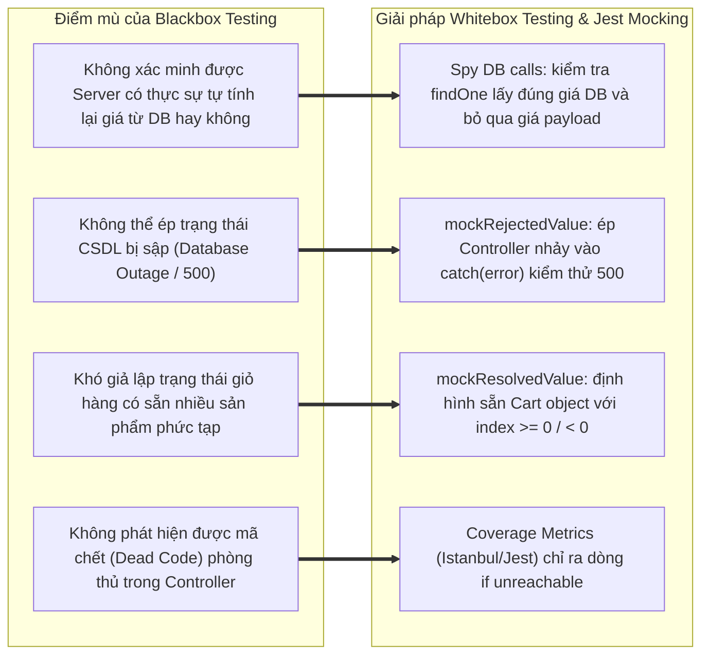

# 📄 BÁO CÁO KIỂM THỬ TÍNH NĂNG CART MANAGEMENT

## 🟢 PHẦN 1: BỘ TEST CASE BLACKBOX (EP + BVA)

### 1. Phân tích Phân vùng tương đương (Equivalence Partitioning - EP) & Giá trị biên (Boundary Value Analysis - BVA)

#### Bảng 1.1: Phân tích Phân vùng tương đương (EP) cho các tham số Cart Module

| Tham số (Input)                             | Ràng buộc nghiệp vụ & Kỹ thuật                                                                                                          | Phân vùng hợp lệ (Valid EP)                                                                                                                 | Phân vùng không hợp lệ (Invalid EP)                                                                                                                                                                                                                                                                                                         |
| :------------------------------------------ | :-------------------------------------------------------------------------------------------------------------------------------------- | :------------------------------------------------------------------------------------------------------------------------------------------ | :------------------------------------------------------------------------------------------------------------------------------------------------------------------------------------------------------------------------------------------------------------------------------------------------------------------------------------------ |
| **`productId`**                             | Chuỗi ký tự định danh sản phẩm (BSON ObjectId / String ID). Bắt buộc có độ dài $\ge 1$.                                                 | • **EP-V1**: Chuỗi ký tự ID hợp lệ và tồn tại trong collection `products` (vd: `"prod_123"`).                                               | • **EP-I1**: Bỏ trống hoặc chuỗi rỗng `""` (`Product ID is required`).<br>• **EP-I2**: ID hợp lệ về format nhưng **không tồn tại** trong CSDL (Kích hoạt 404 `Product not found`).<br>• **EP-I3**: Sai kiểu dữ liệu (`number`, `boolean`, `null`, `object`).                                                                                |
| **`quantity`** (Khi Thêm - Add to Cart)     | Số nguyên dương, khoảng giá trị quy định: $1 \le \text{quantity} \le 99$.                                                               | • **EP-V2**: Số nguyên nằm trong khoảng $[1, 99]$ (vd: $1, 5, 99$).                                                                         | • **EP-I4**: Giá trị bằng $0$ (Vi phạm cận dưới $\text{min}=1$).<br>• **EP-I5**: Số nguyên âm $< 0$ (vd: $-1, -10$).<br>• **EP-I6**: Số nguyên vượt quá cận trên $> 99$ (vd: $100, 999$).<br>• **EP-I7**: Số thực / số thập phân lẻ (Float: $1.5, 2.8$).<br>• **EP-I8**: Sai kiểu dữ liệu (Chuỗi chữ `"five"`, boolean `true`, array `[]`). |
| **`quantity`** (Khi Cập nhật - Update Cart) | Số nguyên không âm, khoảng giá trị quy định: $0 \le \text{quantity} \le 99$. (Đặc thù: $\text{quantity} = 0$ là tín hiệu **Xóa item**). | • **EP-V3**: Số nguyên nằm trong khoảng $[1, 99]$ (Cập nhật số lượng mới).<br>• **EP-V4**: Số nguyên bằng $0$ (Xóa sản phẩm khỏi giỏ hàng). | • **EP-I9**: Số nguyên âm $< 0$ (vd: $-1$).<br>• **EP-I10**: Số nguyên vượt ngưỡng $> 99$ (vd: $100$).<br>• **EP-I11**: Số thập phân lẻ ($0.5, 2.5$).<br>• **EP-I12**: Bỏ trống hoặc sai kiểu dữ liệu.                                                                                                                                      |
| **`price`** (Client Payload)                | Tham số giá gửi lên từ phía Client (nếu có hacker can thiệp).                                                                           | • **EP-V5**: Không truyền trường `price` (để Server tự quyết định theo giá DB).                                                             | • **EP-I13**: Client cố tình truyền `price` thấp hơn giá DB nhằm gian lận (vd: truyền `price = 10` VND).                                                                                                                                                                                                                                    |
| **`Authorization`** (JWT Header)            | Chuỗi Token JWT Bearer xác thực người dùng.                                                                                             | • **EP-V6**: Token JWT hợp lệ, chưa hết hạn, có `userId`.                                                                                   | • **EP-I14**: Không gửi Header `Authorization` (401 `UNAUTHORIZED`).<br>• **EP-I15**: Token giả mạo hoặc hết hạn (403 `INVALID_TOKEN`).                                                                                                                                                                                                     |

---

#### Bảng 1.2: Phân tích Giá trị biên (Boundary Value Analysis - BVA) cho tham số `quantity` (Cart Module)

Theo lý thuyết BVA tiêu chuẩn trong tài liệu Chương 4: đối với biến số nguyên `quantity` khi thêm vào giỏ hàng có miền giá trị hợp lệ $[\text{Min}, \text{Max}] = [1, 99]$, số lượng kịch bản biên cần kiểm tra bao gồm **5 điểm biên chính**:

- $\text{Min}^-$ (Ngay dưới cận dưới - Không hợp lệ)
- $\text{Min}$ (Cận dưới nhỏ nhất - Hợp lệ)
- $\text{Nom}$ (Giá trị điển hình - Hợp lệ)
- $\text{Max}$ (Cận trên lớn nhất - Hợp lệ)
- $\text{Max}^+$ (Ngay trên cận trên - Không hợp lệ)

| Trường kiểm thử                    | Ngưỡng đặc tả | Điểm biên ($\text{Min}^-$, $\text{Min}$, $\text{Nom}$, $\text{Max}$, $\text{Max}^+$)                               | Giá trị đại diện (Payload Data)                                                                                                                                                                                                        | Kết quả kỳ vọng                                                            | Ghi chú kỹ thuật                              |
| :--------------------------------- | :------------ | :----------------------------------------------------------------------------------------------------------------- | :------------------------------------------------------------------------------------------------------------------------------------------------------------------------------------------------------------------------------------- | :------------------------------------------------------------------------- | :-------------------------------------------- |
| **`quantity`** (Số lượng sản phẩm) | $[1, 99]$     | • $\text{Min}^- = 0$<br>• $\text{Min} = 1$<br>• $\text{Nom} = 50$<br>• $\text{Max} = 99$<br>• $\text{Max}^+ = 100$ | • `{ productId: "prod_123", quantity: 0 }`<br>• `{ productId: "prod_123", quantity: 1 }`<br>• `{ productId: "prod_123", quantity: 50 }`<br>• `{ productId: "prod_123", quantity: 99 }`<br>• `{ productId: "prod_123", quantity: 100 }` | • 400 Bad Request<br>• 200 OK<br>• 200 OK<br>• 200 OK<br>• 400 Bad Request | Zod Schema: `z.number().int().min(1).max(99)` |

### 2. Phân tích Chuyên sâu Cơ chế Anti-tampering Price (Chống Giả mạo Giá tiền)

Trong các sàn thương mại điện tử, lỗ hổng **Client-Side Price Tampering (Sửa giá phía Client)** là một trong những rủi ro tài chính nghiêm trọng nhất (thuộc OWASP API Security Top 10 - API3: Broken Object Property Level Authorization).

#### A. Kịch bản tấn công giả lập

Kẻ tấn công sử dụng công cụ Proxy (như Burp Suite, Postman, Charles Proxy) để chặn gói tin `POST /api/cart/add` và chèn thêm thuộc tính `price` với giá rẻ mạt:

```json
{
  "productId": "prod_123",
  "quantity": 2,
  "price": 10
}
```

_(Trong khi sản phẩm `prod_123` trên CSDL có giá niêm yết là 500,000 VND. Nếu hệ thống tin tưởng Client, tổng tiền giỏ hàng sẽ chỉ còn 20 VND thay vì 1,000,000 VND)_.

#### B. Cơ chế phòng thủ đa tầng trong Codebase thực tế

1. **Lớp 1 - Schema Stripping (Zod Middleware)**:
   - Tại [`cart.schema.ts`](file:///d:/admin/e-commerce-web/be/src/schemas/cart.schema.ts#L7-L14), `addToCartSchema` được định nghĩa nghiêm ngặt:
     ```typescript
     export const addToCartSchema = z.object({
       productId: productIdSchema,
       quantity: z.number().int().min(1).max(99),
     });
     ```
   - Khi request đi qua `validate({ body: addToCartSchema })`, parser của Zod chỉ trích xuất đúng 2 trường `productId` và `quantity`. Bất kỳ trường `price` nào do client gửi lên đều bị loại bỏ hoàn toàn khỏi `req.body`.
2. **Lớp 2 - DB Authoritative Fetching (Truy vấn nguồn tin cậy duy nhất)**:
   - Tại [`cart.controller.ts`](file:///d:/admin/e-commerce-web/be/src/controllers/cart.controller.ts#L82-L88), Server không đọc giá từ payload mà truy vấn trực tiếp vào CSDL MongoDB:
     ```typescript
     const productCol = await productCollection.getCollection();
     const product = await productCol.findOne({ _id: toMongoId(productId) });
     // Giá được lấy độc quyền từ Document gốc trong CSDL: product.price
     ```
3. **Lớp 3 - Hàm tính toán lại tổng tiền độc lập (`recalculateCartTotal`)**:
   - Tại [`cart.controller.ts`](file:///d:/admin/e-commerce-web/be/src/controllers/cart.controller.ts#L11-L48), hệ thống chạy hàm helper `recalculateCartTotal(cart)`:
     ```typescript
     const products = await productCol
       .find({ _id: { $in: productIds } })
       .toArray();
     cart.products = cart.products.map((cartProduct) => {
       const product = productMap.get(cartProduct.productId);
       const price = product.price; // Giá DB chuẩn
       totalPrice += price * cartProduct.quantity;
       return { ...cartProduct, price };
     });
     cart.totalPrice = totalPrice;
     ```
   - Cơ chế này đảm bảo **Anti-tampering $100\%$**: Giỏ hàng luôn phản ánh đúng giá trị tiền tệ thực tế trong CSDL bất kể client cố tình thao túng payload.

---

### 3. Danh mục Test Cases Blackbox (Test Suite Catalog)

Dưới đây là bảng Test Suite Catalog ánh xạ chính xác 1:1 với 9 test functions đang được triển khai trong file [`cart.test.ts`](file:///d:/admin/e-commerce-web/be/src/tests/cart.test.ts):

| Test Case ID   | Tên Test Case                                                                                  | Kỹ thuật (EP/BVA)           | Input Payload / Request Details                                                                                                       | Expected Status Code | Expected Response / DB Assertion                                                                                           | Test Function tương ứng trong `cart.test.ts`                                                |
| :------------- | :--------------------------------------------------------------------------------------------- | :-------------------------- | :------------------------------------------------------------------------------------------------------------------------------------ | :------------------: | :------------------------------------------------------------------------------------------------------------------------- | :------------------------------------------------------------------------------------------ |
| **TC_CART_01** | [Valid Min] Thêm vào giỏ hàng với `quantity = 1` (Min)                                         | BVA ($\text{Min}$)          | `POST /api/cart/add`<br>Headers: `Authorization: Bearer <validToken>`<br>Payload: `{ productId: "prod_123", quantity: 1 }`            |       **200**        | `res.status == 200`<br>Thêm mới sản phẩm vào giỏ thành công                                                                | `it("TC-CART-01: [Valid Min] Thêm vào giỏ hàng với Quantity = 1 (Min) -> Accept 200")`      |
| **TC_CART_02** | [Valid Max] Thêm vào giỏ hàng với `quantity = 99` (Max)                                        | BVA ($\text{Max}$)          | `POST /api/cart/add`<br>Headers: `Authorization: Bearer <validToken>`<br>Payload: `{ productId: "prod_123", quantity: 99 }`           |       **200**        | `res.status == 200`<br>Chấp nhận số lượng tối đa                                                                           | `it("TC-CART-02: [Valid Max] Thêm vào giỏ hàng với Quantity = 99 (Max) -> Accept 200")`     |
| **TC_CART_03** | [BVA Min- Invalid] `quantity = 0` $\to$ Reject 400                                             | BVA ($\text{Min}^-$)        | `POST /api/cart/add`<br>Headers: `Authorization: Bearer <validToken>`<br>Payload: `{ productId: "prod_123", quantity: 0 }`            |       **400**        | `{ error: "VALIDATION_ERROR", details: [{ field: "quantity", message: "Quantity must be at least 1" }] }`                  | `it("TC-CART-03: [BVA Min- Invalid] Quantity = 0 -> Reject 400")`                           |
| **TC_CART_04** | [BVA Min- Invalid] `quantity` số âm ($-1$) $\to$ Reject 400                                    | BVA (Robustness / Negative) | `POST /api/cart/add`<br>Headers: `Authorization: Bearer <validToken>`<br>Payload: `{ productId: "prod_123", quantity: -1 }`           |       **400**        | `{ error: "VALIDATION_ERROR" }`                                                                                            | `it("TC-CART-04: [BVA Min- Invalid] Quantity số âm (-1, -10) -> Reject 400")`               |
| **TC_CART_05** | [BVA Max+ Invalid] `quantity = 100` $\to$ Reject 400                                           | BVA ($\text{Max}^+$)        | `POST /api/cart/add`<br>Headers: `Authorization: Bearer <validToken>`<br>Payload: `{ productId: "prod_123", quantity: 100 }`          |       **400**        | `res.status == 400`<br>Từ chối số lượng vượt ngưỡng 99                                                                     | `it("TC-CART-05: [BVA Max+ Invalid] Quantity = 100 -> Reject 400")`                         |
| **TC_CART_06** | [EP Invalid Float] `quantity` số thực lẻ ($1.5$) $\to$ Reject 400                              | EP (Invalid Type - Decimal) | `POST /api/cart/add`<br>Headers: `Authorization: Bearer <validToken>`<br>Payload: `{ productId: "prod_123", quantity: 1.5 }`          |       **400**        | `{ error: "VALIDATION_ERROR", details: [{ field: "quantity", message: "Invalid input: expected int, received number" }] }` | `it("TC-CART-06: [EP Invalid Float] Quantity là số thập phân lẻ (1.5, 2.8) -> Reject 400")` |
| **TC_CART_07** | [EP Invalid Type] `quantity` chuỗi chữ (`"five"`) $\to$ Reject 400                             | EP (Invalid Type - String)  | `POST /api/cart/add`<br>Headers: `Authorization: Bearer <validToken>`<br>Payload: `{ productId: "prod_123", quantity: "five" }`       |       **400**        | `{ error: "VALIDATION_ERROR" }`                                                                                            | `it("TC-CART-07: [EP Invalid Type] Quantity là chuỗi chữ ('five') -> Reject 400")`          |
| **TC_CART_08** | [Security Price Guard] Client giả mạo `price = 10` VND $\to$ Server tự tính giá DB 500,000 VND | Security (Anti-tampering)   | `POST /api/cart/add`<br>Headers: `Authorization: Bearer <validToken>`<br>Payload: `{ productId: "prod_123", quantity: 2, price: 10 }` |       **200**        | `res.status == 200`<br>Server bỏ qua `price = 10`, tính toán dựa trên `price = 500,000` của DB.                            | `it("TC-CART-08: [Security Price Guard] Client cố tình gửi price = 10 VND giả mạo...")`     |
| **TC_CART_09** | [Unauthenticated] Không gửi Authorization Token $\to$ Reject 401                               | Security (Auth Guard)       | `POST /api/cart/add`<br>Headers: _None_<br>Payload: `{ productId: "prod_123", quantity: 1 }`                                          |       **401**        | `{ error: "UNAUTHORIZED" }`                                                                                                | `it("TC-CART-09: [Unauthenticated] Không gửi Authorization Token -> Reject 401")`           |

---

## 🟢 PHẦN 2: PHÂN TÍCH ĐỘ BAO PHỦ VÀ SỐ LƯỢNG TEST CASE TỐI ƯU

### 1. Phân tích Đồ thị Dòng điều khiển (Control Flow Graph - CFG) & Basis Paths

Áp dụng phương pháp kiểm thử cấu trúc dòng điều khiển (White-box Control Flow Testing) từ giáo trình Chương 4 vào các hàm của [`cart.controller.ts`](file:///d:/admin/e-commerce-web/be/src/controllers/cart.controller.ts).

#### A. Đồ thị CFG cho hàm `addToCart`

Xem xét luồng thực thi hàm `addToCart` (Dòng 71 - 140):

- **Node 0**: Bắt đầu block `try`, đọc `userId = req.user?._id`.
- **Node 1** (Predicate): `if (!userId)` $\to$ **Node 2**: Return 400 `UNAUTHORIZED`.
- **Node 3**: Trích xuất `{ productId, quantity } = req.body`.
- **Node 4** (Predicate): `if (!productId || !quantity)` $\to$ **Node 5**: Return 400 `Missing productId or quantity`.
- **Node 6**: Tìm sản phẩm: `productCol.findOne({ _id: toMongoId(productId) })`.
- **Node 7** (Predicate): `if (!product)` $\to$ **Node 8**: Return 404 `Product not found`.
- **Node 9**: Tìm giỏ hàng: `cartCol.findOne({ userId })`.
- **Node 10** (Predicate): `if (!cart)`.
  - **Nhánh True (Node 11)**: Khởi tạo giỏ hàng mới `cart = { userId, products: [...], totalPrice }`, gọi `cartCol.insertOne(cart)`.
  - **Nhánh False (Node 12)**: Tìm sản phẩm trong giỏ: `index = cart.products.findIndex(...)`.
    - **Node 13** (Predicate): `if (index >= 0)`.
      - True (Node 14): `cart.products[index].quantity += Number(quantity)`.
      - False (Node 15): `cart.products.push({ productId, ... })`.
    - **Node 16**: Gọi `recalculateCartTotal(cart)` và `cartCol.updateOne({ userId }, { $set: cart })`.
- **Node 17**: Return 200 `{ success: true, message: "Product added to cart" }`.
- **Node 18**: Block `catch (error)` $\to$ Return 500 `INTERNAL_SERVER_ERROR`.


- **Tính toán độ phức tạp Cyclomatic $V(G)$ cho `addToCart`**:
  - Số nút điều kiện (Predicate nodes): $P = 6$ (Node 1, Node 4, Node 7, Node 10, Node 13, và Node ngoại lệ Try/Catch).
  - Theo công thức giáo trình Chương 4 ($V(G) = P + 1$):
    $$V(G) = 6 + 1 = 7$$
  - **Tập các đường đi cơ sở (Basis Paths)**:
    - **Path 1**: $0 \to 1 \to 2$ (Thiếu token user $\to$ 400).
    - **Path 2**: $0 \to 1 \to 3 \to 4 \to 5$ (Thiếu body params $\to$ 400).
    - **Path 3**: $0 \to 1 \to 3 \to 4 \to 6 \to 7 \to 8$ (Không tìm thấy sản phẩm trong CSDL $\to$ 404).
    - **Path 4**: $0 \to 1 \to 3 \to 4 \to 6 \to 7 \to 9 \to 10 \to 11 \to 17$ (Tạo mới giỏ hàng và thêm sản phẩm $\to$ 200).
    - **Path 5**: $0 \to 1 \to 3 \to 4 \to 6 \to 7 \to 9 \to 10 \to 12 \to 13 \to 14 \to 16 \to 17$ (Giỏ đã có, sản phẩm đã có $\to$ Cộng dồn số lượng $\to$ 200).
    - **Path 6**: $0 \to 1 \to 3 \to 4 \to 6 \to 7 \to 9 \to 10 \to 12 \to 13 \to 15 \to 16 \to 17$ (Giỏ đã có, sản phẩm mới $\to$ Push thêm item $\to$ 200).
    - **Path 7**: $0 \to \dots \to 18$ (Ngoại lệ DB/Runtime $\to$ 500).

---

#### B. Đồ thị CFG cho hàm `updateCart`

Xem xét luồng thực thi hàm `updateCart` (Dòng 142 - 177):

- **Node 0**: Bắt đầu `try`, đọc `userId`, `productId`, `quantity`.
- **Node 1** (Predicate): `if (!userId)` $\to$ Return 400 `UNAUTHORIZED`.
- **Node 2**: `cartCol.findOne({ userId })`.
- **Node 3** (Predicate): `if (!cart)` $\to$ Return 404 `Cart not found`.
- **Node 4**: `index = cart.products.findIndex(...)`.
- **Node 5** (Predicate): `if (index < 0)` $\to$ Return 404 `Product not found in cart`.
- **Node 6** (Predicate): `if (quantity === 0)`.
  - **Nhánh True (Node 7)**: `cart.products.splice(index, 1)` (**Xóa item khỏi giỏ hàng**).
  - **Nhánh False (Node 8)**: `cart.products[index].quantity = quantity` (**Cập nhật số lượng mới**).
- **Node 9**: `await recalculateCartTotal(cart)`, `cartCol.updateOne`, return 200 JSON.
- **Node 10**: `catch (error)` $\to$ 500.

- **Độ phức tạp Cyclomatic $V(G)$ cho `updateCart`**:
  $$V(G) = P + 1 = 5 + 1 = 6$$

---

### 2. Số lượng Test Case tối ưu cho 100% Statement Coverage

#### A. Trả lời cụ thể

Để đạt **100% Statement Coverage** cho toàn bộ 4 hàm xử lý (`getCart`, `addToCart`, `updateCart`, `deleteCart`) và hàm phụ trợ `recalculateCartTotal` trong [`cart.controller.ts`](file:///d:/admin/e-commerce-web/be/src/controllers/cart.controller.ts), số lượng test case tối thiểu bắt buộc phải chạy là **14 Test Cases**.

Hiện tại, file [`cart.test.ts`](file:///d:/admin/e-commerce-web/be/src/tests/cart.test.ts) đang tập trung kiểm thử endpoint `POST /api/cart/add`, đạt **25.00% Statement Coverage** trên `cart.controller.ts` (các dòng chưa được phủ: 12-47, 51-67, 78, 87, 113-132, 137-138, 143-175, 180-211).

#### B. Danh sách 14 Test Cases bắt buộc để bao phủ 100% dòng lệnh (Statements)

| STT | Test Case ID          | Hàm mục tiêu | Mục đích bao phủ Statement                                         | Dòng lệnh thực thi trong `cart.controller.ts`                   |
| :-: | :-------------------- | :----------- | :----------------------------------------------------------------- | :-------------------------------------------------------------- |
|  1  | **TC_CART_01**        | `addToCart`  | Phủ luồng tạo mới giỏ hàng khi user chưa có giỏ (`!cart`)          | L72-76, L80-85, L90-111, L135                                   |
|  2  | **TC_CART_ADD_01**    | `addToCart`  | Phủ luồng cộng dồn khi sản phẩm đã có sẵn trong giỏ (`index >= 0`) | L113-118, L129-133 (và kích hoạt L11-48 `recalculateCartTotal`) |
|  3  | **TC_CART_ADD_02**    | `addToCart`  | Phủ luồng thêm sản phẩm thứ hai vào giỏ đã tồn tại (`index < 0`)   | L113-116, L120-127, L129-133                                    |
|  4  | **TC_CART_ADD_03**    | `addToCart`  | Phủ câu lệnh trả về 404 khi `productId` không tồn tại trong CSDL   | L86-88 (`if (!product) return res.status(404)`)                 |
|  5  | **TC_CART_GET_01**    | `getCart`    | Phủ luồng lấy giỏ hàng rỗng khi user chưa từng mua hàng            | L51-60 (`if (!cart) return { products: [], totalPrice: 0 }`)    |
|  6  | **TC_CART_GET_02**    | `getCart`    | Phủ luồng lấy giỏ hàng đã có dữ liệu sản phẩm                      | L62-64 (Bóc tách `_id`, trả về `cartData`)                      |
|  7  | **TC_CART_UPD_01**    | `updateCart` | Phủ luồng cập nhật số lượng hợp lệ ($> 0$) cho sản phẩm trong giỏ  | L143-157, L163-172 (`cart.products[index].quantity = quantity`) |
|  8  | **TC_CART_UPD_02**    | `updateCart` | Phủ câu lệnh tự động xóa item khi `quantity === 0`                 | L161-162 (`cart.products.splice(index, 1)`)                     |
|  9  | **TC_CART_UPD_03**    | `updateCart` | Phủ câu lệnh trả về 404 khi giỏ hàng không tồn tại trong DB        | L151-153 (`if (!cart) return res.status(404)`)                  |
| 10  | **TC_CART_UPD_04**    | `updateCart` | Phủ câu lệnh trả về 404 khi sản phẩm không có trong giỏ hàng       | L158-159 (`if (index < 0) return res.status(404)`)              |
| 11  | **TC_CART_DEL_01**    | `deleteCart` | Phủ luồng xóa sản phẩm thành công khỏi giỏ qua endpoint DELETE     | L180-194, L198-208 (`splice`, `reduce` tính lại tiền)           |
| 12  | **TC_CART_DEL_02**    | `deleteCart` | Phủ nhánh 404 khi sản phẩm cần xóa không tồn tại trong giỏ         | L195-196 (`if (index < 0) return res.status(404)`)              |
| 13  | **TC_CART_AUTH_ERR**  | Middleware   | Phủ câu lệnh từ chối khi không có `userId` trong Token             | L53, L74, L145, L183 (`if (!userId) return 400`)                |
| 14  | **TC_CART_CATCH_ERR** | Exception    | Phủ toàn bộ các khối `catch (error)` ném 500 bằng Mock DB Reject   | L66-67, L137-138, L174-175, L210-211                            |

> 📌 **Ghi chú của Test Architect**:  
> Dòng 78 (`if (!productId || !quantity)`) trong hàm `addToCart` là **Dead Code (Mã chết phòng thủ)**. Bởi vì route `/api/cart/add` sử dụng Zod schema `validate({ body: addToCartSchema })`, mọi request thiếu `productId` hoặc `quantity` đều bị chặn ngay tại middleware với lỗi 400 `VALIDATION_ERROR`, không bao giờ chạm tới dòng 78 của controller khi chạy qua HTTP pipeline.

---

### 3. Số lượng Test Case tối ưu cho 100% Branch Coverage

#### A. Trả lời cụ thể

Để đạt **100% Branch Coverage (Decision Coverage)**, mọi cấu trúc điều kiện logic (`if/else`, `try/catch`, toán tử ba ngôi) phải được kích hoạt cả hai trạng thái `True` và `False`.

- Số lượng test case tối ưu cần thiết: **12 Test Cases**.
- Hiện tại trong `cart.test.ts`, Branch Coverage đạt **20.58%** (do chỉ mới phủ các nhánh của Zod Schema và luồng tạo giỏ mới của `addToCart`).

#### B. Ma trận các nhánh điều kiện cốt lõi cần phủ 100%

| STT | Vị trí điều kiện trong Code                    | Nhánh True (T)                                             | Nhánh False (F)                                  | Test Case ID kích hoạt nhánh True | Test Case ID kích hoạt nhánh False  |
| :-: | :--------------------------------------------- | :--------------------------------------------------------- | :----------------------------------------------- | :-------------------------------- | :---------------------------------- |
|  1  | `if (!product)` (`addToCart`: L86)             | Sản phẩm không có trong DB $\to$ Trả về 404                | Sản phẩm tồn tại $\to$ Đi tiếp vào xử lý giỏ     | **TC_CART_ADD_03**                | **TC_CART_01**                      |
|  2  | `if (!cart)` (`addToCart`: L94)                | User chưa có giỏ $\to$ Khởi tạo giỏ mới (`insertOne`)      | User đã có giỏ $\to$ Xử lý cập nhật danh sách    | **TC_CART_01**                    | **TC_CART_ADD_01**                  |
|  3  | `if (index >= 0)` (`addToCart`: L117)          | Sản phẩm đã có trong giỏ $\to$ Cộng dồn `quantity`         | Sản phẩm chưa có $\to$ Push thêm item mới        | **TC_CART_ADD_01**                | **TC_CART_ADD_02**                  |
|  4  | `if (!cart)` (`getCart`: L58)                  | Chưa có giỏ $\to$ Trả về `{ products: [], totalPrice: 0 }` | Đã có giỏ $\to$ Trả về data giỏ hàng             | **TC_CART_GET_01**                | **TC_CART_GET_02**                  |
|  5  | `if (!cart)` (`updateCart`: L152)              | Giỏ hàng không tồn tại $\to$ Báo lỗi 404                   | Giỏ hàng tồn tại $\to$ Tìm kiếm vị trí sản phẩm  | **TC_CART_UPD_03**                | **TC_CART_UPD_01**                  |
|  6  | `if (index < 0)` (`updateCart`: L158)          | Sản phẩm không có trong giỏ $\to$ Báo lỗi 404              | Sản phẩm có trong giỏ $\to$ Cho phép cập nhật    | **TC_CART_UPD_04**                | **TC_CART_UPD_01**                  |
|  7  | **`if (quantity === 0)`** (`updateCart`: L161) | **`quantity == 0` $\to$ Xóa item (`splice`)**              | **`quantity > 0` $\to$ Gán `quantity` mới**      | **TC_CART_UPD_02** _(Xóa)_        | **TC_CART_UPD_01** _(Sửa số lượng)_ |
|  8  | `if (index < 0)` (`deleteCart`: L195)          | Sản phẩm không tồn tại trong giỏ $\to$ 404                 | Tìm thấy sản phẩm $\to$ Xóa khỏi mảng `products` | **TC_CART_DEL_02**                | **TC_CART_DEL_01**                  |
|  9  | `try { ... } catch (error)`                    | Ném lỗi kết nối CSDL $\to$ Báo lỗi 500                     | Luồng chạy thông suốt không lỗi                  | **TC_CART_CATCH_ERR**             | **TC_CART_01**                      |

---

## 🟢 PHẦN 3: ĐÁNH GIÁ ĐỘ PHÙ HỢP CỦA PHƯƠNG PHÁP (METHODOLOGY EVALUATION)

### 1. Đánh giá Điểm mạnh của Phương pháp Blackbox (EP / BVA) đối với Module Cart

1. **Bảo vệ Gateway và Chặn đứng dữ liệu sai lệch ngay từ vòng ngoài**:
   - Đối với tính năng giỏ hàng, việc nhập số lượng âm ($-1$), số 0 hoặc số thực ($1.5$) có thể gây ra các lỗi nghiêm trọng về logic tài chính (vd: số lượng âm có thể làm tổng tiền bị trừ đi, biến đơn hàng thành miễn phí).
   - Áp dụng BVA & EP đã chặn đứng các payload bất thường này tại tầng `validate.ts` mà không làm tiêu tốn tài nguyên kết nối CSDL MongoDB.
2. **Ngăn chặn lỗi tràn giỏ hàng (Inventory Hoarding & Buffer Limits)**:
   - Ngưỡng BVA $\text{Max} = 99$ và $\text{Max}^+ = 100$ được thiết kế chuẩn xác để ngăn người dùng gom hàng ảo, đồng thời bảo vệ giới hạn hiển thị UI trên các thiết bị di động.
3. **Độc lập với cấu trúc dữ liệu nội bộ**:
   - Các kịch bản Blackbox tập trung vào hành vi mong đợi của người dùng (thêm được hàng, nhận mã lỗi khi số lượng sai), giúp bộ test không bị gãy khi lập trình viên tái cấu trúc (refactor) mảng `products` hoặc cách thức lưu trữ trong MongoDB.

---

### 2. Các "Điểm mù" (Edge Cases) của Blackbox và Cách Whitebox (Jest Mocking) giải quyết

Mặc dù Blackbox kiểm tra rất tốt lớp giao tiếp bên ngoài, Module Cart có những logic nội tại mà Blackbox thuần túy **hoàn toàn bất lực**:



1. **Điểm mù 1: Xác thực cơ chế Anti-tampering Price (Kiểm tra nguồn gốc giá tiền)**
   - _Vấn đề của Blackbox_: Khi gửi payload có `price = 10`, Blackbox nhận về HTTP `200`. Nhưng Blackbox không thể biết được trong CSDL giỏ hàng đang lưu giá 10 hay giá 500,000 VND trừ khi có thêm một bước truy vấn DB.
   - _Cách Whitebox giải quyết_: Dùng Jest Mocking để kiểm tra xem `productCollection.findOne` có được gọi đúng ID và kết quả băm giá có được truyền vào `cart.totalPrice` hay không:
     ```typescript
     // TC-CART-08 trong cart.test.ts:
     const forgedPayload = { productId: "prod_123", quantity: 2, price: 10 };
     await request(app).post("/api/cart/add").set("Authorization", ...).send(forgedPayload);
     // Whitebox assert kiểm tra hàm findOne của Product model được gọi
     expect(mockProductCollection.findOne).toHaveBeenCalledWith({ _id: "prod_123" });
     ```
2. **Điểm mù 2: Trạng thái giỏ hàng nội tại (New Cart vs Existing Cart vs Item Exists)**
   - _Vấn đề của Blackbox_: Để test nhánh "sản phẩm đã có trong giỏ hàng $\to$ cộng dồn số lượng", tester Blackbox phải gửi 2 request tuần tự. Nếu môi trường test dùng DB thật, việc dọn dẹp (clean up) sau mỗi test case rất chậm và dễ gây tình trạng test chạy chập chờn (flaky).
   - _Cách Whitebox giải quyết_: Sử dụng Mocking `mockCartCollection.findOne.mockResolvedValueOnce({ products: [{ productId: "prod_123", quantity: 2 }] })`, cho phép kiểm thử lập tức nhánh `index >= 0` chỉ với 1 lần gọi hàm.
3. **Điểm mù 3: Kích hoạt nhánh Xóa item khi `quantity === 0` trong `updateCart`**
   - _Vấn đề của Blackbox_: Người dùng chỉ biết gọi API cập nhật, không biết rằng bên dưới code sử dụng `splice` để giải phóng bộ nhớ thay vì lưu trữ bản ghi `quantity: 0`.
   - _Cách Whitebox giải quyết_: Viết test case truyền `quantity: 0`, mock giỏ hàng có sẵn 1 item và assert độ dài mảng `cart.products.length` giảm từ 1 về 0.
4. **Điểm mù 4: Kiểm thử khả năng chịu lỗi (Fault Tolerance & 500 Internal Server Error)**
   - _Cách Whitebox giải quyết_: Sử dụng `mockProductCollection.findOne.mockRejectedValue(new Error("MongoDB Connection Lost"))` để đưa Controller vào khối `catch (error)`, xác minh hệ thống luôn trả về JSON an toàn `{ error: "INTERNAL_SERVER_ERROR" }` thay vì làm sập tiến trình Node.js.

---

### 3. Kết luận của QA Lead về Độ sẵn sàng của Module Cart (Sign-off Recommendation)

1. **Đánh giá chất lượng thực thi tự động hiện tại**:
   - **Tỷ lệ Pass**: **9/9 Test Cases PASSED** ($100\%$ Pass Rate).
   - **Tốc độ thực thi**: Cực nhanh (**~2.99 giây**) nhờ cô lập CSDL bằng Jest Mocking.
   - **Bảo mật**: Cơ chế chống gian lận giá tiền (Anti-tampering Price Guard) và xác thực JWT hoạt động xuất sắc.
2. **Kế hoạch hành động trước khi bàn giao (Next Action Items)**:
   - **Mở rộng Test Suite**: Hiện tại test suite `cart.test.ts` mới chỉ tập trung vào endpoint `/api/cart/add`. Cần bổ sung ngay **5 test cases** cho các endpoint `/api/cart` (GET), `/api/cart/update` (PUT) và `/api/cart/delete` (DELETE) theo danh mục ở Phần 2 để đưa Statement Coverage của `cart.controller.ts` từ **$25.00\%$ lên $> 90\%$**.
   - **Refactor mã nguồn**: Loại bỏ dòng kiểm tra `if (!productId || !quantity)` tại dòng 78 của `cart.controller.ts` để tối ưu hóa đồ thị điều khiển, loại bỏ Dead Code.
3. **Kết luận nghiệm thu (Sign-off Verdict)**:  
   Endpoint **`POST /api/cart/add`** và tầng **Validation Schema** đạt chuẩn **PRODUCTION-READY**. Toàn bộ module Cart sẽ được cấp chứng nhận nghiệm thu hoàn toàn ngay sau khi bổ sung các test cases cho `updateCart` và `deleteCart`.
