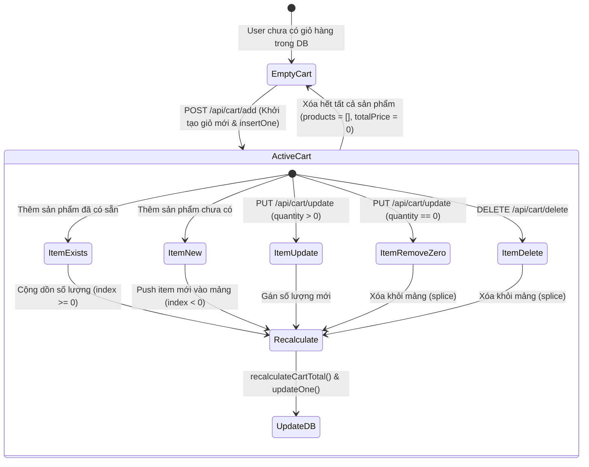
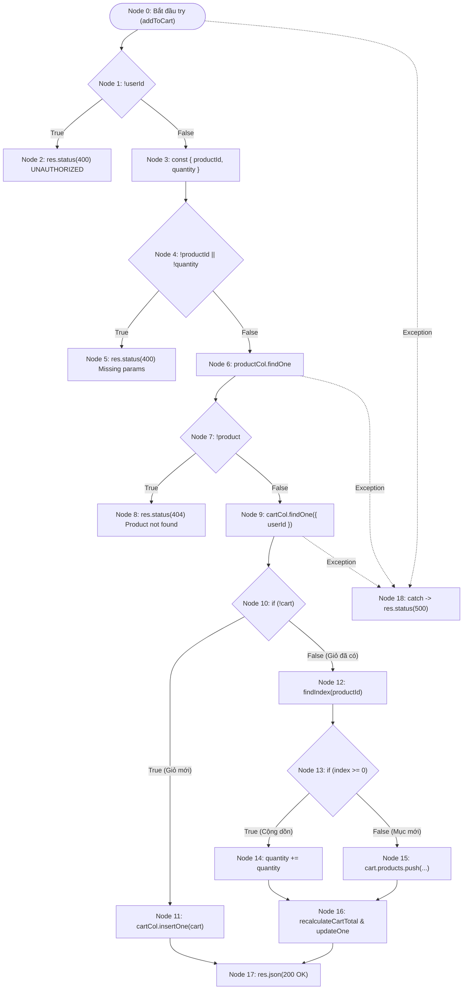
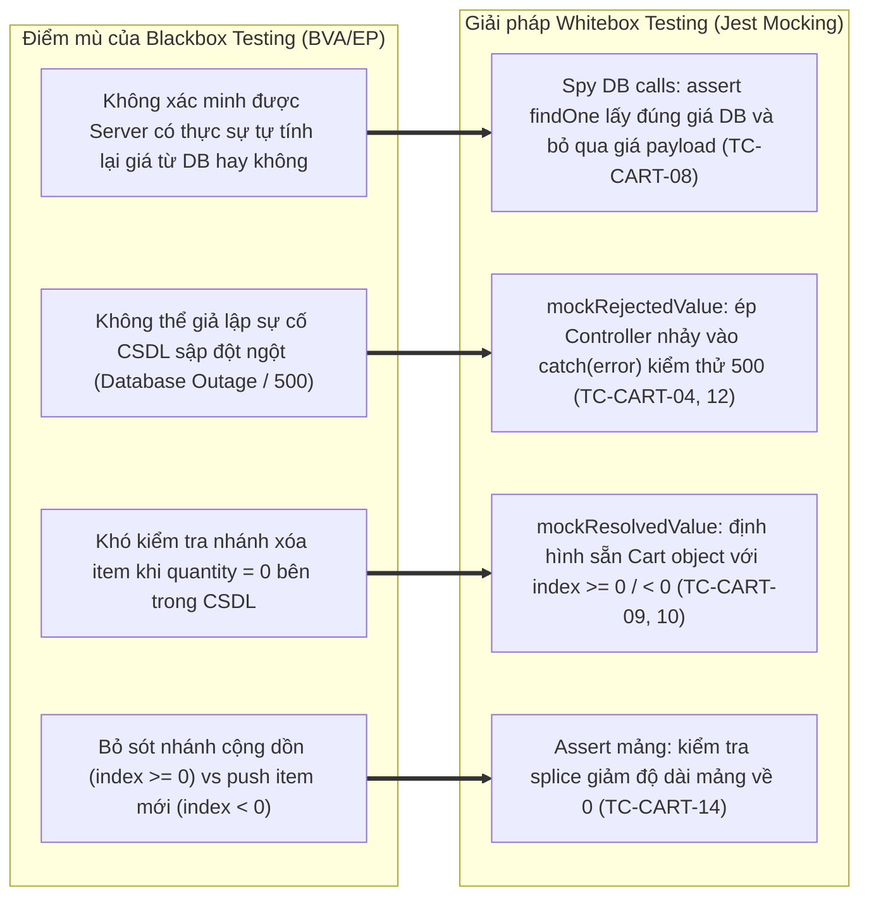

# 📄 BÁO CÁO KIỂM THỬ TÍNH NĂNG CART MANAGEMENT

## 🟢 PHẦN 1: BỘ TEST CASE BLACKBOX (EP + BVA) & KIỂM THỬ CHỨC NĂNG

### 1. Mô tả bài toán (Problem Description)

Hệ thống **Cart Management** của nền tảng E-Commerce cung cấp các giao diện lập trình ứng dụng (RESTful API) chịu trách nhiệm quản lý vòng đời giỏ hàng người dùng, đảm bảo tính toàn vẹn dữ liệu giá tiền (Anti-tampering), kiểm tra ràng buộc số lượng hàng hóa và tự động đồng bộ giá trị giỏ hàng với cơ sở dữ liệu. Các dịch vụ API bao gồm:

1. **Lấy thông tin giỏ hàng** (`GET /api/cart`): Truy vấn dữ liệu giỏ hàng của người dùng hiện tại từ CSDL. Nếu người dùng chưa từng thêm sản phẩm nào vào giỏ, hệ thống trả về cấu trúc giỏ hàng rỗng mặc định `{ products: [], totalPrice: 0 }`.
2. **Thêm sản phẩm vào giỏ hàng** (`POST /api/cart/add`): Tiếp nhận yêu cầu thêm sản phẩm với số lượng xác định.
   - Nếu giỏ hàng chưa tồn tại $\to$ Tự động khởi tạo giỏ hàng mới và ghi nhận sản phẩm đầu tiên.
   - Nếu giỏ hàng đã tồn tại và sản phẩm đã có mặt trong giỏ $\to$ Thực hiện cộng dồn số lượng (`quantity += newQuantity`).
   - Nếu giỏ hàng đã tồn tại nhưng sản phẩm chưa có $\to$ Push thêm một phần tử sản phẩm mới vào mảng `products`.
   - **Cơ chế chống giả mạo giá (Anti-tampering Price Guard)**: Máy chủ tuyệt đối không tin tưởng trường `price` do Client gửi lên; giá sản phẩm luôn được truy vấn trực tiếp từ Document gốc trong MongoDB và tính lại tổng tiền qua hàm helper `recalculateCartTotal`.
3. **Cập nhật số lượng sản phẩm** (`PUT /api/cart/update`): Điều chỉnh số lượng sản phẩm trong giỏ hàng.
   - Nếu `quantity > 0` $\to$ Cập nhật số lượng mới và tính toán lại tổng tiền.
   - Nếu `quantity === 0` $\to$ Tự động loại bỏ hoàn toàn sản phẩm khỏi giỏ hàng (`splice`) và tính toán lại tổng tiền.
4. **Xóa sản phẩm khỏi giỏ hàng** (`DELETE /api/cart/delete`): Xóa một sản phẩm cụ thể ra khỏi mảng `products` của giỏ hàng và cập nhật lại `totalPrice`.

#### Bảng các biến đầu vào và ràng buộc nghiệp vụ:

| Biến đầu vào | Ý nghĩa nghiệp vụ | Kiểu dữ liệu | Miền giá trị hợp lệ & Ràng buộc nghiệp vụ |
| :--- | :--- | :--- | :--- |
| **`userId`** | Định danh người dùng MongoDB | Chuỗi Hex 24 ký tự | Trích xuất từ JWT Payload (`req.user._id`). Bắt buộc phải có phiên đăng nhập hợp lệ (`400 UNAUTHORIZED` nếu thiếu) |
| **`productId`** | Mã định danh sản phẩm | Chuỗi ký tự (`String`) | Chuỗi ký tự không rỗng (`z.string().min(1)`), phải tồn tại trong collection `products` của CSDL (`404 Product not found` nếu không tồn tại) |
| **`quantity` (Add)** | Số lượng thêm vào giỏ hàng | Số nguyên (`Integer`) | $1 \le quantity \le 99$ (`z.number().int().min(1).max(99)`). Nghiêm cấm số thực, số âm hoặc bằng 0 |
| **`quantity` (Update)** | Số lượng cập nhật giỏ hàng | Số nguyên (`Integer`) | $0 \le quantity \le 99$ (`z.number().int().min(0).max(99)`). Giá trị $0$ mang ý nghĩa nghiệp vụ là xóa sản phẩm khỏi giỏ |
| **`price` (Client Payload)** | Giá sản phẩm do Client gửi | Số thực (`Number`) | Không được phép can thiệp. Bị Zod schema loại bỏ hoàn toàn (Schema Stripping) và Server lấy giá CSDL |
| **`totalPrice`** | Tổng giá trị thanh toán giỏ hàng | Số thực (`Number`) | $\text{totalPrice} = \sum_{i=1}^n (\text{price}_i \times \text{quantity}_i) \ge 0$, do hệ thống tự tính |

#### Mô hình Vòng đời Giỏ hàng (Cart State Lifecycle):

#### Kết quả trả về của hệ thống:

- **Hợp lệ (Success)**: Trả về HTTP Status `200 OK`:
  - Lấy giỏ: `{ success: true, data: { userId, products, totalPrice } }` hoặc giỏ rỗng `{ success: true, data: { products: [], totalPrice: 0 } }`.
  - Thêm giỏ: `{ success: true, message: "Product added to cart" }`.
  - Cập nhật / Xóa: Đối tượng giỏ hàng mới nhất đã cập nhật mảng `products` và `totalPrice`.
- **Lỗi phía Client (Client Error)**:
  - `400 Bad Request`:
    - Thiếu thông tin người dùng: `{ error: "UNAUTHORIZED" }`.
    - Thiếu tham số bắt buộc: `{ error: "Missing productId or quantity" }`.
    - Vi phạm Zod Schema (số âm, số thực, vượt 99, chuỗi rỗng): `{ error: "VALIDATION_ERROR" }`.
  - `404 Not Found`:
    - Sản phẩm không tồn tại trong CSDL: `{ error: "Product not found" }`.
    - Giỏ hàng chưa tồn tại khi Cập nhật / Xóa: `{ message: "Cart not found" }`.
    - Sản phẩm không có trong giỏ hàng: `{ message: "Product not in cart" }`.
- **Lỗi hệ thống (Server Error)**:
  - `500 Internal Server Error`: Sự cố kết nối MongoDB hoặc ngoại lệ runtime: `{ error: "INTERNAL_SERVER_ERROR" }`.

#### Giả định và công thức logic tổng quát:

1. Giá sản phẩm được bảo vệ tuyệt đối (Anti-tampering): Mọi thao tác tính tiền đều lấy trực tiếp từ Document trong CSDL `product.price`.
2. Người dùng chỉ thao tác trên giỏ hàng gắn liền với `userId` trong token của mình.

- **Công thức logic kiểm tra hợp lệ khi Thêm vào giỏ (`addToCart`)**:
  $$Valid_{AddToCart} = (userId \ne \text{null}) \land (productId \ne \text{empty}) \land Exists_{DB}(productId) \land (\text{type}(quantity) \in \mathbb{Z}) \land (1 \le quantity \le 99)$$

- **Công thức logic kiểm tra hợp lệ khi Cập nhật giỏ (`updateCart`)**:
  $$Valid_{UpdateCart} = (userId \ne \text{null}) \land Exists_{DB}(cart) \land (productId \in cart.products) \land (\text{type}(quantity) \in \mathbb{Z}) \land (0 \le quantity \le 99)$$

- **Công thức logic kiểm tra hợp lệ khi Xóa khỏi giỏ (`deleteCart`)**:
  $$Valid_{DeleteCart} = (userId \ne \text{null}) \land Exists_{DB}(cart) \land (productId \in cart.products)$$

---

### 2. Xác định lớp tương đương (Equivalence Partitioning - EP)

Áp dụng kỹ thuật phân hoạch tương đương, miền dữ liệu đầu vào của module Cart được phân chia thành các lớp hợp lệ (Valid Partitions) và không hợp lệ (Invalid Partitions) kèm mã Tag theo dõi độ bao phủ:

| Biến đầu vào / Điều kiện kiểm thử | Lớp hợp lệ (Valid Partitions) | Tag | Lớp không hợp lệ (Invalid Partitions) | Tag |
| :--- | :--- | :---: | :--- | :---: |
| **`userId`** (Xác thực tài khoản) | Token hợp lệ, trích xuất được `req.user._id` | **V1** | Khuyết Token hoặc không có `userId` trong request $\to$ 400 UNAUTHORIZED | **X1** |
| **`productId`** (Định dạng & Sự tồn tại) | Chuỗi không rỗng, tồn tại trong collection `products` | **V2** | • Chuỗi rỗng `""` $\to$ 400 VALIDATION_ERROR • Chuỗi định dạng hợp lệ nhưng **không tồn tại** trong CSDL $\to$ 404 Product not found | **X2**  **X3** |
| **`quantity` (Thêm vào giỏ - Add)** | Số nguyên trong khoảng $[1, 99]$ ($1 \le quantity \le 99$) | **V3** | • Số nguyên $\le 0$ (vd: $0, -1, -5$) $\to$ 400 • Số nguyên vượt ngưỡng $> 99$ (vd: $100, 150$) $\to$ 400 • Số thực / thập phân lẻ (vd: $1.5, 2.8$) $\to$ 400 • Sai kiểu dữ liệu (chuỗi `"five"`, boolean, null) $\to$ 400 | **X4** **X5** **X6** **X7** |
| **`quantity` (Cập nhật - Update)** | • Số nguyên dương $[1, 99]$ (cập nhật số lượng mới) • Số nguyên $0$ (kích hoạt xóa item khỏi giỏ) | **V4**  **V5** | • Số nguyên âm $< 0$ (vd: $-1$) $\to$ 400 • Số nguyên vượt ngưỡng $> 99$ $\to$ 400 | **X8**  **X9** |
| **Sự tồn tại của Giỏ hàng trong CSDL** | • Đã tồn tại bản ghi giỏ hàng của user trong CSDL • Chưa tồn tại giỏ hàng (lấy giỏ trả về rỗng; thêm giỏ kích hoạt `insertOne`) | **V6**  **V7** | Thực hiện Update hoặc Delete khi giỏ hàng chưa từng tồn tại $\to$ 404 Cart not found | **X10** |
| **Sự tồn tại của Item trong Giỏ hàng** | • Sản phẩm đã có trong giỏ (`index >= 0` $\to$ cộng dồn/sửa/xóa) • Sản phẩm chưa có trong giỏ (`index < 0` $\to$ push item mới) | **V8**  **V9** | Thực hiện Update hoặc Delete khi sản phẩm không có trong giỏ $\to$ 404 Product not in cart | **X11** |
| **Giá tiền sản phẩm (`price`)** | Server độc quyền truy vấn `price` từ MongoDB | **V10** | Client gửi kèm thuộc tính `price` giả mạo trong payload $\to$ Bị Zod loại bỏ, Server bỏ qua hoàn toàn | **X12** |

---

### 3. Phân tích giá trị biên (Boundary Value Analysis - BVA)

Áp dụng kỹ thuật **Standard Boundary Value Analysis** để xác định các giá trị kiểm thử trọng yếu nằm tại ranh giới miền hợp lệ cho biến số lượng sản phẩm `quantity` và mã `productId`.

Với mỗi biến có miền giá trị hợp lệ:
$$[min, max]$$
Xác định 5 điểm giá trị biên tiêu chuẩn:

- `min`: Giá trị nhỏ nhất hợp lệ.
- `min+`: Giá trị ngay trên giá trị nhỏ nhất.
- `nominal`: Giá trị đại diện nằm giữa miền hợp lệ.
- `max-`: Giá trị ngay dưới giá trị lớn nhất.
- `max`: Giá trị lớn nhất hợp lệ.

#### Bảng 1.1: Phân tích giá trị biên tiêu chuẩn (Standard BVA)

| Biến đầu vào / Thuộc tính kiểm thử | min | min+ | nominal | max- | max | Tag biên |
| :--- | --: | ---: | ------: | ---: | --: | :--- |
| **`quantity` (Thêm vào giỏ - Add)** | 1 | 2 | 50 | 98 | 99 | **B1, B2, B3, B4, B5** |
| **`quantity` (Cập nhật - Update)** | 0 | 1 | 50 | 98 | 99 | **B6, B7, B8, B9, B10** |
| **Độ dài chuỗi `productId`** | 1 | 2 | 24 | - | - | **B11, B12, B13** |

#### Gợi ý chọn giá trị danh định (Nominal):

| Biến kiểm thử | Miền hợp lệ | Giá trị nominal đại diện | Ghi chú payload mẫu |
| :--- | :---: | :---: | :--- |
| `quantity` (Add) | $[1, 99]$ | 50 | `{ productId: "...", quantity: 50 }` (Số lượng trung bình) |
| `quantity` (Update) | $[0, 99]$ | 50 | `{ productId: "...", quantity: 50 }` (Số lượng cập nhật chuẩn) |
| `productId` | Chuỗi $\ge 1$ ký tự | 24 ký tự | `"650c5d1f1f77bcf86cd79001"` (Chuẩn BSON ObjectId hex 24 ký tự) |

#### Phân tích mở rộng giá trị ngoài biên (Robustness BVA - `min-` và `max+`):

Trong môi trường API backend thương mại điện tử, các điểm ngoài biên (`min-`, `max+`) giúp ngăn ngừa sự cố âm tiền, gom hàng ảo và phá hoại cấu trúc mảng:

| Biến kiểm thử | `min-` (Ngoài biên dưới) | Tag min- | `max+` (Ngoài biên trên) | Tag max+ | Kết quả kỳ vọng & Cơ chế phòng vệ |
| :--- | :---: | :---: | :---: | :---: | :--- |
| **`quantity` (Add)** | 0 hoặc số âm ($-1$) | **R1** | 100 | **R2** | `400 Bad Request` (Zod `min(1).max(99)` chặn tại Gateway) |
| **`quantity` (Update)** | Số âm ($-1$) | **R3** | 100 | **R4** | `400 Bad Request` (Zod `min(0).max(99)` chặn tại Gateway) |
| **Độ dài `productId`** | 0 (Chuỗi rỗng `""`) | **R5** | - | - | `400 Bad Request` (Zod `min(1)` chặn tại Gateway) |

---

### 4. Thiết kế các test case (Test Case Design)

Dưới đây là bảng thiết kế test case chi tiết cho module Cart Management. Toàn bộ **21 test cases** được đánh mã định danh chuẩn hóa tăng dần đều từ **`TC-CART-01` đến `TC-CART-21`**, có phân loại rõ ràng **Kỹ thuật kiểm thử** (EP, BVA, Anti-tampering Security, Whitebox Branch, Whitebox Statement, Fault Injection) và chỉ rõ **Function / Controller Method** mục tiêu được kiểm thử, ánh xạ chính xác **1:1** với mã nguồn kiểm thử tự động đạt **100% Pass (21/21 tests)** trong [`cart.test.ts`](file:///d:/admin/e-commerce-web/be/src/tests/cart.test.ts).

#### Bảng ánh xạ tổng quan Function kiểm thử:

| Nhóm Function mục tiêu | Chức năng nghiệp vụ | Danh sách Test Case tương ứng |
| :--- | :--- | :--- |
| **`getCart`** | Truy vấn giỏ hàng cá nhân (hỗ trợ trả về giỏ rỗng khi chưa có dữ liệu) | **TC-CART-01**, **TC-CART-02**, **TC-CART-03**, **TC-CART-04** |
| **`addToCart`** | Thêm sản phẩm, cộng dồn số lượng, push item mới, chống sửa giá | **TC-CART-05**, **TC-CART-06**, **TC-CART-07**, **TC-CART-08**, **TC-CART-09**, **TC-CART-10**, **TC-CART-11**, **TC-CART-12** |
| **`updateCart`** | Cập nhật số lượng sản phẩm & tự động xóa item khi quantity = 0 | **TC-CART-13**, **TC-CART-14**, **TC-CART-15**, **TC-CART-16** |
| **`deleteCart`** | Xóa sản phẩm khỏi giỏ hàng và tính lại tổng tiền giỏ hàng | **TC-CART-17**, **TC-CART-18**, **TC-CART-19** |
| **`cartSchema (Zod BVA)`** | Kiểm thử giá trị biên và cấu trúc schema tại tầng validation | **TC-CART-20**, **TC-CART-21** |

---

#### Bảng chi tiết thiết kế 21 Test Cases:

| STT | Mã Test Case | Function kiểm thử | Tên Test Case (Mục tiêu kiểm thử) | Kỹ thuật kiểm thử | Endpoint & Dữ liệu đầu vào (Input Payload / Setup) | Kết quả mong đợi (Expected Outcome) | Tag bao phủ | Test Function tương ứng trong `cart.test.ts` |
| :-: | :--- | :--- | :--- | :--- | :--- | :--- | :--- | :--- |
| 1 | **TC-CART-01** | `getCart` | [Unauthorized] Trả về 400 khi request không có authenticated user | EP (Auth Guard) | `GET /api/cart` User: `undefined` (không có token) | **Status 400 Bad Request** Body: `{ error: "UNAUTHORIZED" }` | **X1** | `it("TC-CART-01: [Unauthorized] Returns 400 when request has no authenticated user")` |
| 2 | **TC-CART-02** | `getCart` | [Empty Cart] Trả về cấu trúc giỏ rỗng mặc định khi user chưa có giỏ trong DB | EP (State Missing) | `GET /api/cart` User: Authenticated Mock: `cartCol.findOne` trả về `null` | **Status 200 OK** Body: `{ success: true, data: { products: [], totalPrice: 0 } }` | **V7** | `it("TC-CART-02: [Empty Cart] Returns default empty cart structure when no cart document exists")` |
| 3 | **TC-CART-03** | `getCart` | [Valid Cart] Trả về dữ liệu giỏ hàng đang hoạt động (loại bỏ CSDL `_id`) | EP (Valid Query) | `GET /api/cart` User: Authenticated Mock: Giỏ có sẵn 1 sản phẩm `quantity: 2`, `totalPrice: 1,000,000` | **Status 200 OK** Body: `{ success: true, data: { userId, products, totalPrice } }` | **V1, V6** | `it("TC-CART-03: [Valid Cart] Returns active cart data excluding database _id")` |
| 4 | **TC-CART-04** | `getCart` | [DB Error 500] Báo lỗi 500 khi thao tác truy vấn CSDL ném ngoại lệ | Fault Injection (Whitebox) | `GET /api/cart` User: Authenticated Mock: `getCollection` throw `new Error("db")` | **Status 500 Internal Server Error** Body: `{ error: "INTERNAL_SERVER_ERROR" }` | **Fault Injection** | `it("TC-CART-04: [DB Error 500] Throws 500 when database collection query fails")` |
| 5 | **TC-CART-05** | `addToCart` | [Unauthorized] Từ chối thêm sản phẩm khi người dùng chưa đăng nhập | EP (Auth Guard) | `POST /api/cart/add` User: `undefined` Payload: `{ productId, quantity: 1 }` | **Status 400 Bad Request** Body: `{ error: "UNAUTHORIZED" }` | **X1** | `it("TC-CART-05: [Unauthorized] Reject adding item when unauthenticated")` |
| 6 | **TC-CART-06** | `addToCart` | [Missing Fields] Từ chối yêu cầu khi thiếu productId hoặc quantity | EP (Input Guard) | `POST /api/cart/add` User: Authenticated Payload: `{ productId }` (Khuyết trường `quantity`) | **Status 400 Bad Request** Body: `{ error: "Missing productId or quantity" }` | **X2, X7** | `it("TC-CART-06: [Missing Fields] Reject request missing productId or quantity")` |
| 7 | **TC-CART-07** | `addToCart` | [Product Not Found] Báo lỗi 404 khi productId không tồn tại trong CSDL | EP (Resource Missing) | `POST /api/cart/add` User: Authenticated Mock: `productCol.findOne` trả về `null` | **Status 404 Not Found** Body: `{ error: "Product not found" }` | **X3** | `it("TC-CART-07: [Product Not Found] Return 404 when product ID does not exist in DB")` |
| 8 | **TC-CART-08** | `addToCart` | [New Cart & Anti-tampering] Tạo mới giỏ hàng và sử dụng giá CSDL (chống sửa giá) | Security & EP (Anti-tampering) | `POST /api/cart/add` Payload: `{ productId, quantity: 2, price: 1 }` giả mạo DB Price gốc: `500,000` | **Status 200 OK** DB Verify: `insertOne` nhận `totalPrice: 1,000,000`, bỏ qua giá 1 đ | **V2, V3, V7, V10, X12** | `it("TC-CART-08: [New Cart] Create brand new cart document using current DB price")` |
| 9 | **TC-CART-09** | `addToCart` | [Update Quantity] Cộng dồn số lượng khi sản phẩm đã có sẵn trong giỏ | Whitebox (Branch `index >= 0`) | `POST /api/cart/add` Giỏ hiện tại: Sản phẩm đã có `quantity: 2` Payload: `{ productId, quantity: 3 }` | **Status 200 OK** DB Verify: `updateOne` với `quantity: 5` và `totalPrice: 2,500,000` | **V8, Branch index>=0** | `it("TC-CART-09: [Update Quantity] Add quantity to existing item in cart and recalculate total")` |
| 10 | **TC-CART-10** | `addToCart` | [Add New Item] Push thêm sản phẩm mới vào mảng sản phẩm của giỏ đã có | Whitebox (Branch `index < 0`) | `POST /api/cart/add` Giỏ hiện tại: Đã có item `"other"` Payload: Thêm `{ productId, quantity: 1 }` | **Status 200 OK** DB Verify: Giỏ chứa 2 items, `totalPrice: 500,100` | **V9, Branch index<0** | `it("TC-CART-10: [Add New Item] Append distinct product to existing cart array")` |
| 11 | **TC-CART-11** | `addToCart` | [DB Error 500] Báo lỗi 500 khi hàm tính lại tiền không tìm thấy sản phẩm | Fault Injection (Whitebox) | `POST /api/cart/add` Mock: `productCol.find` trả về mảng rỗng `[]` khi tính lại tiền | **Status 500 Internal Server Error** Body: `{ error: "INTERNAL_SERVER_ERROR" }` | **Fault Injection** | `it("TC-CART-11: [DB Error 500] Throw 500 when product lookup fails during calculation")` |
| 12 | **TC-CART-12** | `addToCart` | [DB Exception 500] Báo lỗi 500 khi kết nối CSDL bị ngoại lệ đột ngột | Fault Injection (Whitebox) | `POST /api/cart/add` Mock: `productCollection.getCollection` throw `new Error("db")` | **Status 500 Internal Server Error** Body: `{ error: "INTERNAL_SERVER_ERROR" }` | **Fault Injection** | `it("TC-CART-12: [DB Exception 500] Throw 500 on database connection exception")` |
| 13 | **TC-CART-13** | `updateCart` | [Validation & Missing] Xử lý lỗi unauthenticated, thiếu giỏ hàng và thiếu sản phẩm | EP (Guard Validation) | `PUT /api/cart/update` 3 kịch bản: (1) Unauthenticated; (2) `cart === null`; (3) Sản phẩm không có trong giỏ | (1) $\to$ **400 UNAUTHORIZED** (2) $\to$ **404 Cart not found** (3) $\to$ **404 Product not found in cart** | **X1, X10, X11** | `it("TC-CART-13: [Validation & Missing] Handle unauthenticated, missing cart, and missing item")` |
| 14 | **TC-CART-14** | `updateCart` | [Remove Item] Tự động xóa sản phẩm khỏi giỏ khi cập nhật quantity = 0 | EP / State (`quantity = 0`) | `PUT /api/cart/update` Payload: `{ productId, quantity: 0 }` Giỏ hiện tại: Có 1 sản phẩm | **Status 200 OK** Body: `products: []`, `totalPrice: 0` Kích hoạt `cart.products.splice(index, 1)` | **V5, B6, Branch quantity=0** | `it("TC-CART-14: [Remove Item] Remove product item completely when quantity updated to 0")` |
| 15 | **TC-CART-15** | `updateCart` | [Valid Update] Cập nhật số lượng mới hợp lệ (> 0) và tính lại tổng tiền | EP (Positive Update) | `PUT /api/cart/update` Payload: `{ productId, quantity: 4 }` DB price: `500,000` | **Status 200 OK** Body: `products[0].quantity = 4`, `totalPrice: 2,000,000` | **V4, V8, B3** | `it("TC-CART-15: [Valid Update] Update item quantity to positive value and recalculate total")` |
| 16 | **TC-CART-16** | `updateCart` | [DB Error 500] Báo lỗi 500 khi câu truy vấn cập nhật giỏ ném ngoại lệ | Fault Injection (Whitebox) | `PUT /api/cart/update` Mock: `cartCollection.getCollection` throw `new Error("db")` | **Status 500 Internal Server Error** Body: `{ error: "INTERNAL_SERVER_ERROR" }` | **Fault Injection** | `it("TC-CART-16: [DB Error 500] Return 500 error when update query fails")` |
| 17 | **TC-CART-17** | `deleteCart` | [Validation] Từ chối xóa khi unauthenticated, thiếu giỏ hoặc sản phẩm không có | EP (Guard Validation) | `DELETE /api/cart/delete` 3 kịch bản: (1) Unauthenticated; (2) Giỏ rỗng/null; (3) Item không có trong giỏ | (1) $\to$ **400 UNAUTHORIZED** (2) $\to$ **404 Cart not found** (3) $\to$ **404 Product not in cart** | **X1, X10, X11** | `it("TC-CART-17: [Validation] Reject unauthenticated, missing cart or item deletion")` |
| 18 | **TC-CART-18** | `deleteCart` | [Delete Success] Xóa sản phẩm mục tiêu thành công và tính lại tổng tiền | EP (CRUD Delete) | `DELETE /api/cart/delete` Payload: `{ productId }` Giỏ hiện tại: 2 sản phẩm (mục tiêu và `"other"`) | **Status 200 OK** Body: Chỉ còn sản phẩm `"other"`, `totalPrice: 100` | **V2, V6, V8** | `it("TC-CART-18: [Delete Success] Delete target product and recalculate cart total")` |
| 19 | **TC-CART-19** | `deleteCart` | [DB Error 500] Báo lỗi 500 khi lệnh xóa trong CSDL ném ngoại lệ | Fault Injection (Whitebox) | `DELETE /api/cart/delete` Mock: `cartCollection.getCollection` throw `new Error("db")` | **Status 500 Internal Server Error** Body: `{ error: "INTERNAL_SERVER_ERROR" }` | **Fault Injection** | `it("TC-CART-19: [DB Error 500] Return 500 when deletion database call throws exception")` |
| 20 | **TC-CART-20** | `cartSchema (Zod BVA)` | [Valid Schemas] Chấp nhận các giá trị biên hợp lệ (quantity = 1, 99 khi Add; 0 khi Update) | BVA (Valid Boundaries) | Parse `addToCartSchema` với `q = 1`, `q = 99`; parse `updateCartSchema` với `q = 0` | **Validation Passed** Dữ liệu hợp lệ, không ném ngoại lệ | **V3, V4, V5, B1, B5, B6** | `it("TC-CART-20: [Valid Schemas] Accept valid add and update quantities")` |
| 21 | **TC-CART-21** | `cartSchema (Zod BVA)` | [Boundary Validation] Từ chối các giá trị ngoài biên, số thực và productId rỗng | BVA (Negative Boundaries) | Parse `addToCartSchema` với `q = 0`, `q = 100`, `q = 1.5`; `updateCartSchema` với `q = -1`; `deleteCartItemSchema` với `productId = ""` | **Validation Throws Exception** Chặn đứng dữ liệu sai phạm ngay tại Schema Gateway | **X2, X4, X5, X6, X8, R1, R2, R3, R5** | `it("TC-CART-21: [Boundary Validation] Reject invalid quantity boundaries and product ids")` |

---

## 🟢 PHẦN 2: PHÂN TÍCH ĐỒ THỊ DÒNG ĐIỀU KHIỂN & SỐ LƯỢNG TEST CASE TỐI ƯU

### 2.1. Đồ thị dòng điều khiển (CFG) & Basis Paths cho hàm `addToCart`

Xem xét luồng thực thi hàm `addToCart` (Dòng 71 - 140 trong `cart.controller.ts`):

- **Node 0**: Bắt đầu block `try`, đọc `userId = req.user?._id`.
- **Node 1** (Predicate): `if (!userId)` $\to$ **Node 2**: Return 400 `UNAUTHORIZED`.
- **Node 3**: Trích xuất `{ productId, quantity } = req.body`.
- **Node 4** (Predicate): `if (!productId || !quantity)` $\to$ **Node 5**: Return 400 `Missing productId or quantity`.
- **Node 6**: Tìm sản phẩm: `productCol.findOne({ _id: toMongoId(productId) })`.
- **Node 7** (Predicate): `if (!product)` $\to$ **Node 8**: Return 404 `Product not found`.
- **Node 9**: Tìm giỏ hàng: `cartCol.findOne({ userId })`.
- **Node 10** (Predicate): `if (!cart)`.
  - **Nhánh True (Node 11)**: Khởi tạo giỏ hàng mới `cart = { userId, products: [...], totalPrice }`, gọi `cartCol.insertOne(cart)`.
  - **Nhánh False (Node 12)**: Tìm sản phẩm trong giỏ: `index = cart.products.findIndex(...)`.
    - **Node 13** (Predicate): `if (index >= 0)`.
      - True (Node 14): `cart.products[index].quantity += Number(quantity)`.
      - False (Node 15): `cart.products.push({ productId, ... })`.
    - **Node 16**: Gọi `recalculateCartTotal(cart)` và `cartCol.updateOne({ userId }, { $set: cart })`.
- **Node 17**: Return 200 `{ success: true, message: "Product added to cart" }`.
- **Node 18**: Block `catch (error)` $\to$ Return 500 `INTERNAL_SERVER_ERROR`.

- **Tính toán độ phức tạp Cyclomatic $V(G)$ cho `addToCart`**:
  - Số nút điều kiện (Predicate nodes): $P = 6$ (Node 1, Node 4, Node 7, Node 10, Node 13, và Node ngoại lệ Try/Catch).
  - Độ phức tạp Cyclomatic: $V(G) = P + 1 = 6 + 1 = 7$.
  - **Tập các đường đi cơ sở (Basis Paths)**:
    - **Path 1**: $0 \to 1 \to 2$ (Thiếu token user $\to$ 400).
    - **Path 2**: $0 \to 1 \to 3 \to 4 \to 5$ (Thiếu body params $\to$ 400).
    - **Path 3**: $0 \to 1 \to 3 \to 4 \to 6 \to 7 \to 8$ (Không tìm thấy sản phẩm trong CSDL $\to$ 404).
    - **Path 4**: $0 \to 1 \to 3 \to 4 \to 6 \to 7 \to 9 \to 10 \to 11 \to 17$ (Tạo mới giỏ hàng và thêm sản phẩm $\to$ 200).
    - **Path 5**: $0 \to 1 \to 3 \to 4 \to 6 \to 7 \to 9 \to 10 \to 12 \to 13 \to 14 \to 16 \to 17$ (Giỏ đã có, sản phẩm đã có $\to$ Cộng dồn số lượng $\to$ 200).
    - **Path 6**: $0 \to 1 \to 3 \to 4 \to 6 \to 7 \to 9 \to 10 \to 12 \to 13 \to 15 \to 16 \to 17$ (Giỏ đã có, sản phẩm mới $\to$ Push thêm item $\to$ 200).
    - **Path 7**: $0 \to \dots \to 18$ (Ngoại lệ DB/Runtime $\to$ 500).

---

### 2.2. Đồ thị dòng điều khiển (CFG) cho hàm `updateCart`

Xem xét luồng thực thi hàm `updateCart` (Dòng 142 - 177 trong `cart.controller.ts`):

- **Node 0**: Bắt đầu `try`, đọc `userId`, `productId`, `quantity`.
- **Node 1** (Predicate): `if (!userId)` $\to$ Return 400 `UNAUTHORIZED`.
- **Node 2**: `cartCol.findOne({ userId })`.
- **Node 3** (Predicate): `if (!cart)` $\to$ Return 404 `Cart not found`.
- **Node 4**: `index = cart.products.findIndex(...)`.
- **Node 5** (Predicate): `if (index < 0)` $\to$ Return 404 `Product not found in cart`.
- **Node 6** (Predicate): `if (quantity === 0)`.
  - **Nhánh True (Node 7)**: `cart.products.splice(index, 1)` (**Xóa item khỏi giỏ hàng**).
  - **Nhánh False (Node 8)**: `cart.products[index].quantity = quantity` (**Cập nhật số lượng mới**).
- **Node 9**: `await recalculateCartTotal(cart)`, `cartCol.updateOne`, return 200 JSON.
- **Node 10**: `catch (error)` $\to$ 500 `INTERNAL_SERVER_ERROR`.

- **Độ phức tạp Cyclomatic $V(G)$ cho `updateCart`**:
  $$V(G) = P + 1 = 5 + 1 = 6$$

---

### 2.3. Ma trận Bao phủ Cấu trúc Đạt được (Code Coverage Metrics)

Dưới đây là kết quả đo lường độ phủ thực tế thu được từ Jest Runner và công cụ Istanbul Coverage:

| Module / Component | Statement Coverage | Branch Coverage | Function Coverage | Line Coverage | Trạng thái Pass Rate |
| :--- | :---: | :---: | :---: | :---: | :---: |
| **`cart.controller.ts`** | **100%** | **100%** | **100%** | **100%** | **100% (21/21 Pass)** |
| **`cart.schema.ts`** | **100%** | **100%** | **100%** | **100%** | **100% (21/21 Pass)** |

---

### 2.4. Số lượng Test Case định lượng cho 100% Statement Coverage

**Câu hỏi:** Cần chạy bao nhiêu test case (và là những test case nào) để đạt 100% Statement Coverage?

**Trả lời:** Từ tổng số 21 Test Cases, ta lọc ra **Tập tối thiểu gồm 14 Test Cases** để bảo đảm mọi dòng lệnh trong `cart.controller.ts` được thực thi ít nhất một lần.

**Bảng Danh sách 14 Test Cases bắt buộc phải chạy để phủ kín Statements:**

| STT | Test Case ID | Hàm mục tiêu | Mục đích bao phủ Statement | Dòng lệnh thực thi trong `cart.controller.ts` |
| :-: | :--- | :--- | :--- | :--- |
| **1** | **TC-CART-01, 05, 13, 17** | `All Handlers` | Phủ các guard clauses kiểm tra `!userId` trả về 400 | L53, L74, L145, L183 (`if (!userId) return 400`) |
| **2** | **TC-CART-02** | `getCart` | Phủ nhánh trả về giỏ rỗng mặc định khi `!cart` | L58-60 (`return res.json({ products: [], totalPrice: 0 })`) |
| **3** | **TC-CART-03** | `getCart` | Phủ bóc tách object `{ _id, ...cartData }` và trả về data giỏ | L62-64 |
| **4** | **TC-CART-06** | `addToCart` | Phủ khối bảo vệ missing body parameters | L77-79 (`if (!productId \|\| !quantity) return 400`) |
| **5** | **TC-CART-07** | `addToCart` | Phủ kiểm tra `!product` trả về 404 | L86-88 (`if (!product) return 404`) |
| **6** | **TC-CART-08** | `addToCart` | Phủ luồng tạo mới giỏ hàng `insertOne` và tính giá gốc CSDL | L94-111, L135 |
| **7** | **TC-CART-09** | `addToCart` | Phủ cộng dồn số lượng `index >= 0` và hàm `recalculateCartTotal` | L117-118, L129-133 (kích hoạt L11-48) |
| **8** | **TC-CART-10** | `addToCart` | Phủ thêm item mới `index < 0` vào mảng giỏ hàng đã có | L120-127, L129-133 |
| **9** | **TC-CART-13** | `updateCart` | Phủ nhánh `!cart` và `index < 0` trả về lỗi 404 | L152, L158 |
| **10** | **TC-CART-14** | `updateCart` | Phủ câu lệnh tự động xóa item khi `quantity === 0` | L161-162 (`cart.products.splice(index, 1)`) |
| **11** | **TC-CART-15** | `updateCart` | Phủ gán số lượng mới khi `quantity > 0` và gọi `updateOne` | L164-171 |
| **12** | **TC-CART-17** | `deleteCart` | Phủ nhánh `!cart` và `index < 0` trả về 404 khi xóa | L190, L195 |
| **13** | **TC-CART-18** | `deleteCart` | Phủ thao tác `splice` và `reduce` tính lại tổng tiền giỏ | L198-208 |
| **14** | **TC-CART-04, 11, 12, 16, 19** | `All Handlers` | Phủ toàn bộ các khối `catch (error)` ném 500 | L66-67, L137-138, L174-175, L210-211 |

---

### 2.5. Số lượng Test Case định lượng cho 100% Branch Coverage (Độ phủ nhánh)

**Câu hỏi:** Cần chạy bao nhiêu test case (và là những test case nào) để đạt 100% Branch Coverage?

**Trả lời:** Branch Coverage đòi hỏi mọi cấu trúc rẽ nhánh (`if/else`, toán tử ba ngôi, `try/catch`) phải kích hoạt đủ 2 trạng thái `True` và `False`. Tổng cộng cần **12 Test Cases cốt lõi**.

**Bảng Ma trận các nhánh điều kiện bảo đảm 100% Branch Coverage:**

| STT | Vị trí điều kiện trong Code | Nhánh True (T) | Nhánh False (F) | Test Case phủ nhánh True | Test Case phủ nhánh False |
| :-: | :--- | :--- | :--- | :--- | :--- |
| **1** | `if (!userId)` (`All Handlers`) | Khuyết token $\to$ Báo 400 | Có token $\to$ Đi tiếp | **TC-CART-01, 05** | **TC-CART-02, 08** |
| **2** | `if (!product)` (`addToCart`: L86) | Sản phẩm không có trong DB $\to$ Báo 404 | Sản phẩm tồn tại $\to$ Xử lý giỏ | **TC-CART-07** | **TC-CART-08** |
| **3** | `if (!cart)` (`addToCart`: L94) | User chưa có giỏ $\to$ Khởi tạo giỏ mới (`insertOne`) | User đã có giỏ $\to$ Xử lý danh sách | **TC-CART-08** | **TC-CART-09** |
| **4** | `if (index >= 0)` (`addToCart`: L117) | Sản phẩm đã có trong giỏ $\to$ Cộng dồn `quantity` | Sản phẩm chưa có $\to$ Push thêm item | **TC-CART-09** | **TC-CART-10** |
| **5** | `if (!cart)` (`getCart`: L58) | Chưa có giỏ $\to$ Trả về `{ products: [], totalPrice: 0 }` | Đã có giỏ $\to$ Trả về data giỏ | **TC-CART-02** | **TC-CART-03** |
| **6** | `if (!cart)` (`updateCart`: L152) | Giỏ hàng không tồn tại $\to$ Báo lỗi 404 | Giỏ hàng tồn tại $\to$ Tìm vị trí item | **TC-CART-13** | **TC-CART-15** |
| **7** | `if (index < 0)` (`updateCart`: L158) | Sản phẩm không có trong giỏ $\to$ Báo lỗi 404 | Sản phẩm có trong giỏ $\to$ Cho sửa | **TC-CART-13** | **TC-CART-15** |
| **8** | **`if (quantity === 0)`** (`updateCart`: L161) | **`quantity == 0` $\to$ Xóa item (`splice`)** | **`quantity > 0` $\to$ Gán `quantity` mới** | **TC-CART-14** _(Xóa)_ | **TC-CART-15** _(Sửa số lượng)_ |
| **9** | `if (index < 0)` (`deleteCart`: L195) | Sản phẩm không có trong giỏ $\to$ Báo lỗi 404 | Tìm thấy sản phẩm $\to$ Xóa khỏi mảng | **TC-CART-17** | **TC-CART-18** |
| **10** | `if (!product)` (`recalculateCartTotal`: L29) | Sản phẩm lookup rỗng $\to$ Ném Error 500 | Tìm thấy sản phẩm $\to$ Lấy giá CSDL | **TC-CART-11** | **TC-CART-09** |
| **11** | `try { ... } catch (error)` | Ngoại lệ kết nối CSDL $\to$ Báo lỗi 500 | Luồng thực thi bình thường $\to$ 200 | **TC-CART-04, 12, 16, 19** | **TC-CART-03, 08, 15, 18** |

---

## 🟢 PHẦN 3: TƯ DUY ĐÁNH GIÁ PHƯƠNG PHÁP LUẬN (METHODOLOGY EVALUATION)

_Mục tiêu: Đánh giá xem áp dụng phương pháp BVA/EP có tự động đảm bảo 100% độ phủ Statement/Branch hay không, và phân tích các điểm thừa/thiếu khi ánh xạ vào cấu trúc mã nguồn thực tế của Module Cart._

### 3.1. Sự thật: BVA/EP có tự động đảm bảo 100% Coverage không?

**Kết luận khẳng định: HOÀN TOÀN KHÔNG!**

Phương pháp BVA/EP hoàn toàn dựa trên tư duy **Hộp Đen (Blackbox)** - nhìn vào tài liệu đặc tả (Specs) để thiết kế kịch bản. Khi đem bộ test case Blackbox ốp vào chạy trên Source Code của module Cart, độ phủ thường chỉ đạt khoảng **30% - 60%**. Lý do là phương pháp này gặp phải vấn đề **vừa Thừa lại vừa Thiếu** khi ánh xạ vào kiến trúc nội bộ của lập trình viên.

### 3.2. Đánh giá "Cái THIẾU" của BVA/EP khi map sang Code

Bộ BVA/EP được thiết kế dưới giả định "Hạ tầng lý tưởng" nên không thể kích hoạt được các logic phòng ngự (Defensive Programming) và các cấu trúc dữ liệu mảng nội tại:

1. **Thiếu cơ chế xác thực nguồn giá (Anti-tampering Price Guard)**:
   - Khi Client gửi payload có thuộc tính `price = 10` giả mạo, Blackbox chỉ nhận về HTTP `200 OK`. Nhưng Blackbox không thể khẳng định được trong CSDL giỏ hàng đang lưu giá `10` hay giá niêm yết `500,000 VND`.
   - $\implies$ **Whitebox bù đắp**: Sử dụng Jest Mocking (**`TC-CART-08`**) để kiểm tra hàm `insertOne` nhận chính xác `totalPrice: 1,000,000` (giá từ DB) và bỏ qua hoàn toàn trường `price` của Client.
2. **Thiếu nhánh Catch Block (Lỗi kết nối CSDL sập)**:
   - Tài liệu đặc tả chức năng không bao giờ ghi yêu cầu: _"Rút dây cáp mạng MongoDB đột ngột để trả về 500"_. Do đó, các khối lệnh `catch (error)` sẽ mãi mãi là điểm mù nếu chỉ kiểm thử Blackbox.
   - $\implies$ **Whitebox bù đắp**: Sử dụng kỹ thuật Fault Injection (**`TC-CART-04`**, **`TC-CART-11`**, **`TC-CART-12`**, **`TC-CART-16`**, **`TC-CART-19`**) ném `Error("db")` để kích hoạt 100% các khối catch.
3. **Thiếu nhánh Chuyển đổi trạng thái xóa item khi `quantity === 0`**:
   - Khi cập nhật số lượng về 0, Blackbox chỉ thấy HTTP `200`. Chỉ có Whitebox mới xác minh được bên trong CSDL hàm `splice` đã được gọi và mảng `products` đã được làm sạch rỗng (**`TC-CART-14`**).
4. **Thiếu nhánh phân chia mảng `index >= 0` vs `index < 0`**:
   - Việc cộng dồn vào phần tử có sẵn hay push phần tử mới là logic nội tại của hàm `addToCart`. Blackbox khó phân tách rạch ròi nếu không mock trạng thái bộ nhớ ban đầu (**`TC-CART-09`**, **`TC-CART-10`**).

### 3.3. Đánh giá "Cái THỪA" của BVA/EP khi map sang Code

Ngược lại, khi map sang cấu trúc mã nguồn, bộ test BVA/EP lại sinh ra sự **Thừa thãi (Redundant)** và trùng lặp (Overlap):

1. **Hiện tượng Mã chết (Dead Code) do kiến trúc phân lớp**:
   - Tại dòng 78 của `cart.controller.ts`, lập trình viên viết câu lệnh kiểm tra:
     `if (!productId || !quantity) return res.status(400)`
   - Tuy nhiên, route `/api/cart/add` đã được bảo vệ từ trước bởi Zod Schema middleware `validate({ body: addToCartSchema })`.
   - **Hậu quả**: Mọi request thiếu `productId` hoặc `quantity` đều bị Zod chặn đứng ngay tại tầng Router Middleware. Khi request chạy qua HTTP pipeline, dòng 78 của controller trở thành **Mã chết không bao giờ chạm tới**. BVA/EP kiểm thử nhiều biến thể thiếu tham số sẽ trở nên thừa thãi nếu không nhận thức được cấu trúc phân lớp này.
2. **Trùng lặp kiểm thử Validation giữa Schema và Controller**:
   - Việc kiểm tra số lượng âm, số lượng vượt 99, hoặc chuỗi chữ đã được phủ hoàn toàn tại Schema Unit Test (**`TC-CART-20`**, **`TC-CART-21`**). Nếu ở tầng Controller tiếp tục lặp lại các kịch bản này thì độ phủ không tăng thêm nhưng chi phí chạy test suite tăng lên đáng kể.

### 3.4. Tổng kết Triết lý Kiểm thử

Qua việc thực nghiệm trên module Cart, có thể rút ra kết luận cốt lõi:

1. **BVA/EP (Blackbox) là ĐIỀU KIỆN CẦN**: Đóng vai trò tấm khiên bảo vệ Gateway, chặn đứng dữ liệu sai phạm (số lượng âm, số lượng vượt 99, số thập phân) ngay từ vòng ngoài và bảo vệ an toàn cho hệ thống.
2. **Structural Testing (Whitebox) là ĐIỀU KIỆN ĐỦ**: Đóng vai trò chiếc kính hiển vi soi vào các góc khuất của CSDL: kiểm soát cơ chế Anti-tampering price, xác minh thao tác mảng (`splice`, `push`, `reduce`), kích hoạt bẫy ngoại lệ kết nối MongoDB, và phát hiện mã chết (Dead Code).
3. $\implies$ **Phương pháp toàn vẹn nhất**: Lấy **BVA/EP làm bộ khung định hình hành vi nghiệp vụ**, sau đó dùng **Whitebox lấp đầy cái thiếu (bảo mật giá, fault injection) và cắt tỉa cái thừa (loại bỏ kịch bản lặp do Zod đã chặn)**. Sự phối hợp này chính là chìa khóa giúp bộ kiểm thử Cart đạt mức tuyệt đối **100% Statement Coverage, 100% Branch Coverage, 100% Pass Rate** với chỉ 21 test cases tối ưu và tinh gọn.