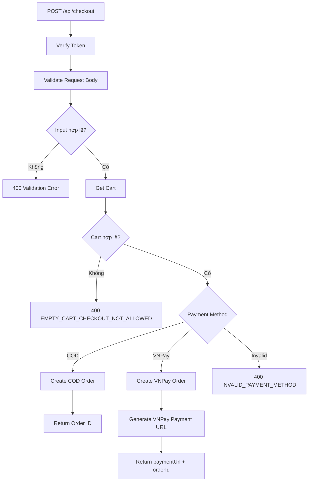
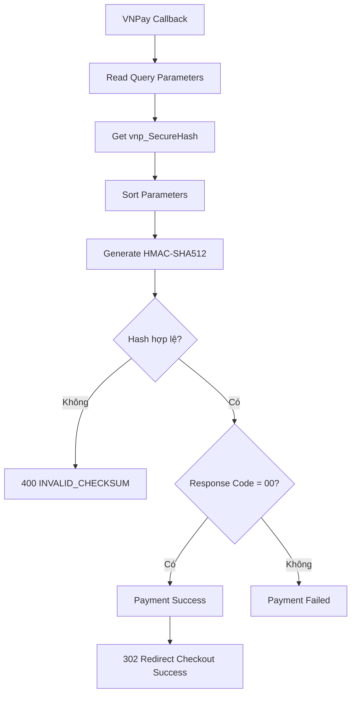

# BÁO CÁO KIỂM THỬ MODULE CHECKOUT & PAYMENT

## 1. KẾT QUẢ KIỂM THỬ CHÍNH

**Module:** Checkout & Payment  
**Controller:** `checkout.controller.ts`  
**Test file:** `checkout.test.ts`

| Hạng mục | Kết quả |
|---|---|
| Blackbox Testing | Equivalence Partitioning + Boundary Value Analysis |
| Postman Business Test Cases | **14 testcase** |
| Postman Runner Requests | **17 requests** |
| Postman Assertions | **27/27 PASS** |
| Jest Test Cases | **25/25 PASS** |
| Statement Coverage | **100%** |
| Branch Coverage | **100%** |
| Function Coverage | **100%** |
| Line Coverage | **100%** |

### 1.1. Coverage trước và sau khi bổ sung Whitebox

| Metric | Initial | Final |
|---|---:|---:|
| Statements | 89.41% | **100%** |
| Branches | 79.48% | **100%** |
| Functions | 100% | **100%** |
| Lines | 89.15% | **100%** |

---

## 1.2. DANH MỤC TEST CASE CHECKOUT

Bảng dưới đây được chuẩn hóa theo dạng ma trận kỹ thuật, thể hiện rõ kỹ thuật thiết kế test, input/setup, kết quả mong đợi và trạng thái thực thi.

### Bảng 1.2a. Blackbox Testing - Postman API Testing

| Test Case ID | Tên Test Case / Mục tiêu kiểm thử | Kỹ thuật | Input Payload / Request Details / Setup | Expected Status | Expected Response / Assertion | Trạng thái |
|---|---|---|---|---:|---|---|
| **TC_CHK_01** | [Empty Cart] Không cho Checkout khi giỏ hàng rỗng | EP - Invalid Partition | `POST /api/checkout`<br>Setup: `products = []`, `totalPrice = 0` | **400** | `EMPTY_CART_CHECKOUT_NOT_ALLOWED` | **PASS - Postman** |
| **TC_CHK_03** | [Valid Phone] Số điện thoại hợp lệ 10 chữ số | BVA - Valid Boundary | `phoneNumber: "0912345678"`<br>Cart hợp lệ | **200** | Tạo Order thành công, trả `orderId` | **PASS - Postman** |
| **TC_CHK_04** | [BVA Min-1] Phone 9 chữ số | BVA - Min - 1 | `phoneNumber: "091234567"` | **400** | Reject Phone không hợp lệ | **PASS - Postman** |
| **TC_CHK_05** | [BVA Max+1] Phone 11 chữ số | BVA - Max + 1 | `phoneNumber: "09123456789"` | **400** | Reject Phone không hợp lệ | **PASS - Postman** |
| **TC_CHK_06** | [Invalid Prefix] Phone đủ 10 số nhưng Prefix không hợp lệ | EP - Invalid Partition | `phoneNumber: "0123456789"` | **400** | Reject Prefix không hợp lệ | **PASS - Postman** |
| **TC_CHK_07** | [BVA Min-1] Address 9 ký tự | BVA - Min - 1 | `address.length = 9` | **400** | `ADDRESS_TOO_SHORT` | **PASS - Postman** |
| **TC_CHK_08** | [BVA Min] Address 10 ký tự | BVA - Valid Min | `address: "1234567890"` | **200** | Tạo Order thành công | **PASS - Postman** |
| **TC_CHK_09** | [BVA Max] Address 200 ký tự | BVA - Valid Max | Pre-request: `"A".repeat(200)` | **200** | Tạo Order thành công | **PASS - Postman** |
| **TC_CHK_10** | [BVA Max+1] Address 201 ký tự | BVA - Max + 1 | Pre-request: `"A".repeat(201)` | **400** | `ADDRESS_TOO_LONG` | **PASS - Postman** |
| **TC_CHK_11A** | [Valid Payment] Thanh toán COD | EP - Valid Partition | `typePayment: "cod"` | **200** | Tạo đơn COD và trả `orderId` | **PASS - Postman** |
| **TC_CHK_11B** | [Valid Payment] Thanh toán VNPay | EP - Valid Partition | `typePayment: "vnpay"` | **200** | Trả `paymentUrl` và `orderId` | **PASS - Postman** |
| **TC_CHK_12** | [Invalid Payment] Payment Method không hỗ trợ | EP - Invalid Partition | `typePayment: "paypal"` | **400** | Reject Payment Method | **PASS - Postman** |
| **TC_CHK_13** | [Security] VNPay Callback với Hash bị giả mạo | EP - Invalid Hash | `vnp_SecureHash = INVALID_FORGED_HASH_CODE` | **400** | `INVALID_CHECKSUM` | **PASS - Postman** |
| **TC_CHK_14** | [Valid Callback] VNPay Hash hợp lệ | EP - Valid Hash | HMAC-SHA512 hợp lệ<br>`vnp_ResponseCode = 00` | **302** | Redirect `/checkout-success?orderId=...` | **PASS - Postman** |

### Bảng 1.2b. Whitebox Testing - Jest Mocking

| Test Case ID | Tên Test Case / Mục tiêu kiểm thử | Kỹ thuật Whitebox | Input / Setup Mock | Expected Status | Expected Response / Nhánh Code |
|---|---|---|---|---:|---|
| **TC_CHK_15** | Thiếu VNPay Secret | Environment Injection | Xóa/Mock `VNPAY_SECURE_SECRET` | **500** | Phủ nhánh Missing Secret |
| **TC_CHK_16** | Hash hợp lệ nhưng Order không tồn tại | DB State Injection | Callback hợp lệ<br>Mock `findOne → null` | **404** | Phủ nhánh Order Not Found |
| **TC_CHK_17** | VNPay Callback thất bại | Branch Injection | `vnp_ResponseCode != "00"` | **302 / Failed Flow** | Phủ nhánh Payment Failed |
| **TC_CHK_18** | Database lỗi khi Checkout | Exception Throwing | Mock DB thao tác Checkout `throw Error()` | **500** | Phủ block `catch` của Checkout |
| **TC_CHK_19** | Database lỗi trong VNPay Callback | Exception Throwing | Mock DB callback `throw Error()` | **500** | Phủ block `catch` của Callback |
| **TC_CHK_20** | Query parameter không phải String | Type Injection | Query value Mock thành Array/Object | **400 / Filtered** | Phủ `typeof value === "string"` |
| **TC_CHK_21** | `cart.products` không phải Array | Data Anomaly | Mock `cart.products` sai kiểu | **400** | Phủ `!Array.isArray(products)` |
| **TC_CHK_22** | Có Products nhưng `totalPrice = 0` | Data Anomaly | `products.length > 0`, `totalPrice = 0` | **400** | Phủ Empty Cart Guard theo Price |
| **TC_CHK_23** | Kiểm tra Payment fallback trong Controller | Schema Mocking | Mock `safeParse` cho dữ liệu Payment đặc biệt | Theo Controller | Phủ nhánh Payment fallback |
| **TC_CHK_24** | Phủ `cart.products || []` | Logical Branch | Getter/Mock làm `cart.products = undefined` tại nhánh cần kiểm tra | Theo Controller | Phủ Logical OR fallback `[]` |
| **TC_CHK_25** | Phủ `req.ip || "127.0.0.1"` | Logical Branch | Mock `req.ip = undefined` | Theo Controller | Phủ IP fallback `127.0.0.1` |

> **Lưu ý:** Postman có 14 testcase nghiệp vụ. Jest có tổng cộng 25 testcase trong `checkout.test.ts`. Các testcase Whitebox được bổ sung nhằm kích hoạt những nhánh nội bộ mà Blackbox API Testing khó hoặc không thể kích hoạt trực tiếp.

---

## 2. EQUIVALENCE PARTITIONING & BOUNDARY VALUE ANALYSIS

### 2.1. Phân vùng tương đương và giá trị biên

| Conditions | Valid Partitions | Tag | Invalid Partitions | Tag | Valid Boundaries | Tag |
|---|---|---|---|---|---|---|
| Cart | Có sản phẩm và `totalPrice > 0` | `CART_VALID` | Cart rỗng / không tồn tại / `totalPrice = 0` | `CART_INVALID` | Cart có 1 sản phẩm | `CART_MIN_VALID` |
| Phone Length | Đúng 10 chữ số | `PHONE_VALID` | `< 10` hoặc `> 10` chữ số | `PHONE_LENGTH_INVALID` | 10 chữ số | `PHONE_BOUNDARY` |
| Phone Prefix | Prefix hợp lệ | `PREFIX_VALID` | Prefix không hợp lệ | `PREFIX_INVALID` | Prefix hợp lệ + 10 số | `PREFIX_BOUNDARY` |
| Address Length | 10 - 200 ký tự | `ADDRESS_VALID` | `< 10` hoặc `> 200` | `ADDRESS_INVALID` | 10 và 200 | `ADDRESS_BOUNDARY` |
| Payment Method | `cod`, `vnpay` | `PAYMENT_VALID` | `paypal` hoặc giá trị khác | `PAYMENT_INVALID` | `cod`, `vnpay` | `PAYMENT_BOUNDARY` |
| VNPay Hash | Hash hợp lệ | `HASH_VALID` | Hash sai / bị thay đổi | `HASH_INVALID` | Hash khớp dữ liệu callback | `HASH_BOUNDARY` |

---

## 3. PHÂN TÍCH BOUNDARY VALUE ANALYSIS

### 3.1. Phone Number

Điều kiện hợp lệ:

```text
Phone Number = 10 chữ số
```

| Giá trị | Phân loại | Test Case | Expected |
|---:|---|---|---|
| 9 chữ số | Min - 1 | `TC_CHK_04` | `400` |
| 10 chữ số | Valid Boundary | `TC_CHK_03` | `200` |
| 11 chữ số | Max + 1 | `TC_CHK_05` | `400` |

Ngoài độ dài, `TC_CHK_06` kiểm tra số điện thoại có đủ 10 chữ số nhưng Prefix không hợp lệ.

### 3.2. Address

Điều kiện hợp lệ:

```text
10 <= address.length <= 200
```

| Giá trị | Phân loại | Test Case | Expected |
|---:|---|---|---|
| 9 | Min - 1 | `TC_CHK_07` | `400` |
| 10 | Min | `TC_CHK_08` | `200` |
| 200 | Max | `TC_CHK_09` | `200` |
| 201 | Max + 1 | `TC_CHK_10` | `400` |

Trong Postman, giá trị biên 200 và 201 được sinh tự động:

```javascript
pm.variables.set("address200", "A".repeat(200));
pm.variables.set("address201", "A".repeat(201));
```

---

## 4. CHECKOUT FLOW



---

## 5. POSTMAN COLLECTION RUNNER

### 5.1. Luồng chạy tự động

Folder:

```text
Checkout & Payment Gateway Test Suite
```

Thứ tự chạy:

```text
00 - SETUP Login
↓
00 - SETUP Get Valid Product
↓
00 - SETUP Clear Cart
↓
TC_CHK_01
↓
TC_CHK_03 → TC_CHK_12
↓
TC_CHK_13
↓
TC_CHK_14
```

Ba request SETUP có nhiệm vụ:

- Login và cập nhật Token.
- Lấy `validProductId` đang tồn tại.
- Làm rỗng Cart trước `TC_CHK_01`.

Từ `TC_CHK_03` đến `TC_CHK_12`, Pre-request Script tự thêm Product vào Cart trước khi Checkout, giúp các testcase không phụ thuộc trạng thái của testcase trước.

### 5.2. Kết quả Postman Collection Runner

| Hạng mục | Kết quả |
|---|---:|
| Testcase nghiệp vụ | **14** |
| Request SETUP | **3** |
| Tổng số Request | **17** |
| Assertions | **27/27 PASS** |
| Failed | **0** |
| Errors | **0** |

Ba request SETUP không được tính là testcase nghiệp vụ.

`27 Passed` trong Postman là số assertion `pm.test(...)` đã PASS, không phải số testcase.

```text
Postman: 14 testcase nghiệp vụ, 27/27 assertions PASS
Jest: 25/25 testcase PASS
```

---

## 6. VNPAY CALLBACK TESTING

### 6.1. Luồng xử lý VNPay Callback



### 6.2. Tampered Hash

`TC_CHK_13` sử dụng:

```text
vnp_ResponseCode = 00
vnp_OrderInfo = orderId={{lastOrderId}}
vnp_SecureHash = INVALID_FORGED_HASH_CODE
```

Kết quả:

```text
400 Bad Request
INVALID_CHECKSUM
```

### 6.3. Valid Hash

`TC_CHK_14` sử dụng Hash HMAC-SHA512 hợp lệ:

```text
vnp_ResponseCode = 00
vnp_OrderInfo = orderId={{lastOrderId}}
vnp_SecureHash = {{validHash}}
```

Postman được cấu hình:

```text
Automatically follow redirects = OFF
```

Kết quả:

```text
302 Found
→ /checkout-success?orderId=PAY...
```

---

## 7. COVERAGE

Lệnh chạy:

```bash
npx jest src/tests/checkout.test.ts --coverage --runInBand
```

### 7.1. Coverage ban đầu

Bộ test ban đầu đạt:

| Metric | Coverage |
|---|---:|
| Statements | 89.41% |
| Branches | 79.48% |
| Functions | 100% |
| Lines | 89.15% |

Mặc dù Function Coverage đã đạt `100%`, Branch Coverage chỉ đạt `79.48%`.

Điều này cho thấy việc tất cả Function được gọi không đồng nghĩa với việc tất cả nhánh logic bên trong đã được thực thi.

### 7.2. Các nhánh chưa được phủ

Các nhánh còn thiếu chủ yếu gồm:

- Database Exception.
- Missing VNPay Secret.
- Order Not Found.
- VNPay Failed Response.
- Invalid Query Type.
- Products không phải Array.
- `totalPrice = 0`.
- `cart.products || []`.
- `req.ip || "127.0.0.1"`.

Các testcase Whitebox được bổ sung để kích hoạt trực tiếp những nhánh này.

### 7.3. Coverage cuối cùng

Sau khi bổ sung Whitebox Testing:

```text
25/25 Jest Test Cases PASS
```

| Metric | Initial | Final |
|---|---:|---:|
| Statements | 89.41% | **100%** |
| Branches | 79.48% | **100%** |
| Functions | 100% | **100%** |
| Lines | 89.15% | **100%** |

---

## 8. ĐÁNH GIÁ PHƯƠNG PHÁP KIỂM THỬ

### 8.1. Equivalence Partitioning

EP phù hợp với:

- Cart hợp lệ / không hợp lệ.
- Phone Prefix hợp lệ / không hợp lệ.
- Payment Method hợp lệ / không hợp lệ.
- VNPay Hash hợp lệ / không hợp lệ.

EP giúp giảm số testcase nhưng vẫn đại diện được cho các nhóm dữ liệu cần kiểm thử.

### 8.2. Boundary Value Analysis

BVA phù hợp với các điều kiện có giới hạn rõ ràng.

```text
Phone:
9 / 10 / 11

Address:
9 / 10 / 200 / 201
```

Các giá trị sát biên thường có nguy cơ phát sinh lỗi Validation cao nên BVA phù hợp với phần Checkout.

### 8.3. Whitebox Testing

EP và BVA không đủ để đạt `100% Branch Coverage` vì một số nhánh không thể kích hoạt trực tiếp qua API.

Ví dụ:

- Database Exception.
- Missing Environment Variable.
- Order Not Found.
- Invalid Query Type.
- Logical Fallback.

Do đó, Jest Mocking được sử dụng để kiểm tra các nhánh nội bộ này.

---

## 9. KẾT QUẢ TỔNG HỢP

| Hạng mục | Kết quả |
|---|---|
| Module | Checkout & Payment |
| Blackbox Technique | EP + BVA |
| Postman Business Test Cases | **14 testcase** |
| Postman Runner Requests | **17 requests** |
| Postman Assertions | **27/27 PASS** |
| Jest Test Cases | **25/25 PASS** |
| Statement Coverage | **100%** |
| Branch Coverage | **100%** |
| Function Coverage | **100%** |
| Line Coverage | **100%** |

---

## 10. KẾT LUẬN

Module Checkout & Payment được kiểm thử bằng sự kết hợp giữa:

```text
Equivalence Partitioning
+
Boundary Value Analysis
+
Postman API Testing
+
Whitebox Testing
+
Jest Mocking
```

Bộ test Blackbox kiểm tra các yêu cầu nghiệp vụ và các giá trị biên quan trọng của Phone, Address, Cart, Payment Method và VNPay.

Kết quả Postman:

```text
14 testcase nghiệp vụ
17 requests tổng cộng
27/27 assertions PASS
```

Bộ Jest ban đầu đạt:

```text
Statements = 89.41%
Branches   = 79.48%
Functions  = 100%
Lines      = 89.15%
```

Sau khi bổ sung các testcase Whitebox:

```text
25/25 Jest Test Cases PASS

Statements = 100%
Branches   = 100%
Functions  = 100%
Lines      = 100%
```

Kết quả cho thấy EP và BVA phù hợp với kiểm thử input và nghiệp vụ, nhưng để đạt độ phủ nhánh toàn diện cần kết hợp thêm Whitebox Testing và Jest Mocking.