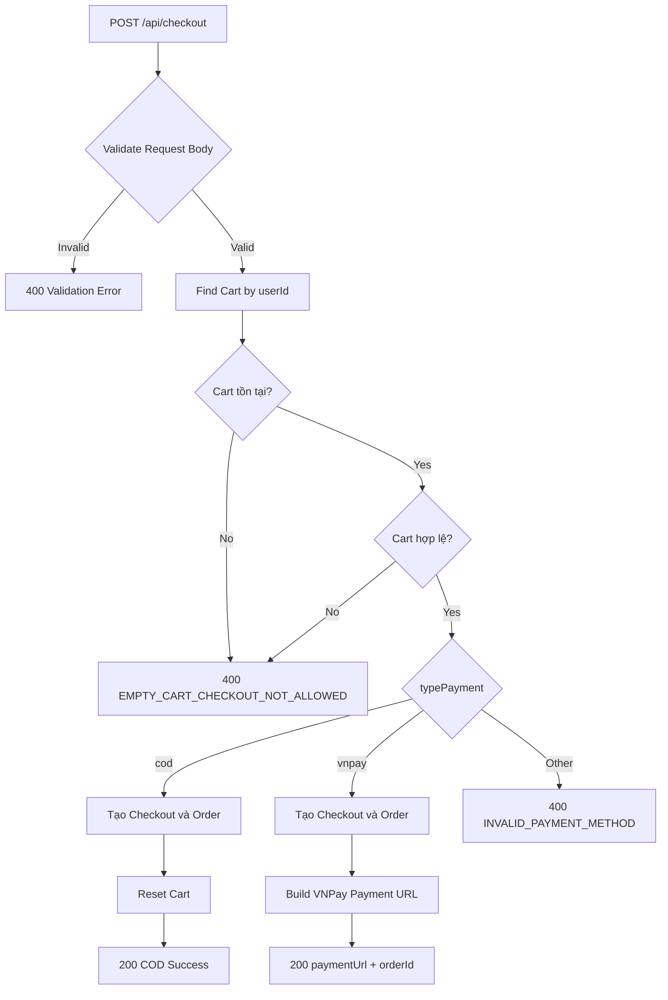
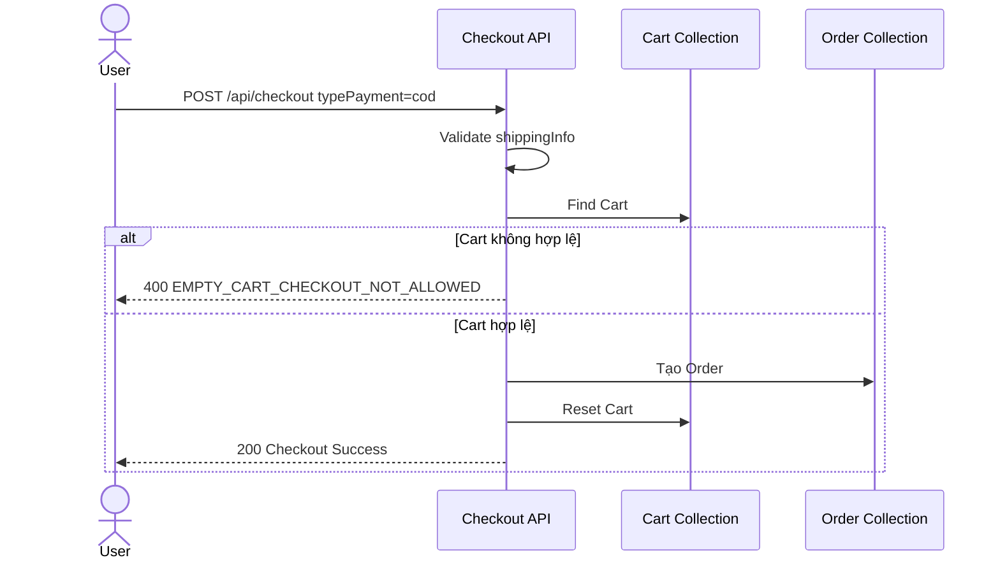
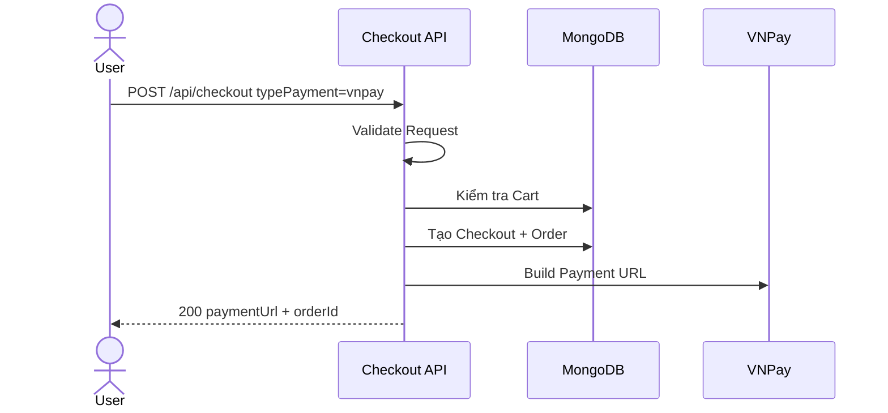
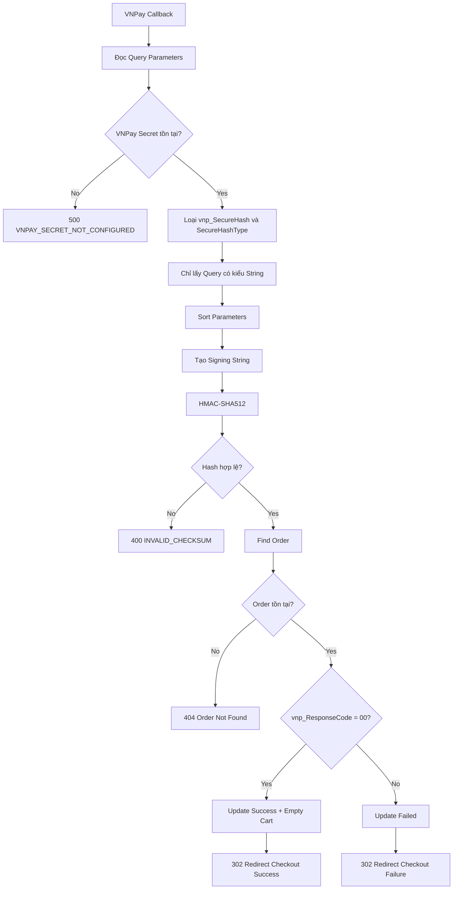
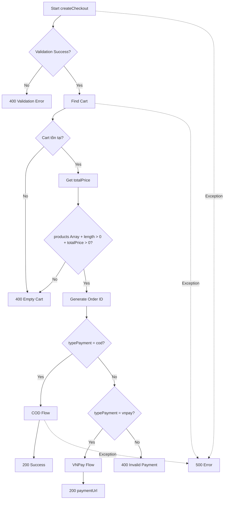
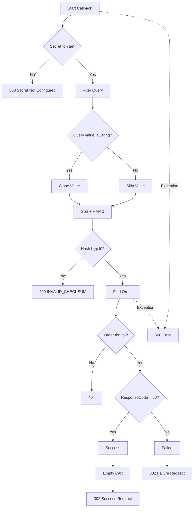

# BÁO CÁO KIỂM THỬ MODULE CHECKOUT & PAYMENT

## 1. TỔNG QUAN

### 1.1. Phạm vi kiểm thử

**Module:** Checkout & Payment  
**Controller chính:** `src/controllers/checkout.controller.ts`  
**File test:** `src/tests/checkout.test.ts`  
**API chính:**

- `POST /api/checkout`
- `GET /api/checkout/vnpay-callback`

**Công cụ sử dụng:**

- Jest
- Supertest
- Postman
- Jest/Istanbul Coverage

**Phương pháp kiểm thử:**

- Black-box Testing
- Equivalence Partitioning (EP)
- Boundary Value Analysis (BVA)
- Security Testing
- White-box Testing
- Branch Coverage
- Jest Mocking

### 1.2. Mục tiêu kiểm thử

Mục tiêu của bộ kiểm thử Checkout là xác minh:

1. Dữ liệu giao hàng được validate đúng trước khi tạo đơn.
2. Không cho phép checkout khi giỏ hàng rỗng hoặc không hợp lệ.
3. Hai phương thức thanh toán `cod` và `vnpay` hoạt động đúng.
4. Các phương thức thanh toán không được hỗ trợ phải bị từ chối.
5. VNPay Callback phải kiểm tra chữ ký HMAC-SHA512 trước khi cập nhật trạng thái đơn hàng.
6. Các trường hợp lỗi Database và các nhánh logic khó xảy ra vẫn được kiểm thử.
7. `checkout.controller.ts` đạt độ bao phủ tối đa về Statement, Branch, Function và Line.

---

# 2. PHÂN TÍCH BLACK-BOX BẰNG EP VÀ BVA

## 2.1. Equivalence Partitioning - EP

Phương pháp Equivalence Partitioning chia dữ liệu đầu vào thành các nhóm có hành vi tương đương. Mỗi nhóm chỉ cần chọn một hoặc một số giá trị đại diện để kiểm thử.

### Bảng phân vùng tương đương

| Trường / Điều kiện | Phân vùng hợp lệ | Phân vùng không hợp lệ | Kết quả mong đợi |
|---|---|---|---|
| `phoneNumber` | Đúng 10 chữ số và bắt đầu bằng `03`, `05`, `07`, `08`, `09` | < 10 số, > 10 số, sai đầu số, chứa ký tự không hợp lệ | Valid → `200`; Invalid → `400` |
| `address` | Từ 10 đến 200 ký tự | < 10 ký tự hoặc > 200 ký tự | Valid → `200`; Invalid → `400` |
| `typePayment` | `"cod"` hoặc `"vnpay"` | `"paypal"` hoặc giá trị ngoài enum | Valid → `200`; Invalid → `400` |
| Cart | Cart tồn tại, `products` là Array, có ít nhất 1 sản phẩm, `totalPrice > 0` | Cart không tồn tại, Cart rỗng, `products` sai kiểu, `totalPrice = 0` | Invalid → `400 EMPTY_CART_CHECKOUT_NOT_ALLOWED` |
| VNPay Secure Hash | Hash đúng với dữ liệu callback | Hash sai hoặc bị chỉnh sửa | Invalid → `400 INVALID_CHECKSUM` |
| VNPay Response Code | `"00"` | Khác `"00"` | `"00"` → Success; khác `"00"` → Failed |

---

## 2.2. Boundary Value Analysis - BVA

BVA tập trung vào các giá trị tại biên và ngay bên ngoài biên, vì đây là khu vực dễ xuất hiện lỗi validation.

### Bảng giá trị biên

| Trường | Ngưỡng | Điểm kiểm thử | Input | Expected |
|---|---|---|---|---|
| `phoneNumber` | Chính xác 10 số | Min- | `"091234567"` - 9 số | `400 INVALID_PHONE_NUMBER` |
| `phoneNumber` | Chính xác 10 số | Min / Max | `"0912345678"` - 10 số | `200` |
| `phoneNumber` | Chính xác 10 số | Max+ | `"09123456789"` - 11 số | `400 INVALID_PHONE_NUMBER` |
| `address` | 10 → 200 ký tự | Min- | `"123456789"` - 9 ký tự | `400 ADDRESS_TOO_SHORT` |
| `address` | 10 → 200 ký tự | Min | `"1234567890"` - 10 ký tự | `200` |
| `address` | 10 → 200 ký tự | Max | `"A".repeat(200)` | `200` |
| `address` | 10 → 200 ký tự | Max+ | `"A".repeat(201)` | `400 ADDRESS_TOO_LONG` |

### Nhận xét BVA

Đối với `phoneNumber`, miền hợp lệ có độ dài cố định là 10 nên các giá trị quan trọng nhất là:

```text
9  → Invalid
10 → Valid
11 → Invalid
```

Đối với `address`, miền hợp lệ là từ 10 đến 200 ký tự:

```text
9   → Invalid
10  → Valid
200 → Valid
201 → Invalid
```

---

# 3. LUỒNG NGHIỆP VỤ CHECKOUT

## 3.1. Luồng tổng quát



---

## 3.2. Luồng COD



---

## 3.3. Luồng VNPay



---

# 4. KIỂM TRA BẢO MẬT VNPAY CALLBACK

VNPay Callback sử dụng chữ ký HMAC-SHA512 để kiểm tra tính toàn vẹn của dữ liệu trả về.

Endpoint:

```text
GET /api/checkout/vnpay-callback
```

## 4.1. Quy trình kiểm tra



## 4.2. Ý nghĩa HMAC-SHA512

Controller tính lại chữ ký dựa trên các query parameter và Secret Key:

```typescript
const signData = crypto
  .createHmac("sha512", tmnSecret)
  .update(Buffer.from(sorted, "utf-8"))
  .digest("hex");
```

Sau đó so sánh chữ ký vừa tính với `vnp_SecureHash`.

Nếu không giống nhau:

```text
400 INVALID_CHECKSUM
```

Điều này giúp phát hiện trường hợp dữ liệu callback bị chỉnh sửa trên đường truyền.

---

# 5. DANH SÁCH ĐẦY ĐỦ 25 TEST CASE

> Các testcase `TC_CHK_01 → TC_CHK_14` là bộ test ban đầu tập trung vào EP, BVA, nghiệp vụ và VNPay Security.  
> Các testcase `TC_CHK_15 → TC_CHK_25` được bổ sung bằng White-box/Jest Mocking để phủ các branch khó tái hiện bằng request thực tế.

| STT | Test Case ID | Kịch bản kiểm thử | Phương pháp | Input / Mock chính | Expected Outcome | Kết quả | Mục tiêu |
|---:|---|---|---|---|---|---|---|
| 1 | `TC_CHK_01` | Không cho phép Checkout khi giỏ hàng rỗng | EP | `products = []`, `totalPrice = 0` | `400 EMPTY_CART_CHECKOUT_NOT_ALLOWED` | PASS | Cart Guard |
| 2 | `TC_CHK_02` | Không cho phép Checkout khi Cart không tồn tại | EP / White-box | `cartCollection.findOne() -> null` | `400 EMPTY_CART_CHECKOUT_NOT_ALLOWED` | PASS | Phủ nhánh `!cart` |
| 3 | `TC_CHK_03` | Số điện thoại hợp lệ 10 chữ số | BVA | `phoneNumber = "0912345678"` | `200 Checkout Success` | PASS | BVA Valid Boundary |
| 4 | `TC_CHK_04` | Số điện thoại 9 chữ số | BVA | `phoneNumber = "091234567"` | `400 INVALID_PHONE_NUMBER` | PASS | BVA Min- |
| 5 | `TC_CHK_05` | Số điện thoại 11 chữ số | BVA | `phoneNumber = "09123456789"` | `400 INVALID_PHONE_NUMBER` | PASS | BVA Max+ |
| 6 | `TC_CHK_06` | Số điện thoại đúng 10 số nhưng sai đầu số | EP | `phoneNumber = "0123456789"` | `400 INVALID_PHONE_NUMBER` | PASS | Invalid EP |
| 7 | `TC_CHK_07` | Địa chỉ 9 ký tự | BVA | `address = "123456789"` | `400 ADDRESS_TOO_SHORT` | PASS | BVA Min- |
| 8 | `TC_CHK_08` | Địa chỉ 10 ký tự | BVA | `address = "1234567890"` | `200 Checkout Success` | PASS | BVA Min |
| 9 | `TC_CHK_09` | Địa chỉ 200 ký tự | BVA | `address = "A".repeat(200)` | `200 Checkout Success` | PASS | BVA Max |
| 10 | `TC_CHK_10` | Địa chỉ 201 ký tự | BVA | `address = "A".repeat(201)` | `400 ADDRESS_TOO_LONG` | PASS | BVA Max+ |
| 11 | `TC_CHK_11` | Kiểm tra loại thanh toán hợp lệ | EP | `typePayment = "cod"` và `"vnpay"` | COD `200`; VNPay `200 + paymentUrl` | PASS | Valid Payment EP |
| 12 | `TC_CHK_12` | Loại thanh toán không hợp lệ | EP | `typePayment = "paypal"` | `400 INVALID_PAYMENT_METHOD` | PASS | Invalid Payment EP |
| 13 | `TC_CHK_13` | VNPay Callback bị sửa chữ ký | EP / Security | `vnp_SecureHash = "INVALID_HASH"` | `400 INVALID_CHECKSUM` | PASS | Chống Parameter Tampering |
| 14 | `TC_CHK_14` | VNPay Callback Hash hợp lệ và ResponseCode 00 | Security | Valid HMAC + `vnp_ResponseCode = "00"` | `302 Redirect checkout-success` | PASS | VNPay Success |
| 15 | `TC_CHK_15` | Thiếu VNPay Secret | White-box | Xóa `VNPAY_SECURE_SECRET` và `VNP_HASHSECRET` | `500 VNPAY_SECRET_NOT_CONFIGURED` | PASS | Secret Guard |
| 16 | `TC_CHK_16` | Hash hợp lệ nhưng Order không tồn tại | White-box | Valid Hash + `orderCollection.findOne() -> null` | `404 Order Not Found` | PASS | Phủ `!order` |
| 17 | `TC_CHK_17` | VNPay trả trạng thái thanh toán thất bại | White-box | Valid Hash + `vnp_ResponseCode != "00"` | Update `failed` + Redirect Failure | PASS | ResponseCode False Branch |
| 18 | `TC_CHK_18` | Database lỗi trong `createCheckout` | White-box / Exception | Mock DB `throw Error` | `500 Internal Server Error` | PASS | Phủ `catch` createCheckout |
| 19 | `TC_CHK_19` | Database lỗi trong `vnpayCallback` | White-box / Exception | Mock DB `throw Error` | `500 Internal Server Error` | PASS | Phủ `catch` callback |
| 20 | `TC_CHK_20` | Query VNPay có giá trị không phải String | White-box / Branch | Query parameter có kiểu `Array` | Non-string value bị bỏ qua | PASS | Phủ `typeof value === "string"` false |
| 21 | `TC_CHK_21` | `cart.products` không phải Array | White-box / Cart Guard | `cart.products = object/string` | `400 EMPTY_CART_CHECKOUT_NOT_ALLOWED` | PASS | Phủ `!Array.isArray()` |
| 22 | `TC_CHK_22` | Có sản phẩm nhưng `totalPrice = 0` | White-box / Cart Guard | `products.length > 0`, `totalPrice = 0` | `400 EMPTY_CART_CHECKOUT_NOT_ALLOWED` | PASS | Phủ `totalPrice === 0` |
| 23 | `TC_CHK_23` | Kiểm tra Payment Fallback trong Controller | White-box / Mock Schema | Mock `safeParse()` thành công với `typePayment = "paypal"` | `400 INVALID_PAYMENT_METHOD` | PASS | Phủ fallback sau Zod |
| 24 | `TC_CHK_24` | Kiểm tra fallback `cart.products || []` | White-box / Logical Branch | Getter làm `cart.products` thành `undefined` tại lúc tạo `orderData` | Fallback `[]` được thực thi | PASS | Phủ Logical OR fallback |
| 25 | `TC_CHK_25` | Kiểm tra fallback IP | White-box / Logical Branch | `req.ip = undefined` | Dùng `"127.0.0.1"` | PASS | Phủ `req.ip || "127.0.0.1"` |

---

# 6. CHI TIẾT INPUT CỦA BỘ TEST BLACK-BOX

Các field không được nhắc đến trong testcase sử dụng dữ liệu hợp lệ mặc định.

Ví dụ dữ liệu Shipping hợp lệ:

```json
{
  "fullName": "Nguyen Van A",
  "phoneNumber": "0912345678",
  "address": "123 Duong Nguyen Hue, Quan 1, TP.HCM",
  "email": "test@example.com"
}
```

## 6.1. TC_CHK_01 - Empty Cart

**Precondition:**

```text
Cart:
products = []
totalPrice = 0
```

**Request:**

```text
POST /api/checkout
Header: Authorization: Bearer {{token}}
```

**Payload:**

```json
{
  "typePayment": "cod",
  "shippingInfo": {
    "fullName": "Nguyen Van A",
    "phoneNumber": "0912345678",
    "address": "123 Duong Nguyen Hue, Quan 1, TP.HCM",
    "email": "test@example.com"
  }
}
```

**Expected:**

```text
400 EMPTY_CART_CHECKOUT_NOT_ALLOWED
```

---

## 6.2. TC_CHK_03 - Phone hợp lệ 10 số

```text
Header: Authorization: Bearer {{token}}
Payload: phoneNumber = "0912345678"
Expected: 200
```

---

## 6.3. TC_CHK_04 - Phone 9 số

```text
Header: Authorization: Bearer {{token}}
Payload: phoneNumber = "091234567"
Expected: 400 INVALID_PHONE_NUMBER
```

---

## 6.4. TC_CHK_05 - Phone 11 số

```text
Header: Authorization: Bearer {{token}}
Payload: phoneNumber = "09123456789"
Expected: 400 INVALID_PHONE_NUMBER
```

---

## 6.5. TC_CHK_06 - Phone sai đầu số

```text
Header: Authorization: Bearer {{token}}
Payload: phoneNumber = "0123456789"
Expected: 400 INVALID_PHONE_NUMBER
```

---

## 6.6. TC_CHK_07 - Address 9 ký tự

```text
Header: Authorization: Bearer {{token}}
Payload: address = "123456789"
Expected: 400 ADDRESS_TOO_SHORT
```

---

## 6.7. TC_CHK_08 - Address 10 ký tự

```text
Header: Authorization: Bearer {{token}}
Payload: address = "1234567890"
Expected: 200
```

---

## 6.8. TC_CHK_09 - Address 200 ký tự

```text
Header: Authorization: Bearer {{token}}
Payload: address = "A".repeat(200)
Expected: 200
```

---

## 6.9. TC_CHK_10 - Address 201 ký tự

```text
Header: Authorization: Bearer {{token}}
Payload: address = "A".repeat(201)
Expected: 400 ADDRESS_TOO_LONG
```

---

## 6.10. TC_CHK_11 - Payment hợp lệ

### COD

```text
Header: Authorization: Bearer {{token}}
Payload: typePayment = "cod"
Expected: 200 success=true
```

### VNPay

```text
Header: Authorization: Bearer {{token}}
Payload: typePayment = "vnpay"
Expected: 200 + paymentUrl + orderId
```

---

## 6.11. TC_CHK_12 - Payment không hợp lệ

```text
Header: Authorization: Bearer {{token}}
Payload: typePayment = "paypal"
Expected: 400 INVALID_PAYMENT_METHOD
```

---

## 6.12. TC_CHK_13 - VNPay Tampered Hash

```text
GET /api/checkout/vnpay-callback

Query:
vnp_ResponseCode = 00
vnp_OrderInfo = orderId=<valid>
vnp_SecureHash = INVALID_HASH
```

**Expected:**

```text
400 INVALID_CHECKSUM
```

---

## 6.13. TC_CHK_14 - VNPay Valid Hash

```text
GET /api/checkout/vnpay-callback

Query:
vnp_ResponseCode = 00
vnp_OrderInfo = orderId=<valid>
vnp_SecureHash = <validHash>
```

**Expected:**

```text
302 Redirect
/checkout-success?orderId=...
```

---

# 7. KIỂM THỬ API THỰC TẾ BẰNG POSTMAN

Postman được dùng để kiểm tra hành vi API thực tế của Checkout theo hướng Black-box.

Một testcase được xem là **PASS khi Actual Result khớp Expected Result**.

Do đó:

```text
Expected = 400
Actual   = 400
=> PASS
```

Không phải testcase PASS nào cũng phải trả HTTP 200.

## 7.1. Danh sách Postman Request

| STT | Postman Request | Input chính | Expected | Kết quả |
|---:|---|---|---|---|
| 1 | `SETUP - Add Product To Cart` | Product hợp lệ + quantity | `200/201` Add Cart Success | PASS |
| 2 | `TC_CHK_01 - Empty Cart` | Cart rỗng | `400 EMPTY_CART_CHECKOUT_NOT_ALLOWED` | PASS |
| 3 | `TC_CHK_03 - Valid Phone` | `"0912345678"` | `200` | PASS |
| 4 | `TC_CHK_04 - Phone 9 digits` | `"091234567"` | `400 INVALID_PHONE_NUMBER` | PASS |
| 5 | `TC_CHK_05 - Phone 11 digits` | `"09123456789"` | `400 INVALID_PHONE_NUMBER` | PASS |
| 6 | `TC_CHK_06 - Invalid Phone Prefix` | `"0123456789"` | `400 INVALID_PHONE_NUMBER` | PASS |
| 7 | `TC_CHK_07 - Address 9 chars` | 9 ký tự | `400 ADDRESS_TOO_SHORT` | PASS |
| 8 | `TC_CHK_08 - Address 10 chars` | 10 ký tự | `200` | PASS |
| 9 | `TC_CHK_09 - Address 200 chars` | `"A".repeat(200)` | `200` | PASS |
| 10 | `TC_CHK_10 - Address 201 chars` | `"A".repeat(201)` | `400 ADDRESS_TOO_LONG` | PASS |
| 11 | `TC_CHK_11A - Valid Payment Type COD` | `typePayment = "cod"` | `200 success=true` | PASS |
| 12 | `TC_CHK_11B - Valid Payment Type VNPay` | `typePayment = "vnpay"` | `200 + paymentUrl` | PASS |
| 13 | `TC_CHK_12 - Invalid Payment Type` | `typePayment = "paypal"` | `400 INVALID_PAYMENT_METHOD` | PASS |
| 14 | `TC_CHK_13 - VNPay Tampered Hash` | Invalid Hash | `400 INVALID_CHECKSUM` | PASS |
| 15 | `TC_CHK_14 - VNPay Valid Hash Success` | Valid Hash + ResponseCode 00 | `302 Redirect` | PASS |

### Lưu ý về TC_CHK_02

`TC_CHK_02 - Cart Not Found` được giữ trong Jest nhưng không chạy trực tiếp trong Postman.

Nguyên nhân:

```text
TC_CHK_02 cần cartCollection.findOne() trả về null
```

Đây là trạng thái phụ thuộc trực tiếp vào MongoDB và khó đảm bảo ổn định bằng HTTP request.

Trong Jest có thể chủ động mock:

```typescript
mockCartCollection.findOne.mockResolvedValue(null);
```

Do đó testcase này phù hợp hơn với Jest/White-box.

---

# 8. WHITE-BOX TESTING VÀ BRANCH COVERAGE

## 8.1. Tại sao cần White-box?

Sau khi chạy bộ test ban đầu, tất cả testcase đều PASS nhưng Branch Coverage vẫn chưa đạt 100%.

Kết quả ban đầu:

| Chỉ số | Coverage |
|---|---:|
| Statements | 89.41% |
| Branches | 79.48% |
| Functions | 100% |
| Lines | 89.15% |

Điều này chứng minh:

> Testcase PASS không đồng nghĩa với việc mọi nhánh trong code đã được thực thi.

Một số nhánh rất khó xảy ra trong request bình thường như:

```text
DB Error
Missing VNPay Secret
Order Not Found
Query value không phải String
req.ip = undefined
cart.products || []
Payment fallback sau Schema
```

Do đó cần dùng Jest Mocking để tạo chính xác các trạng thái này.

---

# 9. CONTROL FLOW GRAPH - CREATE CHECKOUT



---

# 10. CONTROL FLOW GRAPH - VNPAY CALLBACK



---

# 11. MA TRẬN BRANCH QUAN TRỌNG

| STT | Điều kiện | True Branch | False / Fallback Branch | Test tiêu biểu |
|---:|---|---|---|---|
| 1 | `!validation.success` | Reject 400 | Đi tiếp | `TC_CHK_04`, `TC_CHK_03` |
| 2 | `!cart` | Reject Cart Not Found | Cart tồn tại | `TC_CHK_02`, các valid case |
| 3 | `!Array.isArray(cart.products)` | Reject | Array hợp lệ | `TC_CHK_21`, `TC_CHK_03` |
| 4 | `products.length === 0` | Reject | Có sản phẩm | `TC_CHK_01`, valid cases |
| 5 | `totalPrice === 0` | Reject | Giá > 0 | `TC_CHK_22`, valid cases |
| 6 | `typePayment === "cod"` | COD | Sang VNPay check | `TC_CHK_11` |
| 7 | `typePayment === "vnpay"` | VNPay | Payment fallback | `TC_CHK_11`, `TC_CHK_23` |
| 8 | VNPay Secret tồn tại | Tiếp tục | Return 500 | `TC_CHK_14`, `TC_CHK_15` |
| 9 | `typeof value === "string"` | Clone | Skip | Callback tests, `TC_CHK_20` |
| 10 | Hash hợp lệ | Đi tiếp | INVALID_CHECKSUM | `TC_CHK_14`, `TC_CHK_13` |
| 11 | `!order` | Return 404 | Order tồn tại | `TC_CHK_16`, `TC_CHK_14` |
| 12 | `vnp_ResponseCode === "00"` | Success | Failed | `TC_CHK_14`, `TC_CHK_17` |
| 13 | `cart.products || []` | Dùng products | Dùng `[]` | Valid checkout, `TC_CHK_24` |
| 14 | `req.ip || "127.0.0.1"` | Dùng request IP | Dùng localhost | VNPay, `TC_CHK_25` |
| 15 | `catch createCheckout` | Error 500 | Normal Flow | `TC_CHK_18`, valid cases |
| 16 | `catch vnpayCallback` | Error 500 | Normal Flow | `TC_CHK_19`, callback cases |

---

# 12. KẾT QUẢ COVERAGE

## 12.1. Lệnh chạy Jest

```bash
npx jest src/tests/checkout.test.ts --coverage --runInBand
```

---

## 12.2. Kết quả bộ test ban đầu

Bộ test ban đầu:

```text
14/14 Test Cases PASS
```

Coverage:

| Chỉ số | Kết quả ban đầu |
|---|---:|
| Statements | 89.41% |
| Branches | 79.48% |
| Functions | 100% |
| Lines | 89.15% |

Các dòng chưa được thực thi:

```text
140-143
170
227
252-259
```

### Nguyên nhân

Các testcase Black-box ban đầu chưa kích hoạt được các trường hợp:

```text
VNPay Payment Failed
Order Not Found
Missing VNPay Secret
Database Exception
Non-string Query
Payment Fallback
cart.products || []
req.ip || "127.0.0.1"
```

---

## 12.3. Bổ sung White-box Test

Sau khi phân tích các branch chưa được phủ, các testcase `TC_CHK_15 → TC_CHK_25` được bổ sung.

Các testcase này sử dụng:

```text
jest.fn()
mockResolvedValue()
mockRejectedValueOnce()
jest.spyOn()
Mock Request
Getter động
Crypto HMAC
```

Mục tiêu là kích hoạt các branch nội bộ mà request Black-box thông thường không thể tạo ổn định.

---

## 12.4. Kết quả cuối cùng

```text
Test Suites: 1 passed, 1 total
Tests:       25 passed, 25 total
Snapshots:   0
Failed:      0
```

Coverage riêng cho:

```text
checkout.controller.ts
```

| File | Statements | Branches | Functions | Lines | Uncovered Lines |
|---|---:|---:|---:|---:|---|
| `checkout.controller.ts` | **100%** | **100%** | **100%** | **100%** | Không còn |

---

## 12.5. So sánh trước và sau

| Coverage | Ban đầu | Sau khi bổ sung White-box | Mức tăng |
|---|---:|---:|---:|
| Statements | 89.41% | **100%** | +10.59% |
| Branches | 79.48% | **100%** | +20.52% |
| Functions | 100% | **100%** | 0% |
| Lines | 89.15% | **100%** | +10.85% |

---

# 13. PHÂN TÍCH SỐ TESTCASE VÀ ĐỘ BAO PHỦ

## 13.1. Bộ test EP/BVA có đạt 100% Coverage không?

Không.

Bộ test Black-box/EP/BVA ban đầu có:

```text
14 testcase
14/14 PASS
```

nhưng chỉ đạt:

```text
Line Coverage   = 89.15%
Branch Coverage = 79.48%
```

Do đó việc testcase đều PASS không đồng nghĩa với toàn bộ code đã được bao phủ.

---

## 13.2. Bao nhiêu testcase để đạt 100%?

Không thể kết luận rằng:

```text
25 testcase BVA = 100%
```

vì điều này không chính xác.

Bộ test cuối gồm:

```text
14 testcase ban đầu
+
11 testcase White-box bổ sung
=
25 testcase
```

Sau khi kết hợp cả hai nhóm:

```text
25/25 PASS
Branch Coverage = 100%
Line Coverage   = 100%
```

Do đó kết luận đúng là:

> BVA và EP giúp thiết kế các testcase nghiệp vụ chính, nhưng cần bổ sung White-box/Jest Mocking để thực thi các branch nội bộ còn thiếu.

---

# 14. ĐÁNH GIÁ SỰ PHÙ HỢP CỦA PHƯƠNG PHÁP KIỂM THỬ

## 14.1. Equivalence Partitioning

EP phù hợp với module Checkout vì các input có thể chia thành những nhóm hành vi rõ ràng.

Ví dụ:

```text
Payment:
Valid   -> cod / vnpay
Invalid -> paypal
```

```text
Phone:
Valid   -> 10 số + prefix hợp lệ
Invalid -> sai số lượng / sai prefix
```

```text
Cart:
Valid   -> Có sản phẩm + totalPrice > 0
Invalid -> Empty / Missing / Invalid structure
```

Nhờ đó không cần kiểm tra mọi giá trị có thể xảy ra nhưng vẫn đại diện được các nhóm dữ liệu quan trọng.

---

## 14.2. Boundary Value Analysis

BVA phù hợp với:

```text
phoneNumber
address
```

vì hai trường này có ranh giới cụ thể.

Các giá trị được kiểm tra ngay tại và ngay ngoài biên:

```text
Phone:
9  - Invalid
10 - Valid
11 - Invalid
```

```text
Address:
9   - Invalid
10  - Valid
200 - Valid
201 - Invalid
```

BVA giúp phát hiện các lỗi như:

```text
< thay vì <=
> thay vì >=
Sai min()
Sai max()
Sai regex độ dài
```

---

## 14.3. Hạn chế của Black-box

Black-box chỉ quan sát input và output nên khó kiểm soát trạng thái bên trong chương trình.

Các tình huống khó tạo bằng Postman:

```text
Database tự ném exception
VNPay Secret bị thiếu
Order lookup trả về null đúng thời điểm
Query Parameter trở thành Array
req.ip = undefined
cart.products thay đổi giữa các lần truy cập
Bypass Zod để kiểm tra Payment fallback
```

---

## 14.4. Vai trò của White-box

White-box cho phép kiểm soát trực tiếp:

```text
Mock Database
Mock Environment Variable
Mock Request
Mock Schema
Mock Crypto
Getter động
```

Nhờ đó các branch nội bộ có thể được thực thi có chủ đích.

---

## 14.5. Đánh giá chung

| Phương pháp | Phù hợp | Vai trò |
|---|---|---|
| EP | Có | Phân chia các nhóm input hợp lệ / không hợp lệ |
| BVA | Có | Kiểm tra các giá trị tại biên |
| Postman Black-box | Có | Kiểm tra API thực tế |
| Security Testing | Có | Kiểm tra VNPay HMAC-SHA512 |
| White-box | Có | Kiểm tra branch nội bộ |
| Jest Mocking | Có | Tạo các trạng thái khó xảy ra ngoài thực tế |
| Branch Coverage | Có | Đo mức độ thực thi các nhánh điều kiện |

### Kết luận phương pháp

EP và BVA **phù hợp với việc thiết kế bộ test Checkout**, đặc biệt cho Shipping Validation và Payment Type.

Tuy nhiên, EP/BVA **không đủ để đạt 100% Branch Coverage**.

Vì vậy phương pháp phù hợp nhất cho module Checkout là:

```text
Black-box
+ EP
+ BVA
+ Postman
+ White-box
+ Jest Mocking
+ Coverage Analysis
```

---

# 15. TỔNG KẾT KẾT QUẢ KIỂM THỬ

| Tiêu chí | Kết quả |
|---|---|
| Tổng testcase Jest | **25** |
| Test PASS | **25** |
| Test FAIL | **0** |
| Pass Rate | **100%** |
| Statement Coverage | **100%** |
| Branch Coverage | **100%** |
| Function Coverage | **100%** |
| Line Coverage | **100%** |

Các nhóm chức năng đã được kiểm thử:

```text
Shipping Validation
Empty Cart Guard
Cart Not Found
COD Checkout
VNPay Checkout
Invalid Payment Method
VNPay Tampered Hash
VNPay Valid Callback
VNPay Failure
Order Not Found
Missing Secret
Database Exception
Logical Fallback
```

---

# 16. KẾT LUẬN

Module **Checkout & Payment** đã được kiểm thử bằng sự kết hợp giữa Black-box và White-box Testing.

Bộ test ban đầu sử dụng **Equivalence Partitioning và Boundary Value Analysis** để kiểm tra các yêu cầu nghiệp vụ chính như:

```text
Phone Validation
Address Validation
Cart Validation
COD / VNPay
VNPay Checksum
```

Bộ test này gồm:

```text
14 testcase
```

và đạt:

```text
89.41% Statement Coverage
79.48% Branch Coverage
100% Function Coverage
89.15% Line Coverage
```

Qua phân tích Coverage, các branch chưa được thực thi được xác định và bổ sung thêm **11 testcase White-box/Jest Mocking**.

Bộ test cuối cùng gồm:

```text
25 testcase
25/25 PASS
0 Failed
```

Kết quả cuối cho `checkout.controller.ts`:

```text
Statements = 100%
Branches   = 100%
Functions  = 100%
Lines      = 100%
```

Qua kết quả trên có thể kết luận:

> **EP và BVA phù hợp để kiểm thử các vùng dữ liệu nghiệp vụ và giá trị biên, nhưng để đạt độ bao phủ đầy đủ cần kết hợp thêm White-box Testing và Jest Mocking cho các branch nội bộ khó đạt bằng request thông thường.**

## FINAL VERDICT

**Checkout Controller đạt 100% Statement Coverage, 100% Branch Coverage, 100% Function Coverage và 100% Line Coverage với 25/25 testcase PASS.**