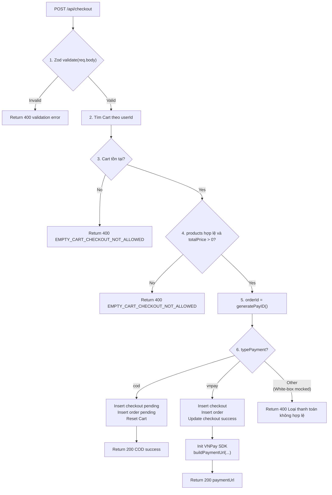
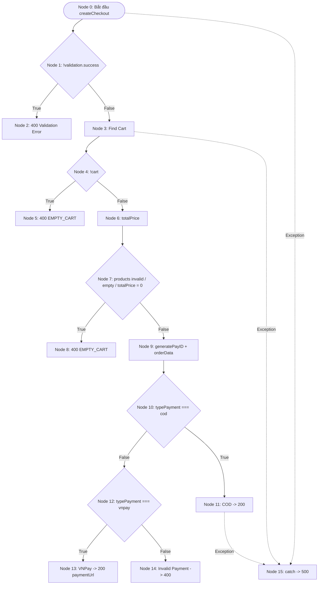
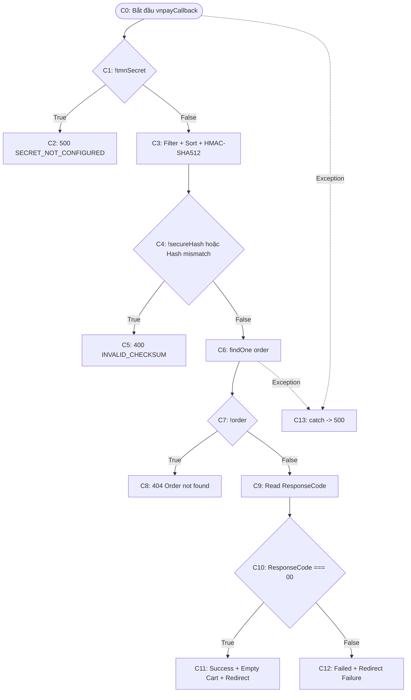
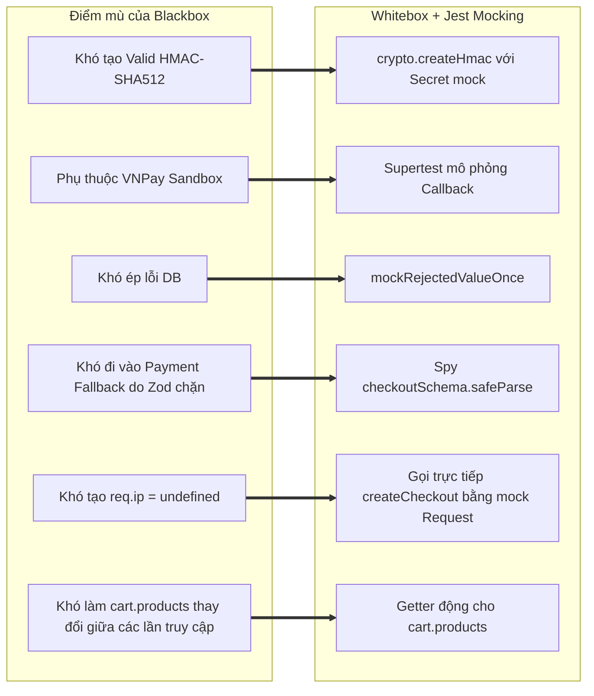

# 📄 BÁO CÁO KIỂM THỬ TÍNH NĂNG CHECKOUT & PAYMENT

## 🟢 PHẦN 1: BỘ TEST CASE BLACKBOX (EP + BVA)

### 1. Phân tích Phân vùng tương đương (Equivalence Partitioning - EP) & Giá trị biên (Boundary Value Analysis - BVA)

#### Bảng 1.1: Phân tích Phân vùng tương đương (EP) cho các tham số Checkout

| Tham số đầu vào | Ràng buộc nghiệp vụ & Schema Zod | Phân vùng hợp lệ (Valid EP) | Phân vùng không hợp lệ (Invalid EP) |
| :--- | :--- | :--- | :--- |
| **`shippingInfo.phoneNumber`** | Chuỗi 10 chữ số, bắt đầu bằng các đầu số viễn thông Việt Nam chuẩn: `^(03\|05\|07\|08\|09)[0-9]{8}$`. | • **EP-V1**: Chuỗi đúng 10 số với đầu số hợp lệ (vd: `"0912345678"`, `"0987654321"`, `"0381234567"`). | • **EP-I1**: Độ dài < 10 chữ số.<br>• **EP-I2**: Độ dài > 10 chữ số.<br>• **EP-I3**: Đúng 10 chữ số nhưng sai đầu số (vd: `"0123456789"`).<br>• **EP-I4**: Chứa ký tự chữ hoặc ký tự đặc biệt. |
| **`shippingInfo.address`** | Chuỗi địa chỉ có độ dài từ 10 đến 200 ký tự. | • **EP-V2**: Chuỗi có độ dài `[10, 200]`. | • **EP-I5**: Bỏ trống hoặc độ dài < 10 (`ADDRESS_TOO_SHORT`).<br>• **EP-I6**: Độ dài > 200 (`ADDRESS_TOO_LONG`). |
| **`shippingInfo.fullName`** | Chuỗi họ tên có độ dài `[1, 100]`. | • **EP-V3**: Chuỗi `1 <= length <= 100`. | • **EP-I7**: Chuỗi rỗng.<br>• **EP-I8**: Vượt quá 100 ký tự. |
| **`shippingInfo.email`** | Chuỗi email hợp lệ. | • **EP-V4**: Email đúng định dạng (vd: `"test@example.com"`). | • **EP-I9**: Email sai định dạng (`INVALID_EMAIL`). |
| **`typePayment`** | Enum: `["cod", "vnpay"]`. | • **EP-V5**: `"cod"`.<br>• **EP-V6**: `"vnpay"`. | • **EP-I10**: Giá trị không hỗ trợ như `"paypal"`, `"stripe"`, `"momo"`.<br>• **EP-I11**: Chuỗi rỗng hoặc sai kiểu dữ liệu (`123`, `true`, `null`). |
| **`cart.products`** | Giỏ hàng phải tồn tại, `products` phải là Array có `length > 0` và `totalPrice > 0`. | • **EP-V7**: Có ít nhất 1 sản phẩm và `totalPrice > 0`. | • **EP-I12**: Cart không tồn tại.<br>• **EP-I13**: `products = []`.<br>• **EP-I14**: `products` không phải Array.<br>• **EP-I15**: Có sản phẩm nhưng `totalPrice = 0`. |

---

#### Bảng 1.2: Phân tích Giá trị biên (Boundary Value Analysis - BVA) cho Checkout Module

Theo lý thuyết BVA, các trường dữ liệu giao hàng được kiểm thử tại các điểm biên quan trọng: `Min-`, `Min`, `Nom`, `Max` và `Max+`.

| Trường kiểm thử | Ngưỡng đặc tả | Điểm biên | Dữ liệu đầu vào | Kết quả kỳ vọng | Ghi chú kỹ thuật |
| :--- | :--- | :--- | :--- | :--- | :--- |
| **`phoneNumber`** | `[10, 10]` số | `Min- = 9`<br>`Min = 10`<br>`Nom = 10`<br>`Max = 10`<br>`Max+ = 11` | `"091234567"`<br>`"0912345678"`<br>`"0381234567"`<br>`"0987654321"`<br>`"09123456789"` | 400<br>200<br>200<br>200<br>400 | Regex kiểm tra chính xác 10 chữ số và đầu số hợp lệ |
| **`address`** | `[10, 200]` ký tự | `Min- = 9`<br>`Min = 10`<br>`Nom ≈ 50`<br>`Max = 200`<br>`Max+ = 201` | Chuỗi 9 ký tự<br>`"1234567890"`<br>Địa chỉ thông thường<br>`"A".repeat(200)`<br>`"A".repeat(201)` | 400<br>200<br>200<br>200<br>400 | Zod Schema: `z.string().min(10).max(200)` |

---

### 2. Phân tích Luồng Nghiệp vụ Checkout COD vs VNPay Sandbox URL Generation

Trong `checkout.controller.ts`, module phân tách hai luồng thanh toán dựa trên `typePayment`.



#### A. Luồng Thanh toán Tiền mặt khi nhận hàng (`typePayment = "cod"`)

1. **Kiểm tra dữ liệu đầu vào**: `checkoutSchema.safeParse(req.body)` phải thành công.

2. **Kiểm tra giỏ hàng**:
   - Cart phải tồn tại.
   - `products` phải là Array.
   - `products.length > 0`.
   - `totalPrice > 0`.

3. **Sinh mã giao dịch**:
   - Hàm `generatePayID()` sử dụng timestamp, giây và mili-giây.

4. **Tạo dữ liệu đơn hàng**:
   - `orderId`.
   - `userId`.
   - `products`.
   - `finalPrice`.
   - `shippingInfo`.
   - `paymentMethod`.
   - `status: "pending"`.

5. **Lưu CSDL**:
   - Insert vào `checkouts`.
   - Insert vào `orders`.

6. **Reset Cart**:
   - `cartCol.updateOne({ userId }, { $set: emptyCart() })`.

7. **Phản hồi**:
   - HTTP 200.
   - `success: true`.
   - Trả `orderId` và metadata.

#### B. Luồng Cổng thanh toán VNPay Sandbox (`typePayment = "vnpay"`)

1. **Khởi tạo dữ liệu giao dịch**:
   - Insert checkout.
   - Insert order.
   - Cập nhật trạng thái checkout.

2. **Khởi tạo VNPay SDK**:

```typescript
const vnpay = new VNPay({
  tmnCode: process.env.VNPAY_TMN_CODE!,
  secureSecret: process.env.VNPAY_SECURE_SECRET!,
  vnpayHost: process.env.VNPAY_HOST!,
  testMode: true,
  loggerFn: ignoreLogger,
});
```

3. **Sinh URL thanh toán**:

Các trường chính:

- `vnp_Amount = finalPrice`.
- `vnp_IpAddr = req.ip || "127.0.0.1"`.
- `vnp_TxnRef = orderId`.
- `vnp_OrderInfo = orderId=${orderId}`.
- `vnp_ReturnUrl = http://localhost:3000/api/checkout/vnpay-callback`.
- `vnp_ExpireDate`: thời hạn thanh toán.

4. **Phản hồi**:
   - HTTP 200.
   - Trả `paymentUrl` để client redirect sang VNPay.

---

### 3. Phân tích Kịch bản Bảo mật VNPay Callback: Checksum HMAC-SHA512 Verification

Endpoint `GET /api/checkout/vnpay-callback` tiếp nhận kết quả trả về từ VNPay.

#### A. Thuật toán Ký số và Kiểm tra Checksum (HMAC-SHA512)

Để chống **Parameter Tampering**, controller thực hiện:

1. **Đọc Secret Key**:
   - `VNPAY_SECURE_SECRET`.
   - Fallback `VNP_HASHSECRET`.
   - Nếu cả hai không tồn tại → HTTP 500 `VNPAY_SECRET_NOT_CONFIGURED`.

2. **Lọc tham số**:
   - Loại `vnp_SecureHash`.
   - Loại `vnp_SecureHashType`.

3. **Chỉ giữ các query có kiểu String**:

```typescript
if (typeof value === "string") {
  cloned[key] = value;
}
```

4. **Sắp xếp key theo thứ tự từ điển**.

5. **Tạo Signing String**:
   - `key1=value1&key2=value2&...`

6. **Tính HMAC-SHA512**:

```typescript
const signData = crypto
  .createHmac("sha512", tmnSecret)
  .update(Buffer.from(sorted, "utf-8"))
  .digest("hex");
```

7. **So sánh chữ ký**:

```typescript
if (
  !secureHash ||
  secureHash.toLowerCase() !== signData.toLowerCase()
) {
  return res.status(400).json({
    success: false,
    errors: [{ message: "INVALID_CHECKSUM" }],
  });
}
```

8. **Tìm Order**:
   - Không tồn tại → HTTP 404.

9. **Kiểm tra `vnp_ResponseCode`**:
   - `"00"` → Success.
   - Khác `"00"` → Failed.

#### B. Hai kịch bản kiểm thử bảo mật thực tế

```mermaid
sequenceDiagram
    autonumber
    actor Attacker as Attacker / VNPay
    participant Server as Express Server (vnpayCallback)
    participant DB as MongoDB (checkouts, carts)

    rect rgb(40, 44, 52)
        Note over Attacker, DB: Kịch bản 1: Giả mạo chữ ký (Tampered Hash)
        Attacker->>Server: GET /vnpay-callback?vnp_ResponseCode=00&vnp_SecureHash=INVALID_HASH
        Server->>Server: Tính lại HMAC-SHA512 từ secret key
        Server-->>Attacker: 400 INVALID_CHECKSUM
        Note right of Server: Không cập nhật Database
    end

    rect rgb(30, 50, 40)
        Note over Attacker, DB: Kịch bản 2: Chữ ký hợp lệ & thành công
        Attacker->>Server: GET /vnpay-callback?...&vnp_ResponseCode=00&vnp_SecureHash=VALID_HASH
        Server->>Server: So sánh signData và secureHash
        Server->>DB: findOne({ orderId })
        Server->>DB: updateOne status = success
        Server->>DB: deleteOne + insertOne Empty Cart
        Server-->>Attacker: 302 Redirect checkout-success
    end
```



#### C. Các kịch bản Callback bổ sung trong White-box Testing

Ngoài hai trường hợp trên, bộ test mới bổ sung:

- Thiếu VNPay Secret → HTTP 500.
- Hash hợp lệ nhưng Order không tồn tại → HTTP 404.
- VNPay trả ResponseCode khác `"00"` → cập nhật `failed` và redirect failure.
- Database lỗi trong Callback → HTTP 500.
- Query parameter dạng Array → kiểm thử nhánh `typeof value !== "string"`.

---

### 4. Danh mục Test Cases (Test Suite Catalog)

Bộ test hiện tại trong `checkout.test.ts` gồm **25 test cases**, trong đó 14 test ban đầu tập trung vào Black-box/EP/BVA và bảo mật cơ bản, 11 test bổ sung tập trung vào White-box và Branch Coverage.

| STT | Test Function / ID | Nhóm kiểm thử | Mục tiêu chính | Kết quả |
| :--: | :--- | :--- | :--- | :---: |
| 1 | `TC_CHECKOUT_EMPTY_01` | EP / Cart Guard | Cart rỗng `products.length === 0` | PASS |
| 2 | `TC_CHECKOUT_EMPTY_02` | EP / Resource Guard | Cart không tồn tại | PASS |
| 3 | `TC_CHECKOUT_BVA_01` | BVA / EP | Phone hợp lệ 10 chữ số | PASS |
| 4 | `TC_CHECKOUT_BVA_02` | BVA Min- | Phone 9 chữ số | PASS |
| 5 | `TC_CHECKOUT_BVA_03` | BVA Max+ | Phone 11 chữ số | PASS |
| 6 | `TC_CHECKOUT_EP_04` | EP | Phone 10 số nhưng sai prefix | PASS |
| 7 | `TC_CHECKOUT_BVA_05` | BVA Min- | Address 9 ký tự | PASS |
| 8 | `TC_CHECKOUT_BVA_06` | BVA Min | Address 10 ký tự | PASS |
| 9 | `TC_CHECKOUT_BVA_07` | BVA Max | Address 200 ký tự | PASS |
| 10 | `TC_CHECKOUT_BVA_08` | BVA Max+ | Address 201 ký tự | PASS |
| 11 | `TC_CHECKOUT_EP_09` | EP | `cod` và `vnpay` hợp lệ | PASS |
| 12 | `TC_CHECKOUT_EP_10` | EP | Payment Type không hợp lệ | PASS |
| 13 | `TC_CHECKOUT_VNPAY_11` | Security | Tampered Hash → INVALID_CHECKSUM | PASS |
| 14 | `TC_CHECKOUT_VNPAY_12` | Security | Valid Hash + ResponseCode 00 | PASS |
| 15 | `TC_CHECKOUT_EXTRA_13` | White-box | Thiếu VNPay Secret | PASS |
| 16 | `TC_CHECKOUT_EXTRA_14` | White-box | Hash hợp lệ nhưng Order không tồn tại | PASS |
| 17 | `TC_CHECKOUT_EXTRA_15` | White-box | VNPay Payment Failed | PASS |
| 18 | `TC_CHECKOUT_EXTRA_16` | White-box / Exception | `createCheckout` gặp lỗi DB | PASS |
| 19 | `TC_CHECKOUT_EXTRA_17` | White-box / Exception | `vnpayCallback` gặp lỗi DB | PASS |
| 20 | `TC_CHECKOUT_EXTRA_18` | White-box / Branch | Query parameter dạng Array | PASS |
| 21 | `TC_CHECKOUT_EXTRA_19` | White-box / Cart Guard | `products` không phải Array | PASS |
| 22 | `TC_CHECKOUT_EXTRA_20` | White-box / Cart Guard | Có products nhưng `totalPrice = 0` | PASS |
| 23 | `TC_CHECKOUT_EXTRA_21` | White-box / Mock Schema | Fallback Payment Branch | PASS |
| 24 | `TC_CHECKOUT_EXTRA_22` | White-box / Logical Branch | `cart.products || []` fallback | PASS |
| 25 | `TC_CHECKOUT_EXTRA_23` | White-box / Logical Branch | `req.ip || "127.0.0.1"` fallback | PASS |

---

## 🟢 PHẦN 3: PHÂN TÍCH ĐỘ BAO PHỦ VÀ CONTROL FLOW

### 1. Phân tích Đồ thị Dòng điều khiển (Control Flow Graph - CFG)

#### A. Đồ thị CFG cho hàm `createCheckout`

Các nút điều kiện nghiệp vụ chính:

- **Node 0**: Bắt đầu `createCheckout`.
- **Node 1**: `if (!validation.success)`.
- **Node 2**: Return 400 Validation Error.
- **Node 3**: Lấy các collection và tìm Cart.
- **Node 4**: `if (!cart)`.
- **Node 5**: Return 400 Empty Cart.
- **Node 6**: Tính `totalPrice`.
- **Node 7**: Kiểm tra `products` và `totalPrice`.
- **Node 8**: Return 400 Empty Cart.
- **Node 9**: Sinh `orderId` và `orderData`.
- **Node 10**: `if (typePayment === "cod")`.
- **Node 11**: COD Success.
- **Node 12**: `if (typePayment === "vnpay")`.
- **Node 13**: VNPay Success.
- **Node 14**: Payment fallback → 400.
- **Node 15**: `catch` → 500.



**Lưu ý quan trọng về Node 14:**

Ở luồng HTTP thông thường, `checkoutSchema` chỉ cho `cod` hoặc `vnpay`, do đó Node 14 không thể đạt tới bằng một request hợp lệ.

Tuy nhiên, trong `TC_CHECKOUT_EXTRA_21`, nhóm dùng Jest Spy/Mock cho `checkoutSchema.safeParse()` để cô lập controller và ép `typePayment = "paypal"` đi qua validation. Nhờ đó Node 14 được thực thi trong White-box Testing mà **không cần sửa production code**.

---

#### B. Đồ thị CFG cho `vnpayCallback`

Các nút quan trọng:

- **C0**: Đọc Query và Secret.
- **C1**: `if (!tmnSecret)`.
- **C2**: 500 Secret Not Configured.
- **C3**: Lọc, sort Query và tính HMAC.
- **C4**: SecureHash thiếu hoặc mismatch.
- **C5**: 400 INVALID_CHECKSUM.
- **C6**: Tìm Order.
- **C7**: `if (!order)`.
- **C8**: 404 Order Not Found.
- **C9**: Đọc ResponseCode.
- **C10**: `vnp_ResponseCode === "00"`.
- **C11**: Payment Success.
- **C12**: Payment Failed.
- **C13**: `catch` → 500.



---

### 2. Kết quả Coverage trước khi bổ sung White-box Test

Ở bộ test ban đầu:

- **14/14 test cases PASS**.
- Statement Coverage: **89.41%**.
- Branch Coverage: **79.48%**.
- Function Coverage: **100%**.
- Line Coverage: **89.15%**.

Các dòng chưa thực thi tại thời điểm đó:

- `140-143`.
- `170`.
- `227`.
- `252-259`.

Nguyên nhân chính:

1. Chưa test VNPay Payment Failed.
2. Chưa test Order Not Found.
3. Chưa test Missing Secret.
4. Chưa kích hoạt các khối `catch`.
5. Chưa phủ các nhánh logic hiếm gặp.
6. Payment fallback bị Schema chặn trước.
7. `cart.products || []` khó đạt nhánh fallback trong request bình thường.
8. Express thường luôn cấp `req.ip`.

---

### 3. Quá trình nâng Coverage lên 100%

#### Giai đoạn 1 – Bộ test ban đầu

| Chỉ số | Coverage |
| :--- | ---: |
| Statements | 89.41% |
| Branches | 79.48% |
| Functions | 100% |
| Lines | 89.15% |

#### Giai đoạn 2 – Bổ sung Error & VNPay Callback Tests

Các test:

- `EXTRA_13`: Missing Secret.
- `EXTRA_14`: Order Not Found.
- `EXTRA_15`: VNPay Failed.
- `EXTRA_16`: createCheckout DB Error.
- `EXTRA_17`: Callback DB Error.

Sau giai đoạn này:

- Statements tăng lên **98.82%**.
- Branches tăng lên **89.74%**.
- Functions vẫn **100%**.
- Lines tăng lên **98.79%**.

#### Giai đoạn 3 – Bổ sung Non-string Query

`TC_CHECKOUT_EXTRA_18` gửi query lặp để Express parse thành Array.

Mục tiêu phủ nhánh:

```typescript
if (typeof value === "string") {
  cloned[key] = value;
}
```

Sau test này:

- Branch Coverage tăng lên **92.30%**.

#### Giai đoạn 4 – Bổ sung Cart Guard Edge Cases

- `TC_CHECKOUT_EXTRA_19`: `products` không phải Array.
- `TC_CHECKOUT_EXTRA_20`: Có products nhưng `totalPrice = 0`.

Hai test này tăng độ chắc chắn cho Cart Guard và kiểm tra đầy đủ các trường hợp nghiệp vụ biên.

#### Giai đoạn 5 – Phủ Payment Fallback

`TC_CHECKOUT_EXTRA_21` mock:

```typescript
checkoutSchema.safeParse()
```

để cho `typePayment = "paypal"` đi qua validation ở mức Unit/White-box.

Kết quả:

- Statements: **100%**.
- Lines: **100%**.
- Branches: **94.87%**.

#### Giai đoạn 6 – Phủ hai Logical Fallback cuối cùng

##### `TC_CHECKOUT_EXTRA_22`

Phủ:

```typescript
products: cart.products || []
```

Test sử dụng getter để:

- Các lần đầu `cart.products` trả Array hợp lệ.
- Khi controller tạo `orderData`, getter trả `undefined`.
- Biểu thức fallback `|| []` được thực thi.

##### `TC_CHECKOUT_EXTRA_23`

Phủ:

```typescript
vnp_IpAddr: req.ip || "127.0.0.1"
```

Test gọi trực tiếp `createCheckout` với mock request không có `ip`.

Kết quả:

- Fallback `"127.0.0.1"` được chạy.
- Branch Coverage đạt **100%**.

---

### 4. Kết quả Coverage cuối cùng

Lệnh kiểm thử:

`npx jest src/tests/checkout.test.ts --coverage --runInBand`

Kết quả:

- **Test Suites: 1 passed, 1 total**
- **Tests: 25 passed, 25 total**
- **Snapshots: 0**
- **Test Failed: 0**

Coverage riêng `checkout.controller.ts`:

| File | % Statements | % Branch | % Functions | % Lines | Uncovered Lines |
| :--- | ---: | ---: | ---: | ---: | :--- |
| `checkout.controller.ts` | **100%** | **100%** | **100%** | **100%** | Không còn |

#### So sánh trước và sau

| Chỉ số | Trước | Sau | Mức tăng |
| :--- | ---: | ---: | ---: |
| Statements | 89.41% | **100%** | +10.59% |
| Branches | 79.48% | **100%** | +20.52% |
| Functions | 100% | **100%** | 0% |
| Lines | 89.15% | **100%** | +10.85% |

---

### 5. Ma trận các nhánh quan trọng đã được phủ

| STT | Điều kiện / Branch | True | False / Fallback | Test tiêu biểu |
| :-: | :--- | :--- | :--- | :--- |
| 1 | `!validation.success` | Validation Error | Đi tiếp | `TC_CHECKOUT_BVA_02`, `TC_CHECKOUT_BVA_01` |
| 2 | `!cart` | Cart không tồn tại | Cart tồn tại | `TC_CHECKOUT_EMPTY_02`, `TC_CHECKOUT_EMPTY_01` |
| 3 | `!Array.isArray(cart.products)` | Reject | Đi tiếp | `TC_CHECKOUT_EXTRA_19`, các test valid |
| 4 | `products.length === 0` | Reject | Có sản phẩm | `TC_CHECKOUT_EMPTY_01`, `TC_CHECKOUT_BVA_01` |
| 5 | `totalPrice === 0` | Reject | Có giá trị | `TC_CHECKOUT_EXTRA_20`, các test valid |
| 6 | `typePayment === "cod"` | COD Flow | Sang check VNPay | `TC_CHECKOUT_EP_09` |
| 7 | `typePayment === "vnpay"` | VNPay Flow | Invalid Payment fallback | `TC_CHECKOUT_EP_09`, `TC_CHECKOUT_EXTRA_21` |
| 8 | `tmnSecret` tồn tại | Tiếp tục HMAC | 500 Missing Secret | `TC_CHECKOUT_VNPAY_12`, `TC_CHECKOUT_EXTRA_13` |
| 9 | Query value là String | Clone param | Bỏ qua value khác String | Callback tests, `TC_CHECKOUT_EXTRA_18` |
| 10 | SecureHash hợp lệ | Đi tiếp | INVALID_CHECKSUM | `TC_CHECKOUT_VNPAY_12`, `TC_CHECKOUT_VNPAY_11` |
| 11 | `!order` | 404 | Order tồn tại | `TC_CHECKOUT_EXTRA_14`, `TC_CHECKOUT_VNPAY_12` |
| 12 | `vnp_ResponseCode === "00"` | Success | Failed | `TC_CHECKOUT_VNPAY_12`, `TC_CHECKOUT_EXTRA_15` |
| 13 | `cart.products || []` | Dùng products | Fallback `[]` | Valid checkout, `TC_CHECKOUT_EXTRA_22` |
| 14 | `req.ip || "127.0.0.1"` | Dùng IP request | Fallback localhost | VNPay request, `TC_CHECKOUT_EXTRA_23` |
| 15 | `catch` createCheckout | 500 | Normal Flow | `TC_CHECKOUT_EXTRA_16`, các test valid |
| 16 | `catch` vnpayCallback | 500 | Normal Flow | `TC_CHECKOUT_EXTRA_17`, các callback valid |

---

## 🟢 PHẦN 4: ĐÁNH GIÁ ĐỘ PHÙ HỢP CỦA PHƯƠNG PHÁP (METHODOLOGY EVALUATION)

### 1. Điểm mạnh của Black-box Testing (EP / BVA)

#### 1.1. Kiểm soát dữ liệu vận chuyển

BVA kiểm tra chính xác các ngưỡng:

- Phone: 9, 10, 11 chữ số.
- Address: 9, 10, 200, 201 ký tự.

Qua đó đảm bảo dữ liệu Shipping tuân thủ các ràng buộc trước khi tạo đơn.

#### 1.2. Ngăn checkout khi giỏ hàng không hợp lệ

EP xác định các phân vùng:

- Cart không tồn tại.
- `products = []`.
- `products` không phải Array.
- `totalPrice = 0`.
- Cart hợp lệ.

Các test xác nhận controller không tạo đơn khi Cart không đáp ứng điều kiện nghiệp vụ.

#### 1.3. Kiểm tra Enum Whitelisting

EP xác nhận hệ thống chỉ chấp nhận:

- `cod`.
- `vnpay`.

Các giá trị khác bị Schema từ chối.

---

### 2. Các "Điểm mù" của Black-box và cách White-box giải quyết



#### 2.1. Xác thực chữ ký HMAC-SHA512

White-box sử dụng `crypto.createHmac()` với Secret mock để tạo chữ ký hợp lệ:

```typescript
const validHash = crypto
  .createHmac("sha512", tmnSecret)
  .update(Buffer.from(signData, "utf-8"))
  .digest("hex");
```

Đồng thời test Tampered Hash chủ động sử dụng chữ ký sai để xác nhận controller trả `INVALID_CHECKSUM`.

#### 2.2. Giả lập VNPay Callback

Không cần phụ thuộc hoàn toàn vào Sandbox thật.

Supertest gọi trực tiếp:

`GET /api/checkout/vnpay-callback`

với các Query khác nhau để mô phỏng:

- Payment Success.
- Payment Failure.
- Invalid Hash.
- Missing Secret.
- Order Not Found.

#### 2.3. Kiểm thử Error Handling

Các test:

- `TC_CHECKOUT_EXTRA_16`.
- `TC_CHECKOUT_EXTRA_17`.

sử dụng `mockRejectedValueOnce(new Error(...))` để ép Database ném exception.

Qua đó hai block `catch` đều được thực thi và xác nhận trả HTTP 500.

#### 2.4. Kiểm thử Payment Fallback bị Schema bảo vệ

Luồng thật:

`paypal` → Zod Reject → không xuống được fallback controller.

White-box giải quyết bằng:

```typescript
jest.spyOn(checkoutSchema, "safeParse").mockReturnValueOnce({
  success: true,
  data: {
    typePayment: "paypal",
    shippingInfo: validShippingInfo,
  },
} as any);
```

Mục tiêu không phải cho phép Paypal trong production mà để **cô lập và kiểm thử controller**.

#### 2.5. Kiểm thử các Logical Fallback hiếm gặp

Hai nhánh cuối:

```typescript
products: cart.products || []
```

và:

```typescript
req.ip || "127.0.0.1"
```

khó đạt qua HTTP request thông thường.

Nhóm giải quyết bằng:

- Getter động cho `cart.products`.
- Mock Request không có thuộc tính `ip`.

Nhờ đó Istanbul/Jest ghi nhận toàn bộ branch.

---

### 3. Kết luận QA về Module Checkout

#### A. Tổng hợp kết quả kiểm thử tự động

- **25/25 Test Cases PASSED**.
- **Pass Rate = 100%**.
- **0 test failed**.
- `checkout.controller.ts` đạt:
  - **100% Statement Coverage**.
  - **100% Branch Coverage**.
  - **100% Function Coverage**.
  - **100% Line Coverage**.

#### B. So sánh với trạng thái ban đầu

Trước khi bổ sung White-box tests:

- Statements: **89.41%**.
- Branches: **79.48%**.
- Functions: **100%**.
- Lines: **89.15%**.

Sau khi hoàn thiện:

- Statements: **100%**.
- Branches: **100%**.
- Functions: **100%**.
- Lines: **100%**.

#### C. Kết luận

Module **Checkout & Payment** đã được kiểm tra bằng kết hợp:

- Equivalence Partitioning.
- Boundary Value Analysis.
- Security Testing.
- Control Flow Testing.
- Statement Coverage.
- Branch Coverage.
- Jest Mocking.
- Error/Exception Testing.

Các luồng chính COD, VNPay, Empty Cart Guard, Shipping Validation và VNPay Callback đều được kiểm thử.

Các nhánh khó đạt trong môi trường request bình thường cũng đã được cô lập và thực thi bằng White-box/Jest Mocking mà không cần thay đổi logic production.

### ✅ SIGN-OFF VERDICT

**Checkout Controller đạt 100% Statements, 100% Branches, 100% Functions và 100% Lines với 25/25 test cases PASS.**

Module **Checkout & Payment** đã hoàn thành mục tiêu độ bao phủ theo yêu cầu của bài kiểm thử.