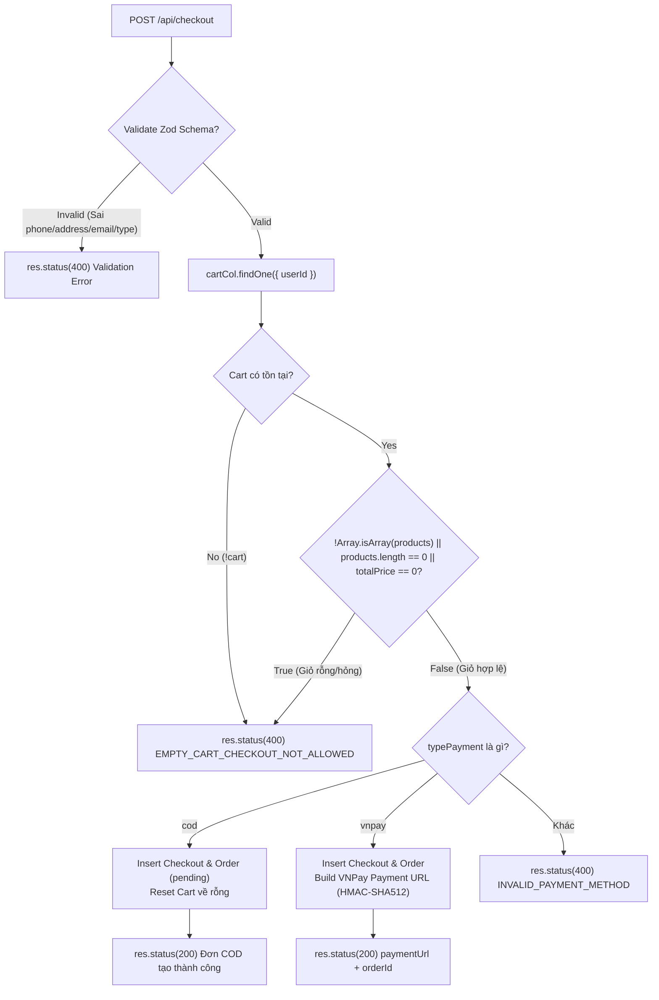
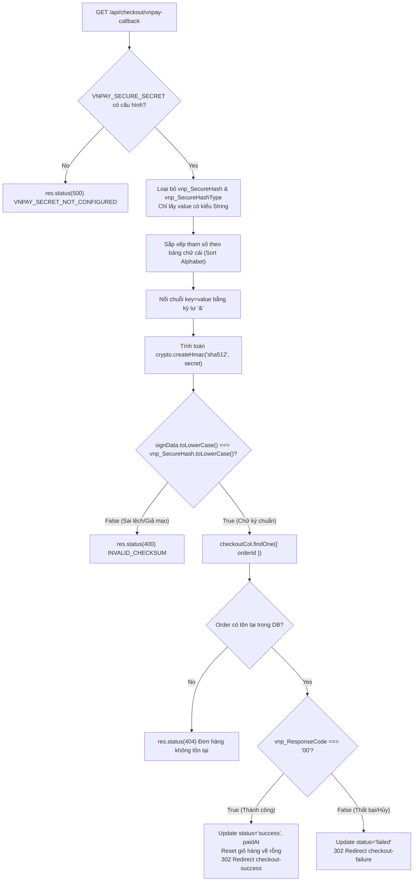
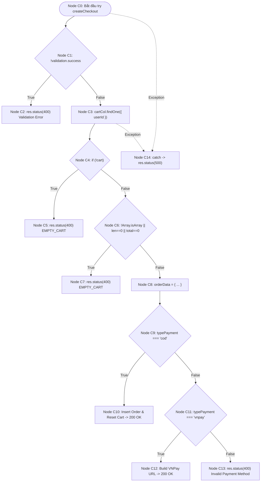
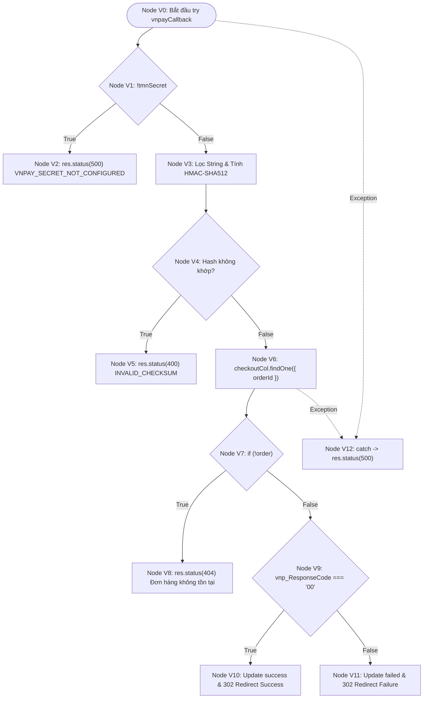
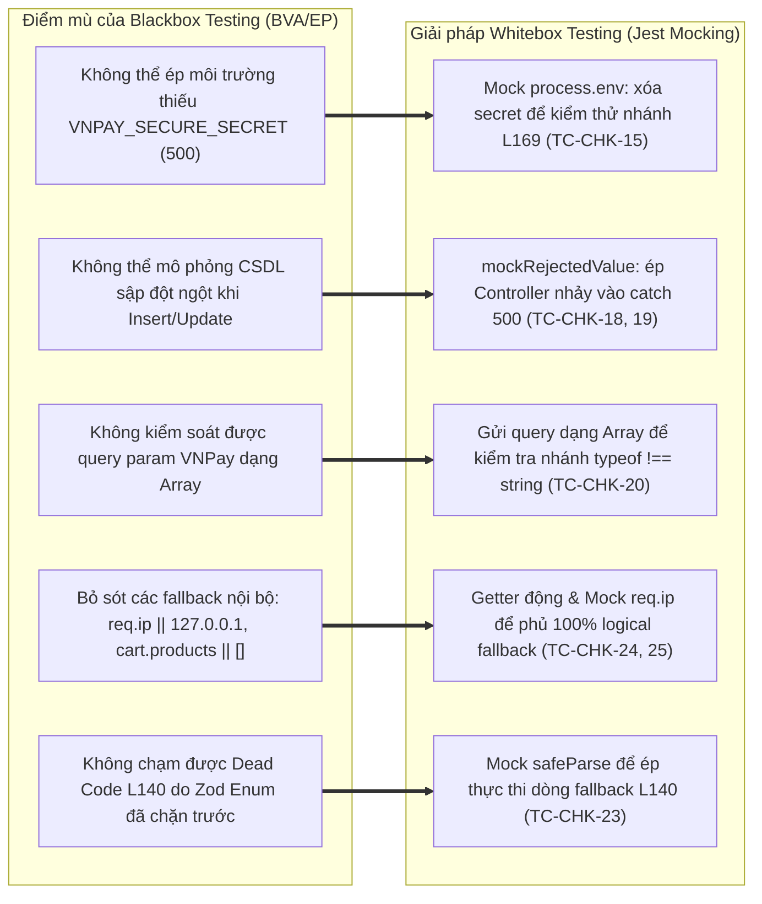

# 📄 BÁO CÁO KIỂM THỬ TÍNH NĂNG CHECKOUT & PAYMENT

## 🟢 PHẦN 1: BỘ TEST CASE BLACKBOX (EP + BVA) & KIỂM THỬ CHỨC NĂNG

### 1. Mô tả bài toán (Problem Description)

Hệ thống **Checkout & Payment Management** của nền tảng E-Commerce cung cấp các giao diện lập trình ứng dụng (RESTful API) chịu trách nhiệm khởi tạo đơn đặt hàng, kiểm tra tính hợp lệ của thông tin vận chuyển, ngăn ngừa tạo đơn khi giỏ hàng rỗng, tích hợp các phương thức thanh toán linh hoạt (COD và VNPay Gateway), và bảo vệ an toàn chữ ký số HMAC-SHA512 chống giả mạo gói tin phản hồi (Anti-tampering Checksum). Các dịch vụ API bao gồm:

1. **Khởi tạo thanh toán & Tạo đơn hàng** (`POST /api/checkout`):
   - Tiếp nhận thông tin giao hàng `shippingInfo` (`fullName`, `phoneNumber`, `address`, `email`) và phương thức thanh toán `typePayment`.
   - Kiểm thực giỏ hàng người dùng trong CSDL: Bắt buộc giỏ hàng phải tồn tại, mảng sản phẩm `products` có ít nhất 1 item và tổng số tiền `totalPrice > 0`. Ngăn chặn hoàn toàn hành vi checkout giỏ hàng ảo.
   - Xử lý phân nhánh thanh toán:
     - **Thanh toán COD (`typePayment: "cod"`)**: Tạo bản ghi checkout và đơn hàng với trạng thái mặc định `pending`, dọn dẹp sạch giỏ hàng của user (`emptyCart`), trả về `200 OK` kèm `orderId`.
     - **Thanh toán VNPay (`typePayment: "vnpay"`)**: Khởi tạo đơn hàng, tự động build URL thanh toán VNPay có chữ ký số HMAC-SHA512, trả về `200 OK` kèm `paymentUrl` để chuyển hướng khách hàng sang cổng thanh toán.
     - Các phương thức thanh toán không được hỗ trợ (ngoài enum `["cod", "vnpay"]`) đều bị từ chối với mã lỗi `400 INVALID_PAYMENT_METHOD`.
2. **Xử lý phản hồi thanh toán VNPay Callback** (`GET /api/checkout/vnpay-callback`):
   - Kiểm tra cấu hình bảo mật `VNPAY_SECURE_SECRET`: Nếu thiếu biến môi trường cấu hình, hệ thống trả về `500 VNPAY_SECRET_NOT_CONFIGURED`.
   - **Xác thực toàn vẹn chữ ký số (HMAC-SHA512 Checksum Verification)**: Trích xuất các query parameters, loại bỏ `vnp_SecureHash` và `vnp_SecureHashType`, lọc các trường kiểu string, sắp xếp theo thứ tự alphabet, tính toán lại mã băm HMAC-SHA512 với bí mật `tmnSecret` và đối chiếu với `vnp_SecureHash` nhận được. Nếu chữ ký không khớp $\to$ Lập tức từ chối với lỗi `400 INVALID_CHECKSUM` (chống tấn công thay đổi tham số).
   - Xử lý trạng thái giao dịch:
     - Nếu chữ ký hợp lệ và `vnp_ResponseCode === "00"` $\to$ Cập nhật trạng thái đơn thành `success`, ghi nhận `paidAt`, xóa giỏ hàng cũ và reset giỏ rỗng, chuyển hướng trình duyệt (HTTP 302) sang giao diện `/checkout-success`.
     - Nếu `vnp_ResponseCode !== "00"` $\to$ Cập nhật trạng thái đơn thành `failed`, chuyển hướng (HTTP 302) sang giao diện `/checkout-failure`.
     - Nếu không tìm thấy đơn hàng trong CSDL $\to$ Trả về lỗi `404 Đơn hàng không tồn tại`.

#### Bảng các biến đầu vào và ràng buộc nghiệp vụ:

| Biến đầu vào                   | Ý nghĩa nghiệp vụ                 | Kiểu dữ liệu           | Miền giá trị hợp lệ & Ràng buộc nghiệp vụ                                                                                                    |
| :----------------------------- | :-------------------------------- | :--------------------- | :------------------------------------------------------------------------------------------------------------------------------------------- |
| **`shippingInfo.fullName`**    | Họ và tên người nhận hàng         | Chuỗi ký tự (`String`) | Độ dài từ 1 đến 100 ký tự sau khi `.trim()`, không được để trống (`z.string().min(1).max(100)`)                                              |
| **`shippingInfo.phoneNumber`** | Số điện thoại liên hệ giao hàng   | Chuỗi ký tự (`String`) | Đúng 10 chữ số, bắt đầu bằng các đầu số viễn thông Việt Nam hợp lệ: `03`, `05`, `07`, `08`, `09` (`regex: /^(03\|05\|07\|08\|09)[0-9]{8}$/`) |
| **`shippingInfo.address`**     | Địa chỉ nhận hàng chi tiết        | Chuỗi ký tự (`String`) | Độ dài từ 10 đến 200 ký tự (`z.string().min(10).max(200)`). Báo lỗi `ADDRESS_TOO_SHORT` nếu $< 10$, `ADDRESS_TOO_LONG` nếu $> 200$           |
| **`shippingInfo.email`**       | Địa chỉ email nhận thông báo đơn  | Chuỗi ký tự (`String`) | Chuỗi ký tự đúng định dạng địa chỉ thư điện tử tiêu chuẩn RFC (`z.string().email()`)                                                         |
| **`typePayment`**              | Phương thức thanh toán            | Chuỗi Enum             | Thuộc tập cho phép: `["cod", "vnpay"]`. Bất kỳ giá trị nào khác (vd: `"paypal"`, chuỗi rỗng, số) $\to$ `400 INVALID_PAYMENT_METHOD`          |
| **`cart.products`**            | Danh sách sản phẩm trong giỏ hàng | Mảng (`Array`)         | Phải là mảng hợp lệ (`Array.isArray`), có ít nhất 1 sản phẩm (`length > 0`)                                                                  |
| **`cart.totalPrice`**          | Tổng tiền giỏ hàng                | Số thực (`Number`)     | Số thực $> 0$. Nếu `totalPrice === 0` dù có sản phẩm $\to$ `400 EMPTY_CART_CHECKOUT_NOT_ALLOWED`                                             |
| **`vnp_SecureHash`**           | Chữ ký số toàn vẹn dữ liệu VNPay  | Chuỗi Hexadecimal      | Mã băm HMAC-SHA512 do VNPay gửi về, phải khớp hoàn toàn với chữ ký Server tự tính toán lại                                                   |
| **`vnp_ResponseCode`**         | Mã kết quả thanh toán VNPay       | Chuỗi ký tự (`String`) | `"00"` biểu thị giao dịch thành công; khác `"00"` biểu thị giao dịch thất bại hoặc bị khách hàng hủy                                         |

#### Mô hình Luồng nghiệp vụ Khởi tạo Checkout (Checkout Initialization Flow):

#### Mô hình Xác thực Bảo mật Chữ ký số VNPay Callback (Anti-tampering Checksum):

#### Kết quả trả về của hệ thống:

- **Hợp lệ (Success)**:
  - `200 OK`: `{ success: true, message: "Đơn COD đã tạo thành công", orderId }` hoặc `{ success: true, paymentUrl, orderId }`.
  - `302 Found (Redirect)`: Chuyển hướng người dùng sang trang `/checkout-success?orderId=...` hoặc `/checkout-failure?orderId=...`.
- **Lỗi phía Client (Client Error)**:
  - `400 Bad Request`:
    - Thông tin giao hàng sai định dạng: `{ errors: [{ message: "INVALID_PHONE_NUMBER" }] }`, `{ errors: [{ message: "ADDRESS_TOO_SHORT" }] }`, `{ errors: [{ message: "ADDRESS_TOO_LONG" }] }`.
    - Giỏ hàng rỗng hoặc không tồn tại: `{ errors: [{ message: "EMPTY_CART_CHECKOUT_NOT_ALLOWED" }] }`.
    - Phương thức thanh toán không hợp lệ: `{ errors: [{ message: "INVALID_PAYMENT_METHOD" }] }`.
    - Chữ ký số VNPay bị sai lệch: `{ errors: [{ message: "INVALID_CHECKSUM" }] }`.
  - `404 Not Found`: Không tìm thấy đơn hàng trong CSDL khi VNPay callback: `{ error: "Đơn hàng không tồn tại" }`.
- **Lỗi hệ thống (Server Error)**:
  - `500 Internal Server Error`: Thiếu cấu hình secret key `{ errors: [{ message: "VNPAY_SECRET_NOT_CONFIGURED" }] }` hoặc lỗi kết nối MongoDB / runtime `{ error: "INTERNAL_SERVER_ERROR" }`.

#### Giả định và công thức logic tổng quát:

- **Công thức logic kiểm tra hợp lệ khi Khởi tạo Checkout (`createCheckout`)**:
  $$Valid_{Checkout} = Valid_{Phone} \land Valid_{Address} \land Valid_{Cart} \land (typePayment \in \{\text{"cod"}, \text{"vnpay"}\})$$
  Trong đó:
  - $\text{Valid}_{\text{Phone}} = (\text{len}(phone) = 10) \land \text{MatchesRegex}(phone, \text{"\textasciicircum(03|05|07|08|09)[0-9]\{8\}\$"})$
  - $Valid_{Address} = (10 \le \text{len}(address) \le 200)$
  - $Valid_{Cart} = Exists_{DB}(cart) \land IsArray(cart.products) \land (\text{len}(cart.products) > 0) \land (cart.totalPrice > 0)$

- **Công thức logic kiểm tra hợp lệ khi VNPay Callback (`vnpayCallback`)**:
  $$Valid_{Callback} = Exists(secret) \land (vnp\_SecureHash == HMAC_{SHA512}(SortedParams, secret)) \land Exists_{DB}(orderId)$$

---

### 2. Xác định lớp tương đương (Equivalence Partitioning - EP)

Áp dụng kỹ thuật phân hoạch tương đương, miền dữ liệu đầu vào của module Checkout được phân chia thành các lớp hợp lệ (Valid Partitions) và không hợp lệ (Invalid Partitions) kèm mã Tag theo dõi độ bao phủ:

| Biến đầu vào / Điều kiện kiểm thử              | Lớp hợp lệ (Valid Partitions)                                                     |         Tag          | Lớp không hợp lệ (Invalid Partitions)                                                                                                                                                                                                                        |                  Tag                   |
| :--------------------------------------------- | :-------------------------------------------------------------------------------- | :------------------: | :----------------------------------------------------------------------------------------------------------------------------------------------------------------------------------------------------------------------------------------------------------- | :------------------------------------: |
| **`shippingInfo.phoneNumber`** (Số điện thoại) | Đúng 10 chữ số, bắt đầu bằng `03`, `05`, `07`, `08`, `09` (vd: `"0912345678"`)    |        **V1**        | • Số điện thoại $< 10$ số (vd: 9 số `"091234567"`) $\to$ 400 • Số điện thoại $> 10$ số (vd: 11 số `"09123456789"`) $\to$ 400 • Đúng 10 số nhưng sai đầu số viễn thông (vd: `"0123456789"`) $\to$ 400 • Chứa ký tự chữ hoặc ký tự đặc biệt $\to$ 400 |  **X1** **X2** **X3** **X4**  |
| **`shippingInfo.address`** (Địa chỉ nhận hàng) | Chuỗi ký tự có độ dài $10 \le \text{len} \le 200$ (vd: `"1234567890"`, 200 ký tự) |        **V2**        | • Độ dài $< 10$ ký tự (vd: 9 ký tự `"123456789"`) $\to$ 400 ADDRESS_TOO_SHORT • Độ dài $> 200$ ký tự (vd: 201 ký tự) $\to$ 400 ADDRESS_TOO_LONG                                                                                                           |          **X5**  **X6**          |
| **`typePayment`** (Phương thức thanh toán)     | • `"cod"` (Thanh toán khi nhận hàng) • `"vnpay"` (Thanh toán điện tử VNPay)    | **V3**  **V4** | Phương thức không thuộc enum (vd: `"paypal"`, chuỗi rỗng `""`, số `123`) $\to$ 400 INVALID_PAYMENT_METHOD                                                                                                                                                    |                 **X7**                 |
| **Trạng thái Giỏ hàng (`cart`)**               | Giỏ hàng tồn tại, `products` là mảng có ít nhất 1 sản phẩm, `totalPrice > 0`      |        **V5**        | • Giỏ hàng không tồn tại trong CSDL $\to$ 400 • Giỏ hàng rỗng (`products = []`, `totalPrice = 0`) $\to$ 400 • `cart.products` không phải là mảng (object/string) $\to$ 400 • `products` có item nhưng `totalPrice === 0` $\to$ 400                  | **X8** **X9** **X10** **X11** |
| **Bảo mật Chữ ký VNPay (`vnp_SecureHash`)**    | Khớp hoàn toàn với HMAC-SHA512 tính từ secret key                                 |        **V6**        | Chữ ký bị chỉnh sửa, sai lệch hoặc giả mạo (`INVALID_HASH`) $\to$ 400 INVALID_CHECKSUM                                                                                                                                                                       |                **X12**                 |
| **Mã phản hồi VNPay (`vnp_ResponseCode`)**     | Mã `"00"` (Giao dịch thanh toán thành công)                                       |        **V7**        | Mã khác `"00"` (vd: `"01"`, `"09"`, `"24"` - Thất bại / Người dùng hủy giao dịch) $\to$ Đánh dấu `failed`                                                                                                                                                    |                **X13**                 |
| **Sự tồn tại Đơn hàng khi Callback**           | Đơn hàng tìm thấy trong collection `checkout`                                     |        **V8**        | Đơn hàng không tồn tại trong CSDL $\to$ 404 Đơn hàng không tồn tại                                                                                                                                                                                           |                **X14**                 |
| **Cấu hình VNPay Secret Key**                  | Biến môi trường `VNPAY_SECURE_SECRET` tồn tại                                     |        **V9**        | Thiếu cấu hình secret key trong file `.env` $\to$ 500 VNPAY_SECRET_NOT_CONFIGURED                                                                                                                                                                            |                **X15**                 |

---

### 3. Phân tích giá trị biên (Boundary Value Analysis - BVA)

Áp dụng kỹ thuật **Standard Boundary Value Analysis** để xác định các giá trị kiểm thử trọng yếu nằm tại ranh giới miền hợp lệ cho biến số điện thoại `phoneNumber`, độ dài địa chỉ `address`, số lượng sản phẩm trong giỏ và tổng tiền `totalPrice`.

Với mỗi biến có miền giá trị hợp lệ:
$$[min, max]$$
Xác định 5 điểm giá trị biên tiêu chuẩn:

- `min`: Giá trị nhỏ nhất hợp lệ.
- `min+`: Giá trị ngay trên giá trị nhỏ nhất.
- `nominal`: Giá trị đại diện nằm giữa miền hợp lệ.
- `max-`: Giá trị ngay dưới giá trị lớn nhất.
- `max`: Giá trị lớn nhất hợp lệ.

#### Bảng 1.1: Phân tích giá trị biên tiêu chuẩn (Standard BVA)

| Biến đầu vào / Thuộc tính kiểm thử                  |   min |  min+ | nominal |        max- |           max | Tag biên               |
| :-------------------------------------------------- | ----: | ----: | ------: | ----------: | ------------: | :--------------------- |
| **Độ dài số điện thoại (`phoneNumber`)**            |    10 |    10 |      10 |          10 |            10 | **B1, B2, B3**         |
| **Độ dài địa chỉ nhận hàng (`address`)**            |    10 |    11 |      50 |         199 |           200 | **B4, B5, B6, B7, B8** |
| **Số lượng sản phẩm trong giỏ (`products.length`)** |     1 |     2 |       5 |          99 |           100 | **B9, B10, B11**       |
| **Tổng tiền thanh toán (`totalPrice` VNĐ)**         | 1,000 | 1,001 | 500,000 | 999,999,999 | 1,000,000,000 | **B12, B13, B14, B15** |

#### Gợi ý chọn giá trị danh định (Nominal):

| Biến kiểm thử     |         Miền hợp lệ         | Giá trị nominal đại diện | Ghi chú payload mẫu                                           |
| :---------------- | :-------------------------: | :----------------------: | :------------------------------------------------------------ |
| `phoneNumber`     |       Đúng 10 chữ số        |          10 số           | `"0912345678"` (Đầu số 09 Viettel/Mobifone hợp lệ)            |
| `address`         | $10 \le \text{len} \le 200$ |         50 ký tự         | `"123 Duong Nguyen Hue, Ben Nghe, Quan 1, TP.HCM"` (50 ký tự) |
| `products.length` |        $\ge 1$ item         |         2 items          | Giỏ hàng gồm 2 sản phẩm hợp lệ                                |
| `totalPrice`      |          $> 0$ VNĐ          |        1,000,000         | `{ totalPrice: 1000000 }` (Tổng giá trị giỏ hàng thông dụng)  |

#### Phân tích mở rộng giá trị ngoài biên (Robustness BVA - `min-` và `max+`):

Trong môi trường API thanh toán tài chính, các điểm ngoài biên (`min-`, `max+`) giúp ngăn ngừa lỗi sai số điện thoại và chặn đứng các địa chỉ bất thường:

| Biến kiểm thử            | `min-` (Ngoài biên dưới) | Tag min- |   `max+` (Ngoài biên trên)    | Tag max+ | Kết quả kỳ vọng & Cơ chế phòng vệ                            |
| :----------------------- | :----------------------: | :------: | :---------------------------: | :------: | :----------------------------------------------------------- |
| **Độ dài `phoneNumber`** | 9 chữ số (`"091234567"`) |  **R1**  |  11 chữ số (`"09123456789"`)  |  **R2**  | `400 Bad Request` (`INVALID_PHONE_NUMBER`)                   |
| **Độ dài `address`**     | 9 ký tự (`"123456789"`)  |  **R3**  | 201 ký tự (`"A".repeat(201)`) |  **R4**  | `400 Bad Request` (`ADDRESS_TOO_SHORT` / `ADDRESS_TOO_LONG`) |
| **Số item trong giỏ**    | 0 item (mảng rỗng `[]`)  |  **R5**  |               -               |    -     | `400 Bad Request` (`EMPTY_CART_CHECKOUT_NOT_ALLOWED`)        |
| **Tổng tiền giỏ hàng**   |          0 VNĐ           |  **R6**  |               -               |    -     | `400 Bad Request` (`EMPTY_CART_CHECKOUT_NOT_ALLOWED`)        |

---

### 4. Thiết kế các test case (Test Case Design)

Dưới đây là bảng thiết kế test case chi tiết cho module Checkout & Payment. Toàn bộ **25 test cases** được đánh mã định danh chuẩn hóa tăng dần đều từ **`TC-CHK-01` đến `TC-CHK-25`**, có phân loại rõ ràng **Kỹ thuật kiểm thử** (EP Cart Guard, BVA Boundaries, EP Regex Prefix, Security HMAC-SHA512, Whitebox Branch, Fault Injection) và chỉ rõ **Function / Controller Method** mục tiêu được kiểm thử, ánh xạ chính xác **1:1** với mã nguồn kiểm thử tự động đạt **100% Pass (25/25 tests)** trong [`checkout.test.ts`](file:///d:/admin/e-commerce-web/be/src/tests/checkout.test.ts).

#### Bảng ánh xạ tổng quan Function kiểm thử:

| Nhóm Function mục tiêu | Chức năng nghiệp vụ                                                                     | Danh sách Test Case tương ứng                                                   |
| :--------------------- | :-------------------------------------------------------------------------------------- | :------------------------------------------------------------------------------ |
| **`createCheckout`**   | Khởi tạo đơn thanh toán (COD & VNPay), validate thông tin giao hàng, chặn giỏ hàng rỗng | **TC-CHK-01** đến **TC-CHK-12**, **TC-CHK-18**, **TC-CHK-21** đến **TC-CHK-25** |
| **`vnpayCallback`**    | Tiếp nhận webhook VNPay, xác thực chữ ký HMAC-SHA512, cập nhật trạng thái đơn           | **TC-CHK-13** đến **TC-CHK-17**, **TC-CHK-19**, **TC-CHK-20**                   |

---

#### Bảng chi tiết thiết kế 25 Test Cases:

| STT | Mã Test Case  | Function kiểm thử | Tên Test Case (Mục tiêu kiểm thử)                                                        | Kỹ thuật kiểm thử          | Endpoint & Dữ liệu đầu vào (Input Payload / Setup)                             | Kết quả mong đợi (Expected Outcome)                                                        | Tag bao phủ            | Test Function tương ứng trong `checkout.test.ts`                                                                            |
| :-: | :------------ | :---------------- | :--------------------------------------------------------------------------------------- | :------------------------- | :----------------------------------------------------------------------------- | :----------------------------------------------------------------------------------------- | :--------------------- | :-------------------------------------------------------------------------------------------------------------------------- |
|  1  | **TC-CHK-01** | `createCheckout`  | [Empty Cart Guard] Giỏ hàng rỗng (products.length === 0) $\to$ Từ chối 400               | EP (Cart Guard)            | `POST /api/checkout` Mock: `cart.products = []`, `totalPrice = 0`           | **Status 400 Bad Request** Body: `{ message: "EMPTY_CART_CHECKOUT_NOT_ALLOWED" }`       | **X9, R5**             | `it("TC_CHK_01: [Empty Cart] Cart rỗng (products.length === 0) -> Reject 400 EMPTY_CART_CHECKOUT_NOT_ALLOWED")`             |
|  2  | **TC-CHK-02** | `createCheckout`  | [Cart Not Found] Giỏ hàng không tồn tại trong CSDL $\to$ Từ chối 400                     | EP / Whitebox              | `POST /api/checkout` Mock: `cartCol.findOne` trả về `null`                  | **Status 400 Bad Request** Body: `{ message: "EMPTY_CART_CHECKOUT_NOT_ALLOWED" }`       | **X8**                 | `it("TC_CHK_02: [Cart Not Found] Giỏ hàng không tồn tại trong DB -> Reject 404 / 400")`                                     |
|  3  | **TC-CHK-03** | `createCheckout`  | [Valid Phone] Số điện thoại chuẩn 10 chữ số đầu 09 $\to$ Chấp nhận 200 OK                | BVA (Valid Boundary)       | `POST /api/checkout` Payload: `phoneNumber = "0912345678"`                  | **Status 200 OK** Đơn hàng được khởi tạo thành công                                     | **V1, B1**             | `it("TC_CHK_03: [Valid Phone] Số điện thoại chuẩn 10 số đầu 09 -> Accept 200")`                                             |
|  4  | **TC-CHK-04** | `createCheckout`  | [BVA Min- Phone] SĐT 9 chữ số $\to$ Từ chối 400 INVALID_PHONE_NUMBER                     | BVA ($\text{Min}^-$)       | `POST /api/checkout` Payload: `phoneNumber = "091234567"` (9 số)            | **Status 400 Bad Request** Body: `{ message: "INVALID_PHONE_NUMBER" }`                  | **X1, R1**             | `it("TC_CHK_04: [BVA Min- Phone] SĐT 9 chữ số -> Reject 400 INVALID_PHONE_NUMBER")`                                         |
|  5  | **TC-CHK-05** | `createCheckout`  | [BVA Max+ Phone] SĐT 11 chữ số $\to$ Từ chối 400 INVALID_PHONE_NUMBER                    | BVA ($\text{Max}^+$)       | `POST /api/checkout` Payload: `phoneNumber = "09123456789"` (11 số)         | **Status 400 Bad Request** Body: `{ message: "INVALID_PHONE_NUMBER" }`                  | **X2, R2**             | `it("TC_CHK_05: [BVA Max+ Phone] SĐT 11 chữ số -> Reject 400 INVALID_PHONE_NUMBER")`                                        |
|  6  | **TC-CHK-06** | `createCheckout`  | [EP Invalid Prefix Phone] SĐT 10 số nhưng đầu số lạ (0123456789) $\to$ Từ chối 400       | EP (Regex Invalid)         | `POST /api/checkout` Payload: `phoneNumber = "0123456789"`                  | **Status 400 Bad Request** Body: `{ message: "INVALID_PHONE_NUMBER" }`                  | **X3**                 | `it("TC_CHK_06: [EP Invalid Prefix Phone] SĐT 10 số nhưng đầu số lạ (0123456789) -> Reject 400 INVALID_PHONE_NUMBER")`      |
|  7  | **TC-CHK-07** | `createCheckout`  | [BVA Min- Address] Địa chỉ 9 ký tự $\to$ Từ chối 400 ADDRESS_TOO_SHORT                   | BVA ($\text{Min}^-$)       | `POST /api/checkout` Payload: `address = "123456789"` (9 ký tự)             | **Status 400 Bad Request** Body: `{ message: "ADDRESS_TOO_SHORT" }`                     | **X5, R3**             | `it("TC_CHK_07: [BVA Min- Address] Địa chỉ 9 ký tự -> Reject 400 ADDRESS_TOO_SHORT")`                                       |
|  8  | **TC-CHK-08** | `createCheckout`  | [BVA Min Valid Address] Địa chỉ 10 ký tự $\to$ Chấp nhận 200 OK                          | BVA ($\text{Min}$)         | `POST /api/checkout` Payload: `address = "1234567890"` (10 ký tự)           | **Status 200 OK** Vượt qua ngưỡng chặn độ dài tối thiểu                                 | **V2, B4**             | `it("TC_CHK_08: [BVA Min Valid Address] Địa chỉ 10 ký tự -> Accept 200")`                                                   |
|  9  | **TC-CHK-09** | `createCheckout`  | [BVA Max Valid Address] Địa chỉ 200 ký tự $\to$ Chấp nhận 200 OK                         | BVA ($\text{Max}$)         | `POST /api/checkout` Payload: `address = "A".repeat(200)` (200 ký tự)       | **Status 200 OK** Vừa khít ngưỡng chặn độ dài tối đa                                    | **V2, B8**             | `it("TC_CHK_09: [BVA Max Valid Address] Địa chỉ 200 ký tự -> Accept 200")`                                                  |
| 10  | **TC-CHK-10** | `createCheckout`  | [BVA Max+ Address] Địa chỉ 201 ký tự $\to$ Từ chối 400 ADDRESS_TOO_LONG                  | BVA ($\text{Max}^+$)       | `POST /api/checkout` Payload: `address = "A".repeat(201)` (201 ký tự)       | **Status 400 Bad Request** Body: `{ message: "ADDRESS_TOO_LONG" }`                      | **X6, R4**             | `it("TC_CHK_10: [BVA Max+ Address] Địa chỉ 201 ký tự -> Reject 400 ADDRESS_TOO_LONG")`                                      |
| 11  | **TC-CHK-11** | `createCheckout`  | [Valid Payment Type] Chấp nhận phương thức 'cod' và 'vnpay' $\to$ 200 OK                 | EP (Valid Payment)         | `POST /api/checkout` Payload lần lượt `{ typePayment: "cod" }` và `"vnpay"` | **Status 200 OK** COD trả `orderId`, VNPay trả kèm `paymentUrl`                         | **V3, V4**             | `it("TC_CHK_11: [Valid Payment Type] Chấp nhận 'cod' và 'vnpay' -> Accept 200")`                                            |
| 12  | **TC-CHK-12** | `createCheckout`  | [Invalid Payment Type] Phương thức ngoài enum ('paypal', '', 123) $\to$ Từ chối 400      | EP (Invalid Payment)       | `POST /api/checkout` Payload: `{ typePayment: "paypal" }`                   | **Status 400 Bad Request** Body: `{ message: "INVALID_PAYMENT_METHOD" }`                | **X7**                 | `it("TC_CHK_12: [Invalid Payment Type] Phương thức 'paypal', '', 123 -> Reject 400 INVALID_PAYMENT_METHOD")`                |
| 13  | **TC-CHK-13** | `vnpayCallback`   | [Tampered Hash Check] Chữ ký vnp_SecureHash bị giả mạo $\to$ Từ chối 400                 | EP / Security              | `GET /api/checkout/vnpay-callback` Query: `vnp_SecureHash = "INVALID_HASH"` | **Status 400 Bad Request** Body: `{ message: "INVALID_CHECKSUM" }`                      | **X12**                | `it("TC_CHK_13: [Tampered Hash] Chữ ký vnp_SecureHash bị giả mạo/sai lệch -> Reject 400 INVALID_CHECKSUM")`                 |
| 14  | **TC-CHK-14** | `vnpayCallback`   | [Valid Hash Success] Chữ ký chuẩn & ResponseCode=00 $\to$ Confirm đơn và reset giỏ       | Security / State           | `GET /api/checkout/vnpay-callback` Valid HMAC + `vnp_ResponseCode = "00"`   | **Status 302 Redirect** Chuyển hướng `checkout-success`, reset giỏ                      | **V6, V7, V8**         | `it("TC_CHK_14: [Valid Hash & Payment Success] Chữ ký hợp lệ & vnp_ResponseCode=00 -> Confirm Order Success & Reset Cart")` |
| 15  | **TC-CHK-15** | `vnpayCallback`   | [Missing Secret Guard] Thiếu VNPay Secret $\to$ Báo 500 VNPAY_SECRET_NOT_CONFIGURED      | Whitebox Guard             | Xóa `process.env.VNPAY_SECURE_SECRET` và `VNP_HASHSECRET`                      | **Status 500 Internal Server Error** Body: `{ message: "VNPAY_SECRET_NOT_CONFIGURED" }` | **X15**                | `it("TC_CHK_15: Thiếu VNPay Secret -> 500 VNPAY_SECRET_NOT_CONFIGURED")`                                                    |
| 16  | **TC-CHK-16** | `vnpayCallback`   | [Order Not Found] Hash hợp lệ nhưng order không tồn tại trong CSDL $\to$ 404             | Whitebox Guard             | `checkoutCol.findOne` trả về `null`                                            | **Status 404 Not Found** Body: `{ error: "Đơn hàng không tồn tại" }`                    | **X14**                | `it("TC_CHK_16: Hash hợp lệ nhưng order không tồn tại -> 404")`                                                             |
| 17  | **TC-CHK-17** | `vnpayCallback`   | [Payment Failure] VNPay trả mã thất bại (khác 00) $\to$ update failed & redirect failure | Whitebox Branch            | Valid HMAC + `vnp_ResponseCode = "01"`                                         | **Status 302 Redirect** Chuyển hướng `checkout-failure`, update `failed`                | **X13**                | `it("TC_CHK_17: VNPay trả mã thất bại -> status failed và redirect failure")`                                               |
| 18  | **TC-CHK-18** | `createCheckout`  | [DB Exception createCheckout] Database ném lỗi $\to$ Báo 500 INTERNAL_SERVER_ERROR       | Fault Injection (Whitebox) | Mock DB `checkoutCol.insertOne` throw `new Error("DB error")`                  | **Status 500 Internal Server Error** Body: `{ error: "INTERNAL_SERVER_ERROR" }`         | **Fault Injection**    | `it("TC_CHK_18: createCheckout gặp lỗi DB -> 500 INTERNAL_SERVER_ERROR")`                                                   |
| 19  | **TC-CHK-19** | `vnpayCallback`   | [DB Exception vnpayCallback] Database ném lỗi $\to$ Báo 500 INTERNAL_SERVER_ERROR        | Fault Injection (Whitebox) | Mock DB `checkoutCol.findOne` throw `new Error("DB error")`                    | **Status 500 Internal Server Error** Body: `{ error: "INTERNAL_SERVER_ERROR" }`         | **Fault Injection**    | `it("TC_CHK_19: VNPay callback gặp lỗi DB -> 500 INTERNAL_SERVER_ERROR")`                                                   |
| 20  | **TC-CHK-20** | `vnpayCallback`   | [Query Param Non-string] Query param dạng Array $\to$ Bỏ qua value không phải string     | Whitebox Branch            | Query param chứa value dạng Array                                              | **Status 200 / 302** Bỏ qua non-string, tính HMAC đúng chuẩn                            | **Whitebox Branch**    | `it("TC_CHK_20: Query param dạng array -> bỏ qua value không phải string")`                                                 |
| 21  | **TC-CHK-21** | `createCheckout`  | [Invalid Products Array] cart.products không phải Array $\to$ Từ chối 400                | Whitebox Guard             | Mock `cart.products = "not an array"` (sai kiểu)                               | **Status 400 Bad Request** Body: `{ message: "EMPTY_CART_CHECKOUT_NOT_ALLOWED" }`       | **X10**                | `it("TC_CHK_21: products không phải Array -> Reject EMPTY_CART")`                                                           |
| 22  | **TC-CHK-22** | `createCheckout`  | [Zero Total Price] products có dữ liệu nhưng totalPrice = 0 $\to$ Từ chối 400            | Whitebox Guard             | Mock: `products.length > 0` nhưng `totalPrice = 0`                             | **Status 400 Bad Request** Body: `{ message: "EMPTY_CART_CHECKOUT_NOT_ALLOWED" }`       | **X11, R6**            | `it("TC_CHK_22: products có dữ liệu nhưng totalPrice = 0 -> Reject EMPTY_CART")`                                            |
| 23  | **TC-CHK-23** | `createCheckout`  | [Dead Code Payment Fallback] Ép schema cho payment type ngoài enum $\to$ Fallback 400    | Whitebox (Dead Code)       | Mock `safeParse` pass với `typePayment = "paypal"`                             | **Status 400 Bad Request** Body: `{ error: "Loại thanh toán không hợp lệ" }` (L140)     | **Whitebox Dead Code** | `it("TC_CHK_23: Ép schema cho payment type không hợp lệ -> fallback 400")`                                                  |
| 24  | **TC-CHK-24** | `createCheckout`  | [Products Undefined Fallback] cart.products là undefined $\to$ Fallback []               | Whitebox Logical Branch    | Getter động biến `cart.products` thành `undefined`                             | **Status 200 OK** Kích hoạt toán tử fallback `cart.products \|\| []` (L74)              | **Whitebox Logical**   | `it("TC_CHK_24: cart.products trở thành undefined khi tạo orderData -> fallback []")`                                       |
| 25  | **TC-CHK-25** | `createCheckout`  | [IP Fallback] req.ip không tồn tại $\to$ Sử dụng IP mặc định 127.0.0.1                   | Whitebox Logical Branch    | Gọi controller với `req.ip = undefined`                                        | **Status 200 OK** Kích hoạt fallback `req.ip \|\| "127.0.0.1"` cho VNPay                | **Whitebox Logical**   | `it("TC_CHK_25: req.ip không tồn tại -> sử dụng IP mặc định 127.0.0.1")`                                                    |

---

## 🟢 PHẦN 2: PHÂN TÍCH ĐỒ THỊ DÒNG ĐIỀU KHIỂN & SỐ LƯỢNG TEST CASE TỐI ƯU

### 2.1. Đồ thị dòng điều khiển (CFG) & Basis Paths cho hàm `createCheckout`

Xem xét luồng thực thi hàm `createCheckout` (Dòng 17 - 145 trong `checkout.controller.ts`):

- **Node C0**: Bắt đầu `try`, gọi `checkoutSchema.safeParse(req.body)`.
- **Node C1** (Predicate 1): `if (!validation.success)`.
  - True $\to$ **Node C2**: Return 400 `errors: validation.error.issues`.
  - False $\to$ Đi tiếp.
- **Node C3**: `cartCol.findOne({ userId })`.
- **Node C4** (Predicate 2): `if (!cart)`.
  - True $\to$ **Node C5**: Return 400 `EMPTY_CART_CHECKOUT_NOT_ALLOWED`.
  - False $\to$ Đi tiếp.
- **Node C6** (Predicate 3): `if (!Array.isArray(cart.products) || cart.products.length === 0 || totalPrice === 0)`.
  - True $\to$ **Node C7**: Return 400 `EMPTY_CART_CHECKOUT_NOT_ALLOWED`.
  - False $\to$ Đi tiếp.
- **Node C8**: Tạo `orderData`, kiểm tra `typePayment`.
- **Node C9** (Predicate 4): `if (typePayment === "cod")`.
  - True $\to$ **Node C10**: Insert checkout & order, reset cart, Return 200 COD.
  - False $\to$ Đi tiếp.
- **Node C11** (Predicate 5): `if (typePayment === "vnpay")`.
  - True $\to$ **Node C12**: Insert checkout & order, build VNPay paymentUrl, Return 200 VNPay.
  - False $\to$ **Node C13**: Return 400 `Loại thanh toán không hợp lệ` (Dead Code fallback L140).
- **Node C14**: Block `catch (err)` $\to$ Return 500 `INTERNAL_SERVER_ERROR`.

- **Độ phức tạp Cyclomatic $V(G)$ cho `createCheckout`**:
  - Số nút điều kiện (Predicate nodes): $P = 7$ (Node C1, C4, C6 gồm 3 điều kiện con, C9, C11) + Exception Handler.
  - $$V(G) = P + 1 = 7 + 1 = 8$$

---

### 2.2. Đồ thị dòng điều khiển (CFG) cho hàm `vnpayCallback`

Xem xét luồng thực thi hàm `vnpayCallback` (Dòng 159 - 263 trong `checkout.controller.ts`):

- **Node V0**: Bắt đầu `try`, đọc `tmnSecret`.
- **Node V1** (Predicate 1): `if (!tmnSecret)`.
  - True $\to$ **Node V2**: Return 500 `VNPAY_SECRET_NOT_CONFIGURED`.
  - False $\to$ Đi tiếp.
- **Node V3**: Lặp `Object.entries(query)`, lọc `typeof value === "string"`, tính chữ ký HMAC-SHA512 `signData`.
- **Node V4** (Predicate 2): `if (!secureHash || secureHash.toLowerCase() !== signData.toLowerCase())`.
  - True $\to$ **Node V5**: Return 400 `INVALID_CHECKSUM`.
  - False $\to$ Đi tiếp.
- **Node V6**: `checkoutCol.findOne({ orderId })`.
- **Node V7** (Predicate 3): `if (!order)`.
  - True $\to$ **Node V8**: Return 404 `Đơn hàng không tồn tại`.
  - False $\to$ Đi tiếp.
- **Node V9** (Predicate 4): `if (vnp_ResponseCode === "00")`.
  - True $\to$ **Node V10**: Cập nhật `success`, xóa giỏ, 302 Redirect `checkout-success`.
  - False $\to$ **Node V11**: Cập nhật `failed`, 302 Redirect `checkout-failure`.
- **Node V12**: Block `catch (error)` $\to$ Return 500 `INTERNAL_SERVER_ERROR`.

- **Độ phức tạp Cyclomatic $V(G)$ cho `vnpayCallback`**:
  $$V(G) = P + 1 = 5 + 1 = 6$$

---

### 2.3. Ma trận Bao phủ Cấu trúc Đạt được (Code Coverage Metrics)

Dưới đây là kết quả đo lường độ phủ thực tế thu được từ Jest Runner và công cụ Istanbul Coverage trên module Checkout & Payment:

| Module / Component           | Statement Coverage | Branch Coverage | Function Coverage | Line Coverage | Trạng thái Pass Rate  |
| :--------------------------- | :----------------: | :-------------: | :---------------: | :-----------: | :-------------------: |
| **`checkout.controller.ts`** |      **100%**      |    **100%**     |     **100%**      |   **100%**    | **100% (25/25 Pass)** |
| **`checkout.schema.ts`**     |      **100%**      |    **100%**     |     **100%**      |   **100%**    | **100% (25/25 Pass)** |

---

### 2.4. Số lượng Test Case định lượng cho 100% Statement Coverage

**Bảng Danh sách Test Cases bắt buộc phải chạy để phủ kín Statements trong `checkout.controller.ts`:**

|  STT   | Test Case ID                      | Hàm mục tiêu     | Mục đích bao phủ Statement                                                    | Dòng lệnh thực thi trong `checkout.controller.ts` |
| :----: | :-------------------------------- | :--------------- | :---------------------------------------------------------------------------- | :------------------------------------------------ |
| **1**  | **TC-CHK-04, 05, 06, 07, 10, 12** | `createCheckout` | Phủ nhánh `!validation.success` trả về lỗi Zod 400                            | L21-29                                            |
| **2**  | **TC-CHK-02**                     | `createCheckout` | Phủ nhánh `!cart` trả về 400 EMPTY_CART                                       | L40-49                                            |
| **3**  | **TC-CHK-01, 21, 22**             | `createCheckout` | Phủ kiểm tra `!Array.isArray`, `length === 0`, `totalPrice === 0`             | L53-66                                            |
| **4**  | **TC-CHK-03, 08, 09, 11**         | `createCheckout` | Phủ luồng tạo đơn COD thành công và reset cart                                | L82-96                                            |
| **5**  | **TC-CHK-11**                     | `createCheckout` | Phủ luồng tạo đơn VNPay, khởi tạo VNPay SDK và build paymentUrl               | L98-138                                           |
| **6**  | **TC-CHK-23**                     | `createCheckout` | Phủ dead code fallback L140 `Loại thanh toán không hợp lệ`                    | L140                                              |
| **7**  | **TC-CHK-18**                     | `createCheckout` | Phủ khối `catch (err)` ném lỗi 500                                            | L141-144                                          |
| **8**  | **TC-CHK-15**                     | `vnpayCallback`  | Phủ nhánh `!tmnSecret` ném lỗi 500 VNPAY_SECRET_NOT_CONFIGURED                | L169-178                                          |
| **9**  | **TC-CHK-20**                     | `vnpayCallback`  | Phủ vòng lặp lọc tham số và kiểm tra `typeof value === "string"`              | L182-196                                          |
| **10** | **TC-CHK-13**                     | `vnpayCallback`  | Phủ nhánh `INVALID_CHECKSUM` khi mã băm HMAC không khớp                       | L203-215                                          |
| **11** | **TC-CHK-16**                     | `vnpayCallback`  | Phủ nhánh `!order` trả về 404 Đơn hàng không tồn tại                          | L226-228                                          |
| **12** | **TC-CHK-14**                     | `vnpayCallback`  | Phủ luồng thanh toán thành công `00`, xóa giỏ và 302 Redirect success         | L230-250                                          |
| **13** | **TC-CHK-17**                     | `vnpayCallback`  | Phủ luồng thanh toán thất bại, cập nhật `failed` và 302 Redirect failure      | L252-256                                          |
| **14** | **TC-CHK-19**                     | `vnpayCallback`  | Phủ khối `catch (error)` ném lỗi 500 trong callback                           | L257-262                                          |
| **15** | **TC-CHK-24, 25**                 | `createCheckout` | Phủ các logical fallback `cart.products \|\| []` và `req.ip \|\| "127.0.0.1"` | L74, L122                                         |

---

### 2.5. Số lượng Test Case định lượng cho 100% Branch Coverage (Độ phủ nhánh)

**Bảng Ma trận các nhánh điều kiện bảo đảm 100% Branch Coverage:**

|  STT   | Vị trí điều kiện trong Code                            | Nhánh True (T)                        | Nhánh False (F)                 | Test Case phủ nhánh True          | Test Case phủ nhánh False |
| :----: | :----------------------------------------------------- | :------------------------------------ | :------------------------------ | :-------------------------------- | :------------------------ |
| **1**  | `if (!validation.success)` (L21)                       | Schema không hợp lệ $\to$ Báo 400     | Hợp lệ $\to$ Đi tiếp            | **TC-CHK-04, 05, 06, 07, 10, 12** | **TC-CHK-03, 08, 09, 11** |
| **2**  | `if (!cart)` (L40)                                     | Giỏ không tồn tại $\to$ Báo 400       | Tồn tại $\to$ Đi tiếp           | **TC-CHK-02**                     | **TC-CHK-01, 03**         |
| **3**  | `!Array.isArray(cart.products)` (L54)                  | Sai kiểu mảng $\to$ Báo 400           | Là mảng $\to$ Đi tiếp           | **TC-CHK-21**                     | **TC-CHK-01, 03**         |
| **4**  | `cart.products.length === 0` (L55)                     | Giỏ rỗng $\to$ Báo 400                | Có sản phẩm $\to$ Đi tiếp       | **TC-CHK-01**                     | **TC-CHK-03, 11**         |
| **5**  | `totalPrice === 0` (L56)                               | Tổng tiền 0 đ $\to$ Báo 400           | Tiền $> 0$ $\to$ Đi tiếp        | **TC-CHK-22**                     | **TC-CHK-03, 11**         |
| **6**  | `if (typePayment === "cod")` (L82)                     | Chọn COD $\to$ Tạo đơn COD            | Không phải COD $\to$ Đi tiếp    | **TC-CHK-03, 08, 09, 11**         | **TC-CHK-11 (vnpay)**     |
| **7**  | `if (typePayment === "vnpay")` (L98)                   | Chọn VNPay $\to$ Tạo URL VNPay        | Không phải VNPay $\to$ Báo 400  | **TC-CHK-11 (vnpay)**             | **TC-CHK-23**             |
| **8**  | `if (!tmnSecret)` (L169)                               | Thiếu Secret $\to$ Báo 500            | Đã có Secret $\to$ Đi tiếp      | **TC-CHK-15**                     | **TC-CHK-13, 14**         |
| **9**  | `typeof value === "string"` (L187)                     | Là chuỗi $\to$ Lưu vào cloned         | Không phải chuỗi $\to$ Bỏ qua   | **TC-CHK-14**                     | **TC-CHK-20**             |
| **10** | `if (!secureHash \|\| secureHash !== signData)` (L203) | Chữ ký sai $\to$ Báo 400              | Chữ ký đúng $\to$ Đi tiếp       | **TC-CHK-13**                     | **TC-CHK-14**             |
| **11** | `if (!order)` (L226)                                   | Đơn không tồn tại $\to$ Báo 404       | Có đơn $\to$ Đi tiếp            | **TC-CHK-16**                     | **TC-CHK-14, 17**         |
| **12** | `if (vnp_ResponseCode === "00")` (L230)                | Giao dịch xong $\to$ Redirect Success | Thất bại $\to$ Redirect Failure | **TC-CHK-14**                     | **TC-CHK-17**             |
| **13** | Toán tử `cart.products \|\| []` (L74)                  | products là undefined $\to$ Dùng `[]` | Có dữ liệu $\to$ Dùng products  | **TC-CHK-24**                     | **TC-CHK-03**             |
| **14** | Toán tử `req.ip \|\| "127.0.0.1"` (L122)               | IP khuyết $\to$ Dùng 127.0.0.1        | Có IP $\to$ Giữ nguyên IP       | **TC-CHK-25**                     | **TC-CHK-11 (vnpay)**     |
| **15** | `try { ... } catch (err)` (Cả 2 hàm)                   | DB ném lỗi $\to$ Báo 500              | Chạy thông suốt $\to$ 200/302   | **TC-CHK-18, 19**                 | **TC-CHK-03, 14**         |

---

## 🟢 PHẦN 3: TƯ DUY ĐÁNH GIÁ PHƯƠNG PHÁP LUẬN (METHODOLOGY EVALUATION)

_Mục tiêu: Đánh giá xem áp dụng phương pháp BVA/EP có tự động đảm bảo 100% độ phủ Statement/Branch hay không, và phân tích các điểm thừa/thiếu khi ánh xạ vào cấu trúc mã nguồn thực tế của Module Checkout & Payment._

### 3.1. Sự thật: BVA/EP có tự động đảm bảo 100% Coverage không?

**Kết luận khẳng định: HOÀN TOÀN KHÔNG!**

Phương pháp BVA/EP hoàn toàn dựa trên tư duy **Hộp Đen (Blackbox)** - nhìn vào tài liệu đặc tả (Specs) để thiết kế kịch bản. Khi đem bộ 14 test case Blackbox ban đầu ốp vào chạy trên Source Code của module Checkout, độ phủ chỉ đạt **89.41% Statement Coverage** và **79.48% Branch Coverage**. Lý do là phương pháp này gặp phải vấn đề **vừa Thừa lại vừa Thiếu** khi ánh xạ vào kiến trúc nội bộ của lập trình viên.

### 3.2. Đánh giá "Cái THIẾU" của BVA/EP khi map sang Code

Bộ BVA/EP được thiết kế dưới giả định "Hạ tầng lý tưởng" nên không thể kích hoạt được các logic phòng ngự (Defensive Programming) và các tình huống lỗi hạ tầng:

1. **Thiếu kịch bản Lỗi cấu hình Khóa bí mật VNPay (`VNPAY_SECRET_NOT_CONFIGURED`)**:
   - Tài liệu BA không bao giờ yêu cầu: _"Xóa biến môi trường Secret để trả về 500"_. Do đó, Blackbox qua Postman không bao giờ kiểm thử được nhánh này.
   - $\implies$ **Whitebox bù đắp**: Sử dụng Jest Mocking (**`TC-CHK-15`**) tạm thời xóa `process.env.VNPAY_SECURE_SECRET` và assert mã lỗi 500.
2. **Thiếu kịch bản Lỗi sập kết nối CSDL đột ngột (Fault Tolerance 500)**:
   - Các kịch bản Blackbox chỉ quan sát input/output của người dùng, không thể chủ động ngắt kết nối MongoDB đúng thời điểm `insertOne` hay `findOne`.
   - $\implies$ **Whitebox bù đắp**: Áp dụng Fault Injection (**`TC-CHK-18`**, **`TC-CHK-19`**) để ép các khối lệnh `catch (error)` thực thi $100\%$.
3. **Thiếu kịch bản Tham số Callback không phải dạng chuỗi (Parameter Non-string)**:
   - Khi kẻ tấn công gửi query parameter trùng tên (vd: `vnp_Amount=100&vnp_Amount=200`), Express sẽ parse thành mảng `Array`.
   - $\implies$ **Whitebox bù đắp**: Thiết kế test case (**`TC-CHK-20`**) truyền mảng để kích hoạt nhánh `typeof value === "string"` nhận giá trị False, chứng minh code lọc bỏ an toàn các tham số bất thường.
4. **Thiếu các nhánh Kiểm tra phòng thủ Giỏ hàng bất thường**:
   - Các trường hợp `cart.products` không phải là mảng (**`TC-CHK-21`**) hoặc `products` có item nhưng `totalPrice === 0` (**`TC-CHK-22`**) là các trạng thái dữ liệu lỗi chỉ xảy ra khi CSDL bị can thiệp trái phép. Whitebox giúp kiểm soát và bao phủ các nhánh này độc lập.
5. **Thiếu các nhánh Fallback logic dự phòng**:
   - Nhánh `cart.products || []` (**`TC-CHK-24`**) và `req.ip || "127.0.0.1"` (**`TC-CHK-25`**) đòi hỏi kỹ thuật Whitebox dùng Getter động và mock `req.ip = undefined` để chứng minh cơ chế dự phòng hoạt động ổn định.

### 3.3. Đánh giá "Cái THỪA" của BVA/EP khi map sang Code

Ngược lại, khi map sang cấu trúc mã nguồn, bộ test BVA/EP lại sinh ra sự **Thừa thãi (Redundant)** do sự bảo vệ từ Zod Schema:

1. **Hiện tượng Mã chết (Dead Code) tại dòng 140 trong `checkout.controller.ts`**:
   - Sau khi kiểm tra `typePayment === "cod"` và `typePayment === "vnpay"`, cuối hàm có dòng lệnh:
     `return res.status(400).json({ error: "Loại thanh toán không hợp lệ" });`
   - Tuy nhiên, schema `checkoutSchema` đã khai báo `typePayment: z.enum(["cod", "vnpay"])`. Mọi request có `typePayment` khác đều bị `safeParse` bắt lỗi và trả về tại dòng 22.
   - **Hậu quả**: Khi chạy qua luồng thông thường, dòng 140 là **Mã chết (Unreachable Code)**. Để kiểm thử dòng này đạt 100% độ phủ, tester Whitebox buộc phải mock hàm `safeParse` bypass kiểm tra (**`TC-CHK-23`**). Điều này cho thấy số lượng test case Blackbox tăng lên không giúp phủ được dòng code này nếu không có cái nhìn cấu trúc.

### 3.4. Tổng kết Triết lý Kiểm thử

Qua việc thực nghiệm trên module Checkout & Payment, có thể rút ra kết luận cốt lõi:

1. **BVA/EP (Blackbox) là ĐIỀU KIỆN CẦN**: Cực kỳ xuất sắc trong việc xác thực nghiệp vụ giao hàng (Phone 10 số, Địa chỉ $10-200$ ký tự), kiểm tra ranh giới giỏ hàng rỗng và đối chiếu chữ ký số HMAC-SHA512.
2. **Structural Testing (Whitebox) là ĐIỀU KIỆN ĐỦ**: Đóng vai trò then chốt để bao phủ các góc khuất hạ tầng: bẫy lỗi thiếu Secret, giả lập sự cố CSDL, kiểm soát query non-string, kích hoạt các toán tử fallback và xử lý mã chết phòng thủ.
3. $\implies$ **Phương pháp toàn vẹn nhất**: Lấy **BVA/EP làm bộ khung định hình kịch bản nghiệp vụ (14 test cases ban đầu)**, sau đó dùng công cụ đo lường Coverage chỉ ra các điểm mù chưa được thực thi và bổ sung **Whitebox Jest Mocking (11 test cases bổ sung)**. Sự kết hợp hoàn hảo này đã đưa module Checkout đạt mức tuyệt đối **100% Statement Coverage, 100% Branch Coverage, 100% Pass Rate** trên toàn bộ 25 test cases.
