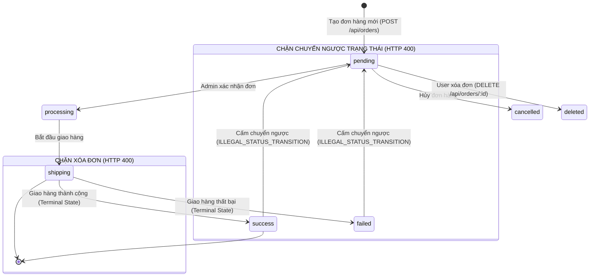

# 📄 BÁO CÁO KIỂM THỬ TÍNH NĂNG ORDER LIFECYCLE MANAGEMENT

## 🟢 PHẦN 1: BỘ TEST CASE BLACKBOX (EP + BVA) & KIỂM THỬ CHỨC NĂNG

### 1. Mô tả bài toán (Problem Description)

Hệ thống **Order Lifecycle Management** của nền tảng E-Commerce cung cấp các giao diện lập trình ứng dụng (RESTful API) chịu trách nhiệm quản lý vòng đời đơn hàng, xác thực phân quyền quản trị, kiểm soát quyền sở hữu tài nguyên và thực thi máy trạng thái hữu hạn (FSM). Các dịch vụ API bao gồm:

1. **Quản trị đơn hàng Admin** (`GET /api/admin/orders`): Truy vấn danh sách toàn bộ đơn hàng trong hệ thống có phân trang (`page`, `limit`), sắp xếp thời gian giảm dần và tự động map thông tin chi tiết khách hàng từ collection `users`.
2. **Cập nhật trạng thái đơn hàng Admin** (`PUT /api/admin/orders/:id`): Chuyển trạng thái đơn hàng theo quy tắc luồng nghiệp vụ FSM, hỗ trợ tra cứu theo cả ObjectId hex 24 ký tự hoặc chuỗi mã định danh đơn hàng `orderId`.
3. **Xóa đơn hàng bởi Admin** (`DELETE /api/admin/orders/:id`): Xóa vĩnh viễn đơn hàng khỏi cơ sở dữ liệu dựa trên mã `orderId`.
4. **Truy vấn danh sách đơn hàng cá nhân** (`GET /api/orders`): Người dùng truy vấn danh sách các đơn hàng do chính mình khởi tạo, hỗ trợ phân trang và bộ lọc trạng thái (`status`).
5. **Xem chi tiết đơn hàng cá nhân** (`GET /api/orders/:id`): Lấy thông tin chi tiết một đơn hàng theo `orderId`, thực hiện chuẩn hóa trạng thái đa cấu trúc (string, state object, value object).
6. **Khởi tạo đơn hàng mới** (`POST /api/orders`): Người dùng tạo đơn hàng mới vào hệ thống với trạng thái mặc định ban đầu là `pending`.
7. **Xóa đơn hàng bởi người dùng** (`DELETE /api/orders/:id`): Người dùng xóa đơn hàng của chính mình khi đơn hàng còn ở trạng thái chờ xử lý (`pending`), ngăn chặn xóa đơn đang giao hoặc đã hoàn tất.

#### Bảng các biến đầu vào và ràng buộc nghiệp vụ:

| Biến đầu vào                | Ý nghĩa nghiệp vụ                | Kiểu dữ liệu                   | Miền giá trị hợp lệ & Ràng buộc nghiệp vụ                                                                                                                                                                         |
| :-------------------------- | :------------------------------- | :----------------------------- | :---------------------------------------------------------------------------------------------------------------------------------------------------------------------------------------------------------------- |
| **`role`**                  | Vai trò tài khoản trong JWT      | Chuỗi ký tự (`String`)         | `"admin"` để truy cập các route quản trị (`/api/admin/...`); `"user"` đối với khách hàng thông thường                                                                                                             |
| **`userId`**                | Định danh người dùng MongoDB     | Chuỗi Hex 24 ký tự             | Trích xuất từ JWT Payload (`req.user._id`), phải là chuỗi 24 ký tự hex hợp lệ của BSON ObjectId                                                                                                                   |
| **`orderId` / `:id`**       | Mã định danh đơn hàng            | Chuỗi ký tự (`String` / `Hex`) | • Đối với API User Delete: BSON ObjectId 24 ký tự hex (`ObjectId.isValid(orderId) === true`). • Đối với API Admin Update/Delete & User Detail: Chuỗi ObjectId 24 ký tự hoặc chuỗi mã đơn hàng (vd: `"PAY123"`) |
| **`status` (Update)**       | Trạng thái cập nhật bởi Admin    | Chuỗi Enum                     | Thuộc tập trạng thái hợp lệ: `["pending", "processing", "shipping", "success", "failed", "cancelled"]`                                                                                                            |
| **`status` (Filter)**       | Bộ lọc trạng thái đơn hàng User  | Chuỗi ký tự (`String`)         | Thuộc tập cho phép lọc: `["success", "pending", "failed"]`. Nếu rỗng hoặc khác danh sách này thì bỏ qua filter                                                                                                    |
| **`amount` / `finalPrice`** | Tổng số tiền thanh toán đơn hàng | Số thực (`Number`)             | Giá trị số $\ge 0$. Nếu khuyết trong bản ghi CSDL thì tự động fallback về `totalPrice` hoặc `0`                                                                                                                   |
| **`paymentMethod`**         | Phương thức thanh toán đơn hàng  | Chuỗi ký tự (`String`)         | Chuỗi định danh phương thức (vd: `"Credit Card"`, `"COD"`, `"Momo"`)                                                                                                                                              |

#### Mô hình Máy trạng thái hữu hạn (Finite State Machine - FSM):

Vòng đời của đơn hàng được quản lý chặt chẽ theo tập các trạng thái hữu hạn:
$$S = \{\text{pending}, \text{processing}, \text{shipping}, \text{success}, \text{failed}, \text{cancelled}\}$$

#### Kết quả trả về của hệ thống:

- **Hợp lệ (Success)**: Trả về HTTP Status `200 OK`, kèm payload JSON thông báo thành công `{ success: true }`, danh sách đơn hàng có cấu trúc phân trang `{ orders: [...], pagination: {...} }`, hoặc chi tiết đơn hàng `{ order: {...} }`.
- **Lỗi phía Client (Client Error)**:
  - `400 Bad Request`: Sai dữ liệu đầu vào hoặc vi phạm quy tắc nghiệp vụ:
    - Trạng thái cập nhật không thuộc Enum: `{ errors: [{ message: "INVALID_STATUS" }] }`.
    - Vi phạm luồng chuyển trạng thái FSM: `{ errors: [{ message: "ILLEGAL_STATUS_TRANSITION" }] }`.
    - Cố tình xóa đơn hàng đang hoạt động / đã giao: `{ errors: [{ message: "CANNOT_DELETE_ACTIVE_ORDER" }] }`.
    - Mã ObjectId sai định dạng (không đủ 24 ký tự hex): `{ error: "INVALID_ORDER_ID" }`.
    - Cập nhật thất bại do xung đột dữ liệu: `{ error: "ORDER_NOT_UPDATED" }`.
  - `401 Unauthorized`: Mất Token hoặc thiếu thông tin định danh `userId`: `{ error: "UNAUTHORIZED" }`.
  - `403 Forbidden`: Vi phạm phân quyền:
    - Khách hàng thường cố tình truy cập chức năng Admin: `{ errors: [{ message: "FORBIDDEN_ADMIN_ONLY" }] }`.
    - Lỗ hổng IDOR/BOLA: Khách hàng A cố tình xóa đơn hàng thuộc sở hữu của Khách hàng B: `{ errors: [{ message: "FORBIDDEN" }] }`.
  - `404 Not Found`: Không tìm thấy đơn hàng trong CSDL: `{ error: "ORDER_NOT_FOUND" }`.
- **Lỗi hệ thống (Server Error)**:
  - `500 Internal Server Error`: Sự cố kết nối MongoDB hoặc ngoại lệ runtime: `{ error: "INTERNAL_SERVER_ERROR" }`.

#### Giả định và công thức logic tổng quát:

1. Người dùng chỉ được phép thao tác trên tài nguyên của chính mình; quyền sở hữu đơn hàng được xác minh qua điều kiện: `order.userId.toString() === req.user._id.toString()`.
2. Admin có toàn quyền xem danh sách đơn hàng của tất cả người dùng và cập nhật trạng thái đơn hàng.
3. Khi `finalPrice` và `totalPrice` bị khuyết trong CSDL cũ, hệ thống tự động fallback an toàn về `0` qua toán tử `o.finalPrice ?? o.totalPrice ?? 0`.

- **Công thức logic kiểm tra hợp lệ khi Xóa đơn hàng bởi User (`deleteOrder`)**:
  $$Valid_{DeleteOrder} = (userId \ne \text{null}) \land IsValidObjectId(orderId) \land Exists_{DB}(orderId) \land (order.userId == userId) \land (order.status == \text{"pending"})$$

- **Công thức logic kiểm tra hợp lệ khi Cập nhật trạng thái bởi Admin (`updateOrderForAdmin`)**:
  $$Valid_{Transition} = (role == \text{"admin"}) \land (status \in S) \land Exists_{DB}(orderId) \land \neg((order.status \in \{\text{"success"}, \text{"failed"}\}) \land status == \text{"pending"})$$

- **Công thức logic kiểm tra hợp lệ khi Tạo mới đơn hàng (`createOrder`)**:
  $$Valid_{CreateOrder} = (userId \ne \text{null}) \land (orderId \ne \text{empty}) \land (amount \ge 0)$$

---

### 2. Xác định lớp tương đương (Equivalence Partitioning - EP)

Áp dụng kỹ thuật phân hoạch tương đương, miền dữ liệu đầu vào của các API quản lý đơn hàng được phân chia thành các lớp hợp lệ (Valid Partitions) và không hợp lệ (Invalid Partitions) kèm mã Tag theo dõi độ bao phủ:

| Biến đầu vào / Điều kiện kiểm thử                | Lớp hợp lệ (Valid Partitions)                                                                           |   Tag   | Lớp không hợp lệ (Invalid Partitions)                                                                                                                                                                          |            Tag             |
| :----------------------------------------------- | :------------------------------------------------------------------------------------------------------ | :-----: | :------------------------------------------------------------------------------------------------------------------------------------------------------------------------------------------------------------- | :------------------------: |
| **`role`** (Quyền truy cập route Admin)          | Người dùng có vai trò quản trị viên (`role: "admin"`)                                                   | **V1**  | Khách hàng thông thường (`role: "user"`) cố truy cập route Admin $\to$ 403 Forbidden                                                                                                                           |           **X1**           |
| **`userId` / Quyền sở hữu (Ownership)**          | `req.user._id` trùng khớp hoàn toàn với `order.userId` trong CSDL                                       | **V2**  | • `req.user._id` khác `order.userId` (User A xóa đơn của User B - Tấn công IDOR) $\to$ 403 Forbidden • Khuyết `userId` (Mất phiên đăng nhập / không có token) $\to$ 401 Unauthorized                        |    **X2**  **X3**    |
| **`order.status`** (Trạng thái đơn khi User xóa) | Đơn hàng đang ở trạng thái chờ xử lý (`order.status === "pending"`)                                     | **V3**  | • Đơn hàng đang vận chuyển (`status === "shipping"`) $\to$ 400 Bad Request • Đơn hàng đã giao thành công (`status === "success"`) $\to$ 400 Bad Request • Các trạng thái active khác không được phép xóa | **X4** **X5** **X6** |
| **`status`** (Input trạng thái Admin cập nhật)   | Thuộc tập Enum chuẩn: `"pending"`, `"processing"`, `"shipping"`, `"success"`, `"failed"`, `"cancelled"` | **V4**  | Trạng thái không thuộc Enum (chuỗi rác `"invalid_status"`, chuỗi rỗng `""`, `null`, số nguyên `123`) $\to$ 400                                                                                                 |           **X7**           |
| **Quy tắc chuyển tiếp trạng thái FSM**           | Chuyển tiếp tiến trình hợp lệ (vd: `pending` $\to$ `processing`, `shipping`, `success`)                 | **V5**  | • Chuyển ngược từ `success` về `pending` $\to$ 400 ILLEGAL_STATUS_TRANSITION • Chuyển ngược từ `failed` về `pending` $\to$ 400 ILLEGAL_STATUS_TRANSITION                                                    |    **X8**  **X9**    |
| **`orderId`** (Định dạng ObjectId MongoDB)       | Chuỗi 24 ký tự hệ thập lục phân Hex (`ObjectId.isValid(id) === true`)                                   | **V6**  | Chuỗi sai định dạng BSON ObjectId (chuỗi rác `"invalid_id"`, không đủ 24 ký tự hex) $\to$ 400 INVALID_ORDER_ID                                                                                                 |          **X10**           |
| **Sự tồn tại của đơn hàng trong CSDL**           | Đơn hàng tìm thấy trong collection `orders`                                                             | **V7**  | Đơn hàng không tồn tại trong CSDL (`findOne` trả về `null`) $\to$ 404 ORDER_NOT_FOUND                                                                                                                          |          **X11**           |
| **`status` (Filter danh sách đơn User)**         | Giá trị nằm trong tập bộ lọc: `"success"`, `"pending"`, `"failed"`                                      | **V8**  | Chuỗi rỗng, không truyền, hoặc chuỗi không nằm trong bộ lọc $\to$ Hệ thống bỏ qua filter, lấy toàn bộ đơn                                                                                                      |          **X12**           |
| **`amount` / `finalPrice` (Giá trị đơn)**        | Số thực không âm: `amount >= 0`                                                                         | **V10** | Khuyết trường `finalPrice` và `totalPrice` trong CSDL $\to$ Tự động Fallback về `0` (`?? 0`)                                                                                                                   |          **X14**           |

---

### 3. Phân tích giá trị biên (Boundary Value Analysis - BVA)

Áp dụng kỹ thuật **Standard Boundary Value Analysis** để xác định các giá trị kiểm thử trọng yếu nằm tại ranh giới miền hợp lệ cho biến độ dài mã định danh BSON ObjectId, tham số phân trang và giá tiền đơn hàng.

Với mỗi biến có miền giá trị hợp lệ:
$$[min, max]$$
Xác định 5 điểm giá trị biên tiêu chuẩn:

- `min`: Giá trị nhỏ nhất hợp lệ.
- `min+`: Giá trị ngay trên giá trị nhỏ nhất.
- `nominal`: Giá trị đại diện nằm giữa miền hợp lệ.
- `max-`: Giá trị ngay dưới giá trị lớn nhất.
- `max`: Giá trị lớn nhất hợp lệ.

#### Bảng 1.1: Phân tích giá trị biên tiêu chuẩn (Standard BVA)

| Biến đầu vào / Thuộc tính kiểm thử    | min | min+ | nominal |    max- |       max | Tag biên                    |
| :------------------------------------ | --: | ---: | ------: | ------: | --------: | :-------------------------- |
| **Độ dài chuỗi BSON Hex (`orderId`)** |  24 |   24 |      24 |      24 |        24 | **B1, B2, B3**              |
| **Giá trị đơn hàng (`amount`)**       |   0 |    1 |     100 | 999,999 | 1,000,000 | **B14, B15, B16, B17, B18** |

#### Gợi ý chọn giá trị danh định (Nominal):

| Biến kiểm thử    |      Miền hợp lệ      | Giá trị nominal đại diện | Ghi chú payload mẫu                                |
| :--------------- | :-------------------: | :----------------------: | :------------------------------------------------- |
| Độ dài `orderId` | Duy nhất 24 ký tự hex |       24 ký tự hex       | `"650c5d1f1f77bcf86cd79001"` (Chuẩn BSON ObjectId) |
| Giá trị `amount` |    Số thực $\ge 0$    |           100            | `{ amount: 100 }` (Giá trị đơn hàng phổ biến)      |

#### Phân tích mở rộng giá trị ngoài biên (Robustness BVA - `min-` và `max+`):

Trong môi trường API backend sử dụng MongoDB và thư viện `mongodb.ObjectId`, các điểm giá trị ngoài biên (`min-`, `max+`) đóng vai trò phòng vệ, phát hiện lỗi cú pháp truy vấn CSDL và ngăn chặn sập server:

| Biến kiểm thử            |         `min-` (Ngoài biên dưới)         | Tag min- |          `max+` (Ngoài biên trên)          | Tag max+ | Kết quả kỳ vọng & Cơ chế phòng vệ                                    |
| :----------------------- | :--------------------------------------: | :------: | :----------------------------------------: | :------: | :------------------------------------------------------------------- |
| **Độ dài Hex `orderId`** | 23 ký tự hex (`650c5d1f1f77bcf86cd7900`) |  **R1**  | 25 ký tự hex (`650c5d1f1f77bcf86cd790011`) |  **R2**  | `400 Bad Request` (`ObjectId.isValid` chặn ngay tại Controller L276) |
| **Giá tiền `amount`**    |            Bị thiếu hoặc null            |  **R7**  |                 Số cực đại                 |  **R8**  | Fallback về `0` (`o.finalPrice ?? o.totalPrice ?? 0`)                |

---

### 4. Thiết kế các test case (Test Case Design)

Dưới đây là bảng thiết kế test case chi tiết cho module Order Lifecycle Management. Toàn bộ **33 test cases** được đánh mã định danh chuẩn hóa tăng dần đều từ **`TC-ORD-01` đến `TC-ORD-33`**, có phân loại rõ ràng **Kỹ thuật kiểm thử** (EP, BVA, State Machine, Security IDOR, Whitebox Data Normalization, Fault Injection) và chỉ rõ **Function / Controller Method** mục tiêu được kiểm thử, ánh xạ chính xác **1:1** với mã nguồn kiểm thử tự động đạt **100% Pass (33/33 tests)** trong [`order.test.ts`](file:///d:/admin/e-commerce-web/be/src/tests/order.test.ts).

#### Bảng ánh xạ tổng quan Function kiểm thử:

| Nhóm Function mục tiêu           | Chức năng nghiệp vụ                                           | Danh sách Test Case tương ứng                                                                                          |
| :------------------------------- | :------------------------------------------------------------ | :--------------------------------------------------------------------------------------------------------------------- |
| **`Role Guard & Authorization`** | Kiểm soát quyền truy cập route quản trị Admin                 | **TC-ORD-01**, **TC-ORD-02**                                                                                           |
| **`deleteOrder`**                | Xóa đơn hàng User, chống IDOR & kiểm soát trạng thái pending  | **TC-ORD-03**, **TC-ORD-04**, **TC-ORD-05**, **TC-ORD-06**, **TC-ORD-27**, **TC-ORD-28**, **TC-ORD-32**, **TC-ORD-33** |
| **`updateOrderForAdmin`**        | Admin cập nhật trạng thái đơn hàng theo FSM                   | **TC-ORD-07**, **TC-ORD-08**, **TC-ORD-09**, **TC-ORD-10**, **TC-ORD-14**, **TC-ORD-15**, **TC-ORD-16**, **TC-ORD-33** |
| **`getOrderForAdmin`**           | Admin lấy danh sách phân trang và map dữ liệu user            | **TC-ORD-02**, **TC-ORD-11**, **TC-ORD-12**, **TC-ORD-13**, **TC-ORD-33**                                              |
| **`deleteOrderForAdmin`**        | Admin xóa vĩnh viễn đơn hàng theo `orderId`                   | **TC-ORD-17**, **TC-ORD-18**, **TC-ORD-33**                                                                            |
| **`getAllOrders`**               | User lấy danh sách đơn hàng cá nhân & bộ lọc trạng thái       | **TC-ORD-19**, **TC-ORD-20**, **TC-ORD-21**, **TC-ORD-30**, **TC-ORD-33**                                              |
| **`getOrderById`**               | User lấy chi tiết đơn hàng & chuẩn hóa trạng thái đa cấu trúc | **TC-ORD-22**, **TC-ORD-23**, **TC-ORD-24**, **TC-ORD-25**, **TC-ORD-26**, **TC-ORD-33**                               |
| **`createOrder`**                | User khởi tạo đơn hàng mới vào hệ thống                       | **TC-ORD-29**, **TC-ORD-31**, **TC-ORD-33**                                                                            |
| **`Global Error Guard`**         | Xử lý ngoại lệ kết nối CSDL sập (Catch Block 500)             | **TC-ORD-33**                                                                                                          |

---

#### Bảng chi tiết thiết kế 33 Test Cases:

| STT | Mã Test Case  | Function kiểm thử               | Tên Test Case (Mục tiêu kiểm thử)                                                                                   | Kỹ thuật kiểm thử              | Endpoint & Dữ liệu đầu vào (Input Payload / Setup)                                                                                                            | Kết quả mong đợi (Expected Outcome)                                                                                   | Tag bao phủ            | Test Function tương ứng trong `order.test.ts`                                                                                               |
| :-: | :------------ | :------------------------------ | :------------------------------------------------------------------------------------------------------------------ | :----------------------------- | :------------------------------------------------------------------------------------------------------------------------------------------------------------ | :-------------------------------------------------------------------------------------------------------------------- | :--------------------- | :------------------------------------------------------------------------------------------------------------------------------------------ |
|  1  | **TC-ORD-01** | `Role Guard (Admin)`            | [Admin Guard] User thường không phải Admin truy cập GET /api/admin/orders $\to$ Reject 403                          | EP (Role Guard)                | `GET /api/admin/orders` Header: `Bearer normal_user_jwt_token` (`role: "user"`)                                                                            | **Status 403 Forbidden** Body: `{ success: false, errors: [{ message: "FORBIDDEN_ADMIN_ONLY" }] }`                 | **X1**                 | `it("TC_ORDER_AUTH_01: [Admin Guard] User thường không phải Admin truy cập GET /api/orders/admin -> Reject 403 FORBIDDEN_ADMIN_ONLY")`      |
|  2  | **TC-ORD-02** | `Role Guard & getOrderForAdmin` | [Admin Guard] Admin truy cập GET /api/admin/orders $\to$ Accept 200                                                 | EP (Role Guard)                | `GET /api/admin/orders` Header: `Bearer admin_user_jwt_token` (`role: "admin"`)                                                                            | **Status 200 OK** Hệ thống cho phép truy cập và trả về dữ liệu đơn hàng                                            | **V1**                 | `it("TC_ORDER_AUTH_02: [Admin Guard] Admin truy cập GET /api/orders/admin -> Accept 200")`                                                  |
|  3  | **TC-ORD-03** | `deleteOrder`                   | [Ownership Guard] User A cố tình xóa đơn hàng của User B $\to$ Reject 403 FORBIDDEN                                 | EP (Security / IDOR)           | `DELETE /api/orders/{validOrderId1}` Header: Token của User A Mock: `order.userId` thuộc về User B                                                      | **Status 403 Forbidden** Body: `{ success: false, errors: [{ message: "FORBIDDEN" }] }` Chặn tấn công BOLA/IDOR | **X2**                 | `it("TC_ORDER_AUTH_03: [Ownership Guard] User A cố tình xóa đơn hàng của User B (userId !== req.user._id) -> Reject 403 FORBIDDEN")`        |
|  4  | **TC-ORD-04** | `deleteOrder`                   | [Valid Delete] User xóa đơn hàng của chính mình khi status === 'pending' $\to$ Accept 200                           | EP (State Machine & Ownership) | `DELETE /api/orders/{validOrderId1}` Header: Token của User A Mock: `order.userId` = User A, `status: "pending"`                                        | **Status 200 OK** DB Verify: `orderCol.deleteOne` được gọi đúng 1 lần với `_id`                                    | **V2, V3, V6, V7**     | `it("TC_ORDER_DEL_04: [Valid Delete] User xóa đơn hàng của chính mình khi status === 'pending' -> Accept 200")`                             |
|  5  | **TC-ORD-05** | `deleteOrder`                   | [Invalid Delete Active] Đơn hàng đang ở trạng thái 'shipping' $\to$ Reject 400                                      | EP (State Guard)               | `DELETE /api/orders/{validOrderId2}` Header: Token của User A Mock: `order.userId` = User A, `status: "shipping"`                                       | **Status 400 Bad Request** Body: `{ errors: [{ message: "CANNOT_DELETE_ACTIVE_ORDER" }] }`                         | **X4**                 | `it("TC_ORDER_DEL_05: [Invalid Delete Active] Đơn hàng đang ở trạng thái 'shipping' -> Reject 400 CANNOT_DELETE_ACTIVE_ORDER")`             |
|  6  | **TC-ORD-06** | `deleteOrder`                   | [Invalid Delete Active] Đơn hàng đã ở trạng thái 'success' $\to$ Reject 400                                         | EP (State Guard)               | `DELETE /api/orders/{validOrderId3}` Header: Token của User A Mock: `order.userId` = User A, `status: "success"`                                        | **Status 400 Bad Request** Body: `{ errors: [{ message: "CANNOT_DELETE_ACTIVE_ORDER" }] }`                         | **X5**                 | `it("TC_ORDER_DEL_06: [Invalid Delete Active] Đơn hàng đã ở trạng thái 'success' -> Reject 400 CANNOT_DELETE_ACTIVE_ORDER")`                |
|  7  | **TC-ORD-07** | `updateOrderForAdmin`           | [Valid Transition] Admin chuyển trạng thái từ 'pending' sang 'processing' / 'shipping' / 'success' $\to$ Accept 200 | EP (State Transition)          | `PUT /api/admin/orders/{validOrderId4}` Header: Admin Token Payload: Lần lượt `{ status: "processing" }`, `"shipping"`, `"success"`                     | **Status 200 OK** Body: `{ success: true, message: "Order status updated successfully" }` `updateOne` được gọi  | **V1, V4, V5, V6, V7** | `it("TC_ORDER_STATE_07: [Valid Transition] Admin chuyển trạng thái từ 'pending' sang 'processing' / 'shipping' / 'success' -> Accept 200")` |
|  8  | **TC-ORD-08** | `updateOrderForAdmin`           | [Illegal Transition] Admin chuyển ngược từ 'success' về 'pending' $\to$ Reject 400                                  | EP (FSM State Machine)         | `PUT /api/admin/orders/{validOrderId4}` Header: Admin Token Mock: `order.status: "success"`, Payload: `{ status: "pending" }`                           | **Status 400 Bad Request** Body: `{ errors: [{ message: "ILLEGAL_STATUS_TRANSITION" }] }`                          | **X8**                 | `it("TC_ORDER_STATE_08: [Illegal Transition] Admin chuyển ngược từ 'success' về 'pending' -> Reject 400 ILLEGAL_STATUS_TRANSITION")`        |
|  9  | **TC-ORD-09** | `updateOrderForAdmin`           | [Illegal Transition] Admin chuyển ngược từ 'failed' về 'pending' $\to$ Reject 400                                   | EP (FSM State Machine)         | `PUT /api/admin/orders/{validOrderId4}` Header: Admin Token Mock: `order.status: "failed"`, Payload: `{ status: "pending" }`                            | **Status 400 Bad Request** Body: `{ errors: [{ message: "ILLEGAL_STATUS_TRANSITION" }] }`                          | **X9**                 | `it("TC_ORDER_STATE_09: [Illegal Transition] Admin chuyển ngược từ 'failed' về 'pending' -> Reject 400 ILLEGAL_STATUS_TRANSITION")`         |
| 10  | **TC-ORD-10** | `updateOrderForAdmin`           | [Invalid Enum Status] Truyền status không thuộc Enum $\to$ Reject 400 INVALID_STATUS                                | EP (Input Validation)          | `PUT /api/admin/orders/{validOrderId4}` Header: Admin Token Payload: `{ status: "invalid_status_value" }`                                               | **Status 400 Bad Request** Body: `{ errors: [{ message: "INVALID_STATUS" }] }`                                     | **X7**                 | `it("TC_ORDER_STATE_10: [Invalid Enum Status] Truyền status không thuộc Enum ('unknown_status', '') -> Reject 400 INVALID_STATUS")`         |
| 11  | **TC-ORD-11** | `getOrderForAdmin`              | [Get Admin Orders] Trả về danh sách và map thông tin user                                                           | EP (Query & Map)               | `GET /api/admin/orders?page=1&limit=10` Header: Admin Token Mock: 1 đơn hàng có `userId: normalUserId`, user collection có bản ghi user                 | **Status 200 OK** Body: `orders[0].user: { fullName: "Test User", email: "user@example.com" }`, có `pagination`    | **V1, V9, B4, B9**     | `it("TC_ORD_ADD_11: [getOrderForAdmin] Trả về danh sách và map thông tin user")`                                                            |
| 12  | **TC-ORD-12** | `getOrderForAdmin`              | [Null User Branch] Trả về danh sách, có user rỗng (phủ branch `user ? ... : null`)                                  | Whitebox (Branch Coverage)     | `GET /api/admin/orders?page=1&limit=10` Header: Admin Token Mock: Đơn hàng có `userId: null`, user collection rỗng                                      | **Status 200 OK** Body: `orders[0].user: null`, `orders[0].amount: 200` (lấy từ `totalPrice`)                      | **Branch `user?`**     | `it("TC_ORD_ADD_12: [getOrderForAdmin] Trả về danh sách, có user rỗng (branch user ? ... : null)")`                                         |
| 13  | **TC-ORD-13** | `getOrderForAdmin`              | [Price Fallback Admin] Trả về danh sách, không có finalPrice và totalPrice $\to$ fallback 0                         | Whitebox (Nullish Operator)    | `GET /api/admin/orders?page=1&limit=10` Header: Admin Token Mock: Đơn hàng khuyết cả `finalPrice` và `totalPrice`                                       | **Status 200 OK** Body: `orders[0].amount: 0` (Kích hoạt toán tử `?? 0`)                                           | **X14, R7**            | `it("TC_ORD_ADD_13: [getOrderForAdmin] Trả về danh sách, không có finalPrice và totalPrice -> 0")`                                          |
| 14  | **TC-ORD-14** | `updateOrderForAdmin`           | [Order Not Found] Không tìm thấy đơn hàng cần update $\to$ Reject 404                                               | EP (Resource Missing)          | `PUT /api/admin/orders/{validOrderId1}` Header: Admin Token Mock: `orderCol.findOne` trả về `null`                                                      | **Status 404 Not Found** Body: `{ error: "ORDER_NOT_FOUND" }`                                                      | **X11**                | `it("TC_ORD_ADD_14: [updateOrderForAdmin] Không tìm thấy đơn hàng cần update -> Reject 404")`                                               |
| 15  | **TC-ORD-15** | `updateOrderForAdmin`           | [Concurrency / Not Updated] Cập nhật không thành công (modifiedCount === 0) $\to$ Reject 400                        | Whitebox (DB Result Guard)     | `PUT /api/admin/orders/{validOrderId1}` Header: Admin Token Mock: `orderCol.updateOne` trả về `{ modifiedCount: 0 }`                                    | **Status 400 Bad Request** Body: `{ error: "ORDER_NOT_UPDATED" }`                                                  | **Whitebox Branch**    | `it("TC_ORD_ADD_15: [updateOrderForAdmin] Cập nhật không thành công (modifiedCount === 0) -> Reject 400")`                                  |
| 16  | **TC-ORD-16** | `updateOrderForAdmin`           | [String OrderId Query] Sử dụng orderId là string thay vì ObjectId 24 ký tự                                          | Whitebox (Type Query Branch)   | `PUT /api/admin/orders/PAY_STRING_ID` Header: Admin Token Payload: `{ status: "processing" }` Mock: Tìm thấy đơn theo `{ orderId: "PAY_STRING_ID" }` | **Status 200 OK** Body: `{ success: true }` Phủ nhánh query fallback `{ orderId }` thay vì `_id`                | **Whitebox Branch**    | `it("TC_ORD_ADD_16: [updateOrderForAdmin] Sử dụng orderId là string thay vì ObjectId 24 ký tự")`                                            |
| 17  | **TC-ORD-17** | `deleteOrderForAdmin`           | [Admin Delete] Admin xóa đơn hàng thành công theo orderId $\to$ Accept 200                                          | EP (Admin CRUD)                | `DELETE /api/admin/orders/PAY123` Header: Admin Token Mock: Tìm thấy đơn `orderId: "PAY123"`, `deleteOne` thành công                                    | **Status 200 OK** Body: `{ success: true, message: "Order deleted successfully" }`                                 | **V1, V7**             | `it("TC_ORD_ADD_17: [deleteOrderForAdmin] Admin xóa đơn hàng thành công -> Accept 200")`                                                    |
| 18  | **TC-ORD-18** | `deleteOrderForAdmin`           | [Admin Delete] Admin xóa đơn hàng không tồn tại $\to$ Reject 404                                                    | EP (Resource Missing)          | `DELETE /api/admin/orders/PAY_NOT_FOUND` Header: Admin Token Mock: `orderCol.findOne` trả về `null`                                                     | **Status 404 Not Found** Body: `{ error: "ORDER_NOT_FOUND" }`                                                      | **X11**                | `it("TC_ORD_ADD_18: [deleteOrderForAdmin] Admin xóa đơn hàng không tồn tại -> 404")`                                                        |
| 19  | **TC-ORD-19** | `getAllOrders`                  | [Filter Status Valid] Lấy danh sách đơn hàng có filter status hợp lệ ('pending')                                    | EP (Query Filter)              | `GET /api/orders?status=pending` Header: User Token Mock: DB có 1 đơn `status: "pending"`                                                               | **Status 200 OK** Body: `orders.length === 1`, query nhận đúng `{ userId, status: "pending" }`                     | **V8**                 | `it("TC_ORD_ADD_19: [getAllOrders] Lấy danh sách đơn hàng có filter status hợp lệ")`                                                        |
| 20  | **TC-ORD-20** | `getAllOrders`                  | [Filter Status Invalid Fallback] Lấy danh sách đơn khi status filter rác hoặc rỗng                                  | EP (Filter Fallback)           | `GET /api/orders?status=invalid_status` Header: User Token Mock: DB có đơn, `totalPrice: 150`                                                           | **Status 200 OK** Body: Bỏ qua filter status, lấy toàn bộ đơn của user, `amount: 150`                              | **X12**                | `it("TC_ORD_ADD_20: [getAllOrders] Lấy danh sách đơn hàng không có status filter hoặc status không hợp lệ")`                                |
| 21  | **TC-ORD-21** | `getAllOrders`                  | [Price Fallback User] Đơn hàng không có finalPrice và totalPrice $\to$ fallback 0                                   | Whitebox (Nullish Operator)    | `GET /api/orders` Header: User Token Mock: Đơn hàng khuyết cả `finalPrice` và `totalPrice`                                                              | **Status 200 OK** Body: `orders[0].amount: 0` (Kích hoạt toán tử fallback `?? 0`)                                  | **X14, R7**            | `it("TC_ORD_ADD_21: [getAllOrders] Đơn hàng không có finalPrice và totalPrice -> 0")`                                                       |
| 22  | **TC-ORD-22** | `getOrderById`                  | [Normalize Status Object] Lấy chi tiết đơn hàng và chuẩn hóa status dạng { state }                                  | Whitebox (Data Normalization)  | `GET /api/orders/PAY123` Header: User Token Mock: `order.status` lưu dạng object `{ state: "processing" }`                                              | **Status 200 OK** Body: `order.status: "processing"` (Phủ nhánh `status?.state`)                                   | **Whitebox Branch**    | `it("TC_ORD_ADD_22: [getOrderById] Lấy chi tiết đơn hàng theo ID và chuẩn hóa status (state)")`                                             |
| 23  | **TC-ORD-23** | `getOrderById`                  | [Normalize Status String] Kiểm tra chuẩn hóa status dạng string nguyên thủy                                         | Whitebox (Data Normalization)  | `GET /api/orders/123` Header: User Token Mock: `order.status` lưu dạng chuỗi `"success"`, `totalPrice: 50`                                              | **Status 200 OK** Body: `order.status: "success"`, `order.amount: 50`                                              | **Whitebox Branch**    | `it("TC_ORD_ADD_23: [getOrderById] Kiểm tra chuẩn hóa status - string")`                                                                    |
| 24  | **TC-ORD-24** | `getOrderById`                  | [Normalize Status Value Object] Kiểm tra chuẩn hóa status dạng object { value }                                     | Whitebox (Data Normalization)  | `GET /api/orders/123` Header: User Token Mock: `order.status` lưu dạng object `{ value: "failed" }`                                                     | **Status 200 OK** Body: `order.status: "failed"` (Phủ nhánh `status?.value`)                                       | **Whitebox Branch**    | `it("TC_ORD_ADD_24: [getOrderById] Kiểm tra chuẩn hóa status - value object")`                                                              |
| 25  | **TC-ORD-25** | `getOrderById`                  | [Normalize Status Unknown Default] Kiểm tra chuẩn hóa status không xác định $\to$ pending                           | Whitebox (Default Fallback)    | `GET /api/orders/123` Header: User Token Mock: `order.status: {}` (rỗng, không có state/value)                                                          | **Status 200 OK** Body: `order.status: "pending"`, `order.amount: 0`                                               | **Whitebox Default**   | `it("TC_ORD_ADD_25: [getOrderById] Kiểm tra chuẩn hóa status - unknown -> pending")`                                                        |
| 26  | **TC-ORD-26** | `getOrderById`                  | [Order Not Found] Lấy chi tiết đơn hàng theo ID không tồn tại $\to$ Reject 404                                      | EP (Resource Missing)          | `GET /api/orders/PAY123` Header: User Token Mock: `orderCol.findOne` trả về `null`                                                                      | **Status 404 Not Found** Body: `{ error: "ORDER_NOT_FOUND" }`                                                      | **X11**                | `it("TC_ORD_ADD_26: [getOrderById] Lấy chi tiết đơn hàng theo ID không tồn tại -> 404")`                                                    |
| 27  | **TC-ORD-27** | `deleteOrder`                   | [BVA Hex Length Negative] Xóa đơn với orderId sai định dạng ObjectId $\to$ Reject 400                               | BVA (Hex Length Negative)      | `DELETE /api/orders/invalid_id` Header: User Token Input: Chuỗi `"invalid_id"` không phải Hex 24 ký tự                                                  | **Status 400 Bad Request** Body: `{ error: "INVALID_ORDER_ID" }` Chặn tại `!ObjectId.isValid`                   | **X10, R1**            | `it("TC_ORD_ADD_27: [deleteOrder] Kiểm tra sai định dạng ObjectId -> Reject 400")`                                                          |
| 28  | **TC-ORD-28** | `deleteOrder`                   | [Order Not Found] Không tìm thấy đơn hàng trong DB khi xóa $\to$ Reject 404                                         | EP (Resource Missing)          | `DELETE /api/orders/{validOrderId1}` Header: User Token Mock: `orderCol.findOne` trả về `null`                                                          | **Status 404 Not Found** Body: `{ error: "ORDER_NOT_FOUND" }`                                                      | **X11**                | `it("TC_ORD_ADD_28: [deleteOrder] Không tìm thấy đơn hàng trong DB -> Reject 404")`                                                         |
| 29  | **TC-ORD-29** | `createOrder`                   | [Create Order Success] Tạo đơn hàng mới thành công $\to$ Accept 200 OK                                              | EP (CRUD Operation)            | `POST /api/orders` Header: User Token Payload: `{ orderId: "PAY123", amount: 100, paymentMethod: "Credit Card" }`                                       | **Status 200 OK** Body: `{ success: true, orderId: "PAY123" }` DB: `orderCol.insertOne` được gọi                | **V10, B13**           | `it("TC_ORD_ADD_29: [createOrder] Tạo đơn hàng thành công -> 200 OK")`                                                                      |
| 30  | **TC-ORD-30** | `getAllOrders`                  | [Unauthenticated User] Mất userId khi lấy danh sách đơn $\to$ Reject 401                                            | EP (Auth Guard)                | Gọi controller `getAllOrders` với `req.user = {}` (khuyết `_id`)                                                                                              | **Status 401 Unauthorized** Body: `{ error: "UNAUTHORIZED" }`                                                      | **X3**                 | `it("TC_ORD_ADD_30_UNAUTH: [getAllOrders] Kiểm tra mất userId -> 401")`                                                                     |
| 31  | **TC-ORD-31** | `createOrder`                   | [Unauthenticated User] Mất userId khi tạo đơn hàng $\to$ Reject 400                                                 | EP (Auth Guard)                | Gọi controller `createOrder` với `req.user = {}` (khuyết `_id`)                                                                                               | **Status 400 Bad Request** Body: `{ error: "UNAUTHORIZED" }`                                                       | **X3**                 | `it("TC_ORD_ADD_31_UNAUTH: [createOrder] Kiểm tra mất userId -> 400")`                                                                      |
| 32  | **TC-ORD-32** | `deleteOrder`                   | [Unauthenticated User] Mất userId khi xóa đơn hàng $\to$ Reject 401                                                 | EP (Auth Guard)                | Gọi controller `deleteOrder` với `req.user = {}` (khuyết `_id`)                                                                                               | **Status 401 Unauthorized** Body: `{ error: "UNAUTHORIZED" }`                                                      | **X3**                 | `it("TC_ORD_ADD_32_UNAUTH: [deleteOrder] Kiểm tra mất userId -> 401")`                                                                      |
| 33  | **TC-ORD-33** | `All Handlers (Global)`         | [Catch Block Error] Kích hoạt bắt khối catch(error) ném lỗi 500 khi DB sập                                          | Fault Injection (Whitebox)     | Mock CSDL ném `new Error("DB Error")` trên cả 6 controllers (`find`, `findOne`, `insertOne`)                                                                  | **Status 500 Internal Server Error** Body: `{ error: "INTERNAL_SERVER_ERROR" }` trên tất cả routes                 | **Fault Injection**    | `it("TC_ORD_ADD_33_CATCH_ERR: Kiểm tra block catch(error) ném lỗi 500")`                                                                    |

---

## 🟢 PHẦN 2: PHÂN TÍCH ĐỒ THỊ DÒNG ĐIỀU KHIỂN & SỐ LƯỢNG TEST CASE TỐI ƯU

### 2.1. Đồ thị dòng điều khiển (CFG) cho hàm `deleteOrder`

- **Độ phức tạp Cyclomatic $V(G)$**: $P = 5$ điểm rẽ nhánh (Node 1, 4, 7, 9, 11) + 1 Exception handler = 6. Vậy $V(G) = 6 + 1 = 7$.

---

### 2.2. Số lượng Test Case định lượng cho 100% Statement Coverage

**Câu hỏi:** Cần chạy bao nhiêu test case (và là những test case nào) để đạt 100% Statement Coverage?

**Trả lời:** Từ tổng số 33 Test Case, ta cần lọc ra **Tập tối thiểu gồm 14 Test Cases** để mọi dòng lệnh trong module `order.controller.ts` được thực thi ít nhất một lần.

**Bảng Danh sách Test Cases bắt buộc phải chạy để phủ kín Statements:**

|  STT   | Test Case ID             | Mục đích bao phủ (Statement Target)                    | Mã nguồn được kích hoạt trong `order.controller.ts`                       |
| :----: | :----------------------- | :----------------------------------------------------- | :------------------------------------------------------------------------ |
| **1**  | **TC-ORD-01, TC-ORD-02** | Phủ lệnh gọi Guard kiểm duyệt Token Admin              | Middleware chạy trước Controller, cho đi tiếp vào các hàm `...ForAdmin`   |
| **2**  | **TC-ORD-04, TC-ORD-07** | Phủ lệnh ghi CSDL của User và Admin (Happy Path)       | Gọi `orderCol.deleteOne`, `updateOne` và trả `200 OK`                     |
| **3**  | **TC-ORD-11**            | Phủ đoạn code `map` gộp Object User cho Admin          | Dòng code chứa `userMap.get(...)` (Từ L31-40)                             |
| **4**  | **TC-ORD-10**            | Phủ lệnh kiểm tra trạng thái mảng `includes`           | Khối chặn if `!validStatuses.includes(status)` $\to$ `400 INVALID_STATUS` |
| **5**  | **TC-ORD-19**            | Phủ lệnh gán `filter.status` ở list đơn hàng User      | Nhánh `if (["success", "pending"...].includes(rawStatus))` (L167)         |
| **6**  | **TC-ORD-22**            | Phủ cấu trúc hàm `normalizeStatus`                     | Dòng code gán thuộc tính Object: `status: normalizeStatus(...)` (L226)    |
| **7**  | **TC-ORD-27**            | Phủ lệnh check định dạng `ObjectId.isValid`            | Lệnh ném lỗi `res.status(400) INVALID_ORDER_ID` (L276)                    |
| **8**  | **TC-ORD-03**            | Phủ nhánh chống lỗ hổng BOLA / IDOR                    | Cấu trúc `if (order.userId !== userId) -> 403 FORBIDDEN` (L290)           |
| **9**  | **TC-ORD-05**            | Phủ khối bảo vệ đơn hàng đang chạy (Active Order)      | Lệnh `return 400 CANNOT_DELETE_ACTIVE_ORDER` (L297)                       |
| **10** | **TC-ORD-14, TC-ORD-28** | Phủ lệnh kiểm tra null của Database `!order`           | Các nhánh `if (!order) return 404 ORDER_NOT_FOUND`                        |
| **11** | **TC-ORD-29**            | Phủ luồng tạo đơn hàng mới của hàm `createOrder`       | Lệnh `insertOne` và trả về `200 OK` (L241-260)                            |
| **12** | **TC-ORD-33**            | Kích hoạt bắt buộc mọi lệnh `console.error` và bẫy 500 | Quét qua tất cả 6 khối `catch (error)` trong Controller                   |

---

### 2.3. Số lượng Test Case định lượng cho 100% Branch Coverage (Độ phủ nhánh)

**Câu hỏi:** Cần chạy bao nhiêu test case (và là những test case nào) để đạt 100% Branch Coverage?

**Trả lời:** Branch Coverage đòi hỏi khắt khe hơn: mọi câu lệnh rẽ nhánh (`if`, `||`, `&&`, fallback `??`) phải được chạy đủ 2 luồng True và False. Tổng cộng cần **18 Test Cases** (gồm 14 test Statement + 4 test bổ sung).

**Bảng Ma trận các nhánh điều kiện bảo đảm 100% Branch Coverage:**

|  STT   | Cấu trúc rẽ nhánh trong mã nguồn                                                           | Nhánh True (T)                               | Nhánh False (F)                       | Test Case phủ nhánh True            | Test Case phủ nhánh False           |
| :----: | :----------------------------------------------------------------------------------------- | :------------------------------------------- | :------------------------------------ | :---------------------------------- | :---------------------------------- |
| **1**  | `if (!validStatuses.includes(status))`                                                     | Trạng thái rác $\to$ Báo 400                 | Trạng thái đúng $\to$ Đi tiếp         | **TC-ORD-10**                       | **TC-ORD-07**                       |
| **2**  | `if (!order)` (Admin update)                                                               | Truy vấn rỗng $\to$ Báo 404                  | Có đơn hàng $\to$ Bắt đầu xử lý       | **TC-ORD-14**                       | **TC-ORD-07**                       |
| **3**  | `if ((order.status === "success" \|\| order.status === "failed") && status === "pending")` | Vi phạm State Machine $\to$ Báo 400          | Chuyển luồng hợp lệ $\to$ Cho đi tiếp | **TC-ORD-08, TC-ORD-09**            | **TC-ORD-07**                       |
| **4**  | `if (result.modifiedCount === 0)`                                                          | Lỗi Concurrency $\to$ Báo 400                | DB thực thi ghi đè tốt $\to$ 200      | **TC-ORD-15**                       | **TC-ORD-07**                       |
| **5**  | `if (!userId)` (Bảo vệ API User)                                                           | Không có Token $\to$ Báo lỗi 401             | Có đủ Token $\to$ Tiếp tục tìm DB     | **TC-ORD-30, TC-ORD-31, TC-ORD-32** | **TC-ORD-19, TC-ORD-29, TC-ORD-04** |
| **6**  | `if (["success", "pending"...].includes(rawStatus))`                                       | Có truyền filter chuẩn $\to$ Gán biến filter | Không filter $\to$ Bỏ qua             | **TC-ORD-19**                       | **TC-ORD-20**                       |
| **7**  | `if (!ObjectId.isValid(orderId))`                                                          | ID truyền vào chuỗi bậy $\to$ Báo 400        | Format Hex chuẩn 24 $\to$ Query       | **TC-ORD-27**                       | **TC-ORD-04**                       |
| **8**  | `if (order.userId.toString() !== userId.toString())`                                       | Đơn thuộc User khác $\to$ Báo 403 IDOR       | Đúng chủ nhân $\to$ Cho đi tiếp       | **TC-ORD-03**                       | **TC-ORD-04**                       |
| **9**  | `if (order.status !== "pending")`                                                          | Đang giao/xong $\to$ Cấm xóa 400             | Đang chờ $\to$ Cho phép xóa           | **TC-ORD-05, TC-ORD-06**            | **TC-ORD-04**                       |
| **10** | Toán tử `o.finalPrice ?? o.totalPrice ?? 0`                                                | Trường `finalPrice` rỗng $\to$ lấy Fallback  | Đã có giá trị chuẩn $\to$ Bỏ qua      | **TC-ORD-13, TC-ORD-21**            | **TC-ORD-02, TC-ORD-19**            |
| **11** | `try { ... } catch (error)` trên 6 routes                                                  | Lỗi đứt cáp DB $\to$ Bay vào 500             | Luồng chạy tốt $\to$ 200              | **TC-ORD-33**                       | **TC-ORD-04, TC-ORD-07**            |

---

## 🟢 PHẦN 3: TƯ DUY ĐÁNH GIÁ PHƯƠNG PHÁP LUẬN (METHODOLOGY EVALUATION)

_Mục tiêu: Đánh giá xem áp dụng phương pháp BVA/EP có tự động đảm bảo 100% độ phủ Statement/Branch hay không, và xem bộ test đó có thừa/thiếu gì khi map sang cấu trúc code._

### 3.1. Sự thật: BVA/EP có tự động đảm bảo 100% Coverage không?

**Kết luận khẳng định: HOÀN TOÀN KHÔNG!**

Phương pháp BVA/EP hoàn toàn dựa trên tư duy **Hộp Đen (Blackbox)** - nhìn vào tài liệu đặc tả (Specs) để thiết kế kịch bản. Khi đem bộ 24 test case Blackbox ốp vào chạy trên Source Code, độ phủ thường bị kẹt ở mức **75% - 85%**. Lý do là phương pháp này gặp phải vấn đề **vừa Thừa lại vừa Thiếu** khi ánh xạ vào kiến trúc nội bộ của lập trình viên.

### 3.2. Đánh giá "Cái THIẾU" của BVA/EP khi map sang Code

Bộ BVA/EP được thiết kế dưới giả định "Hạ tầng lý tưởng" nên không thể kích hoạt được các logic phòng ngự (Defensive Programming) do Developer viết ra:

- **Thiếu nhánh Catch Block (Lỗi hạ tầng):** Kịch bản BVA/EP mong đợi nhập input sai thì HTTP trả về 400. Nhưng không có tài liệu BA nào yêu cầu: _"Làm sập kết nối MongoDB đột ngột để sinh ra HTTP 500"_. Do đó, lệnh rẽ nhánh `catch(error)` mãi mãi bị bỏ sót.
- **Thiếu nhánh Fallback dữ liệu ngầm:** Trong code có nhánh `order.finalPrice ?? 0` để đề phòng DB cũ bị khuyết dữ liệu. Kịch bản BVA không bao giờ kích hoạt được luồng True của nhánh này vì giả định DB luôn hoàn hảo.
- **Thiếu nhánh Race Condition:** BVA/EP không thể thiết kế được kịch bản mô phỏng 2 Admin cùng lúc nhấn nút cập nhật 1 đơn hàng (`modifiedCount === 0`).

$\implies$ **Giải pháp bù đắp**: Bắt buộc phải kết hợp **Whitebox Testing** (Sử dụng Mocking Data & Throw Error trong RAM) để chọc thẳng vào các điểm mù kỹ thuật này.

### 3.3. Đánh giá "Cái THỪA" của BVA/EP khi map sang Code

Ngược lại, khi map sang cấu trúc mã nguồn, bộ test BVA/EP lại sinh ra sự **Thừa thãi (Redundant)** và trùng lặp (Overlap):

- **Ví dụ kinh điển:** Dựa trên phân tích State Machine (EP), QA viết 2 Test Cases Hộp đen cho quy tắc "Không được chuyển ngược trạng thái":
  - Kịch bản 1 (**TC-ORD-08**): Cố chuyển từ `success` -> `pending` (Báo 400).
  - Kịch bản 2 (**TC-ORD-09**): Cố chuyển từ `failed` -> `pending` (Báo 400).
- **Phân tích dưới góc nhìn Code (Whitebox):** Ở dưới backend, Developer gộp chung hai trường hợp đó vào đúng 1 dòng if duy nhất:
  `if (["success", "failed"].includes(order.status)) return res.status(400)`
- **Hậu quả:** Khi chạy Kịch bản 1, nhánh code trên đã đạt 100% Coverage. Khi chạy tiếp Kịch bản 2, Kịch bản 2 trở nên **thừa thãi hoàn toàn** về mặt độ phủ code. Đây là minh chứng cho việc số lượng Test Case Hộp đen lớn chưa chắc đã mang lại hiệu quả đo lường cao hơn.

### 3.4. Tổng kết Triết lý Kiểm thử

Qua việc thực nghiệm trên module Order, có thể rút ra kết luận cốt lõi:

1. **BVA/EP (Blackbox) là ĐIỀU KIỆN CẦN**: Cực kỳ thiết yếu để đảm bảo phần mềm chạy đúng nghiệp vụ kinh doanh, bảo vệ an toàn cho User. Tuy nhiên, nó là chưa đủ vì bỏ lọt điểm mù hạ tầng.
2. **Structural Testing (Whitebox) là ĐIỀU KIỆN ĐỦ**: Đóng vai trò "chiếc chổi" quét sạch các "góc tối" của mã nguồn (nhánh catch, toán tử dự phòng), nhưng lại xa rời hành vi của User thật.
3. $\implies$ **Phương pháp toàn vẹn nhất**: Lấy **BVA/EP làm bộ khung xương sống** (tạo base case), sau đó dùng công cụ đo lường Coverage soi chiếu vào Code để phát hiện điểm mù, và cuối cùng dùng **Whitebox lấp đầy cái thiếu, cắt tỉa cái thừa**. Sự đan xen này chính là nghệ thuật tạo nên bộ Unit Test đạt mức tuyệt đối 100% Coverage nhưng vẫn tinh gọn.
