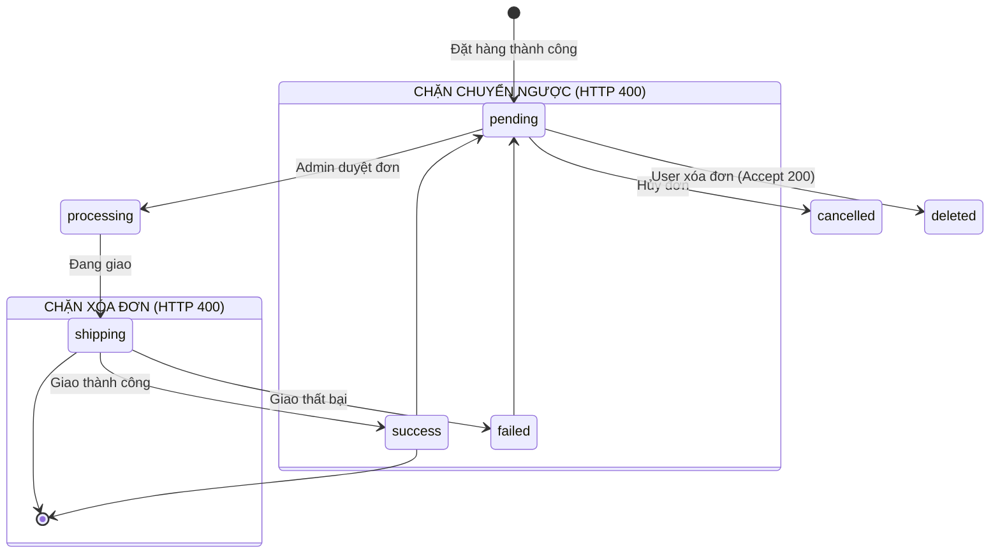

# 📄 BÁO CÁO KIỂM THỬ TÍNH NĂNG ORDER LIFECYCLE MANAGEMENT

---

## 🟢 PHẦN 1: PHÂN TÍCH THIẾT KẾ TEST CASE (BLACKBOX & WHITEBOX)

### 1.1. Phân tích Phân vùng tương đương (EP), Chuyển đổi trạng thái & Phân quyền

#### A. Phân tích Kiểm soát Quyền sở hữu Đơn hàng (Ownership Guard)

Lỗ hổng IDOR (Insecure Direct Object Reference) cho phép kẻ tấn công thay đổi tài nguyên của người dùng khác.

- **Phân vùng hợp lệ (Valid EP)**: `order.userId.toString() === req.user._id.toString()`.
- **Phân vùng vi phạm (Invalid EP)**: Khách hàng A truyền `:id` đơn hàng của Khách hàng B $\to$ **HTTP 403 Forbidden**.

#### B. Phân tích Quy tắc Chuyển đổi trạng thái (State Transition Rules)

Hệ thống đơn hàng là một **Máy trạng thái hữu hạn (Finite State Machine - FSM)**:
$$S = \{\text{pending}, \text{processing}, \text{shipping}, \text{success}, \text{failed}, \text{cancelled}\}$$

#### C. Phân tích Phân quyền Quản trị viên (Admin Role Guard)

- **User thường (`role = "user"`)**: Truy cập endpoint quản trị $\to$ **HTTP 403 Forbidden**.
- **Admin (`role = "admin"`)**: Truy cập endpoint quản trị $\to$ **HTTP 200 OK**.

---

### 1.2. Danh mục Toàn bộ 33 Test Cases (Test Suite Catalog)

_(Được chuẩn hóa theo format ma trận kỹ thuật, hiển thị rõ Kỹ thuật thiết kế, Input Payload và DB Assertion)_

#### Bảng 1.2a: Phân hệ Blackbox Testing (Kiểm thử chức năng API - 24 TCs)

| Test Case ID             | Tên Test Case (Mục tiêu kiểm thử)                    | Kỹ thuật (EP/BVA)  | Input Payload / Request Details                                            | Expected Status | Expected Response / DB Assertion                                                |
| :----------------------- | :--------------------------------------------------- | :----------------- | :------------------------------------------------------------------------- | :-------------: | :------------------------------------------------------------------------------ |
| **TC_ORD_01**            | [Admin Guard] User thường truy cập route Admin       | EP (Role Guard)    | `GET /api/admin/orders` Header: `Bearer user_token`                     |     **403**     | `{ message: "Forbidden" }` Chặn tại Middleware                               |
| **TC_ORD_02**            | [Admin Guard] Admin truy cập route Admin             | EP (Role Guard)    | `GET /api/admin/orders` Header: `Bearer admin_token`                    |     **200**     | `{ success: true, orders: [...] }`                                              |
| **TC_ORD_03**            | [Ownership Guard] User A xóa đơn của User B          | EP (Security/IDOR) | `DELETE /api/orders/order_B_id` Header: `Bearer user_A_token`           |     **403**     | `{ errors: [{ message: "FORBIDDEN" }] }`                                        |
| **TC_ORD_04**            | [Valid Delete] User xóa đơn của mình khi `pending`   | EP (Valid State)   | `DELETE /api/orders/{pending_id}` Header: `Bearer user_A_token`         |     **200**     | `{ success: true, message: "Order deleted..." }` `deleteOne` được gọi        |
| **TC_ORD_05**            | [Invalid Delete] Xóa đơn trạng thái `shipping`       | EP (Invalid State) | `DELETE /api/orders/{shipping_id}`                                         |     **400**     | `{ errors: [{ message: "CANNOT_DELETE_ACTIVE_ORDER" }] }`                       |
| **TC_ORD_06**            | [Invalid Delete] Xóa đơn trạng thái `success`        | EP (Invalid State) | `DELETE /api/orders/{success_id}`                                          |     **400**     | `{ errors: [{ message: "CANNOT_DELETE_ACTIVE_ORDER" }] }`                       |
| **TC_ORD_07**            | [Valid Transition] Admin chuyển sang `processing`    | EP (Valid State)   | `PUT /api/admin/orders/{id}` Payload: `{ status: "processing" }`        |     **200**     | `{ success: true, message: "Order status updated..." }` `updateOne` được gọi |
| **TC_ORD_08**            | [Illegal Transition] Admin chuyển ngược từ `success` | BVA/EP (State)     | `PUT /api/admin/orders/{id}` Payload: `{ status: "pending" }`           |     **400**     | `{ errors: [{ message: "ILLEGAL_STATUS_TRANSITION" }] }`                        |
| **TC_ORD_09**            | [Illegal Transition] Admin chuyển ngược từ `failed`  | BVA/EP (State)     | `PUT /api/admin/orders/{id}` Payload: `{ status: "pending" }`           |     **400**     | `{ errors: [{ message: "ILLEGAL_STATUS_TRANSITION" }] }`                        |
| **TC_ORD_10**            | [Invalid Enum Status] Cập nhật status rác            | EP (Validation)    | `PUT /api/admin/orders/{id}` Payload: `{ status: "xyz_status" }`        |     **400**     | `{ errors: [{ message: "INVALID_STATUS" }] }`                                   |
| **TC_ORD_ADD_11**        | Admin lấy danh sách phân trang                       | EP (CRUD)          | `GET /api/admin/orders?page=1&limit=10` Mock: Có dữ liệu User tương ứng |     **200**     | Response map đúng thông tin user                                                |
| **TC_ORD_ADD_14**        | Admin update đơn không tồn tại                       | EP (Error Guard)   | `PUT /api/admin/orders/fake_id`                                            |     **404**     | `{ error: "ORDER_NOT_FOUND" }`                                                  |
| **TC_ORD_ADD_17**        | Admin xóa đơn hàng thành công                        | EP (CRUD)          | `DELETE /api/admin/orders/{id}`                                            |     **200**     | `{ success: true }` Gọi hàm `deleteOne`                                      |
| **TC_ORD_ADD_18**        | Admin xóa đơn không tồn tại                          | EP (Error Guard)   | `DELETE /api/admin/orders/fake_id`                                         |     **404**     | `{ error: "ORDER_NOT_FOUND" }`                                                  |
| **TC_ORD_ADD_19**        | User lấy danh sách đơn filter theo trạng thái        | EP (CRUD Filter)   | `GET /api/orders?status=pending`                                           |     **200**     | Response chứa danh sách đơn pending                                             |
| **TC_ORD_ADD_20**        | User lấy danh sách đơn (không filter)                | EP (CRUD)          | `GET /api/orders`                                                          |     **200**     | Trả về tổng đơn hàng của User                                                   |
| **TC_ORD_ADD_22**        | User lấy chi tiết đơn hàng                           | EP (CRUD)          | `GET /api/orders/detail/{id}`                                              |     **200**     | Trả về Object chi tiết đơn hàng                                                 |
| **TC_ORD_ADD_26**        | User lấy chi tiết đơn không tồn tại                  | EP (Error Guard)   | `GET /api/orders/detail/fake_id`                                           |     **404**     | `{ error: "ORDER_NOT_FOUND" }`                                                  |
| **TC_ORD_ADD_27**        | Delete với ID sai định dạng                          | BVA (Validation)   | `DELETE /api/orders/123xyz` (Không phải Hex 24)                            |     **400**     | `{ error: "INVALID_ORDER_ID" }`                                                 |
| **TC_ORD_ADD_28**        | User xóa đơn không tồn tại                           | EP (Error Guard)   | `DELETE /api/orders/64a2b9...` (ID hợp lệ nhưng rỗng DB)                   |     **404**     | `{ error: "ORDER_NOT_FOUND" }`                                                  |
| **TC_ORD_ADD_29**        | Tạo đơn hàng mới thành công                          | EP (CRUD)          | `POST /api/orders` Payload: `{ amount: 1000 }`                          |     **200**     | `{ success: true, orderId }` Gọi `insertOne`                                 |
| **TC_ORD_ADD_30_UNAUTH** | Lấy danh sách khi mất Token                          | EP (Auth)          | `GET /api/orders` Headers: Rỗng                                         |     **401**     | `{ error: "UNAUTHORIZED" }`                                                     |
| **TC_ORD_ADD_31_UNAUTH** | Tạo đơn khi mất Token                                | EP (Auth)          | `POST /api/orders` Headers: Rỗng                                        |     **401**     | `{ error: "UNAUTHORIZED" }`                                                     |
| **TC_ORD_ADD_32_UNAUTH** | Xóa đơn khi mất Token                                | EP (Auth)          | `DELETE /api/orders/{id}` Headers: Rỗng                                 |     **401**     | `{ error: "UNAUTHORIZED" }`                                                     |

#### Bảng 1.2b: Phân hệ Whitebox Testing (Kiểm thử cấu trúc nội bộ - 9 TCs)

| Test Case ID      | Mục tiêu phủ Coverage (Structural Target)      | Kỹ thuật (Whitebox) | Setup Mock & Payload                                             | Nhánh Code bị kích hoạt / Assertion             |
| :---------------- | :--------------------------------------------- | :------------------ | :--------------------------------------------------------------- | :---------------------------------------------- |
| **TC_ORD_ADD_12** | Phủ vòng lặp khi User bị rỗng trong hàm Admin. | Nullish Injection   | Mock DB: Đơn hàng có `userId` nhưng bảng User `findOne` trả rỗng | Fallback tạo user object là `null`              |
| **TC_ORD_ADD_13** | Phủ toán tử `?? 0` khi DB mất `finalPrice`.    | Data Anomaly        | Mock DB Order: Object không có `finalPrice`                      | Kích hoạt `o.finalPrice ?? o.totalPrice ?? 0`   |
| **TC_ORD_ADD_15** | Kiểm tra lỗi Concurrency khi update xịt.       | Mock Implementation | `updateOne.mockResolvedValue({ modifiedCount: 0 })`              | Kích hoạt `if (modifiedCount === 0) return 400` |
| **TC_ORD_ADD_16** | Phủ lỗi Type Casting khi ép kiểu ID.           | Data Injection      | Truyền `orderId` mảng/object sai Type                            | Tự chuyển đổi query `_id` vs `orderId`          |
| **TC_ORD_ADD_21** | Phủ toán tử `?? 0` khi DB mất price (User).    | Data Anomaly        | Mock DB trả ra đơn khuyết tiền cho User list                     | Kích hoạt `?? 0` ở hàm `getAllOrders`           |
| **TC_ORD_ADD_23** | Phủ chuẩn hóa (normalize) String.              | Type Reflection     | Mock hàm normalize nhận String                                   | Trả ra chính String đó                          |
| **TC_ORD_ADD_24** | Phủ chuẩn hóa Value Object.                    | Object Reflection   | Mock hàm normalize nhận `{ value: "pending" }`                   | Nhánh trả ra `status.value`                     |
| **TC_ORD_ADD_25** | Phủ mặc định giá trị lạ về `'pending'`.        | Switch Default      | Mock hàm normalize nhận type quái dị                             | Rơi xuống dòng `return "pending"`               |
| **TC_ORD_ADD_33** | Kích hoạt toàn bộ khối `catch(error)`.         | Exception Throwing  | `orderCol.mockRejectedValue(new Error("DB Down"))`               | Nhảy xuống block catch, trả ra 500              |

---

## 🟢 PHẦN 2: PHÂN TÍCH ĐỒ THỊ DÒNG ĐIỀU KHIỂN & SỐ LƯỢNG TEST CASE TỐI ƯU

### 2.1. Đồ thị CFG cho hàm `deleteOrder`

- **Độ phức tạp Cyclomatic $V(G)$**: $P = 5$ (Node 1, 4, 7, 9, 11) + 1 Exception handler = 6. Vậy $V(G) = 6 + 1 = 7$.

---

### 2.2. Số lượng Test Case định lượng cho 100% Statement Coverage

**Câu hỏi:** Cần chạy bao nhiêu test case (và là những test case nào) để đạt 100% Statement Coverage?

**Trả lời:** Từ tổng số 33 Test Case, ta cần lọc ra **Tập tối thiểu gồm 14 Test Cases** để mọi dòng lệnh trong module `order.controller.ts` được thực thi ít nhất một lần.

**Bảng Danh sách Test Cases bắt buộc phải chạy để phủ kín Statements:**

|  STT   | Test Case ID            | Mục đích bao phủ (Statement Target)                    | Mã nguồn được kích hoạt trong `order.controller.ts`                       |
| :----: | :---------------------- | :----------------------------------------------------- | :------------------------------------------------------------------------ |
| **1**  | **TC_ORD_01, 02**       | Phủ lệnh gọi Guard kiểm duyệt Token Admin              | Middleware chạy trước Controller, cho đi tiếp vào các hàm `...ForAdmin`   |
| **2**  | **TC_ORD_04, 07**       | Phủ lệnh ghi CSDL của User và Admin (Happy Path)       | Gọi `orderCol.deleteOne`, `updateOne` và trả `200 OK`                     |
| **3**  | **TC_ORD_ADD_11**       | Phủ đoạn code `map` gộp Object User cho Admin          | Dòng code chứa `userMap.get(...)` (Từ L31-40)                             |
| **4**  | **TC_ORD_10**           | Phủ lệnh kiểm tra trạng thái mảng `includes`           | Khối chặn if `!validStatuses.includes(status)` $\to$ `400 INVALID_STATUS` |
| **5**  | **TC_ORD_ADD_19**       | Phủ lệnh gán `filter.status` ở list đơn hàng User      | Nhánh `if (["success", "pending"...].includes(rawStatus))` (L167)         |
| **6**  | **TC_ORD_ADD_22**       | Phủ cấu trúc hàm `normalizeStatus`                     | Dòng code gán thuộc tính Object: `status: normalizeStatus(...)` (L226)    |
| **7**  | **TC_ORD_ADD_27**       | Phủ lệnh check định dạng `ObjectId.isValid`            | Lệnh ném lỗi `res.status(400) INVALID_ORDER_ID` (L276)                    |
| **8**  | **TC_ORD_03**           | Phủ nhánh chống lỗ hổng BOLA / IDOR                    | Cấu trúc `if (order.userId !== userId) -> 403 FORBIDDEN` (L290)           |
| **9**  | **TC_ORD_05**           | Phủ khối bảo vệ đơn hàng đang chạy (Active Order)      | Lệnh `return 400 CANNOT_DELETE_ACTIVE_ORDER` (L297)                       |
| **10** | **TC_ORD_ADD_14, 28**   | Phủ lệnh kiểm tra null của Database `!order`           | Các nhánh `if (!order) return 404 ORDER_NOT_FOUND`                        |
| **11** | **TC_ORD_ADD_29**       | Phủ luồng tạo đơn hàng mới của hàm `createOrder`       | Lệnh `insertOne` và trả về `200 OK` (L241-260)                            |
| **12** | **TC_ORD_ADD_33_CATCH** | Kích hoạt bắt buộc mọi lệnh `console.error` và bẫy 500 | Quét qua tất cả 6 khối `catch (error)` trong Controller                   |

---

### 2.3. Số lượng Test Case định lượng cho 100% Branch Coverage (Độ phủ nhánh)

**Câu hỏi:** Cần chạy bao nhiêu test case (và là những test case nào) để đạt 100% Branch Coverage?

**Trả lời:** Branch Coverage đòi hỏi khắt khe hơn: mọi câu lệnh rẽ nhánh (`if`, `||`, `&&`, fallback `??`) phải được chạy đủ 2 luồng True và False. Tổng cộng cần **18 Test Cases** (gồm 14 test Statement + 4 test bổ sung).

**Bảng Ma trận các nhánh điều kiện bảo đảm 100% Branch Coverage:**

|  STT   | Cấu trúc rẽ nhánh trong mã nguồn                                                           | Nhánh True (T)                               | Nhánh False (F)                       | Test Case phủ nhánh True | Test Case phủ nhánh False |
| :----: | :----------------------------------------------------------------------------------------- | :------------------------------------------- | :------------------------------------ | :----------------------- | :------------------------ |
| **1**  | `if (!validStatuses.includes(status))`                                                     | Trạng thái rác $\to$ Báo 400                 | Trạng thái đúng $\to$ Đi tiếp         | **TC_ORD_10**            | **TC_ORD_07**             |
| **2**  | `if (!order)` (Admin update)                                                               | Truy vấn rỗng $\to$ Báo 404                  | Có đơn hàng $\to$ Bắt đầu xử lý       | **TC_ORD_ADD_14**        | **TC_ORD_07**             |
| **3**  | `if ((order.status === "success" \|\| order.status === "failed") && status === "pending")` | Vi phạm State Machine $\to$ Báo 400          | Chuyển luồng hợp lệ $\to$ Cho đi tiếp | **TC_ORD_08, 09**        | **TC_ORD_07**             |
| **4**  | `if (result.modifiedCount === 0)`                                                          | Lỗi Concurrency $\to$ Báo 400                | DB thực thi ghi đè tốt $\to$ 200      | **TC_ORD_ADD_15**        | **TC_ORD_07**             |
| **5**  | `if (!userId)` (Bảo vệ API User)                                                           | Không có Token $\to$ Báo lỗi 401             | Có đủ Token $\to$ Tiếp tục tìm DB     | **TC_ORD_ADD_30**        | **TC_ORD_ADD_19**         |
| **6**  | `if (["success", "pending"...].includes(rawStatus))`                                       | Có truyền filter chuẩn $\to$ Gán biến filter | Không filter $\to$ Bỏ qua             | **TC_ORD_ADD_19**        | **TC_ORD_ADD_20**         |
| **7**  | `if (!ObjectId.isValid(orderId))`                                                          | ID truyền vào chuỗi bậy $\to$ Báo 400        | Format Hex chuẩn 24 $\to$ Query       | **TC_ORD_ADD_27**        | **TC_ORD_04**             |
| **8**  | `if (order.userId.toString() !== userId.toString())`                                       | Đơn thuộc User khác $\to$ Báo 403 IDOR       | Đúng chủ nhân $\to$ Cho đi tiếp       | **TC_ORD_03**            | **TC_ORD_04**             |
| **9**  | `if (order.status !== "pending")`                                                          | Đang giao/xong $\to$ Cấm xóa 400             | Đang chờ $\to$ Cho phép xóa           | **TC_ORD_05, 06**        | **TC_ORD_04**             |
| **10** | Toán tử `o.finalPrice ?? o.totalPrice ?? 0`                                                | Trường `finalPrice` rỗng $\to$ lấy Fallback  | Đã có giá trị chuẩn $\to$ Bỏ qua      | **TC_ORD_ADD_13, 21**    | **TC_ORD_02, 19**         |
| **11** | `try { ... } catch (error)` trên 6 routes                                                  | Lỗi đứt cáp DB $\to$ Bay vào 500             | Luồng chạy tốt $\to$ 200              | **TC_ORD_ADD_33**        | **TC_ORD_04, 07**         |

---

## 🟢 PHẦN 3: TƯ DUY ĐÁNH GIÁ PHƯƠNG PHÁP LUẬN (METHODOLOGY EVALUATION)

_Mục tiêu: Đánh giá xem áp dụng phương pháp BVA/EP có tự động đảm bảo 100% độ phủ Statement/Branch hay không, và xem bộ test đó có thừa/thiếu gì khi map sang cấu trúc code._

### 3.1. Sự thật: BVA/EP có tự động đảm bảo 100% Coverage không?

**Kết luận khẳng định: HOÀN TOÀN KHÔNG!**

Phương pháp BVA/EP hoàn toàn dựa trên tư duy **Hộp Đen (Blackbox)** - nhìn vào tài liệu đặc tả (Specs) để thiết kế kịch bản. Khi đem bộ 24 test case Blackbox ốp vào chạy trên Source Code, độ phủ thường bị kẹt ở mức **75% - 85%**. Lý do là phương pháp này gặp phải vấn đề **vừa Thừa lại vừa Thiếu** khi ánh xạ vào kiến trúc nội bộ của lập trình viên.

### 3.2. Đánh giá "Cái THIẾU" của BVA/EP khi map sang Code

Bộ BVA/EP được thiết kế dưới giả định "Hạ tầng lý tưởng" nên không thể kích hoạt được các logic phòng ngự (Defensive Programming) do Developer viết ra:

- **Thiếu nhánh Catch Block (Lỗi hạ tầng):** Kịch bản BVA/EP mong đợi nhập input sai thì HTTP trả về 400. Nhưng không có tài liệu BA nào yêu cầu: _"Làm sập kết nối MongoDB đột ngột để sinh ra HTTP 500"_. Do đó, lệnh rẽ nhánh `catch(error)` mãi mãi bị bỏ sót.
- **Thiếu nhánh Fallback dữ liệu ngầm:** Trong code có nhánh `order.finalPrice ?? 0` để đề phòng DB cũ bị khuyết dữ liệu. Kịch bản BVA không bao giờ kích hoạt được luồng True của nhánh này vì giả định DB luôn hoàn hảo.
- **Thiếu nhánh Race Condition:** BVA/EP không thể thiết kế được kịch bản mô phỏng 2 Admin cùng lúc nhấn nút cập nhật 1 đơn hàng (`modifiedCount === 0`).

$\implies$ **Giải pháp bù đắp**: Bắt buộc phải kết hợp **Whitebox Testing** (Sử dụng Mocking Data & Throw Error trong RAM) để chọc thẳng vào các điểm mù kỹ thuật này.

### 3.3. Đánh giá "Cái THỪA" của BVA/EP khi map sang Code

Ngược lại, khi map sang cấu trúc mã nguồn, bộ test BVA/EP lại sinh ra sự **Thừa thãi (Redundant)** và trùng lặp (Overlap):

- **Ví dụ kinh điển:** Dựa trên phân tích State Machine (EP), QA viết 2 Test Cases Hộp đen cho quy tắc "Không được chuyển ngược trạng thái":
  - Kịch bản 1 (TC_08): Cố chuyển từ `success` -> `pending` (Báo 400).
  - Kịch bản 2 (TC_09): Cố chuyển từ `failed` -> `pending` (Báo 400).
- **Phân tích dưới góc nhìn Code (Whitebox):** Ở dưới backend, Developer gộp chung hai trường hợp đó vào đúng 1 dòng if duy nhất:
  `if (["success", "failed"].includes(order.status)) return res.status(400)`
- **Hậu quả:** Khi chạy Kịch bản 1, nhánh code trên đã đạt 100% Coverage. Khi chạy tiếp Kịch bản 2, Kịch bản 2 trở nên **thừa thãi hoàn toàn** về mặt độ phủ code. Đây là minh chứng cho việc số lượng Test Case Hộp đen lớn chưa chắc đã mang lại hiệu quả đo lường cao hơn.

### 3.4. Tổng kết Triết lý Kiểm thử

Qua việc thực nghiệm trên module Order, có thể rút ra kết luận cốt lõi:

1. **BVA/EP (Blackbox) là ĐIỀU KIỆN CẦN**: Cực kỳ thiết yếu để đảm bảo phần mềm chạy đúng nghiệp vụ kinh doanh, bảo vệ an toàn cho User. Tuy nhiên, nó là chưa đủ vì bỏ lọt điểm mù hạ tầng.
2. **Structural Testing (Whitebox) là ĐIỀU ĐIỀU KIỆN ĐỦ**: Đóng vai trò "chiếc chổi" quét sạch các "góc tối" của mã nguồn (nhánh catch, toán tử dự phòng), nhưng lại xa rời hành vi của User thật.
3. $\implies$ **Phương pháp toàn vẹn nhất**: Lấy **BVA/EP làm bộ khung xương sống** (tạo base case), sau đó dùng công cụ đo lường Coverage soi chiếu vào Code để phát hiện điểm mù, và cuối cùng dùng **Whitebox lấp đầy cái thiếu, cắt tỉa cái thừa**. Sự đan xen này chính là nghệ thuật tạo nên bộ Unit Test đạt mức tuyệt đối 100% Coverage nhưng vẫn tinh gọn.
