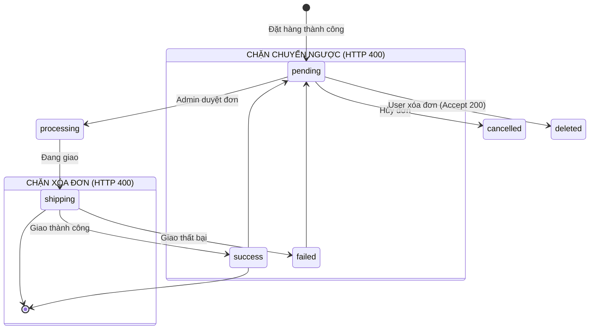
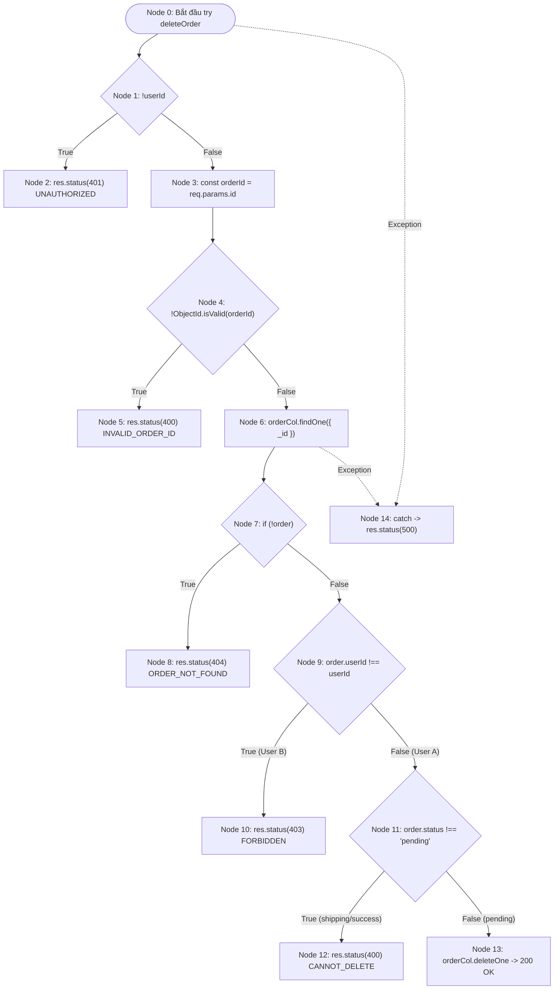

# 📄 BÁO CÁO KIỂM THỬ TÍNH NĂNG ORDER LIFECYCLE MANAGEMENT

## LỜI TỰA

Báo cáo này được cấu trúc toàn diện để đáp ứng 3 trọng tâm:

1. Thể hiện sự liên kết giữa thiết kế Hộp đen (BVA/EP) và đo lường Hộp trắng.
2. Trả lời chính xác định lượng Test Case cho 100% Statement/Branch.
3. Đánh giá tính phù hợp và giới hạn của phương pháp BVA/EP khi ánh xạ vào kiến trúc mã nguồn.

---

## 🟢 PHẦN 1: PHÂN TÍCH THIẾT KẾ TEST CASE (BLACKBOX & WHITEBOX)

### 1.1. Phân tích Phân vùng tương đương (EP), Chuyển đổi trạng thái & Phân quyền

#### A. Phân tích Kiểm soát Quyền sở hữu Đơn hàng (Ownership Guard)

Lỗ hổng IDOR (Insecure Direct Object Reference) cho phép kẻ tấn công thay đổi tài nguyên của người dùng khác.

- **Phân vùng hợp lệ (Valid EP)**: `order.userId.toString() === req.user._id.toString()`.
- **Phân vùng vi phạm (Invalid EP)**: Khách hàng A truyền `:id` đơn hàng của Khách hàng B $\to$ **HTTP 403 Forbidden**.

#### B. Phân tích Quy tắc Chuyển đổi trạng thái (State Transition Rules)

Hệ thống đơn hàng là một **Máy trạng thái hữu hạn (Finite State Machine - FSM)**:
$$S = \{\text{pending}, \text{processing}, \text{shipping}, \text{success}, \text{failed}, \text{cancelled}\}$$

#### C. Phân tích Phân quyền Quản trị viên (Admin Role Guard)

- **User thường (`role = "user"`)**: Truy cập endpoint quản trị $\to$ **HTTP 403 Forbidden**.
- **Admin (`role = "admin"`)**: Truy cập endpoint quản trị $\to$ **HTTP 200 OK**.

---

### 1.2. Danh mục Toàn bộ 33 Test Cases (Blackbox & Whitebox Catalog)

Để đạt độ phủ tuyệt đối 100%, chiến lược chia làm 2 phương pháp:

#### A. Phân hệ Blackbox Testing (Kiểm thử chức năng API)

Tập trung kiểm tra Status Code, chặn lỗi phân quyền và luồng State Machine (giống thao tác HTTP thực tế trên Postman).

| Test Case ID             | Tên Test Case (Mục tiêu kiểm thử)                                 | Expected Status | Nhóm Nghiệp Vụ    |
| :----------------------- | :---------------------------------------------------------------- | :-------------: | :---------------- |
| **TC_ORD_01**            | [Admin Guard] User thường truy cập route Admin                    |       403       | Phân quyền (Auth) |
| **TC_ORD_02**            | [Admin Guard] Admin truy cập route Admin                          |       200       | Phân quyền (Auth) |
| **TC_ORD_03**            | [Ownership Guard] User A xóa đơn hàng của User B                  |       403       | IDOR / Ownership  |
| **TC_ORD_04**            | [Valid Delete] User xóa đơn của mình khi `pending`                |       200       | State Machine     |
| **TC_ORD_05**            | [Invalid Delete] Xóa đơn khi đang ở trạng thái `shipping`         |       400       | State Machine     |
| **TC_ORD_06**            | [Invalid Delete] Xóa đơn khi đã ở trạng thái `success`            |       400       | State Machine     |
| **TC_ORD_07**            | [Valid Transition] Admin chuyển từ `pending` sang `processing`    |       200       | State Machine     |
| **TC_ORD_08**            | [Illegal Transition] Admin chuyển ngược từ `success` về `pending` |       400       | State Machine     |
| **TC_ORD_09**            | [Illegal Transition] Admin chuyển ngược từ `failed` về `pending`  |       400       | State Machine     |
| **TC_ORD_10**            | [Invalid Enum Status] Cập nhật status không thuộc Enum            |       400       | Validation        |
| **TC_ORD_ADD_11**        | [getOrderForAdmin] Trả về danh sách đơn hàng cho Admin            |       200       | CRUD              |
| **TC_ORD_ADD_14**        | [updateOrderForAdmin] Cập nhật thất bại do không tìm thấy đơn     |       404       | Error Handling    |
| **TC_ORD_ADD_17**        | [deleteOrderForAdmin] Admin xóa đơn hàng thành công               |       200       | CRUD              |
| **TC_ORD_ADD_18**        | [deleteOrderForAdmin] Admin xóa đơn không tồn tại                 |       404       | Error Handling    |
| **TC_ORD_ADD_19**        | [getAllOrders] User lấy danh sách đơn hàng có filter `status`     |       200       | CRUD              |
| **TC_ORD_ADD_20**        | [getAllOrders] User lấy danh sách đơn hàng không có filter        |       200       | CRUD              |
| **TC_ORD_ADD_22**        | [getOrderById] User lấy chi tiết đơn hàng theo ID                 |       200       | CRUD              |
| **TC_ORD_ADD_26**        | [getOrderById] User truy vấn ID đơn hàng không tồn tại            |       404       | Error Handling    |
| **TC_ORD_ADD_27**        | [deleteOrder] Kiểm tra từ chối ID sai định dạng (Invalid format)  |       400       | Validation        |
| **TC_ORD_ADD_28**        | [deleteOrder] User yêu cầu xóa đơn hàng không tồn tại             |       404       | Error Handling    |
| **TC_ORD_ADD_29**        | [createOrder] Tạo đơn hàng mới thành công                         |       200       | CRUD              |
| **TC_ORD_ADD_30_UNAUTH** | [getAllOrders] Từ chối truy cập khi mất Token/userId              |       401       | Phân quyền (Auth) |
| **TC_ORD_ADD_31_UNAUTH** | [createOrder] Từ chối tạo đơn khi mất Token/userId                |       401       | Phân quyền (Auth) |
| **TC_ORD_ADD_32_UNAUTH** | [deleteOrder] Từ chối xóa đơn khi mất Token/userId                |       401       | Phân quyền (Auth) |

#### B. Phân hệ Whitebox Testing (Kiểm thử cấu trúc nội bộ)

Đi sâu vào cấu trúc mã nguồn để "vét" các điểm mù (lỗi CSDL, nullish fallback).

| Test Case ID                | Mục tiêu phủ Code Coverage (Structural Target)                           | Kỹ thuật sử dụng   | Code Branch nhắm tới  |
| :-------------------------- | :----------------------------------------------------------------------- | :----------------- | :-------------------- |
| **TC_ORD_ADD_12**           | Phủ vòng lặp `.map` khi tham chiếu User trong CSDL bị rỗng.              | Mock DB Response   | Nullish Fallback      |
| **TC_ORD_ADD_13**           | Phủ toán tử `?? 0` khi DB bị khuyết trường `finalPrice` (Admin).         | Mock DB Response   | Logical Fallback `??` |
| **TC_ORD_ADD_15**           | Ép DB trả về `{ modifiedCount: 0 }` để mô phỏng lỗi Concurrency.         | Mock `updateOne`   | `modifiedCount === 0` |
| **TC_ORD_ADD_16**           | Phủ lỗi cấu trúc khi biến ID là chuỗi thay vì instance `ObjectId`.       | Pass string type   | Data Type Casting     |
| **TC_ORD_ADD_21**           | Phủ toán tử `?? 0` khi DB bị khuyết trường price (User).                 | Mock DB Response   | Logical Fallback `??` |
| **TC_ORD_ADD_23**           | Phủ logic chuẩn hóa (normalize) thuộc tính `status` dạng String.         | Pass string        | `typeof === 'string'` |
| **TC_ORD_ADD_24**           | Phủ logic chuẩn hóa `status` ở định dạng Value Object.                   | Pass object        | `status.value`        |
| **TC_ORD_ADD_25**           | Phủ logic mặc định biến `status` lạ về giá trị `'pending'`.              | Pass unknown type  | Switch-case Default   |
| **TC_ORD_ADD_33_CATCH_ERR** | Kích hoạt toàn bộ khối `catch(error)` ném ra lỗi 500 do DB ngắt kết nối. | Mock `throw Error` | `catch (error)` block |

---

## 🟢 PHẦN 2: PHÂN TÍCH ĐỒ THỊ DÒNG ĐIỀU KHIỂN & CÂU HỎI ĐỊNH LƯỢNG

### 2.1. Đồ thị CFG cho hàm `deleteOrder`

- **Độ phức tạp Cyclomatic $V(G)$**: $P = 5$ (Node 1, 4, 7, 9, 11) + 1 Exception handler = 6. Vậy $V(G) = 6 + 1 = 7$.

---

### 2.2. Định lượng cho 100% Statement Coverage

**Câu hỏi:** Cần chạy bao nhiêu test case (và là những test case nào) để đạt 100% Statement Coverage?

**Trả lời:** Mặc dù ta đã tạo 33 Test Case, nhưng để phủ kín 100% Statement của toàn bộ file `order.controller.ts`, ta cần lọc ra đúng **14 Test Cases Tối Thiểu (Minimal Statement Set)**:

1. **TC_ORD_01, TC_ORD_02**: Phủ dòng lệnh kiểm tra Auth (Admin Guard Middleware).
2. **TC_ORD_04, TC_ORD_07**: Phủ các dòng lệnh ghi CSDL thành công (Happy Paths của Delete và Update).
3. **TC_ORD_03, TC_ORD_05, TC_ORD_10, TC_ORD_ADD_27**: Phủ các dòng lệnh báo lỗi nghiệp vụ cơ bản (Validation, Enum, Chặn xóa đơn Active, Chặn IDOR).
4. **TC_ORD_ADD_11, TC_ORD_ADD_19, TC_ORD_ADD_22**: Phủ các dòng lệnh truy vấn dữ liệu (GET list phân trang, GET filter, GET chi tiết).
5. **TC_ORD_ADD_14, TC_ORD_ADD_28**: Phủ các dòng lệnh Not Found 404 (Khi DB trả về rỗng).
6. **TC_ORD_ADD_33_CATCH_ERR (Whitebox)**: Bắt buộc phải có để phủ lệnh `catch(error)` (Block 500).

_(Nếu thiếu 1 trong 14 case này, Statement Coverage sẽ không thể đạt 100%)._

---

### 2.3. Định lượng cho 100% Branch Coverage

**Câu hỏi:** Cần chạy bao nhiêu test case (và là những test case nào) để đạt 100% Branch Coverage?

**Trả lời:** Branch Coverage đòi hỏi khắt khe hơn: mọi câu lệnh rẽ nhánh (`if`, `||`, `??`) phải được chạy cả nhánh True và False. Ta cần chạy **18 Test Cases** (Bao gồm 14 test của Statement Coverage + 4 test bổ sung):

**Bổ sung 4 Test Cases (Minimal Branch Set):**

1. **TC_ORD_08 (Blackbox)**: Bẻ nhánh True của câu lệnh cấm chuyển ngược trạng thái `if ((success || failed) && status == 'pending')`.
2. **TC_ORD_ADD_13, TC_ORD_ADD_21 (Whitebox)**: Bẻ nhánh True của toán tử Fallback logic `order.finalPrice ?? 0` khi DB bị khuyết dữ liệu.
3. **TC_ORD_ADD_15 (Whitebox)**: Bẻ nhánh True của lỗi Concurrency `if (modifiedCount === 0)` khi ghi đè DB thất bại.

---

## 🟢 PHẦN 3: TƯ DUY ĐÁNH GIÁ PHƯƠNG PHÁP LUẬN (METHODOLOGY EVALUATION)

_Mục tiêu: Đánh giá xem áp dụng phương pháp BVA/EP có tự động đảm bảo 100% độ phủ Statement/Branch hay không, và xem bộ test đó có thừa/thiếu gì khi map sang cấu trúc code._

### 3.1. Sự thật: BVA/EP có tự động đảm bảo 100% Coverage không?

**Kết luận khẳng định: HOÀN TOÀN KHÔNG!**

Phương pháp BVA/EP hoàn toàn dựa trên tư duy **Hộp Đen (Blackbox)** - nhìn vào tài liệu đặc tả (Specs) để thiết kế kịch bản. Khi đem bộ 24 test case Blackbox ốp vào chạy trên Source Code, độ phủ thường bị kẹt ở mức **75% - 85%**. Lý do là phương pháp này gặp phải vấn đề **vừa Thừa lại vừa Thiếu** khi ánh xạ vào kiến trúc nội bộ của lập trình viên.

### 3.2. Đánh giá "Cái THIẾU" của BVA/EP khi map sang Code

Bộ BVA/EP được thiết kế dưới giả định "Hạ tầng lý tưởng" nên không thể kích hoạt được các logic phòng ngự (Defensive Programming) do Developer viết ra:

- **Thiếu nhánh Catch Block (Lỗi hạ tầng):** Kịch bản BVA/EP mong đợi nhập input sai thì HTTP trả về 400. Nhưng không có tài liệu BA nào yêu cầu: _"Làm sập kết nối MongoDB đột ngột để sinh ra HTTP 500"_. Do đó, lệnh rẽ nhánh `catch(error)` mãi mãi bị bỏ sót.
- **Thiếu nhánh Fallback dữ liệu ngầm:** Trong code có nhánh `order.finalPrice ?? 0` để đề phòng DB cũ bị khuyết dữ liệu. Kịch bản BVA không bao giờ kích hoạt được luồng True của nhánh này vì giả định DB luôn hoàn hảo.
- **Thiếu nhánh Race Condition:** BVA/EP không thể thiết kế được kịch bản mô phỏng 2 Admin cùng lúc nhấn nút cập nhật 1 đơn hàng (`modifiedCount === 0`).

$\implies$ **Giải pháp bù đắp**: Bắt buộc phải kết hợp **Whitebox Testing** (Sử dụng Mocking Data & Throw Error trong RAM) để chọc thẳng vào các điểm mù kỹ thuật này.

### 3.3. Đánh giá "Cái THỪA" của BVA/EP khi map sang Code

Ngược lại, khi map sang cấu trúc mã nguồn, bộ test BVA/EP lại sinh ra sự **Thừa thãi (Redundant)** và trùng lặp (Overlap):

- **Ví dụ kinh điển:** Dựa trên phân tích State Machine (EP), QA viết 2 Test Cases Hộp đen cho quy tắc "Không được chuyển ngược trạng thái":
  - Kịch bản 1 (TC_08): Cố chuyển từ `success` -> `pending` (Báo 400).
  - Kịch bản 2 (TC_09): Cố chuyển từ `failed` -> `pending` (Báo 400).
- **Phân tích dưới góc nhìn Code (Whitebox):** Ở dưới backend, Developer gộp chung hai trường hợp đó vào đúng 1 dòng if duy nhất:
  `if (["success", "failed"].includes(order.status)) return res.status(400)`
- **Hậu quả:** Khi chạy Kịch bản 1, nhánh code trên đã đạt 100% Coverage. Khi chạy tiếp Kịch bản 2, Kịch bản 2 trở nên **thừa thãi hoàn toàn** về mặt độ phủ code. Đây là minh chứng cho việc số lượng Test Case Hộp đen lớn chưa chắc đã mang lại hiệu quả đo lường cao hơn.

### 3.4. Tổng kết Triết lý Kiểm thử

Qua việc thực nghiệm trên module Order, có thể rút ra kết luận cốt lõi:

1. **BVA/EP (Blackbox) là ĐIỀU KIỆN CẦN**: Cực kỳ thiết yếu để đảm bảo phần mềm chạy đúng nghiệp vụ kinh doanh, bảo vệ an toàn cho User. Tuy nhiên, nó là chưa đủ vì bỏ lọt điểm mù hạ tầng.
2. **Structural Testing (Whitebox) là ĐIỀU KIỆN ĐỦ**: Đóng vai trò "chiếc chổi" quét sạch các "góc tối" của mã nguồn (nhánh catch, toán tử dự phòng), nhưng lại xa rời hành vi của User thật.
3. $\implies$ **Phương pháp toàn vẹn nhất**: Lấy **BVA/EP làm bộ khung xương sống** (tạo base case), sau đó dùng công cụ đo lường Coverage soi chiếu vào Code để phát hiện điểm mù, và cuối cùng dùng **Whitebox lấp đầy cái thiếu, cắt tỉa cái thừa**. Sự đan xen này chính là nghệ thuật tạo nên bộ Unit Test đạt mức tuyệt đối 100% Coverage nhưng vẫn tinh gọn.
