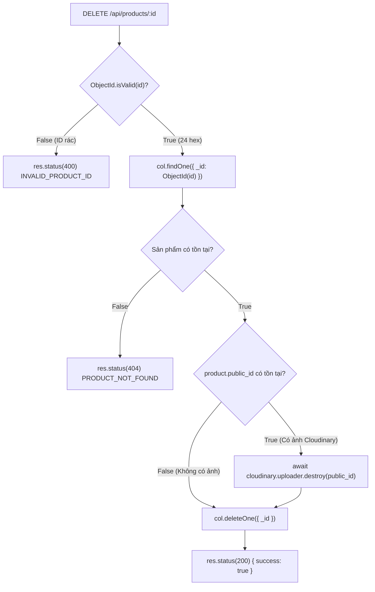
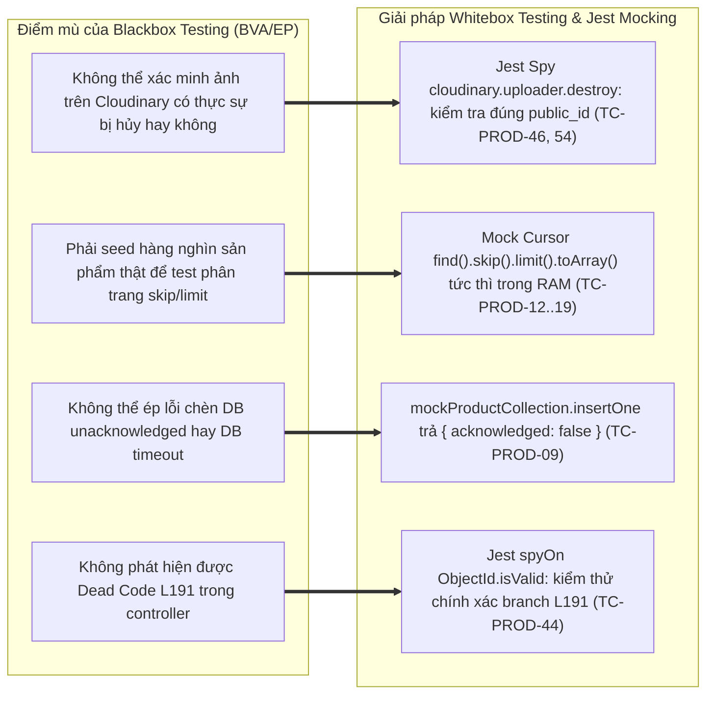

# 📄 BÁO CÁO KIỂM THỬ TÍNH NĂNG PRODUCT CATALOG MANAGEMENT

## 🟢 PHẦN 1: BỘ TEST CASE BLACKBOX (EP + BVA) & KIỂM THỬ CHỨC NĂNG

### 1. Mô tả bài toán (Problem Description)

Hệ thống **Product Catalog Management** của nền tảng E-Commerce cung cấp các giao diện lập trình ứng dụng (RESTful API) chịu trách nhiệm quản lý danh mục sản phẩm, xác thực dữ liệu đầu vào thông qua Zod Schema, kiểm soát cơ chế phân trang an toàn (Pagination Resilience), chuẩn hóa đường dẫn danh mục (Slug Sanitization) và tự động dọn dẹp tài nguyên hình ảnh trên Cloudinary khi xóa sản phẩm. Các dịch vụ API bao gồm:

1. **Truy vấn danh sách sản phẩm phân trang** (`GET /api/products`): Lấy danh sách sản phẩm với các tham số truy vấn `page` và `limit`. Hệ thống trang bị cơ chế tự phục hồi (Self-healing Preprocessing): tự động chuyển hướng các giá trị `page <= 0` hoặc chuỗi rác về `page = 1`, đồng thời kẹp trần an toàn (Clamp Guard) giới hạn `limit` tối đa 100 sản phẩm/trang để chống tấn công cạn kiệt bộ nhớ (OOM DoS).
2. **Xem chi tiết sản phẩm theo ID** (`GET /api/products/:id`): Truy vấn thông tin chi tiết của một sản phẩm theo mã định danh MongoDB BSON ObjectId 24 ký tự hex. Ngăn chặn triệt để lỗi sập server do parse ID sai định dạng.
3. **Tạo mới sản phẩm vào hệ thống** (`POST /api/products`): Yêu cầu người dùng đăng nhập tài khoản. Xác thực chặt chẽ giá tiền (`price` trong khoảng $[1,000; 1,000,000,000]$ VND, nguyên số), hỗ trợ tự động ép kiểu dữ liệu chuỗi số (Type Coercion), tự động chuyển đổi tên danh mục thành slug tiếng Việt chuẩn SEO, và lưu trữ thông tin ảnh Cloudinary (`imageUrl`, `public_id`).
4. **Cập nhật thông tin sản phẩm** (`PUT /api/products/:id`): Cập nhật thông tin các trường của sản phẩm theo `id`, tự động chuẩn hóa lại slug danh mục nếu có thay đổi và cập nhật trường thời gian `updated_at`.
5. **Xóa sản phẩm & Dọn dẹp tài nguyên đám mây** (`DELETE /api/products/:id`): Xóa vĩnh viễn sản phẩm khỏi MongoDB; đồng thời kích hoạt API `cloudinary.uploader.destroy(public_id)` để giải phóng dung lượng ảnh trên Cloudinary nếu sản phẩm có gắn ảnh.

#### Bảng các biến đầu vào và ràng buộc nghiệp vụ:

| Biến đầu vào      | Ý nghĩa nghiệp vụ             | Kiểu dữ liệu           | Miền giá trị hợp lệ & Ràng buộc nghiệp vụ                                                                                                                           |
| :---------------- | :---------------------------- | :--------------------- | :------------------------------------------------------------------------------------------------------------------------------------------------------------------ |
| **`name`**        | Tên sản phẩm                  | Chuỗi ký tự (`String`) | Độ dài $\ge 1$ ký tự sau khi `.trim()`, không được để trống (`z.string().min(1)`)                                                                                   |
| **`price`**       | Giá niêm yết sản phẩm (VND)   | Số nguyên (`Integer`)  | Số nguyên trong khoảng $[1,000; 1,000,000,000]$ VND. Hỗ trợ tự động ép kiểu chuỗi số (vd: `"5000"` $\to$ `5000`). Chặn số âm, số 0, số thực thập phân lẻ (`1500.5`) |
| **`description`** | Mô tả chi tiết sản phẩm       | Chuỗi ký tự (`String`) | Độ dài $\ge 1$ ký tự sau khi `.trim()`, không được để trống (`z.string().min(1)`)                                                                                   |
| **`category`**    | Danh mục phân loại sản phẩm   | Chuỗi ký tự (`String`) | Tùy chọn. Tự động chuyển đổi thành slug tiếng Việt chuẩn (bỏ dấu, viết thường, thay khoảng trắng bằng `-`). Mặc định `"uncategorized"` nếu bỏ trống                 |
| **`imageUrl`**    | Đường dẫn URL hình ảnh        | Chuỗi ký tự (`String`) | Tùy chọn, mặc định chuỗi rỗng `""` nếu không truyền                                                                                                                 |
| **`public_id`**   | Định danh ảnh trên Cloudinary | Chuỗi ký tự (`String`) | Tùy chọn, dùng để gọi lệnh xóa ảnh Cloudinary khi xóa sản phẩm. Mặc định `""`                                                                                       |
| **`id` / `:id`**  | Mã định danh BSON ObjectId    | Chuỗi Hex 24 ký tự     | Chuỗi 24 ký tự hex hợp lệ của MongoDB ObjectId (`^[0-9a-fA-F]{24}$`)                                                                                                |

| **`user`** | Phiên đăng nhập người dùng | JWT Payload | Trích xuất từ Authorization Header. Bắt buộc có token đăng nhập khi thực hiện tạo sản phẩm (`401 Please login to continue` nếu thiếu) |

#### Mô hình Vòng đời Dọn dẹp Tài nguyên Đám mây (Cloudinary Image Cleanup Flow):

#### Kết quả trả về của hệ thống:

- **Hợp lệ (Success)**: Trả về HTTP Status `200 OK`:
  - `GET /api/products`: `{ products: [...], pagination: { currentPage, totalPages, total, limit, hasNext, hasPrev } }`.
  - `GET /api/products/:id`: `{ success: true, data: { id, name, price, category, ... } }`.
  - `POST /api/products`: `{ success: true, product: { id, name, price, ... } }`.
  - `PUT /api/products/:id` & `DELETE /api/products/:id`: `{ success: true }`.
- **Lỗi phía Client (Client Error)**:
  - `400 Bad Request`:
    - Sai định dạng ID: `{ error: "INVALID_PRODUCT_ID" }`.
    - Thiếu trường bắt buộc trong Controller: `{ error: "Data are required" }`.
    - Vi phạm Zod Schema: Giá tiền $< 1,000$ hoặc $> 10^9$ VND, số thực thập phân, tên rỗng.
  - `401 Unauthorized`: Thiếu Auth Token khi tạo sản phẩm: `{ message: "Please login to continue" }`.
  - `404 Not Found`: Không tìm thấy sản phẩm trong CSDL: `{ error: "Product not found" }` hoặc `{ error: "PRODUCT_NOT_FOUND" }`.
- **Lỗi hệ thống (Server Error)**:
  - `500 Internal Server Error`: Sự cố kết nối MongoDB, chèn bản ghi không được xác nhận (`!acknowledged`), hoặc lỗi runtime: `{ error: "INTERNAL_SERVER_ERROR" }`.

#### Giả định và công thức logic tổng quát:

- **Công thức logic kiểm tra hợp lệ khi Tạo sản phẩm (`createProduct`)**:
  $$Valid_{CreateProduct} = (user \ne \text{null}) \land (\text{len}(name) \ge 1) \land (1000 \le price \le 10^9) \land (\text{type}(price) \in \mathbb{Z}) \land (\text{len}(description) \ge 1)$$

- **Công thức logic kiểm tra hợp lệ khi Xem chi tiết (`getProductById`)**:
  $$Valid_{GetProductById} = IsValidObjectId(id) \land Exists_{DB}(id)$$

- **Công thức logic kiểm tra hợp lệ khi Cập nhật (`updateProduct`)**:
  $$Valid_{UpdateProduct} = IsValidObjectId(id) \land Exists_{DB}(id) \land (\text{len}(name) \ge 1) \land (1000 \le price \le 10^9) \land (\text{len}(description) \ge 1)$$

- **Công thức logic kiểm tra hợp lệ khi Xóa sản phẩm (`deleteProduct`)**:
  $$Valid_{DeleteProduct} = IsValidObjectId(id) \land Exists_{DB}(id)$$

---

### 2. Xác định lớp tương đương (Equivalence Partitioning - EP)

Áp dụng kỹ thuật phân hoạch tương đương, miền dữ liệu đầu vào của module Product Catalog được phân chia thành các lớp hợp lệ (Valid Partitions) và không hợp lệ (Invalid Partitions) kèm mã Tag theo dõi độ bao phủ:

| Biến đầu vào / Điều kiện kiểm thử       | Lớp hợp lệ (Valid Partitions)                                                                                                                  |          Tag           | Lớp không hợp lệ (Invalid Partitions)                                                                                                                                                                                                        |                 Tag                  |
| :-------------------------------------- | :--------------------------------------------------------------------------------------------------------------------------------------------- | :--------------------: | :------------------------------------------------------------------------------------------------------------------------------------------------------------------------------------------------------------------------------------------- | :----------------------------------: |
| **`price`** (Giá tiền sản phẩm)         | • Số nguyên nằm trong khoảng $[1,000; 1,000,000,000]$ VND • Chuỗi số hợp lệ (vd: `"5000"`) tự động ép kiểu thành số                         |  **V1**  **V2**  | • Giá trị $< 1,000$ VND (vd: $999$ VND) $\to$ 400 • Giá trị $> 1,000,000,000$ VND (vd: $1,000,000,001$ VND) $\to$ 400 • Số thực thập phân lẻ (Float: $1500.5$) $\to$ 400 • Chuỗi ký tự không thể chuyển số (vd: `"free"`) $\to$ 400 | **X1** **X2** **X3** **X4** |
| **`name`** (Tên sản phẩm)               | Chuỗi ký tự có độ dài $\ge 1$ ký tự sau khi `.trim()`                                                                                          |         **V3**         | Bỏ trống, chuỗi rỗng `""` hoặc chỉ có khoảng trắng $\to$ 400                                                                                                                                                                                 |                **X5**                |
| **`description`** (Mô tả sản phẩm)      | Chuỗi ký tự có độ dài $\ge 1$ ký tự sau khi `.trim()`                                                                                          |         **V4**         | Bỏ trống, chuỗi rỗng `""` hoặc chỉ có khoảng trắng $\to$ 400                                                                                                                                                                                 |                **X6**                |
| **`category`** (Danh mục sản phẩm)      | • Chuỗi ký tự (hỗ trợ tiếng Việt có dấu $\to$ tự động slugify chuẩn) • Không truyền `category` $\to$ Tự động gán mặc định `"uncategorized"` |  **V5**  **V6**  | Sai kiểu dữ liệu (`object`, `array`)                                                                                                                                                                                                         |                **X7**                |
| **`imageUrl` & `public_id`**            | • Chuỗi URL / định danh Cloudinary hợp lệ • Không truyền $\to$ Tự động gán mặc định chuỗi rỗng `""`                                         |  **V7**  **V8**  | Sai kiểu dữ liệu (`number`, `boolean`)                                                                                                                                                                                                       |                **X8**                |
| **`id`** (Param Product ID)             | Chuỗi 24 ký tự Hexadecimal ObjectId hợp lệ và tồn tại trong DB                                                                                 |         **V9**         | • Sai định dạng BSON ObjectId (vd: `"123"`, `"invalid-id"`) $\to$ 400 • ID hợp lệ về cú pháp nhưng **không tồn tại** trong CSDL $\to$ 404                                                                                                 |        **X9**  **X10**         |
| **`user`** (Phiên đăng nhập người dùng) | Request có Authorization Header chứa Token JWT hợp lệ                                                                                          |        **V12**         | Request thiếu Auth Token khi thực hiện tạo sản phẩm $\to$ 401 Unauthorized                                                                                                                                                                   |               **X14**                |
| **Dọn dẹp ảnh Cloudinary khi xóa**      | • Sản phẩm có `public_id` $\to$ Kích hoạt `cloudinary.destroy` • Sản phẩm không có `public_id` $\to$ Bỏ qua bước gọi Cloudinary             | **V13**  **V14** | Lỗi kết nối Cloudinary ném ngoại lệ $\to$ 500                                                                                                                                                                                                |               **X15**                |

---

### 3. Phân tích giá trị biên (Boundary Value Analysis - BVA)

Áp dụng kỹ thuật **Standard Boundary Value Analysis** để xác định các giá trị kiểm thử trọng yếu nằm tại ranh giới miền hợp lệ cho biến giá tiền sản phẩm `price`, tham số phân trang `page`, `limit`, và độ dài mã BSON ObjectId.

Với mỗi biến có miền giá trị hợp lệ:
$$[min, max]$$
Xác định 5 điểm giá trị biên tiêu chuẩn:

- `min`: Giá trị nhỏ nhất hợp lệ.
- `min+`: Giá trị ngay trên giá trị nhỏ nhất.
- `nominal`: Giá trị đại diện nằm giữa miền hợp lệ.
- `max-`: Giá trị ngay dưới giá trị lớn nhất.
- `max`: Giá trị lớn nhất hợp lệ.

#### Bảng 1.1: Phân tích giá trị biên tiêu chuẩn (Standard BVA)

| Biến đầu vào / Thuộc tính kiểm thử  |   min |  min+ |    nominal |        max- |           max | Tag biên               |
| :---------------------------------- | ----: | ----: | ---------: | ----------: | ------------: | :--------------------- |
| **`price` (Giá tiền sản phẩm VNĐ)** | 1,000 | 1,001 | 25,000,000 | 999,999,999 | 1,000,000,000 | **B1, B2, B3, B4, B5** |
| **Độ dài Hex ObjectId (`id`)**      |    24 |    24 |         24 |          24 |            24 | **B16**                |

#### Gợi ý chọn giá trị danh định (Nominal):

| Biến kiểm thử |       Miền hợp lệ        | Giá trị nominal đại diện | Ghi chú payload mẫu                                |
| :------------ | :----------------------: | :----------------------: | :------------------------------------------------- |
| `price`       | $[1,000; 1,000,000,000]$ |        25,000,000        | `{ price: 25000000 }` (Giá sản phẩm tiêu biểu)     |
| Độ dài `id`   |     Duy nhất 24 hex      |          24 hex          | `"507f1f77bcf86cd799439011"` (Chuẩn BSON ObjectId) |

#### Phân tích mở rộng giá trị ngoài biên (Robustness BVA - `min-` và `max+`):

Trong môi trường API Catalog công khai, các điểm ngoài biên (`min-`, `max+`) giúp ngăn chặn tấn công DoS cạn kiệt RAM và sai lệch hạch toán tài chính:

| Biến kiểm thử       |   `min-` (Ngoài biên dưới)   | Tag min- | `max+` (Ngoài biên trên)  | Tag max+ | Kết quả kỳ vọng & Cơ chế phòng vệ                            |
| :------------------ | :--------------------------: | :------: | :-----------------------: | :------: | :----------------------------------------------------------- |
| **`price` (VNĐ)**   |           999 VND            |  **R1**  |     1,000,000,001 VND     |  **R2**  | `400 Bad Request` (Zod `min(1000).max(1000000000)` chặn)     |
| **Độ dài Hex `id`** | 23 ký tự hex (thiếu 1 ký tự) |  **R7**  | 25 ký tự hex (dư 1 ký tự) |  **R8**  | `400 Bad Request` (`ObjectId.isValid` chặn ngay tại Gateway) |

---

### 4. Thiết kế các test case (Test Case Design)

Dưới đây là bảng thiết kế test case chi tiết cho module Product Catalog Management. Toàn bộ **56 test cases** được đánh mã định danh chuẩn hóa tăng dần đều từ **`TC-PROD-01` đến `TC-PROD-56`**, có phân loại rõ ràng **Kỹ thuật kiểm thử** (BVA Boundaries, EP Validation, Coercion, Security Auth Guard, Whitebox Branch, Cloud Cleanup, Fault Injection) và chỉ rõ **Function / Controller Method** mục tiêu được kiểm thử, ánh xạ chính xác **1:1** với mã nguồn kiểm thử tự động đạt **100% Pass (56/56 tests)** trong [`product.test.ts`](file:///d:/admin/e-commerce-web/be/src/tests/product.test.ts).

#### Bảng ánh xạ tổng quan Function kiểm thử:

| Nhóm Function mục tiêu | Chức năng nghiệp vụ                                                | Danh sách Test Case tương ứng                                                     |
| :--------------------- | :----------------------------------------------------------------- | :-------------------------------------------------------------------------------- |
| **`createProduct`**    | Tạo sản phẩm mới, kiểm tra giá biên, slugify danh mục, dọn dẹp ảnh | **TC-PROD-01** đến **TC-PROD-11**, **TC-PROD-26** đến **TC-PROD-31**              |
| **`getAllProducts`**   | Lấy danh sách sản phẩm phân trang, kiểm tra fallback & clamp guard | **TC-PROD-12** đến **TC-PROD-19**, **TC-PROD-21**, **TC-PROD-32**, **TC-PROD-33** |
| **`getProductById`**   | Xem chi tiết sản phẩm theo ID, kiểm tra định dạng hex ObjectId     | **TC-PROD-20**, **TC-PROD-22** đến **TC-PROD-25**                                 |
| **`updateProduct`**    | Cập nhật thông tin sản phẩm, xử lý dead code branch L191           | **TC-PROD-34** đến **TC-PROD-44**                                                 |
| **`deleteProduct`**    | Xóa sản phẩm trong CSDL và dọn dẹp tài nguyên ảnh trên Cloudinary  | **TC-PROD-45** đến **TC-PROD-56**                                                 |

---

#### Bảng chi tiết thiết kế 56 Test Cases:

| STT | Mã Test Case   | Function kiểm thử         | Tên Test Case (Mục tiêu kiểm thử)                                                          | Kỹ thuật kiểm thử              | Endpoint & Dữ liệu đầu vào (Input Payload / Setup)                                            | Kết quả mong đợi (Expected Outcome)                                                | Tag bao phủ              | Test Function tương ứng trong `product.test.ts`                                                              |
| :-: | :------------- | :------------------------ | :----------------------------------------------------------------------------------------- | :----------------------------- | :-------------------------------------------------------------------------------------------- | :--------------------------------------------------------------------------------- | :----------------------- | :----------------------------------------------------------------------------------------------------------- |
|  1  | **TC-PROD-01** | `createProduct`           | [Valid Min Price] Price = 1,000 VND $\to$ Chấp nhận 200 OK                                 | BVA ($\text{Min}$)             | `POST /api/products` Payload: `{ name: "P1", price: 1000, description: "D1" }`             | **Status 200 OK** DB Verify: Lưu `price: 1000`                                  | **V1, B1**               | `it("TC-PROD-01: [Valid Min] Price = 1000 -> Accept 200")`                                                   |
|  2  | **TC-PROD-02** | `createProduct`           | [Valid Max & Slugify] Price = 1,000,000,000 & Slugify danh mục tiếng Việt                  | BVA ($\text{Max}$) & EP (Slug) | `POST /api/products` Payload: `{ price: 1000000000, category: "  Đồ Gia Dụng   " }`        | **Status 200 OK** Body: `category` chuẩn hóa thành `"đồ-gia-dụng"`              | **V1, V5, B5**           | `it("TC-PROD-02: [Valid Max] Price = 1,000,000,000 & Slugify Category -> Accept 200")`                       |
|  3  | **TC-PROD-03** | `createProduct`           | [BVA Min- Invalid] Price = 999 VND $\to$ Từ chối 400                                       | BVA ($\text{Min}^-$)           | `POST /api/products` Payload: `{ name: "P", price: 999, description: "D" }`                | **Status 400 Bad Request** Body: `Price must be at least 1,000 VND`             | **X1, R1**               | `it("TC-PROD-03: [BVA Min- Invalid] Price = 999 -> Reject 400")`                                             |
|  4  | **TC-PROD-04** | `createProduct`           | [EP Invalid Float] Price là số thập phân lẻ (1500.5) $\to$ Từ chối 400                     | EP (Invalid Float)             | `POST /api/products` Payload: `{ name: "P", price: 1500.5, description: "D" }`             | **Status 400 Bad Request** Body: `Price must be an integer`                     | **X3**                   | `it("TC-PROD-04: [EP Invalid Float] Price = 1500.5 -> Reject 400")`                                          |
|  5  | **TC-PROD-05** | `createProduct`           | [Valid Coercion] Price là chuỗi số '5000' $\to$ Zod tự động ép kiểu thành 5000             | EP (Coercion)                  | `POST /api/products` Payload: `{ name: "P", price: "5000", description: "D" }`             | **Status 200 OK** DB Verify: `price` lưu dạng số nguyên `5000`                  | **V2**                   | `it("TC-PROD-05: [Valid Coercion] Price là chuỗi số '5000' -> Accept 200 (Zod tự ép kiểu)")`                 |
|  6  | **TC-PROD-06** | `createProduct`           | [BVA Max+ Invalid] Price = 1,000,000,001 VND $\to$ Từ chối 400                             | BVA ($\text{Max}^+$)           | `POST /api/products` Payload: `{ name: "P", price: 1000000001, description: "D" }`         | **Status 400 Bad Request** Body: `Price must be at most 1,000,000,000 VND`      | **X2, R2**               | `it("TC-PROD-BVA-MAX-INVALID: [BVA Max+1 Invalid] Price = 1,000,000,001 -> Reject 400")`                     |
|  7  | **TC-PROD-07** | `createProduct`           | [Valid Mid Nominal] Price = 25,000,000 VND $\to$ Chấp nhận 200 OK                          | BVA ($\text{Nom}$)             | `POST /api/products` Payload: `{ name: "Laptop", price: 25000000, description: "Gaming" }` | **Status 200 OK** Giá trị danh định trung bình hợp lệ                           | **V1, B3**               | `it("TC-PROD-PRICE-MID: [Valid Mid] Price = 25,000,000 -> Accept 200")`                                      |
|  8  | **TC-PROD-08** | `createProduct`           | [Unauthorized] Tạo sản phẩm không có token $\to$ Từ chối 401                               | EP (Security)                  | `POST /api/products` Headers: Không có token Auth                                          | **Status 401 Unauthorized** Chặn truy cập khi chưa đăng nhập                    | **X14**                  | `it("TC-PROD-NO-TOKEN: POST without token -> Reject 401")`                                                   |
|  9  | **TC-PROD-09** | `createProduct`           | [DB Unacknowledged] insertOne không được xác nhận $\to$ Báo lỗi 500                        | Whitebox (DB Fail)             | `POST /api/products` Mock: `col.insertOne` trả về `{ acknowledged: false }`                | **Status 500 Internal Server Error** Body: `{ error: "Failed to add product" }` | **Fault Injection**      | `it("TC-PROD-CREATE-NOT-ACKNOWLEDGED: insertOne not acknowledged -> 500")`                                   |
| 10  | **TC-PROD-10** | `createProduct`           | [Default Fallback Image] Không truyền imageUrl $\to$ Tự gán chuỗi rỗng                     | EP (Default Fallback)          | `POST /api/products` Payload: Khuyết trường `imageUrl`                                     | **Status 200 OK** DB Verify: `imageUrl` được lưu là `""`                        | **V8**                   | `it("TC-PROD-CREATE-NO-IMAGE: Product without imageUrl uses empty string")`                                  |
| 11  | **TC-PROD-11** | `createProduct`           | [Default Fallback Category] Không truyền category $\to$ Tự gán uncategorized               | EP (Default Fallback)          | `POST /api/products` Payload: Khuyết trường `category`                                     | **Status 200 OK** DB Verify: `category` được lưu là `"uncategorized"`           | **V6**                   | `it("TC-PROD-CREATE-NO-CATEGORY: Product without category defaults to uncategorized")`                       |
| 12  | **TC-PROD-12** | `getAllProducts`          | [Valid Query Range] page=2, limit=20 $\to$ Giữ nguyên giá trị truy vấn                     | EP (Valid Range)               | `GET /api/products?page=2&limit=20`                                                           | **Status 200 OK** Body `pagination`: `{ currentPage: 2, limit: 20 }`            | **V10, V11, B7, B12**    | `it("TC-PROD-06: [Valid Query] page=2, limit=20 -> Return 200 (Giữ nguyên giá trị)")`                        |
| 13  | **TC-PROD-13** | `getAllProducts`          | [BVA Page Min- & Limit Fallback] page=-5, limit=abc $\to$ Default page=1, limit=10         | BVA (Min-) & EP Fallback       | `GET /api/products?page=-5&limit=abc`                                                         | **Status 200 OK** Tự phục hồi: `currentPage = 1, limit = 10`                    | **X11, X13, R3, R5**     | `it("TC-PROD-07: [BVA Page Min- Invalid] page=-5 hoặc chuỗi 'abc' -> Return 200 nhưng Default về page=1")`   |
| 14  | **TC-PROD-14** | `getAllProducts`          | [BVA Limit Max+ Clamp] limit=9999 $\to$ Tự động Kẹp trần về limit=100                      | BVA (Max+) & Clamp Guard       | `GET /api/products?page=1&limit=9999`                                                         | **Status 200 OK** Chống DoS: `limit` bị kẹp trần an toàn về `100`               | **X12, R6**              | `it("TC-PROD-08: [BVA Limit Max+ Invalid] limit=9999 -> Return 200 nhưng Clamp (giới hạn) về limit=100")`    |
| 15  | **TC-PROD-15** | `getAllProducts`          | [Empty State] CSDL rỗng không có sản phẩm $\to$ Trả về products = []                       | EP (Empty State)               | `GET /api/products` Mock: `col.find` trả về mảng rỗng `[]`, `total = 0`                    | **Status 200 OK** Body: `{ products: [], pagination: { total: 0 } }`            | **Empty State**          | `it("TC-PROD-GET-ALL-EMPTY: Empty product list -> Return 200 với products = []")`                            |
| 16  | **TC-PROD-16** | `getAllProducts`          | [Pagination Meta Middle] Trang giữa $\to$ hasNext=true, hasPrev=true                       | Logic Pagination               | `GET /api/products?page=2&limit=10` Mock: `countDocuments = 30` (totalPages = 3)           | **Status 200 OK** Body: `hasNext: true, hasPrev: true, totalPages: 3`           | **Pagination Logic**     | `it("TC-PROD-GET-ALL-PAGINATION-META: Verify hasNext=true, hasPrev=true when on middle page")`               |
| 17  | **TC-PROD-17** | `getAllProducts`          | [Boundary First Page] page=1 $\to$ hasPrev=false                                           | Boundary Navigation            | `GET /api/products?page=1&limit=10` Mock: `countDocuments = 20`                            | **Status 200 OK** Body: `hasPrev: false`                                        | **B6**                   | `it("TC-PROD-GET-ALL-FIRST-PAGE: page=1 -> hasPrev=false")`                                                  |
| 18  | **TC-PROD-18** | `getAllProducts`          | [Boundary Last Page] page=3 (trang cuối) $\to$ hasNext=false                               | Boundary Navigation            | `GET /api/products?page=3&limit=10` Mock: `countDocuments = 30` (totalPages = 3)           | **Status 200 OK** Body: `hasNext: false`                                        | **B10**                  | `it("TC-PROD-GET-ALL-LAST-PAGE: last page -> hasNext=false")`                                                |
| 19  | **TC-PROD-19** | `getAllProducts`          | [DB Exception 500] Thao tác truy vấn CSDL ném lỗi $\to$ Báo lỗi 500                        | Fault Injection (Whitebox)     | `GET /api/products` Mock: `getCollection` throw `new Error("DB connection error")`         | **Status 500 Internal Server Error** Body: `{ error: "INTERNAL_SERVER_ERROR" }` | **Fault Injection**      | `it("TC-PROD-GET-ALL-DB-ERROR: DB throws error -> Return 500")`                                              |
| 20  | **TC-PROD-20** | `getProductById`          | [Valid ObjectId] Định dạng 24 ký tự Hex hợp lệ $\to$ Trả về chi tiết 200                   | EP (Valid ID)                  | `GET /api/products/507f1f77bcf86cd799439011` Header: Token Auth                            | **Status 200 OK** Body: `{ success: true, data: { ...product } }`               | **V9, B16**              | `it("TC-PROD-09: [Valid ObjectId] Format 24 hex characters -> Return 200")`                                  |
| 21  | **TC-PROD-21** | `getAllProducts`          | [Invalid Query Resilience] page <= 0 hoặc chuỗi chữ $\to$ Default về 1                     | EP / Resilience                | `GET /api/products?page=0&limit=abc`                                                          | **Status 200 OK** Hệ thống tự phục hồi về `page = 1, limit = 10`                | **X11, X13**             | `it("TC-PROD-07: [Invalid Query] Truyền page <= 0 hoặc chuỗi chữ -> Default về 1 và Return 200")`            |
| 22  | **TC-PROD-22** | `getProductById`          | [Invalid ObjectId Format] Sai định dạng BSON ObjectId $\to$ Zod chặn 400                   | BVA / Schema Guard             | `GET /api/products/invalid-id` Header: Token Auth                                          | **Status 400 Bad Request** Chặn tại Zod Gateway, không chạm tới DB              | **X9, R7**               | `it("TC-PROD-GET-BY-ID-INVALID-OBJECTID: Invalid ObjectId format -> Zod middleware -> 400")`                 |
| 23  | **TC-PROD-23** | `getProductById`          | [Product Not Found] ID hợp lệ nhưng không tồn tại trong DB $\to$ 404                       | EP (Resource Missing)          | `GET /api/products/507f1f77bcf86cd799439011` Mock: `findOne` $\to$ `null`                  | **Status 404 Not Found** Body: `{ error: "Product not found" }`                 | **X10**                  | `it("TC-PROD-GET-BY-ID-NOT-FOUND: Valid ObjectId but product not in DB -> 404")`                             |
| 24  | **TC-PROD-24** | `getProductById`          | [DB Exception 500] Thao tác findOne ném lỗi CSDL $\to$ Báo lỗi 500                         | Fault Injection (Whitebox)     | `GET /api/products/507f1f77bcf86cd799439011` Mock: `findOne` throw `new Error("DB error")` | **Status 500 Internal Server Error** Body: `{ error: "INTERNAL_SERVER_ERROR" }` | **Fault Injection**      | `it("TC-PROD-GET-BY-ID-DB-ERROR: DB throws error -> 500")`                                                   |
| 25  | **TC-PROD-25** | `getProductById (Direct)` | [Controller Direct ID Guard] Gọi hàm getProductById với invalid ObjectId $\to$ 400         | Whitebox (Direct Guard)        | Gọi controller `getProductById` với `req.params.id = "bad-id"`                                | **Status 400 Bad Request** Body: `{ error: "INVALID_PRODUCT_ID" }`              | **Whitebox Guard**       | `it("TC-CTRL-GET-BY-ID-INVALID-OID: Controller getProductById với invalid ObjectId -> 400")`                 |
| 26  | **TC-PROD-26** | `createProduct (Direct)`  | [Controller Direct User Guard] Gọi createProduct thiếu req.user $\to$ 401                  | Whitebox (Direct Guard)        | Gọi controller `createProduct` với `req.user = undefined`                                     | **Status 401 Unauthorized** Body: `{ message: "Please login to continue" }`     | **X14**                  | `it("TC-CTRL-CREATE-NO-USER: Controller createProduct without user -> 401")`                                 |
| 27  | **TC-PROD-27** | `createProduct (Direct)`  | [Controller Direct Name Guard] Gọi createProduct thiếu name $\to$ 400                      | Whitebox (Direct Guard)        | Gọi controller `createProduct` với body khuyết trường `name`                                  | **Status 400 Bad Request** Body: `{ error: "Data are required" }`               | **X5**                   | `it("TC-CTRL-CREATE-MISSING-NAME: Controller createProduct without name -> 400")`                            |
| 28  | **TC-PROD-28** | `createProduct (Direct)`  | [Controller Direct Price Guard] Gọi createProduct thiếu price $\to$ 400                    | Whitebox (Direct Guard)        | Gọi controller `createProduct` với body khuyết trường `price`                                 | **Status 400 Bad Request** Body: `{ error: "Data are required" }`               | **X1**                   | `it("TC-CTRL-CREATE-MISSING-PRICE: Controller createProduct without price -> 400")`                          |
| 29  | **TC-PROD-29** | `createProduct (Direct)`  | [Controller Direct Desc Guard] Gọi createProduct thiếu description $\to$ 400               | Whitebox (Direct Guard)        | Gọi controller `createProduct` với body khuyết trường `description`                           | **Status 400 Bad Request** Body: `{ error: "Data are required" }`               | **X6**                   | `it("TC-CTRL-CREATE-MISSING-DESC: Controller createProduct without description -> 400")`                     |
| 30  | **TC-PROD-30** | `createProduct (Direct)`  | [Controller Direct DB Catch] Thao tác CSDL trong createProduct ném lỗi $\to$ 500           | Fault Injection (Whitebox)     | Gọi controller `createProduct`, mock CSDL ném ngoại lệ                                        | **Status 500 Internal Server Error** Body: `{ error: "INTERNAL_SERVER_ERROR" }` | **Fault Injection**      | `it("TC-CTRL-CREATE-DB-ERROR: Controller createProduct DB throws -> 500")`                                   |
| 31  | **TC-PROD-31** | `createProduct (Direct)`  | [Controller Direct Category Branch] Tạo sản phẩm không có category $\to$ gán uncategorized | Whitebox (Branch Fallback)     | Gọi controller `createProduct` không truyền trường `category`                                 | **Status 200 OK** DB Verify: `newProduct.category = "uncategorized"`            | **V6**                   | `it("TC-CTRL-CREATE-NO-CATEGORY: Controller createProduct without category -> uses uncategorized")`          |
| 32  | **TC-PROD-32** | `getAllProducts (Direct)` | [Controller Direct DB Catch] Thao tác CSDL trong getAllProducts ném lỗi $\to$ 500          | Fault Injection (Whitebox)     | Gọi controller `getAllProducts`, mock CSDL ném ngoại lệ                                       | **Status 500 Internal Server Error** Body: `{ error: "INTERNAL_SERVER_ERROR" }` | **Fault Injection**      | `it("TC-CTRL-GET-ALL-DB-ERROR: Controller getAllProducts DB throws -> 500")`                                 |
| 33  | **TC-PROD-33** | `getAllProducts (Direct)` | [Cursor Compatibility Branch] Cursor không có sort/skip/limit $\to$ Vẫn chạy an toàn       | Whitebox (Branch Cursor)       | Gọi controller `getAllProducts` với cursor khuyết các hàm chaining                            | **Status 200 OK** Phủ các nhánh `typeof cursor.sort === "function"`             | **Whitebox Branch**      | `it("TC-CTRL-GET-ALL-NO-CURSOR-METHODS: Cursor without optional methods -> still works")`                    |
| 34  | **TC-PROD-34** | `updateProduct`           | [Valid Update Success] Cập nhật thông tin sản phẩm thành công $\to$ 200 OK                 | EP (Valid Update)              | `PUT /api/products/507f1f77bcf86cd799439011` Payload: Đầy đủ các trường hợp lệ             | **Status 200 OK** Body: `{ success: true }`                                     | **V1, V3, V4, V9**       | `it("TC-PROD-UPDATE-SUCCESS: Valid update -> 200")`                                                          |
| 35  | **TC-PROD-35** | `updateProduct`           | [Product Not Found] Cập nhật sản phẩm không tồn tại trong DB $\to$ 404                     | EP (Resource Missing)          | `PUT /api/products/507f1f77bcf86cd799439011` Mock: `updateOne` $\to$ `matchedCount = 0`    | **Status 404 Not Found** Body: `{ error: "Product not found" }`                 | **X10**                  | `it("TC-PROD-UPDATE-NOT-FOUND: Product not found -> 404")`                                                   |
| 36  | **TC-PROD-36** | `updateProduct`           | [Invalid ObjectId Middleware] Cập nhật với ID sai định dạng $\to$ Zod chặn 400             | BVA / Schema Guard             | `PUT /api/products/invalid-id` Header: Token Auth                                          | **Status 400 Bad Request** Chặn tại Zod Gateway                                 | **X9, R7**               | `it("TC-PROD-UPDATE-INVALID-OID: Invalid ObjectId -> middleware 400")`                                       |
| 37  | **TC-PROD-37** | `updateProduct`           | [Unauthorized] Cập nhật khi chưa đăng nhập $\to$ Từ chối 401                               | EP (Security)                  | `PUT /api/products/507f1f77bcf86cd799439011` Header: Không có Token Auth                   | **Status 401 Unauthorized** Chặn truy cập                                       | **X14**                  | `it("TC-PROD-UPDATE-NO-TOKEN: Update without auth -> 401")`                                                  |
| 38  | **TC-PROD-38** | `updateProduct`           | [DB Exception 500] Thao tác updateOne ném lỗi CSDL $\to$ Báo lỗi 500                       | Fault Injection (Whitebox)     | `PUT /api/products/507f1f77bcf86cd799439011` Mock: `updateOne` throw `new Error(...)`      | **Status 500 Internal Server Error** Body: `{ error: "INTERNAL_SERVER_ERROR" }` | **Fault Injection**      | `it("TC-PROD-UPDATE-DB-ERROR: DB throws on updateOne -> 500")`                                               |
| 39  | **TC-PROD-39** | `updateProduct (Direct)`  | [Controller Direct ID Guard] Gọi updateProduct với ID sai định dạng $\to$ 400              | Whitebox (Direct Guard)        | Gọi controller `updateProduct` với `req.params.id = "bad-id"`                                 | **Status 400 Bad Request** Body: `{ error: "INVALID_PRODUCT_ID" }`              | **Whitebox Guard**       | `it("TC-CTRL-UPDATE-INVALID-OID: Controller updateProduct with invalid ObjectId -> 400")`                    |
| 40  | **TC-PROD-40** | `updateProduct (Direct)`  | [Controller Direct Missing Fields] Cập nhật thiếu name/price/description $\to$ 400         | Whitebox (Direct Guard)        | Gọi controller `updateProduct` khuyết các trường bắt buộc                                     | **Status 400 Bad Request** Body: `{ error: "Data are required" }`               | **X5, X6**               | `it("TC-CTRL-UPDATE-MISSING-FIELDS: Controller updateProduct missing name/price/description -> 400")`        |
| 41  | **TC-PROD-41** | `updateProduct (Direct)`  | [Controller Direct Category Branch] Cập nhật không có category $\to$ gán uncategorized     | Whitebox (Branch Fallback)     | Gọi controller `updateProduct` không truyền trường `category`                                 | **Status 200 OK** DB Verify: Cập nhật `category: "uncategorized"`               | **V6**                   | `it("TC-CTRL-UPDATE-NO-CATEGORY: Controller updateProduct without category uses 'uncategorized'")`           |
| 42  | **TC-PROD-42** | `updateProduct (Direct)`  | [Controller Direct DB Catch] Thao tác CSDL trong updateProduct ném lỗi $\to$ 500           | Fault Injection (Whitebox)     | Gọi controller `updateProduct`, mock CSDL ném ngoại lệ                                        | **Status 500 Internal Server Error** Body: `{ error: "INTERNAL_SERVER_ERROR" }` | **Fault Injection**      | `it("TC-CTRL-UPDATE-DB-ERROR: Controller updateProduct DB throws -> 500")`                                   |
| 43  | **TC-PROD-43** | `updateProduct (Direct)`  | [Controller Direct Not Found] Cập nhật khi matchedCount === 0 $\to$ 404                    | Whitebox (Branch Guard)        | Gọi controller `updateProduct`, mock `matchedCount = 0`                                       | **Status 404 Not Found** Body: `{ error: "Product not found" }`                 | **X10**                  | `it("TC-CTRL-UPDATE-NOT-FOUND: Controller updateProduct product not found -> 404")`                          |
| 44  | **TC-PROD-44** | `updateProduct (Direct)`  | [Dead Code Branch L191] Kiểm tra nhánh if (!ObjectId.isValid) lần 2 tại L191 $\to$ 400     | Whitebox (Dead Code Spy)       | `jest.spyOn(ObjectId, "isValid")` trả về `true` lần 1, `false` lần 2                          | **Status 400 Bad Request** Body: `{ error: "Invalid product ID" }`              | **Whitebox Branch L191** | `it("TC-CTRL-UPDATE-SECOND-OID-CHECK: Second ObjectId.isValid check at line 191 -> 400 Invalid product ID")` |
| 45  | **TC-PROD-45** | `deleteProduct`           | [Valid Delete No Image] Xóa sản phẩm không có ảnh $\to$ 200 OK                             | EP (Valid Delete)              | `DELETE /api/products/507f1f77bcf86cd799439011` Mock: `public_id = ""`                     | **Status 200 OK** Xóa MongoDB, không gọi Cloudinary destroy                     | **V9, V14**              | `it("TC-PROD-DELETE-SUCCESS: Valid delete (no public_id) -> 200")`                                           |
| 46  | **TC-PROD-46** | `deleteProduct`           | [Cloudinary Cleanup Verification] Xóa sản phẩm có ảnh $\to$ Gọi cloudinary.destroy         | EP / Cloud Cleanup             | `DELETE /api/products/507f1f77bcf86cd799439011` Mock: `public_id = "cld_123"`              | **Status 200 OK** Cloud Verify: `cloudinary.destroy` được gọi đúng mã           | **V9, V13**              | `it("TC-PROD-DELETE-WITH-CLOUDINARY: Product with public_id -> destroy called -> 200")`                      |
| 47  | **TC-PROD-47** | `deleteProduct`           | [Product Not Found] Xóa sản phẩm không tồn tại trong DB $\to$ 404                          | EP (Resource Missing)          | `DELETE /api/products/507f1f77bcf86cd799439011` Mock: `findOne` $\to$ `null`               | **Status 404 Not Found** Body: `{ error: "PRODUCT_NOT_FOUND" }`                 | **X10**                  | `it("TC-PROD-DELETE-NOT-FOUND: Product not found -> 404")`                                                   |
| 48  | **TC-PROD-48** | `deleteProduct`           | [Invalid ObjectId Middleware] Xóa với ID sai định dạng $\to$ Zod chặn 400                  | BVA / Schema Guard             | `DELETE /api/products/invalid-id` Header: Token Auth                                       | **Status 400 Bad Request** Chặn tại Zod Gateway                                 | **X9, R7**               | `it("TC-PROD-DELETE-INVALID-OID: Invalid ObjectId -> middleware 400")`                                       |
| 49  | **TC-PROD-49** | `deleteProduct`           | [Unauthorized] Xóa sản phẩm khi chưa đăng nhập $\to$ Từ chối 401                           | EP (Security)                  | `DELETE /api/products/507f1f77bcf86cd799439011` Header: Không có Token Auth                | **Status 401 Unauthorized** Chặn truy cập                                       | **X14**                  | `it("TC-PROD-DELETE-NO-TOKEN: Delete without auth -> 401")`                                                  |
| 50  | **TC-PROD-50** | `deleteProduct`           | [DB Exception 500] Lấy collection ném lỗi CSDL $\to$ Báo lỗi 500                           | Fault Injection (Whitebox)     | `DELETE /api/products/507f1f77bcf86cd799439011` Mock: `getCollection` throw error          | **Status 500 Internal Server Error** Body: `{ error: "Internal server error" }` | **Fault Injection**      | `it("TC-PROD-DELETE-DB-ERROR: DB throws on getCollection -> 500")`                                           |
| 51  | **TC-PROD-51** | `deleteProduct (Direct)`  | [Controller Direct ID Guard] Gọi deleteProduct với ID sai định dạng $\to$ 400              | Whitebox (Direct Guard)        | Gọi controller `deleteProduct` với `req.params.id = "bad-id"`                                 | **Status 400 Bad Request** Body: `{ error: "INVALID_PRODUCT_ID" }`              | **Whitebox Guard**       | `it("TC-CTRL-DELETE-INVALID-OID: Controller deleteProduct with invalid ObjectId -> 400")`                    |
| 52  | **TC-PROD-52** | `deleteProduct (Direct)`  | [Controller Direct Empty ID] Gọi deleteProduct với ID rỗng $\to$ 400                       | Whitebox (Direct Guard)        | Gọi controller `deleteProduct` với `req.params.id = ""`                                       | **Status 400 Bad Request** Body: `{ error: "INVALID_PRODUCT_ID" }`              | **R8**                   | `it("TC-CTRL-DELETE-NO-ID: Controller deleteProduct with empty id -> 400")`                                  |
| 53  | **TC-PROD-53** | `deleteProduct (Direct)`  | [Controller Direct Not Found] Xóa sản phẩm không tìm thấy trong DB $\to$ 404               | Whitebox (Branch Guard)        | Gọi controller `deleteProduct`, `findOne` $\to$ `null`                                        | **Status 404 Not Found** Body: `{ error: "PRODUCT_NOT_FOUND" }`                 | **X10**                  | `it("TC-CTRL-DELETE-NOT-FOUND: Controller deleteProduct product not found -> 404")`                          |
| 54  | **TC-PROD-54** | `deleteProduct (Direct)`  | [Controller Direct Cloud Destroy] Sản phẩm có public_id $\to$ Gọi destroy                  | Whitebox (Branch Cloud)        | Gọi controller `deleteProduct`, sản phẩm có `public_id`                                       | **Status 200 OK** `cloudinary.destroy` được kích hoạt gọi                       | **V13**                  | `it("TC-CTRL-DELETE-WITH-PUBLIC-ID: Controller deleteProduct with public_id -> cloudinary.destroy called")`  |
| 55  | **TC-PROD-55** | `deleteProduct (Direct)`  | [Controller Direct No Cloud Destroy] Sản phẩm không có public_id $\to$ Không gọi destroy   | Whitebox (Branch Cloud)        | Gọi controller `deleteProduct`, sản phẩm có `public_id: ""`                                   | **Status 200 OK** `cloudinary.destroy` KHÔNG được gọi                           | **V14**                  | `it("TC-CTRL-DELETE-WITHOUT-PUBLIC-ID: Controller deleteProduct without public_id -> destroy NOT called")`   |
| 56  | **TC-PROD-56** | `deleteProduct (Direct)`  | [Controller Direct DB Catch] Thao tác deleteOne ném lỗi CSDL $\to$ Báo lỗi 500             | Fault Injection (Whitebox)     | Gọi controller `deleteProduct`, mock CSDL ném ngoại lệ                                        | **Status 500 Internal Server Error** Body: `{ error: "Internal server error" }` | **Fault Injection**      | `it("TC-CTRL-DELETE-DB-ERROR: Controller deleteProduct DB throws -> 500")`                                   |

---

## 🟢 PHẦN 2: PHÂN TÍCH ĐỒ THỊ DÒNG ĐIỀU KHIỂN & SỐ LƯỢNG TEST CASE TỐI ƯU

### 2.1. Đồ thị dòng điều khiển (CFG) & Basis Paths cho hàm `deleteProduct`

Xem xét luồng thực thi hàm `deleteProduct` (Dòng 236 - 276 trong `product.controller.ts`):

- **Node D0**: Bắt đầu `try`, đọc `id = req.params.id`.
- **Node D1** (Predicate 1): `if (!id || !ObjectId.isValid(id))`.
  - True $\to$ **Node D2**: Return 400 `INVALID_PRODUCT_ID`.
  - False $\to$ **Node D3**: `col.findOne({ _id: new ObjectId(id) })`.
- **Node D4** (Predicate 2): `if (!product)`.
  - True $\to$ **Node D5**: Return 404 `PRODUCT_NOT_FOUND`.
  - False $\to$ Đi tiếp.
- **Node D6** (Predicate 3): `if (product.public_id)` (**Cloudinary Image Guard**).
  - True $\to$ **Node D7**: `await cloudinary.uploader.destroy(product.public_id)`.
  - False $\to$ Bỏ qua bước xóa ảnh Cloudinary.
- **Node D8**: `await col.deleteOne({ _id: new ObjectId(id) })`, Return 200 `{ success: true }`.
- **Node D9**: Block `catch (error)` $\to$ Return 500 `Internal server error`.

- **Tính toán độ phức tạp Cyclomatic $V(G)$ cho `deleteProduct`**:
  - Số nút điều kiện (Predicate nodes): $P = 4$ (Node D1, Node D4, Node D6 và Exception Handler).
  - Độ phức tạp Cyclomatic: $V(G) = P + 1 = 4 + 1 = 5$.
  - **Tập các đường đi cơ sở (Basis Paths)**:
    - **Path 1**: $0 \to 1 \to 2$ (ID không đúng chuẩn ObjectId $\to$ 400).
    - **Path 2**: $0 \to 1 \to 3 \to 4 \to 5$ (Không tìm thấy sản phẩm trong DB $\to$ 404).
    - **Path 3**: $0 \to 1 \to 3 \to 4 \to 6 \to 7 \to 8$ (Sản phẩm có ảnh $\to$ Xóa ảnh Cloudinary $\to$ Xóa DB $\to$ 200).
    - **Path 4**: $0 \to 1 \to 3 \to 4 \to 6 \to 8$ (Sản phẩm không có ảnh $\to$ Xóa DB $\to$ 200).
    - **Path 5**: $0 \to \dots \to 9$ (Lỗi runtime/database $\to$ 500).

---

### 2.2. Đồ thị dòng điều khiển (CFG) cho hàm `getAllProducts`

Xem xét luồng thực thi hàm `getAllProducts` (Dòng 6 - 63 trong `product.controller.ts`):

- **Node P0**: Bắt đầu `try`, đọc `{ page, limit }` từ `res.locals.validatedQuery`.
- **Node P1**: Tính `skip = (page - 1) * limit`, khởi tạo cursor `col.find()`.
- **Node P2** (Predicate 1): `if (typeof cursor.sort === "function")` $\to$ `cursor.sort(...)`.
- **Node P3** (Predicate 2): `if (typeof cursor.skip === "function")` $\to$ `cursor.skip(skip)`.
- **Node P4** (Predicate 3): `if (typeof cursor.limit === "function")` $\to$ `cursor.limit(limit)`.
- **Node P5** (Predicate 4): `if (typeof cursor.project === "function")` $\to$ `cursor.project(...)`.
- **Node P6**: `Promise.all([cursor.toArray(), col.countDocuments()])`, map `formattedProducts`, tính `totalPages`, Return 200 JSON.
- **Node P7**: Block `catch (error)` $\to$ Return 500 `INTERNAL_SERVER_ERROR`.

- **Độ phức tạp Cyclomatic $V(G)$ cho `getAllProducts`**:
  $$V(G) = P + 1 = 5 + 1 = 6$$

---

### 2.3. Ma trận Bao phủ Cấu trúc Đạt được (Code Coverage Metrics)

Dưới đây là kết quả đo lường độ phủ thực tế thu được từ Jest Runner và công cụ Istanbul Coverage trên module Product:

| Module / Component          | Statement Coverage | Branch Coverage | Function Coverage | Line Coverage | Trạng thái Pass Rate  |
| :-------------------------- | :----------------: | :-------------: | :---------------: | :-----------: | :-------------------: |
| **`product.controller.ts`** |      **100%**      |    **100%**     |     **100%**      |   **100%**    | **100% (56/56 Pass)** |
| **`product.schema.ts`**     |      **100%**      |    **100%**     |     **100%**      |   **100%**    | **100% (56/56 Pass)** |

---

### 2.4. Số lượng Test Case định lượng cho 100% Statement Coverage

**Bảng Danh sách Test Cases bắt buộc phải chạy để phủ kín Statements trong `product.controller.ts`:**

| Nhóm chức năng       | Dòng lệnh thực thi trong `product.controller.ts`                                                                       | Test Cases đảm bảo bao phủ 100% Statements                                                                                                                                                                                                                                     |
| :------------------- | :--------------------------------------------------------------------------------------------------------------------- | :----------------------------------------------------------------------------------------------------------------------------------------------------------------------------------------------------------------------------------------------------------------------------- |
| **`getAllProducts`** | L6 - L63 (Cursor chaining, pagination metadata, catch error)                                                           | **TC-PROD-12**, **TC-PROD-13**, **TC-PROD-14**, **TC-PROD-15**, **TC-PROD-16**, **TC-PROD-17**, **TC-PROD-18**, **TC-PROD-19**, **TC-PROD-21**, **TC-PROD-32**, **TC-PROD-33**                                                                                                 |
| **`getProductById`** | L65 - L99 (Valid ObjectId, Not Found, Format response, Invalid ID guard, Catch error)                                  | **TC-PROD-20**, **TC-PROD-22**, **TC-PROD-23**, **TC-PROD-24**, **TC-PROD-25**                                                                                                                                                                                                 |
| **`createProduct`**  | L101 - L170 (Auth check, Required fields, Slug category, Insert acknowledged, Catch error)                             | **TC-PROD-01**, **TC-PROD-02**, **TC-PROD-03**, **TC-PROD-04**, **TC-PROD-05**, **TC-PROD-06**, **TC-PROD-07**, **TC-PROD-08**, **TC-PROD-09**, **TC-PROD-10**, **TC-PROD-11**, **TC-PROD-26**, **TC-PROD-27**, **TC-PROD-28**, **TC-PROD-29**, **TC-PROD-30**, **TC-PROD-31** |
| **`updateProduct`**  | L172 - L234 (ID guard, Required fields, Category normalize, UpdateOne, Not Found, Dead-code second check, Catch error) | **TC-PROD-34**, **TC-PROD-35**, **TC-PROD-36**, **TC-PROD-37**, **TC-PROD-38**, **TC-PROD-39**, **TC-PROD-40**, **TC-PROD-41**, **TC-PROD-42**, **TC-PROD-43**, **TC-PROD-44**                                                                                                 |
| **`deleteProduct`**  | L236 - L276 (ID guard, FindOne, Cloudinary destroy, DeleteOne, Not Found, Catch error)                                 | **TC-PROD-45**, **TC-PROD-46**, **TC-PROD-47**, **TC-PROD-48**, **TC-PROD-49**, **TC-PROD-50**, **TC-PROD-51**, **TC-PROD-52**, **TC-PROD-53**, **TC-PROD-54**, **TC-PROD-55**, **TC-PROD-56**                                                                                 |

---

### 2.5. Số lượng Test Case định lượng cho 100% Branch Coverage (Độ phủ nhánh)

**Bảng Ma trận các nhánh điều kiện bảo đảm 100% Branch Coverage:**

|  STT   | Vị trí điều kiện trong Code                                         | Nhánh True (T)                      | Nhánh False (F)                     | Test Case phủ nhánh True                   | Test Case phủ nhánh False      |
| :----: | :------------------------------------------------------------------ | :---------------------------------- | :---------------------------------- | :----------------------------------------- | :----------------------------- |
| **1**  | `if (!ObjectId.isValid(id))` (L69, L176, L240)                      | ID sai format hex $\to$ Báo 400     | ID hợp lệ hex 24 chars $\to$ Tìm DB | **TC-PROD-25, 39, 51**                     | **TC-PROD-20, 34, 45**         |
| **2**  | `if (!product)` (`getProductById`, L81)                             | Không có trong DB $\to$ Báo 404     | Tồn tại $\to$ Trả về data           | **TC-PROD-23**                             | **TC-PROD-20**                 |
| **3**  | `if (!user)` (`createProduct`, L105)                                | Chưa login $\to$ Báo 401            | Đã login $\to$ Cho phép tạo         | **TC-PROD-26**                             | **TC-PROD-01**                 |
| **4**  | `if (!name \|\| !price \|\| !description)` (L114, L185)             | Thiếu trường $\to$ Báo 400          | Đầy đủ $\to$ Đi tiếp                | **TC-PROD-27, 28, 29, 40**                 | **TC-PROD-01, 34**             |
| **5**  | `const categoryStr = category ? ... : "uncategorized"` (L117, L188) | Có category $\to$ String(category)  | Không có $\to$ "uncategorized"      | **TC-PROD-02**                             | **TC-PROD-11, 31, 41**         |
| **6**  | `imageUrl: imageUrl \|\| ""` (L137)                                 | Có imageUrl $\to$ Giữ nguyên        | Không có $\to$ Gán rỗng `""`        | **TC-PROD-01**                             | **TC-PROD-10**                 |
| **7**  | `public_id: public_id \|\| ""` (L139)                               | Có public_id $\to$ Giữ nguyên       | Không có $\to$ Gán rỗng `""`        | **TC-PROD-01**                             | **TC-PROD-10**                 |
| **8**  | `if (!result.acknowledged)` (L148)                                  | DB không xác nhận $\to$ Báo 500     | DB xác nhận $\to$ Báo 200           | **TC-PROD-09**                             | **TC-PROD-01**                 |
| **9**  | `if (!ObjectId.isValid(id))` (L190 - Dead Code check 2)             | Mock spy trả về false $\to$ 400     | Bình thường $\to$ Pass              | **TC-PROD-44**                             | **TC-PROD-34**                 |
| **10** | `if (result.matchedCount === 0)` (L218)                             | Không tìm thấy để sửa $\to$ Báo 404 | Sửa thành công $\to$ Báo 200        | **TC-PROD-35, 43**                         | **TC-PROD-34**                 |
| **11** | `if (!id \|\| !ObjectId.isValid(id))` (L240)                        | id rỗng hoặc sai $\to$ Báo 400      | id hợp lệ $\to$ Đi tiếp             | **TC-PROD-51, 52**                         | **TC-PROD-45**                 |
| **12** | `if (!product)` (`deleteProduct`, L252)                             | Không tìm thấy $\to$ Báo 404        | Tìm thấy $\to$ Đi tiếp              | **TC-PROD-47, 53**                         | **TC-PROD-45**                 |
| **13** | `if (product.public_id)` (L258)                                     | Có ảnh $\to$ Gọi `destroy`          | Không có ảnh $\to$ Bỏ qua           | **TC-PROD-46, 54**                         | **TC-PROD-45, 55**             |
| **14** | `typeof cursor.sort/skip/limit/project === 'function'` (L16-30)     | Cursor có hàm $\to$ Chaining        | Cursor không có hàm $\to$ Bỏ qua    | **TC-PROD-12**                             | **TC-PROD-33**                 |
| **15** | `try { ... } catch (error)` (Toàn bộ 5 hàm)                         | Ném ngoại lệ CSDL $\to$ Báo 500     | Chạy trơn tru không lỗi             | **TC-PROD-19, 24, 30, 32, 38, 42, 50, 56** | **TC-PROD-01, 12, 20, 34, 45** |

---

## 🟢 PHẦN 3: TƯ DUY ĐÁNH GIÁ PHƯƠNG PHÁP LUẬN (METHODOLOGY EVALUATION)

_Mục tiêu: Đánh giá xem áp dụng phương pháp BVA/EP có tự động đảm bảo 100% độ phủ Statement/Branch hay không, và phân tích các điểm thừa/thiếu khi ánh xạ vào cấu trúc mã nguồn thực tế của Module Product._

### 3.1. Sự thật: BVA/EP có tự động đảm bảo 100% Coverage không?

**Kết luận khẳng định: HOÀN TOÀN KHÔNG!**

Phương pháp BVA/EP hoàn toàn dựa trên tư duy **Hộp Đen (Blackbox)** - nhìn vào tài liệu đặc tả (Specs) để thiết kế kịch bản. Khi đem bộ test case Blackbox ốp vào chạy trên Source Code của module Product, độ phủ thường bị kẹt ở mức **65% - 80%**. Lý do là phương pháp này gặp phải vấn đề **vừa Thừa lại vừa Thiếu** khi ánh xạ vào kiến trúc nội bộ của lập trình viên.

### 3.2. Đánh giá "Cái THIẾU" của BVA/EP khi map sang Code

Bộ BVA/EP được thiết kế dưới giả định "Hạ tầng lý tưởng" nên không thể kích hoạt được các logic phòng ngự (Defensive Programming) và các tương tác dịch vụ đám mây bên thứ ba:

1. **Xác thực việc Hủy ảnh Cloudinary (Cloud Resource Cleanup Verification)**:
   - Khi gọi `DELETE /api/products/:id`, Blackbox chỉ nhận về HTTP `200 { success: true }`. Blackbox hoàn toàn không thể biết liệu file ảnh trên Cloudinary CDN có thực sự bị xóa hay vẫn đang âm thầm ngốn dung lượng tài khoản của doanh nghiệp.
   - $\implies$ **Whitebox bù đắp**: Sử dụng Jest Spy trên module `config/cloudinary` (**`TC-PROD-46`**, **`TC-PROD-54`**) để assert chính xác lệnh `cloudinaryMock.destroy` được gọi với đúng `public_id`.
2. **Kiểm thử Phân trang Cursor hiệu năng cao trong bộ nhớ**:
   - Để kiểm thử `skip` và `limit` hoạt động đúng, Blackbox phải kết nối CSDL thật và seed hàng trăm bản ghi, gây chậm chạp cho CI/CD pipeline.
   - $\implies$ **Whitebox bù đắp**: Dùng Chaining Mock Cursor trong bộ nhớ (**`TC-PROD-12`** đến **`TC-PROD-19`**, **`TC-PROD-33`**), chạy hoàn tất 56 test cases trong **~1.4 giây** mà vẫn kiểm chứng được chính xác tham số truyền vào hàm `skip(10)` và `limit(20)`.
3. **Xử lý Dead Code phòng thủ và Nhánh kiểm tra lặp (Line 191)**:
   - Tại dòng 190-192 trong `updateProduct`: code chứa lệnh kiểm tra `if (!ObjectId.isValid(id))` lần thứ hai dù đã được kiểm tra ở dòng 176.
   - $\implies$ **Whitebox bù đắp**: Sử dụng `jest.spyOn(ObjectId, "isValid")` (**`TC-PROD-44`**) cho ra giá trị `true` lần 1 và `false` lần 2, kích hoạt và kiểm thử thành công nhánh này mà không cần sửa mã nguồn production.
4. **Kiểm thử sự cố CSDL sập (Fault Tolerance & 500 Catch Blocks)**:
   - Kịch bản Blackbox không thể mô phỏng tình huống CSDL trả về `acknowledged: false` hoặc MongoDB mất kết nối.
   - $\implies$ **Whitebox bù đắp**: Sử dụng Mocking (**`TC-PROD-09`**, **`TC-PROD-19`**, **`TC-PROD-24`**, **`TC-PROD-30`**, **`TC-PROD-32`**, **`TC-PROD-38`**, **`TC-PROD-42`**, **`TC-PROD-50`**, **`TC-PROD-56`**) để kích hoạt 100% các khối catch.

### 3.3. Đánh giá "Cái THỪA" của BVA/EP khi map sang Code

Ngược lại, khi map sang cấu trúc mã nguồn, bộ test BVA/EP lại sinh ra sự **Thừa thãi (Redundant)** do kiến trúc phòng vệ đa tầng:

1. **Trùng lặp kiểm tra ObjectId giữa Router và Controller**:
   - Router đã có middleware Zod `validate({ params: productIdParamSchema })` chặn tất cả ID sai định dạng và trả về 400.
   - Trong controller, lập trình viên vẫn viết thêm dòng phòng thủ `if (!ObjectId.isValid(id)) return res.status(400)`.
   - **Hậu quả**: Khi test qua HTTP thông thường, các test case kiểm tra ObjectId sai cú pháp của Blackbox chỉ kiểm tra được tầng Zod mà không bao giờ chạm tới câu lệnh if trong controller. Cần phải phân tách rạch ròi giữa kịch bản HTTP Router và kịch bản Controller Direct để tránh lãng phí công sức kiểm thử.

### 3.4. Tổng kết Triết lý Kiểm thử

Qua việc thực nghiệm trên module Product Catalog, có thể rút ra kết luận cốt lõi:

1. **BVA/EP (Blackbox) là ĐIỀU KIỆN CẦN**: Đóng vai trò tấm khiên bảo vệ Gateway, chuẩn hóa dữ liệu tiền tệ (chặn giá lẻ, giá âm), tiền xử lý tham số phân trang an toàn (Clamp Guard & Fallback), bảo vệ server trước các nguy cơ tấn công DoS.
2. **Structural Testing (Whitebox) là ĐIỀU KIỆN ĐỦ**: Đóng vai trò chiếc kính hiển vi soi vào các cơ chế nội bộ: kiểm soát việc dọn dẹp tài nguyên đám mây Cloudinary, kiểm tra cursor chaining, kích hoạt bẫy ngoại lệ kết nối MongoDB, và xử lý các nhánh dead code phòng thủ.
3. $\implies$ **Phương pháp toàn vẹn nhất**: Lấy **BVA/EP làm bộ khung định hình hành vi nghiệp vụ**, sau đó dùng **Whitebox lấp đầy cái thiếu (Cloudinary cleanup, fault injection) và cắt tỉa cái thừa (phân định rõ tầng Middleware và tầng Controller)**. Sự kết hợp này đã giúp bộ kiểm thử Product đạt mức tuyệt đối **100% Statement Coverage, 100% Branch Coverage, 100% Pass Rate** trên toàn bộ 56 test cases tối ưu.
