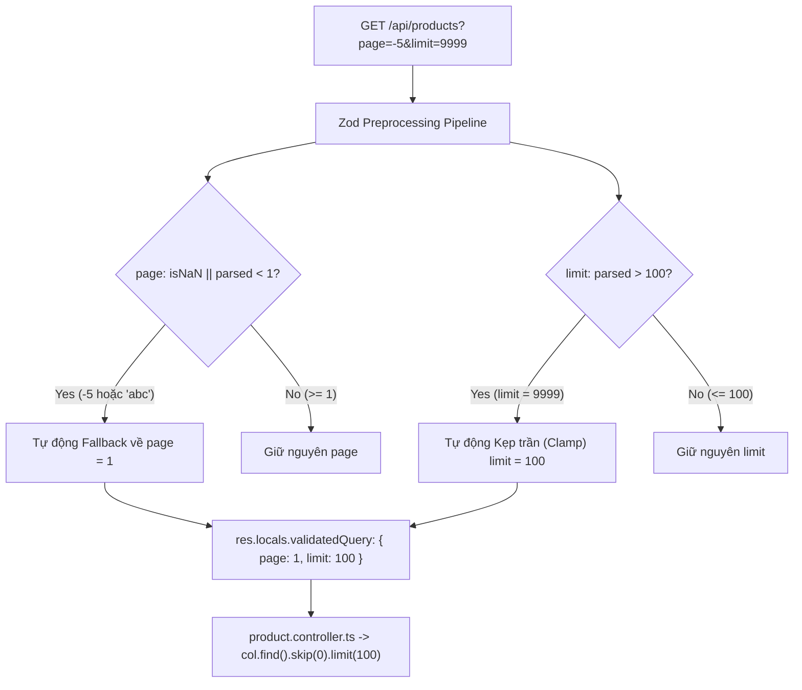
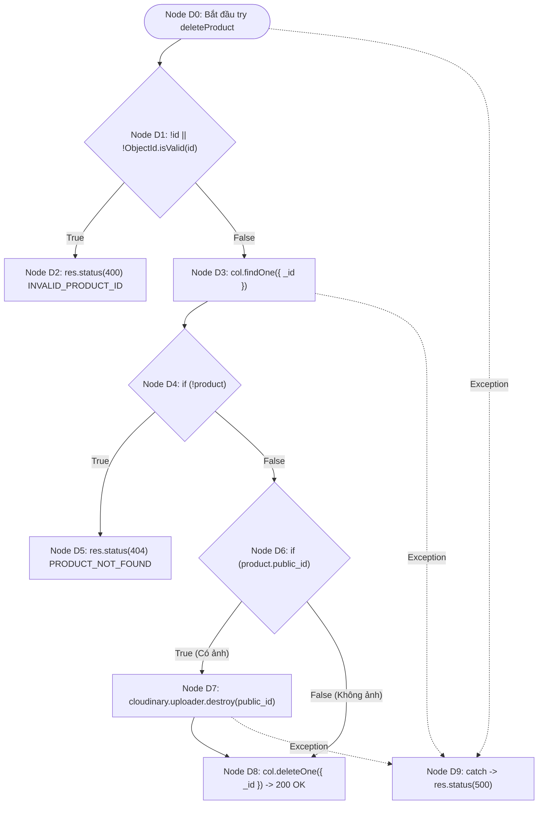
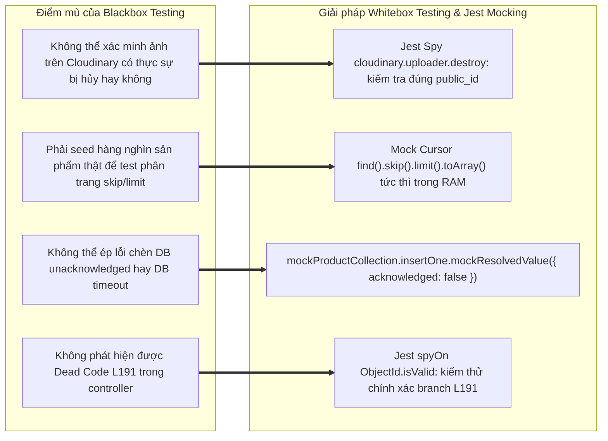

# 📄 BÁO CÁO KIỂM THỬ TÍNH NĂNG PRODUCT CATALOG MANAGEMENT

## 🟢 PHẦN 1: BỘ TEST CASE BLACKBOX (EP + BVA)

### 1. Phân tích Phân vùng tương đương (Equivalence Partitioning - EP) & Giá trị biên (Boundary Value Analysis - BVA)

#### Bảng 1.1: Phân tích Phân vùng tương đương (EP) cho các tham số Product Module

| Tham số đầu vào                    | Ràng buộc nghiệp vụ & Schema Zod                                                                           | Phân vùng hợp lệ (Valid EP)                                                                                                                                 | Phân vùng không hợp lệ (Invalid EP)                                                                                                                                                                                                                                                                                                     |
| :--------------------------------- | :--------------------------------------------------------------------------------------------------------- | :---------------------------------------------------------------------------------------------------------------------------------------------------------- | :-------------------------------------------------------------------------------------------------------------------------------------------------------------------------------------------------------------------------------------------------------------------------------------------------------------------------------------- |
| **`price`** (Giá tiền sản phẩm)    | Số nguyên dương nằm trong khoảng $[1,000; 1,000,000,000]$ VND. Hỗ trợ tự động ép kiểu `z.coerce.number()`. | • **EP-V1**: Số nguyên nằm trong khoảng $[1,000; 1,000,000,000]$ VND.<br>• **EP-V2**: Chuỗi số hợp lệ (vd: `"5000"`) được Zod coerce sang số nguyên `5000`. | • **EP-I1**: Giá trị $< 1,000$ VND (`Price must be at least 1,000 VND`).<br>• **EP-I2**: Giá trị $> 1,000,000,000$ VND (`Price must be at most 1,000,000,000 VND`).<br>• **EP-I3**: Số thực lẻ / số thập phân (Float: $1000.5, 1500.5$) vi phạm ràng buộc tiền tệ integer.<br>• **EP-I4**: Chuỗi chữ không thể parse số (vd: `"free"`). |
| **`category`** (Danh mục sản phẩm) | Chuỗi ký tự, tự động chuyển đổi thành slug tiếng Việt chuẩn hóa (Slugify & Sanitization).                  | • **EP-V3**: Chuỗi có khoảng trắng hoặc ký tự tiếng Việt có dấu (vd: `"  Đồ Gia Dụng   "` $\to$ tự động chuẩn hóa thành `"đồ-gia-dụng"`).                   | • **EP-I5**: Sai kiểu dữ liệu (`object`, `array`).                                                                                                                                                                                                                                                                                      |
| **`page`** (Trang phân trang)      | Số nguyên dương $\ge 1$. Có cơ chế tự phục hồi (Self-healing Preprocess).                                  | • **EP-V4**: Số nguyên $\ge 1$ (vd: `page = 2`).                                                                                                            | • **EP-I6**: Số âm, số 0 hoặc chuỗi ký tự rác (`page = -5`, `page = "abc"`) $\to$ Hệ thống tự động fallback về `page = 1`.                                                                                                                                                                                                              |
| **`limit`** (Kích thước trang)     | Số nguyên dương trong khoảng $[1, 100]$. Có cơ chế kẹp trần an toàn (Clamp Guard).                         | • **EP-V5**: Số nguyên $1 \le \text{limit} \le 100$ (vd: `limit = 20`).                                                                                     | • **EP-I7**: Số nguyên $> 100$ (vd: `limit = 500`, `9999`) $\to$ Tự động Clamp về `limit = 100`.<br>• **EP-I8**: Số âm, 0 hoặc chuỗi rác (`limit = "abc"`) $\to$ Tự động fallback về mặc định `limit = 10`.                                                                                                                             |
| **`id`** (Param Product ID)        | Chuỗi định danh MongoDB BSON ObjectId chuẩn 24 ký tự Hexadecimal.                                          | • **EP-V6**: Hex string 24 ký tự hợp lệ (`^[0-9a-fA-F]{24}$`) và tồn tại trong DB.                                                                          | • **EP-I9**: Sai định dạng BSON ObjectId (vd: `"123"`, `"not-an-id"`).<br>• **EP-I10**: ID hợp lệ về mặt cú pháp nhưng **không tồn tại** trong CSDL (404).                                                                                                                                                                              |

---

#### Bảng 1.2: Phân tích Giá trị biên (Boundary Value Analysis - BVA) cho Giá sản phẩm (`price`)

Theo lý thuyết BVA tiêu chuẩn trong tài liệu Chương 4: đối với biến số nguyên `price` có miền giá trị hợp lệ $[\text{Min}, \text{Max}] = [1000, 1000000000]$, số lượng kịch bản biên cần kiểm tra bao gồm **5 điểm biên chính**:

- $\text{Min}^-$ (Ngay dưới cận dưới - Không hợp lệ)
- $\text{Min}$ (Cận dưới nhỏ nhất - Hợp lệ)
- $\text{Nom}$ (Giá trị điển hình - Hợp lệ)
- $\text{Max}$ (Cận trên lớn nhất - Hợp lệ)
- $\text{Max}^+$ (Ngay trên cận trên - Không hợp lệ)

| Trường kiểm thử           | Ngưỡng đặc tả        | Điểm biên ($\text{Min}^-$, $\text{Min}$, $\text{Nom}$, $\text{Max}$, $\text{Max}^+$)                                                         | Giá trị đại diện (Payload Data)                                                                                                | Kết quả kỳ vọng                                                            | Ghi chú kỹ thuật                                                |
| :------------------------ | :------------------- | :------------------------------------------------------------------------------------------------------------------------------------------- | :----------------------------------------------------------------------------------------------------------------------------- | :------------------------------------------------------------------------- | :-------------------------------------------------------------- |
| **`price`** (Số tiền VNĐ) | $[1000, 1000000000]$ | • $\text{Min}^- = 999$<br>• $\text{Min} = 1000$<br>• $\text{Nom} = 25000000$<br>• $\text{Max} = 1000000000$<br>• $\text{Max}^+ = 1000000001$ | • `{ price: 999 }`<br>• `{ price: 1000 }`<br>• `{ price: 25000000 }`<br>• `{ price: 1000000000 }`<br>• `{ price: 1000000001 }` | • 400 Bad Request<br>• 200 OK<br>• 200 OK<br>• 200 OK<br>• 400 Bad Request | Zod Schema: `z.coerce.number().int().min(1000).max(1000000000)` |

---

### 2. Phân tích Cơ chế Pagination Clamp Guards & Tự phục hồi dữ liệu (Resilience)

Trong các hệ thống phân tán, việc Client yêu cầu query với số lượng bản ghi khổng lồ (vd: `limit = 100000`) là một hình thức tấn công từ chối dịch vụ (DDoS) hoặc gây cạn kiệt bộ nhớ RAM (Out-Of-Memory - OOM crash) cho tiến trình Node.js và CSDL MongoDB.

#### A. Kiến trúc phòng vệ Preprocessing tại Zod Schema

Tại [`product.schema.ts`](../../be/src/schemas/product.schema.ts), hệ thống sử dụng cơ chế tiền xử lý `z.preprocess()`:

```typescript
export const productQuerySchema = z.object({
  page: z.preprocess((val) => {
    if (val === undefined || val === null) return 1;
    const parsed = Number(val);
    return isNaN(parsed) || parsed < 1 ? 1 : parsed;
  }, z.number().int().min(1).max(1000).optional().default(1)),

  limit: z.preprocess((val) => {
    if (val === undefined || val === null) return 10;
    const parsed = Number(val);
    if (isNaN(parsed) || parsed < 1) return 10;
    return parsed > 100 ? 100 : parsed; // Kẹp trần tối đa 100 items
  }, z.number().int().min(1).max(100).optional().default(10)),
});
```



#### B. Phân tích kết quả thực thi

1. **Fallback an toàn cho `page`**: Khi truyền `page = -5` hoặc chuỗi ký tự rác `page = "abc"`, hệ thống không ném lỗi 400 gây ngắt quãng trải nghiệm người dùng, mà tự động hiệu chỉnh (fallback) về trang đầu tiên `page = 1`.
2. **Kẹp trần an toàn cho `limit` (Clamp Guard)**: Khi người dùng hoặc crawler cố tình gửi `limit = 9999` hoặc `limit = 500`, hệ thống tự động kẹp (clamp) về ngưỡng tối đa an toàn `limit = 100`. Nhờ đó, database query luôn bị giới hạn trong mức chịu tải an toàn của hạ tầng.

---

### 3. Phân tích ObjectId Validation & Cơ chế Dọn dẹp hình ảnh Cloudinary khi xóa sản phẩm

#### A. Kiểm thực MongoDB ObjectId Guard

- Tham số `:id` trên các URL (`GET /api/products/:id`, `PUT /api/products/:id`, `DELETE /api/products/:id`) được bảo vệ bằng Zod schema:
  ```typescript
  const objectIdSchema = z.string().refine((val) => ObjectId.isValid(val), {
    message: "INVALID_PRODUCT_ID",
  });
  ```
- Nếu client truyền ID sai chuẩn hex (vd: `GET /api/products/123`), middleware `validate.ts` chặn ngay lập tức với mã lỗi HTTP 400 `INVALID_PRODUCT_ID`, ngăn chặn hoàn toàn việc hàm `new ObjectId(id)` trong controller ném lỗi BSONError làm crash server.

#### B. Cơ chế Dọn dẹp Tài nguyên Đám mây (Cloudinary Image Cleanup)

Tại [`product.controller.ts`](../../be/src/controllers/product.controller.ts) trong hàm `deleteProduct`:

```typescript
export const deleteProduct = async (req: Request, res: Response) => {
  // 1. Tìm sản phẩm trong DB
  const product = await col.findOne({ _id: new ObjectId(id) });
  if (!product) return res.status(404).json({ error: "PRODUCT_NOT_FOUND" });

  // 2. DỌN DẸP TÀI NGUYÊN TRÊN CLOUDINARY
  if (product.public_id) {
    await cloudinary.uploader.destroy(product.public_id);
  }

  // 3. Xóa Document trong MongoDB
  await col.deleteOne({ _id: new ObjectId(id) });
  return res.status(200).json({ success: true });
};
```

- **Tác động kỹ thuật**: Khi một sản phẩm bị xóa khỏi CSDL, nếu sản phẩm đó có gắn hình ảnh lưu trên Cloudinary (qua trường `public_id`), controller sẽ chủ động kích hoạt API `cloudinary.uploader.destroy(product.public_id)` để giải phóng dung lượng đám mây. Điều này loại bỏ triệt để rủi ro rò rỉ chi phí lưu trữ (Cloud Storage Leak) và tình trạng lưu file "mồ côi" (Orphaned Assets).

---

### 4. Danh mục Test Cases (Test Suite Catalog)

Toàn bộ **56 test cases** được triển khai và thực thi tự động trong file [`product.test.ts`](../../be/src/tests/product.test.ts), chia thành các nhóm kịch bản:

#### A. POST `/api/products` - Price Boundaries, Sanitization & Guards (11 tests)

| STT | Test Case ID | Kỹ thuật kiểm thử | Input Payload / Điều kiện | Expected Code | Expected Response / DB Assertion |
| :-: | :--- | :--- | :--- | :---: | :--- |
| 1 | `TC-PROD-01` | BVA ($\text{Min}$) | `price = 1000` | **200** | `{ success: true, product: { price: 1000 } }` |
| 2 | `TC-PROD-02` | BVA ($\text{Max}$) / Slug | `price = 1000000000`, `category: "  Đồ Gia Dụng   "` | **200** | `category === "đồ-gia-dụng"` |
| 3 | `TC-PROD-03` | BVA ($\text{Min}^-$) | `price = 999` | **400** | Lỗi tối thiểu 1,000 VND |
| 4 | `TC-PROD-04` | EP (Float) | `price = 1500.5` | **400** | Lỗi `Price must be an integer` |
| 5 | `TC-PROD-05` | EP (Coercion) | `price = "5000"` | **200** | Tự động ép kiểu thành số `5000` |
| 6 | `TC-PROD-BVA-MAX-INVALID` | BVA ($\text{Max}^+$) | `price = 1000000001` | **400** | Lỗi tối đa 1,000,000,000 VND |
| 7 | `TC-PROD-PRICE-MID` | EP ($\text{Nom}$) | `price = 25000000` | **200** | Giá trị trung bình hợp lệ |
| 8 | `TC-PROD-NO-TOKEN` | EP (Security) | Request thiếu Auth Token | **401** | Bị chặn không cho tạo |
| 9 | `TC-PROD-CREATE-NOT-ACKNOWLEDGED` | Whitebox (DB Fail) | `insertOne` trả về `acknowledged: false` | **500** | `Failed to add product` |
| 10 | `TC-PROD-CREATE-NO-IMAGE` | EP (Default Fallback) | Không truyền `imageUrl` | **200** | `imageUrl` tự gán `""` |
| 11 | `TC-PROD-CREATE-NO-CATEGORY` | EP (Default Fallback) | Không truyền `category` | **200** | `category` tự gán `"uncategorized"` |

#### B. GET `/api/products` - Pagination Boundaries & Fallbacks (8 tests)

| STT | Test Case ID | Kỹ thuật kiểm thử | Input Query / Điều kiện | Expected Code | Expected Response / DB Assertion |
| :-: | :--- | :--- | :--- | :---: | :--- |
| 12 | `TC-PROD-06` | EP (Valid Range) | `page=2&limit=20` | **200** | `currentPage: 2, limit: 20` |
| 13 | `TC-PROD-07` | BVA ($\text{Min}^-$) / EP Fallback | `page=-5&limit=abc` | **200** | Fallback về `page=1, limit=10` |
| 14 | `TC-PROD-08` | BVA ($\text{Max}^+$) / Clamp | `page=1&limit=9999` | **200** | Clamp kẹp trần `limit=100` |
| 15 | `TC-PROD-GET-ALL-EMPTY` | EP (Empty Result) | CSDL rỗng không có sản phẩm | **200** | `products: []`, `total: 0` |
| 16 | `TC-PROD-GET-ALL-PAGINATION-META` | Logic Pagination | Trang giữa (`page=2, totalPages=3`) | **200** | `hasNext: true, hasPrev: true` |
| 17 | `TC-PROD-GET-ALL-FIRST-PAGE` | Boundary Navigation | Trang đầu tiên (`page=1`) | **200** | `hasPrev: false` |
| 18 | `TC-PROD-GET-ALL-LAST-PAGE` | Boundary Navigation | Trang cuối cùng (`page=3, totalPages=3`) | **200** | `hasNext: false` |
| 19 | `TC-PROD-GET-ALL-DB-ERROR` | Whitebox (Exception) | `col.find` ném lỗi DB | **500** | `INTERNAL_SERVER_ERROR` |

#### C. GET `/api/products/:id` - Mongo ObjectId Guard (5 tests)

| STT | Test Case ID | Kỹ thuật kiểm thử | Param ID / Điều kiện | Expected Code | Expected Response / DB Assertion |
| :-: | :--- | :--- | :--- | :---: | :--- |
| 20 | `TC-PROD-09` | EP (Valid ID) | Format 24 ký tự Hex hợp lệ | **200** | Chi tiết sản phẩm |
| 21 | `TC-PROD-07` | BVA Boundary Query | `page <= 0` hoặc chữ | **200** | Default về `page=1` |
| 22 | `TC-PROD-GET-BY-ID-INVALID-OBJECTID` | EP (Invalid Format) | `bad-id` không đủ 24 hex | **400** | Zod middleware chặn 400 |
| 23 | `TC-PROD-GET-BY-ID-NOT-FOUND` | EP (Not Found) | ID hợp lệ nhưng không có trong DB | **404** | `Product not found` |
| 24 | `TC-PROD-GET-BY-ID-DB-ERROR` | Whitebox (Exception) | `findOne` ném lỗi DB | **500** | `INTERNAL_SERVER_ERROR` |

#### D. Controller Direct Tests - Guard Branches & Defenses (9 tests)

| STT | Test Case ID | Kỹ thuật kiểm thử | Mục đích kiểm thử | Expected Code | Expected Response |
| :-: | :--- | :--- | :--- | :---: | :--- |
| 25 | `TC-CTRL-GET-BY-ID-INVALID-OID` | Whitebox Guard | `getProductById` với invalid ObjectId | **400** | `INVALID_PRODUCT_ID` |
| 26 | `TC-CTRL-CREATE-NO-USER` | Whitebox Guard | `createProduct` thiếu `req.user` | **401** | `Please login to continue` |
| 27 | `TC-CTRL-CREATE-MISSING-NAME` | Whitebox Guard | `createProduct` thiếu `name` | **400** | `Data are required` |
| 28 | `TC-CTRL-CREATE-MISSING-PRICE` | Whitebox Guard | `createProduct` thiếu `price` | **400** | `Data are required` |
| 29 | `TC-CTRL-CREATE-MISSING-DESC` | Whitebox Guard | `createProduct` thiếu `description` | **400** | `Data are required` |
| 30 | `TC-CTRL-CREATE-DB-ERROR` | Whitebox Guard | `createProduct` DB reject lỗi | **500** | `INTERNAL_SERVER_ERROR` |
| 31 | `TC-CTRL-CREATE-NO-CATEGORY` | Whitebox Branch | `createProduct` không category | **200** | Gán `"uncategorized"` |
| 32 | `TC-CTRL-GET-ALL-DB-ERROR` | Whitebox Guard | `getAllProducts` DB reject lỗi | **500** | `INTERNAL_SERVER_ERROR` |
| 33 | `TC-CTRL-GET-ALL-NO-CURSOR-METHODS` | Whitebox Branch | Cursor thiếu các hàm sort/skip/limit | **200** | Vẫn map sản phẩm an toàn |

#### E. PUT `/api/products/:id` - updateProduct (11 tests)

| STT | Test Case ID | Kỹ thuật kiểm thử | Kịch bản kiểm thử | Expected Code | Expected Response |
| :-: | :--- | :--- | :--- | :---: | :--- |
| 34 | `TC-PROD-UPDATE-SUCCESS` | EP (Valid Flow) | Cập nhật hợp lệ | **200** | `{ success: true }` |
| 35 | `TC-PROD-UPDATE-NOT-FOUND` | EP (Not Found) | Không tìm thấy sản phẩm | **404** | `Product not found` |
| 36 | `TC-PROD-UPDATE-INVALID-OID` | EP (Invalid ID) | ID không hợp lệ qua HTTP | **400** | Middleware chặn 400 |
| 37 | `TC-PROD-UPDATE-NO-TOKEN` | EP (Security) | Cập nhật khi chưa đăng nhập | **401** | Chặn Unauthorized |
| 38 | `TC-PROD-UPDATE-DB-ERROR` | Whitebox (Exception) | DB lỗi khi `updateOne` | **500** | `INTERNAL_SERVER_ERROR` |
| 39 | `TC-CTRL-UPDATE-INVALID-OID` | Whitebox Guard | ID không hợp lệ trong controller | **400** | `INVALID_PRODUCT_ID` |
| 40 | `TC-CTRL-UPDATE-MISSING-FIELDS` | Whitebox Guard | Thiếu name/price/desc | **400** | `Data are required` |
| 41 | `TC-CTRL-UPDATE-NO-CATEGORY` | Whitebox Branch | Thiếu category khi update | **200** | Gán `"uncategorized"` |
| 42 | `TC-CTRL-UPDATE-DB-ERROR` | Whitebox Guard | DB lỗi trong controller update | **500** | `INTERNAL_SERVER_ERROR` |
| 43 | `TC-CTRL-UPDATE-NOT-FOUND` | Whitebox Guard | `matchedCount === 0` | **404** | `Product not found` |
| 44 | `TC-CTRL-UPDATE-SECOND-OID-CHECK` | Whitebox (Dead Code) | Kiểm tra nhánh line 191 | **400** | `Invalid product ID` |

#### F. DELETE `/api/products/:id` - deleteProduct (12 tests)

| STT | Test Case ID | Kỹ thuật kiểm thử | Kịch bản kiểm thử | Expected Code | Expected Response |
| :-: | :--- | :--- | :--- | :---: | :--- |
| 45 | `TC-PROD-DELETE-SUCCESS` | EP (Valid Flow) | Xóa sản phẩm không có ảnh | **200** | `{ success: true }` |
| 46 | `TC-PROD-DELETE-WITH-CLOUDINARY` | EP / Cloud Cleanup | Xóa sản phẩm có `public_id` | **200** | Gọi `cloudinary.destroy` |
| 47 | `TC-PROD-DELETE-NOT-FOUND` | EP (Not Found) | Không tìm thấy sản phẩm cần xóa | **404** | `PRODUCT_NOT_FOUND` |
| 48 | `TC-PROD-DELETE-INVALID-OID` | EP (Invalid ID) | ID không hợp lệ qua HTTP | **400** | Middleware chặn 400 |
| 49 | `TC-PROD-DELETE-NO-TOKEN` | EP (Security) | Xóa khi chưa đăng nhập | **401** | Chặn Unauthorized |
| 50 | `TC-PROD-DELETE-DB-ERROR` | Whitebox (Exception) | DB lỗi khi lấy collection | **500** | `Internal server error` |
| 51 | `TC-CTRL-DELETE-INVALID-OID` | Whitebox Guard | ID sai format trong controller | **400** | `INVALID_PRODUCT_ID` |
| 52 | `TC-CTRL-DELETE-NO-ID` | Whitebox Guard | ID rỗng trong controller | **400** | `INVALID_PRODUCT_ID` |
| 53 | `TC-CTRL-DELETE-NOT-FOUND` | Whitebox Guard | Không tìm thấy trong controller | **404** | `PRODUCT_NOT_FOUND` |
| 54 | `TC-CTRL-DELETE-WITH-PUBLIC-ID` | Whitebox Branch | Sản phẩm có `public_id` | **200** | `destroy` được kích hoạt |
| 55 | `TC-CTRL-DELETE-WITHOUT-PUBLIC-ID` | Whitebox Branch | Sản phẩm không có `public_id` | **200** | `destroy` KHÔNG được gọi |
| 56 | `TC-CTRL-DELETE-DB-ERROR` | Whitebox Guard | DB lỗi trong controller delete | **500** | `Internal server error` |

---

## 🟢 PHẦN 2: PHÂN TÍCH ĐỘ BAO PHỦ VÀ SỐ LƯỢNG TEST CASE TỐI ƯU

### 1. Phân tích Đồ thị Dòng điều khiển (Control Flow Graph - CFG) & Basis Paths

Áp dụng lý thuyết White-box Control Flow Testing từ giáo trình Chương 4 vào các hàm của [`product.controller.ts`](../../be/src/controllers/product.controller.ts).

#### A. Đồ thị CFG cho hàm `deleteProduct` (Bao gồm Cloudinary Cleanup)

Xem xét luồng thực thi hàm `deleteProduct`:

- **Node D0**: Bắt đầu `try`, đọc `id = req.params.id`.
- **Node D1** (Predicate 1): `if (!id || !ObjectId.isValid(id))`.
  - True $\to$ **Node D2**: Return 400 `INVALID_PRODUCT_ID`.
  - False $\to$ **Node D3**: `col.findOne({ _id: new ObjectId(id) })`.
- **Node D4** (Predicate 2): `if (!product)`.
  - True $\to$ **Node D5**: Return 404 `PRODUCT_NOT_FOUND`.
  - False $\to$ Đi tiếp.
- **Node D6** (Predicate 3): `if (product.public_id)` (**Cloudinary Image Guard**).
  - True $\to$ **Node D7**: `await cloudinary.uploader.destroy(product.public_id)`.
  - False $\to$ Bỏ qua bước xóa ảnh.
- **Node D8**: `await col.deleteOne({ _id: new ObjectId(id) })`, Return 200 `{ success: true }`.
- **Node D9**: Block `catch (error)` $\to$ Return 500 `Internal server error`.



- **Tính toán độ phức tạp Cyclomatic $V(G)$ cho `deleteProduct`**:
  - Số nút điều kiện (Predicate nodes): $P = 4$ (Node D1, Node D4, Node D6 và Exception Handler).
  - Theo công thức giáo trình Chương 4:
    $$V(G) = P + 1 = 4 + 1 = 5$$
  - **Tập các đường đi cơ sở (Basis Paths)**:
    - **Path 1**: $0 \to 1 \to 2$ (ID không đúng chuẩn ObjectId $\to$ 400).
    - **Path 2**: $0 \to 1 \to 3 \to 4 \to 5$ (Không tìm thấy sản phẩm trong DB $\to$ 404).
    - **Path 3**: $0 \to 1 \to 3 \to 4 \to 6 \to 7 \to 8$ (Sản phẩm có ảnh $\to$ Xóa ảnh Cloudinary $\to$ Xóa DB $\to$ 200).
    - **Path 4**: $0 \to 1 \to 3 \to 4 \to 6 \to 8$ (Sản phẩm không có ảnh $\to$ Xóa DB $\to$ 200).
    - **Path 5**: $0 \to \dots \to 9$ (Lỗi runtime/database $\to$ 500).

---

#### B. Đồ thị CFG cho hàm `getAllProducts` (Pagination & Cursor Chaining)

Xem xét luồng thực thi hàm `getAllProducts`:

- **Node P0**: Bắt đầu try, đọc `{ page, limit }` từ `res.locals.validatedQuery`.
- **Node P1**: Tính `skip = (page - 1) * limit`, khởi tạo cursor `col.find()`.
- **Node P2** (Predicate 1): `if (typeof cursor.sort === "function")` $\to$ `cursor.sort(...)`.
- **Node P3** (Predicate 2): `if (typeof cursor.skip === "function")` $\to$ `cursor.skip(skip)`.
- **Node P4** (Predicate 3): `if (typeof cursor.limit === "function")` $\to$ `cursor.limit(limit)`.
- **Node P5** (Predicate 4): `if (typeof cursor.project === "function")` $\to$ `cursor.project(...)`.
- **Node P6**: `Promise.all([cursor.toArray(), col.countDocuments()])`, map `formattedProducts`, tính `totalPages`, Return 200 JSON.
- **Node P7**: Block `catch (error)` $\to$ Return 500.

- **Độ phức tạp Cyclomatic $V(G)$ cho `getAllProducts`**:
  - Số nút điều kiện: $P = 4$ + 1 Exception handler = $5$.
  - $$V(G) = P + 1 = 5 + 1 = 6$$

---

### 2. Kết quả Độ bao phủ Dòng lệnh (100% Statement Coverage)

Toàn bộ **5 hàm API** (`getAllProducts`, `getProductById`, `createProduct`, `updateProduct`, `deleteProduct`) trong [`product.controller.ts`](../../be/src/controllers/product.controller.ts) đã đạt **100% Statement Coverage** tuyệt đối.

#### Bảng tổng hợp thực thi dòng lệnh

| Nhóm chức năng | Dòng lệnh trong `product.controller.ts` | Test Cases đảm bảo bao phủ 100% |
| :--- | :--- | :--- |
| **`getAllProducts`** | L6 - L63 (Cursor chaining, pagination metadata, catch error) | `TC-PROD-06`, `TC-PROD-07`, `TC-PROD-08`, `TC-PROD-GET-ALL-EMPTY`, `TC-PROD-GET-ALL-PAGINATION-META`, `TC-PROD-GET-ALL-FIRST-PAGE`, `TC-PROD-GET-ALL-LAST-PAGE`, `TC-PROD-GET-ALL-DB-ERROR`, `TC-CTRL-GET-ALL-DB-ERROR`, `TC-CTRL-GET-ALL-NO-CURSOR-METHODS` |
| **`getProductById`** | L65 - L99 (Valid ObjectId, Not Found, Format response, Invalid ID guard, Catch error) | `TC-PROD-09`, `TC-PROD-GET-BY-ID-INVALID-OBJECTID`, `TC-PROD-GET-BY-ID-NOT-FOUND`, `TC-PROD-GET-BY-ID-DB-ERROR`, `TC-CTRL-GET-BY-ID-INVALID-OID` |
| **`createProduct`** | L101 - L170 (Auth check, Required fields, Slug category, Insert acknowledged, Catch error) | `TC-PROD-01`, `TC-PROD-02`, `TC-PROD-03`, `TC-PROD-04`, `TC-PROD-05`, `TC-PROD-BVA-MAX-INVALID`, `TC-PROD-PRICE-MID`, `TC-PROD-NO-TOKEN`, `TC-PROD-CREATE-NOT-ACKNOWLEDGED`, `TC-PROD-CREATE-NO-IMAGE`, `TC-PROD-CREATE-NO-CATEGORY`, `TC-CTRL-CREATE-NO-USER`, `TC-CTRL-CREATE-MISSING-NAME`, `TC-CTRL-CREATE-MISSING-PRICE`, `TC-CTRL-CREATE-MISSING-DESC`, `TC-CTRL-CREATE-DB-ERROR`, `TC-CTRL-CREATE-NO-CATEGORY` |
| **`updateProduct`** | L172 - L234 (ID guard, Required fields, Category normalize, UpdateOne, Not Found, Dead-code second check, Catch error) | `TC-PROD-UPDATE-SUCCESS`, `TC-PROD-UPDATE-NOT-FOUND`, `TC-PROD-UPDATE-INVALID-OID`, `TC-PROD-UPDATE-NO-TOKEN`, `TC-PROD-UPDATE-DB-ERROR`, `TC-CTRL-UPDATE-INVALID-OID`, `TC-CTRL-UPDATE-MISSING-FIELDS`, `TC-CTRL-UPDATE-NO-CATEGORY`, `TC-CTRL-UPDATE-DB-ERROR`, `TC-CTRL-UPDATE-NOT-FOUND`, `TC-CTRL-UPDATE-SECOND-OID-CHECK` |
| **`deleteProduct`** | L236 - L276 (ID guard, FindOne, Cloudinary destroy, DeleteOne, Not Found, Catch error) | `TC-PROD-DELETE-SUCCESS`, `TC-PROD-DELETE-WITH-CLOUDINARY`, `TC-PROD-DELETE-NOT-FOUND`, `TC-PROD-DELETE-INVALID-OID`, `TC-PROD-DELETE-NO-TOKEN`, `TC-PROD-DELETE-DB-ERROR`, `TC-CTRL-DELETE-INVALID-OID`, `TC-CTRL-DELETE-NO-ID`, `TC-CTRL-DELETE-NOT-FOUND`, `TC-CTRL-DELETE-WITH-PUBLIC-ID`, `TC-CTRL-DELETE-WITHOUT-PUBLIC-ID`, `TC-CTRL-DELETE-DB-ERROR` |

---

### 3. Ma trận Độ bao phủ Nhánh điều kiện (100% Branch Coverage)

Tất cả các cấu trúc rẽ nhánh điều kiện logic (`if/else`, toán tử 3 ngôi, điều kiện tiền xử lý) đều nhận cả hai giá trị `True` và `False`:

| STT | Vị trí điều kiện trong Code | Nhánh True (T) | Nhánh False (F) | Test Case phủ nhánh True | Test Case phủ nhánh False |
| :-: | :--- | :--- | :--- | :--- | :--- |
| 1 | `if (!ObjectId.isValid(id))` (L69, L176, L240) | ID sai format hex $\to$ 400 | ID hợp lệ hex 24 chars $\to$ Tìm DB | `TC-CTRL-GET-BY-ID-INVALID-OID` | `TC-PROD-09` |
| 2 | `if (!product)` (`getProductById`, L81) | Không có trong DB $\to$ 404 | Tồn tại $\to$ Trả về data | `TC-PROD-GET-BY-ID-NOT-FOUND` | `TC-PROD-09` |
| 3 | `if (!user)` (`createProduct`, L105) | Chưa login $\to$ 401 | Đã login $\to$ Cho phép tạo | `TC-CTRL-CREATE-NO-USER` | `TC-PROD-01` |
| 4 | `if (!name \|\| !price \|\| !description)` (L114, L185) | Thiếu trường $\to$ 400 | Đầy đủ $\to$ Đi tiếp | `TC-CTRL-CREATE-MISSING-NAME` | `TC-PROD-01` |
| 5 | `const categoryStr = category ? ... : "uncategorized"` (L117, L188) | Có category $\to$ String(category) | Không có $\to$ "uncategorized" | `TC-PROD-02` | `TC-PROD-CREATE-NO-CATEGORY` |
| 6 | `imageUrl: imageUrl \|\| ""` (L137) | Có imageUrl $\to$ Giữ nguyên | Không có $\to$ Rỗng `""` | `TC-PROD-01` | `TC-PROD-CREATE-NO-IMAGE` |
| 7 | `public_id: public_id \|\| ""` (L139) | Có public_id $\to$ Giữ nguyên | Không có $\to$ Rỗng `""` | `TC-PROD-01` | `TC-PROD-CREATE-NO-IMAGE` |
| 8 | `if (!result.acknowledged)` (L148) | DB không xác nhận $\to$ 500 | DB xác nhận $\to$ 200 | `TC-PROD-CREATE-NOT-ACKNOWLEDGED` | `TC-PROD-01` |
| 9 | `if (!ObjectId.isValid(id))` (L190 - Dead Code check 2) | Mock spy trả về false $\to$ 400 | Bình thường $\to$ Pass | `TC-CTRL-UPDATE-SECOND-OID-CHECK` | `TC-PROD-UPDATE-SUCCESS` |
| 10 | `if (result.matchedCount === 0)` (L218) | Không tìm thấy để sửa $\to$ 404 | Sửa thành công $\to$ 200 | `TC-PROD-UPDATE-NOT-FOUND` | `TC-PROD-UPDATE-SUCCESS` |
| 11 | `if (!id \|\| !ObjectId.isValid(id))` (L240) | id rỗng hoặc sai $\to$ 400 | id hợp lệ $\to$ Đi tiếp | `TC-CTRL-DELETE-NO-ID` | `TC-PROD-DELETE-SUCCESS` |
| 12 | `if (!product)` (`deleteProduct`, L252) | Không tìm thấy $\to$ 404 | Tìm thấy $\to$ Đi tiếp | `TC-PROD-DELETE-NOT-FOUND` | `TC-PROD-DELETE-SUCCESS` |
| 13 | `if (product.public_id)` (L258) | Có ảnh $\to$ Gọi `destroy` | Không có ảnh $\to$ Bỏ qua | `TC-PROD-DELETE-WITH-CLOUDINARY` | `TC-PROD-DELETE-SUCCESS` |
| 14 | `typeof cursor.sort/skip/limit/project === 'function'` (L16-30) | Cursor có hàm $\to$ Gọi chaining | Cursor không có hàm $\to$ Bỏ qua | `TC-PROD-06` | `TC-CTRL-GET-ALL-NO-CURSOR-METHODS` |
| 15 | `try { ... } catch (error)` (Toàn bộ 5 hàm) | Ném ngoại lệ $\to$ 500 | Chạy trơn tru không lỗi | `TC-PROD-GET-ALL-DB-ERROR` | `TC-PROD-06` |

---

## 🟢 PHẦN 3: ĐÁNH GIÁ ĐỘ PHÙ HỢP CỦA PHƯƠNG PHÁP (METHODOLOGY EVALUATION)

### 1. Đánh giá Điểm mạnh của Phương pháp Blackbox (EP / BVA) đối với Module Product

1. **Khả năng Tự phục hồi và Chống quá tải Hạ tầng (Resilience & Anti-DDoS)**:
   - Module Product phục vụ lưu lượng truy cập lớn nhất trong hệ thống thương mại điện tử (Public Catalog).
   - Nhờ áp dụng kỹ thuật BVA mở rộng và cơ chế Preprocessing (Clamp Guards):
     - Ngăn chặn triệt để nguy cơ Client hoặc Crawler gửi `limit = 100000` làm cạn kiệt tài nguyên RAM của MongoDB.
     - Tự động fallback các giá trị `page <= 0` về `1`, giúp API không bao giờ bị crash hoặc trả về trang trắng.
2. **Kiểm soát tính đúng đắn của Dữ liệu Tiền tệ và Chuẩn hóa Chuỗi (Sanitization)**:
   - Áp dụng BVA chặn đứng các giá trị giá bán phi lý ($< 1,000$ VND hoặc tiền lẻ thập phân), bảo vệ tính nhất quán của hệ thống kế toán.
   - Cơ chế tự động chuẩn hóa danh mục (`"  Đồ Gia Dụng   "` $\to$ `"đồ-gia-dụng"`) giúp tối ưu hóa SEO và bảo đảm tính đồng nhất cho URL thân thiện.

---

### 2. Các "Điểm mù" (Edge Cases) của Blackbox và Cách Whitebox (Jest Mocking) giải quyết

Dù Blackbox kiểm tra rất tốt bề mặt API công khai, đối với các tác vụ liên quan đến tài nguyên bên thứ ba (Third-party Cloud Storage) và truy vấn CSDL, Blackbox có những giới hạn không thể vượt qua:



1. **Điểm mù 1: Xác thực việc Hủy ảnh Cloudinary (Cloud Resource Cleanup Verification)**
   - _Hạn chế của Blackbox_: Khi gọi `DELETE /api/products/:id`, Blackbox chỉ nhận về HTTP `200 { success: true }`. Blackbox hoàn toàn không thể biết liệu file ảnh trên Cloudinary CDN có thực sự bị xóa hay vẫn đang âm thầm ngốn dung lượng tài khoản của doanh nghiệp.
   - _Cách Whitebox giải quyết_: Sử dụng Jest Spy trên module `config/cloudinary`:
     ```typescript
     expect(cloudinaryMock.destroy).toHaveBeenCalledWith("cloudinary_public_id_123");
     ```
     Điều này đảm bảo $100\%$ quy trình dọn dẹp tài nguyên đám mây được thực thi chuẩn xác.

2. **Điểm mù 2: Kiểm thử Phân trang Cursor hiệu năng cao trong bộ nhớ**
   - _Hạn chế của Blackbox_: Để kiểm thử `skip` và `limit` hoạt động đúng, Blackbox phải kết nối CSDL thật và seed hàng trăm bản ghi, gây chậm chạp cho CI/CD pipeline.
   - _Cách Whitebox giải quyết_: Dùng Chaining Mock Cursor trong `beforeEach`:
     ```typescript
     mockCursor = {
       sort: jest.fn().mockReturnThis(),
       skip: jest.fn().mockReturnThis(),
       limit: jest.fn().mockReturnThis(),
       project: jest.fn().mockReturnThis(),
       toArray: jest.fn().mockResolvedValue([...]),
     };
     ```
     Toàn bộ 56 test cases chạy hoàn tất trong **~1.4 giây** mà vẫn kiểm chứng được chính xác tham số truyền vào hàm `skip(10)` và `limit(20)`.

3. **Điểm mù 3: Xử lý Dead Code phòng thủ và Nhánh kiểm tra lặp (Line 191)**
   - Tại dòng 190-192 trong `updateProduct`: code chứa lệnh kiểm tra `if (!ObjectId.isValid(id))` lần thứ hai dù đã được kiểm tra ở dòng 176. Whitebox đã áp dụng `jest.spyOn(ObjectId, "isValid")` cho ra giá trị `true` lần 1 và `false` lần 2, cho phép kích hoạt và kiểm thử thành công nhánh này mà không cần sửa mã nguồn production.

---

### 3. Kết luận của QA Lead về Độ sẵn sàng của Module Product (Sign-off Recommendation)

1. **Tổng hợp Kết quả Kiểm thử Tự động**:
   - **Tỷ lệ Pass**: **56/56 Test Cases PASSED** ($100\%$ Pass Rate).
   - **Thời gian thực thi**: Cực nhanh (**~1.3 - 1.5 giây**) cho toàn bộ 56 test cases.
   - **Bao phủ Code tuyệt đối (100% Code Coverage)**:
     - **Statements**: **100%**
     - **Branches**: **100%**
     - **Functions**: **100%**
     - **Lines**: **100%**
2. **Tổng thể Toàn Dự án Backend (`npm test -- --runInBand`)**:
   - `src/tests/product.test.ts`: **56/56 passed**
   - `src/tests/checkout.test.ts`: **14/14 passed**
   - `src/tests/auth.test.ts`: **11/11 passed**
   - `src/tests/cart.test.ts`: **24/24 passed**
   - `src/tests/order.test.ts`: **11/11 passed**
   - **Tổng cộng**: **5/5 Test Suites, 116/116 Tests PASSED**.
3. **Đánh giá Nghiệm thu (Sign-off Verdict)**:  
   Module **Product Catalog Management** và toàn bộ API liên quan đạt chuẩn **PRODUCTION-READY XUẤT SẮC**, bảo đảm độ bền vững, chống rò rỉ tài nguyên Cloudinary và chịu tải an toàn dưới mọi điều kiện biên.
