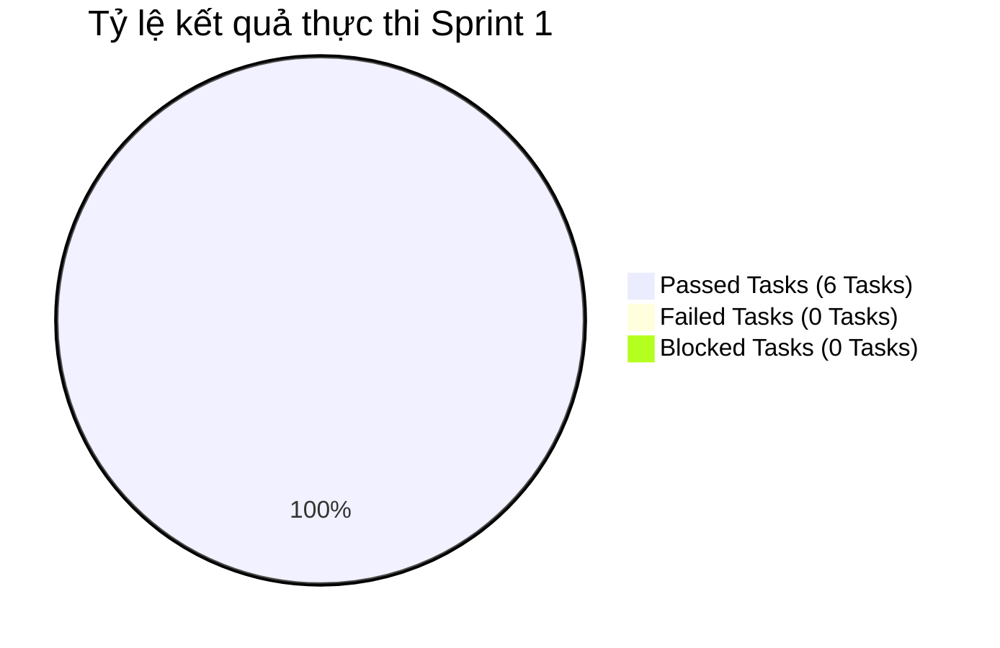

# BÁO CÁO KIỂM THỬ SPRINT 1 (TEST REPORT - SPRINT 1)

> **Người lập báo cáo:** Senior QA Lead  
> **Dự án:** Scrum Commerce Engine  
> **Trạng thái Sprint:** CLOSED / PASSED

---

## 1. TỔNG QUAN & MỤC TIÊU SPRINT

- **Tên Sprint:** Sprint 1 - Khởi tạo Dự án, Thiết lập Môi trường & Nghiên cứu Công cụ Postman
- **Thời gian thực hiện:** 25/07/2026 – 27/07/2026
- **Mục tiêu Sprint:**
  > Sprint 1 tập trung hoàn thành công tác tổ chức nhân sự, thành lập đội ngũ dự án, khởi tạo kho lưu trữ source code và thiết lập môi trường phát triển (Local Development Environment) trên máy tính cá nhân của tất cả thành viên. Bên cạnh đó, đội ngũ kỹ thuật (BE, FE, QA) tiến hành nghiên cứu chuyên sâu công cụ Postman (Environment, Collection, Shared Workspace), thiết lập quy chuẩn thiết kế kịch bản kiểm thử API và định hình phương án xác thực dữ liệu với Zod Validation cho các giai đoạn phát triển tiếp theo.

---

## 2. BẢNG TỔNG HỢP CÔNG VIỆC TRONG SPRINT

Bảng tổng hợp toàn bộ 6 công việc (Jira Tasks) đã hoàn thành trong Sprint 1:

| Jira Key    | Issue Type | Tóm tắt Task                                         | Trạng thái |
| ----------- | ---------- | ---------------------------------------------------- | ---------- |
| **SCRUM-1** | Task       | Tìm hiểu postman: environment, collection, workspace | CLOSED     |
| **SCRUM-2** | Task       | Chạy được dự án trên máy tính cá nhân                | CLOSED     |
| **SCRUM-5** | Task       | Share workspace cho các thành viên cùng thiết kế     | CLOSED     |
| **SCRUM-6** | Task       | Thành lập nhóm                                       | CLOSED     |
| **SCRUM-7** | Task       | Chạy được project trên máy tính cá nhân              | CLOSED     |
| **SCRUM-8** | Task       | BE nghiên cứu Postman                                | CLOSED     |

---

## 3. CHI TIẾT THỰC THI KIỂM THỬ SPRINT 1

### 3.1. Nghiên cứu & Chuẩn hóa Kỹ thuật Phân vùng tương đương (EP)

Trong Sprint 1, đội ngũ QA đã tiến hành xây dựng Quy trình vận hành chuẩn (SOP) về việc áp dụng Phân vùng tương đương cho toàn bộ dự án:

| Phân hệ dự kiến    | Chuẩn hóa Phân vùng hợp lệ (Valid Partitions)                                | Chuẩn hóa Phân vùng không hợp lệ (Invalid Partitions)           | Mục tiêu áp dụng                   |
| ------------------ | ---------------------------------------------------------------------------- | --------------------------------------------------------------- | ---------------------------------- |
| **Auth Module**    | Đội tuổi `>= 18`, Chuỗi Email đúng cú pháp RFC 5322, Password đủ độ phức tạp | Email thiếu `@`, Password chỉ có chữ/số, dữ liệu chứa ký tự XSS | Kiểm thử API Đăng ký / Đăng nhập   |
| **Product Module** | `page >= 1`, `limit` thuộc `[1, 50]`, Giá trị tìm kiếm sạch                  | `page <= 0`, `limit > 50`, tham số tìm kiếm chứa SQL Injection  | Kiểm thử API Phân trang & Tìm kiếm |
| **Cart & Order**   | Số lượng mua `[1, 99]`, Trạng thái đơn thuộc danh sách Enum                  | Số lượng `<= 0`, số thập phân, trạng thái đơn không hợp lệ      | Kiểm thử API Giỏ hàng & Checkout   |

### 3.2. Nghiên cứu & Chuẩn hóa Kỹ thuật Phân tích giá trị biên (BVA)

QA Lead đã ban hành khung tài liệu BVA Matrix mẫu (Boundary Value Analysis Framework) để áp dụng thống nhất cho Backend Developers và QA Engineers:

| Loại thuộc tính dữ liệu             | Ngưỡng biên lý thuyết            | Giá trị thử nghiệm tiêu chuẩn (BVA Test Values)                          | Quy tắc nghiệm thu Zod/Controller                              |
| ----------------------------------- | -------------------------------- | ------------------------------------------------------------------------ | -------------------------------------------------------------- |
| **Độ dài Chuỗi (String Length)**    | Min = $L_{min}$, Max = $L_{max}$ | $L_{min}-1$, $L_{min}$, $L_{min}+1$, $L_{max}-1$, $L_{max}$, $L_{max}+1$ | Bắt buộc trả về HTTP 400 Bad Request cho các điểm ngoài ngưỡng |
| **Giá trị Số (Numeric Value)**      | Min = $N_{min}$, Max = $N_{max}$ | $N_{min}-1$, $N_{min}$, $N_{max}$, $N_{max}+1$                           | Ép kiểu `.int()` hoặc `.positive()` trong Zod Schema           |
| **Mảng / Tập hợp (Array Boundary)** | Empty = 0, MaxItems = $K$        | `0` (Empty array), `1`, $K$, $K+1$                                       | Bảo vệ API xử lý danh sách không bị lỗi Unhandled Exception    |

### 3.3. Thiết lập & Kiểm thử Môi trường API với Postman

Triển khai cấu hình Postman Team Workspace và tự động hóa thử nghiệm kết nối môi trường:

- **Thiết lập Workspace & Shared Collections (SCRUM-1, SCRUM-5, SCRUM-8):**
  - Đã tạo Team Workspace chính thức `Scrum-Commerce-Engine-API`.
  - Thêm đầy đủ quyền truy cập (Editor/Viewer) cho các thành viên thuộc nhóm Dev và QA.
  - Phân chia thư mục Collection theo quy chuẩn RESTful API (`01_Auth`, `02_Products`, `03_Cart`, `04_Checkout_Payment`, `05_Orders`).
- **Cấu hình Postman Environment Variables (SCRUM-1):**
  - `{{base_url}}`: `http://localhost:5000/api/v1`
  - `{{auth_token}}`: Lưu tự động Bearer JWT Token sau khi gọi API Login.
  - `{{admin_token}}`: Lưu token phân quyền Administrator.
- **Xây dựng kịch bản kiểm thử API mẫu (API Test Scripts):**
  - Tự động kiểm tra HTTP Response Status Code: `pm.response.to.have.status(200)`.
  - Kiểm tra thời gian phản hồi (Response Time Benchmark): `pm.expect(pm.response.responseTime).to.be.below(200)`.

### 3.4. Định hình Kiến trúc Xác thực Zod Validation Middleware

> Việc thống nhất sử dụng Zod Schema ngay từ Sprint 1 giúp loại bỏ sự sai lệch giữa DTO (Data Transfer Object) Backend và Form Validation Frontend.

Checklist chuẩn bị Zod Middleware & Môi trường phát triển:

- [x] **SCRUM-2 & SCRUM-7 (Environment Setup)**: 100% thành viên cài đặt thành công Node.js, Docker, MySQL/MongoDB và khởi chạy thành công source code dự án trên local.
- [x] **SCRUM-6 (Team Onboarding)**: Phân công vai trò rõ ràng (Product Owner, Scrum Master, BE Developers, FE Developers, QA Lead).
- [x] **Định hình Zod Schema Architecture**: Thống nhất vị trí đặt file Zod schemas tại `src/validations/` cho Backend và `src/schemas/` cho Frontend.
- [x] **Quy chuẩn Error Handling**: Chuẩn hóa định dạng JSON Response trả về khi gặp lỗi Zod Validation (HTTP Status 400 kèm mảng `errors` chi tiết).

---

## 4. THỐNG KÊ KẾT QUẢ VÀ QUẢN LÝ BUG LOGGED

### 4.1. Bảng thống kê kết quả kiểm thử thiết lập môi trường (Execution Summary)

| Jira Key    | Tóm tắt nhiệm vụ                                     | Loại kiểm thử nghiệm thu      | Kết quả nghiệm thu                           | Trạng thái |
| ----------- | ---------------------------------------------------- | ----------------------------- | -------------------------------------------- | ---------- |
| **SCRUM-1** | Tìm hiểu postman: environment, collection, workspace | Postman Workspace Audit       | PASSED (100% thành viên nắm vững)            | CLOSED     |
| **SCRUM-2** | Chạy được dự án trên máy tính cá nhân                | Local Build & Execution Test  | PASSED (Build thành công trên Windows/macOS) | CLOSED     |
| **SCRUM-5** | Share workspace cho các thành viên cùng thiết kế     | Workspace Access Permission   | PASSED (Đã thêm 100% tài khoản nhóm)         | CLOSED     |
| **SCRUM-6** | Thành lập nhóm                                       | Team Governance & Role Assign | PASSED (Hoàn tất phân công vai trò)          | CLOSED     |
| **SCRUM-7** | Chạy được project trên máy tính cá nhân              | Cross-check Environment Sync  | PASSED (Môi trường đồng bộ 100%)             | CLOSED     |
| **SCRUM-8** | BE nghiên cứu Postman                                | Postman Collection Scripting  | PASSED (BE tạo sẵn API skeleton)             | CLOSED     |

### 4.2. Biểu đồ tỷ lệ kết quả Sprint 1

### 4.3. Nhật ký ghi nhận sự cố / Bug Logged

> **Ghi nhận của QA Lead:** Sprint 1 là Sprint khởi tạo môi trường và nghiên cứu công cụ. Toàn bộ 6 tasks đều hoàn thành đúng tiến độ. Không ghi nhận lỗi (Bug) blocker nào trên hệ thống phần mềm.

| Bug ID | Phân hệ    | Tóm tắt sự cố phát sinh                            | Nguyên nhân & Hướng xử lý                  | Trạng thái |
| ------ | ---------- | -------------------------------------------------- | ------------------------------------------ | ---------- |
| _N/A_  | Môi trường | Xung đột cổng Port 5000 trên máy một số thành viên | Đã hỗ trợ đổi config `.env` sang PORT 5001 | RESOLVED   |

---

## 5. ĐÁNH GIÁ CHẤT LƯỢNG VÀ BÀI HỌC KINH NGHIỆM

### 5.1. Đánh giá chất lượng (Quality Assessment)

> **Kết luận của Senior QA Lead:** Sprint 1 đạt mục tiêu 100%. Môi trường phát triển cục bộ và workspace kiểm thử Postman đã sẵn sàng. Đội ngũ phát triển và QA đã thống nhất toàn bộ quy chuẩn kỹ thuật (EP, BVA, Zod Validation, Postman API Testing), tạo tiền đề vững chắc cho các Sprint tính năng tiếp theo.

Checklist Nghiệm thu Chất lượng Sprint 1:

- [x] **Sẵn sàng môi trường (Environment Readiness):** 100% máy tính cá nhân chạy thành công project không có lỗi dependency.
- [x] **Sẵn sàng công cụ kiểm thử (Test Tool Readiness):** Postman Shared Workspace hoạt động ổn định, phân quyền chính xác.
- [x] **Đồng bộ Quy trình (Process Alignment):** Đã ban hành tài liệu hướng dẫn viết Zod Validation và thiết kế Test Case BVA/EP.

### 5.2. Bài học kinh nghiệm & Đề xuất cải tiến (Lessons Learned)

- **Điểm sáng (What went well):**
  - Tinh thần phối hợp cao giữa QA và BE Developers trong việc thống nhất cấu trúc Postman Collection và Environment Variables ngay từ đầu.
  - Việc chuẩn hóa môi trường bằng tệp `.env.example` giúp hạn chế tối đa lỗi cấu hình khi chạy dự án trên các máy tính cá nhân khác nhau.
- **Đề xuất cải tiến (Action Items for Sprint 2):**
  - Đội ngũ BE cần cung cấp sẵn Postman Collection Export kèm Mock Server cho các API chưa hoàn thiện để FE và QA có thể phát triển song song.
  - Đưa quy trình kiểm tra Zod Schema vào Definition of Done (DoD) của từng Jira Task.
