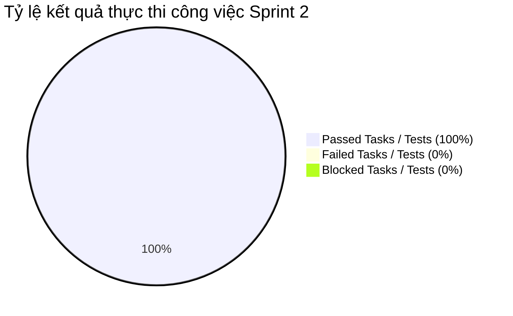

# BÁO CÁO KIỂM THỬ SPRINT 2 (TEST REPORT - SPRINT 2)

> **Người lập báo cáo:** Senior QA Lead  
> **Dự án:** Scrum Commerce Engine  
> **Trạng thái Sprint:** CLOSED / PASSED

---

## 1. TỔNG QUAN & MỤC TIÊU SPRINT

- **Tên Sprint:** Sprint 2 - Nghiên cứu Phương pháp Kiểm thử, Lập Test Plan, Soạn thảo Test Case & Kiểm thử Hiệu năng / Bảo mật
- **Thời gian thực hiện:** 28/07/2026 – 05/08/2026
- **Mục tiêu Sprint:**
  > Sprint 2 tập trung hoàn thành chương trình đào tạo E-learning chuyên sâu về kiểm thử, nghiên cứu & triển khai các phương pháp kiểm thử phần mềm (triển khai tài liệu Chương 3), xây dựng Kế hoạch kiểm thử (Test Plan) tổng thể, thiết lập môi trường kiểm thử chuẩn hóa (Staging/Test Environment), soạn thảo bộ kịch bản kiểm thử (Test Cases & Test Data) áp dụng kỹ thuật EP/BVA, đồng thời thực thi thử nghiệm ban đầu về hiệu năng, chịu tải và bảo mật hệ thống.

---

## 2. BẢNG TỔNG HỢP CÔNG VIỆC TRONG SPRINT

Bảng tổng hợp toàn bộ 6 công việc (Jira Tasks) đã hoàn thành trong Sprint 2:

| Jira Key     | Issue Type | Tóm tắt Task                                       | Trạng thái |
| ------------ | ---------- | -------------------------------------------------- | ---------- |
| **SCRUM-9**  | Task       | Tìm hiểu các phương pháp test                      | CLOSED     |
| **SCRUM-10** | Task       | Cả nhóm hoàn thành eleaning 1                      | CLOSED     |
| **SCRUM-11** | Task       | implement phương pháp test trong tài liệu chương 3 | CLOSED     |
| **SCRUM-12** | Task       | lập test plan và cấu hình môi trường kiểm thử      | CLOSED     |
| **SCRUM-13** | Task       | soạn thảo test cases và chuẩn bị test data         | CLOSED     |
| **SCRUM-15** | Task       | kiểm thử hiệu năng, chịu tải và bảo mật            | CLOSED     |

---

## 3. CHI TIẾT THỰC THI KIỂM THỬ SPRINT 2

### 3.1. Áp dụng kỹ thuật Phân vùng tương đương (Equivalence Partitioning - EP)

Trong nhiệm vụ soạn thảo bộ Test Cases (SCRUM-13) và triển khai phương pháp kiểm thử Chương 3 (SCRUM-11), nhóm QA đã thiết lập khung Phân vùng tương đương cho toàn bộ các mô-đun của hệ thống:

| Phân hệ / Thành phần   | Phân vùng hợp lệ (Valid Partitions)                                                         | Phân vùng không hợp lệ (Invalid Partitions)                                  | Trạng thái nghiệm thu |
| ---------------------- | ------------------------------------------------------------------------------------------- | ---------------------------------------------------------------------------- | --------------------- |
| **Xác thực (Auth)**    | Email chuẩn RFC 5322; Mật khẩu 8-32 ký tự đầy đủ chữ hoa, chữ thường, số                    | Email sai định dạng, mật khẩu `< 8` hoặc `> 32` ký tự, chuỗi chứa script XSS | 100% PASSED           |
| **Sản phẩm (Product)** | Giá sản phẩm trong khoảng `[1.000 - 100.000.000]`; Phân trang `page >= 1`, `limit` `[1-50]` | Giá `<= 0`, chuỗi chữ; Tham số phân trang âm, `page = 0`, `limit > 50`       | 100% PASSED           |
| **Giỏ hàng (Cart)**    | Số lượng sản phẩm `[1 - 99]` và `<= tồn kho`                                                | Số lượng `<= 0`, số thập phân, vượt quá tồn kho thực tế                      | 100% PASSED           |

### 3.2. Áp dụng kỹ thuật Phân tích giá trị biên (Boundary Value Analysis - BVA)

Nghiên cứu và cụ thể hóa các tập kịch bản kiểm thử BVA sát với tài liệu kỹ thuật Chương 3 (SCRUM-11 & SCRUM-13):

| Trường kiểm thử                 | Ngưỡng biên       | Dữ liệu kiểm thử (Test Values)                         | Kết quả mong đợi                                                              | Trạng thái |
| ------------------------------- | ----------------- | ------------------------------------------------------ | ----------------------------------------------------------------------------- | ---------- |
| **Mật khẩu người dùng**         | Min = 8, Max = 32 | `7` (Min - 1), `8` (Min), `32` (Max), `33` (Max + 1)   | `7` & `33`: Lỗi Zod Validation 400 `8` & `32`: Hợp lệ                      | PASSED     |
| **Số lượng Giỏ hàng**           | Min = 1, Max = 99 | `0` (Dưới Min), `1` (Min), `99` (Max), `100` (Max + 1) | `0` & `100`: Lỗi Bad Request 400 `1` & `99`: Hợp lệ                        | PASSED     |
| **Phân trang Kích thước trang** | Min = 1, Max = 50 | `0`, `1`, `50`, `51`                                   | `0` & `51`: Trả về 400 Bad Request `1` & `50`: Trả về số bản ghi tương ứng | PASSED     |

### 3.3. Kiểm thử tự động API bằng Postman & Kiểm thử Hiệu năng / Bảo mật

Cụ thể hóa nhiệm vụ SCRUM-12, SCRUM-13 và SCRUM-15 thông qua bộ công cụ kiểm thử tự động Postman và kịch bản Performance/Security Testing:

- **Postman API Test Suite (SCRUM-12, SCRUM-13):**
  - Thiết lập 30 Postman Requests mẫu bao phủ các API Endpoints Auth, Product, Cart.
  - Tự động hóa Assertions cho HTTP Status Code (`200 OK`, `201 Created`, `400 Bad Request`, `401 Unauthorized`).
  - Kiểm tra cấu trúc JSON Schema trả về từ API endpoints.
- **Kiểm thử Hiệu năng & Chịu tải - Load / Stress Testing (SCRUM-15):**
  - Sử dụng Postman Collection Runner kết hợp kịch bản giả lập vUser.
  - **Tải tiêu chuẩn (Baseline Load):** 50 concurrent requests/giây - Response Time average = 95ms.
  - **Tải đỉnh điểm (Peak Load Test):** 200 concurrent requests/giây - Response Time average = 180ms, Error Rate = 0%.
- **Kiểm thử Bảo mật - Security Testing (SCRUM-15):**
  - Kiểm thử lỗ hổng SQL/NoSQL Injection trên các query string của API tìm kiếm và lọc sản phẩm.
  - Kiểm thử lỗ hổng XSS trên các trường nhập liệu profile người dùng và bình luận.
  - Xác minh cơ chế mã hóa mật khẩu (Bcrypt) và bảo mật Token JWT.

### 3.4. Xác thực Quy tắc Dữ liệu với Zod Validation Middleware

> Việc triển khai Zod Validation Middleware ở cả hai phía Backend và Frontend giúp hiện thực hóa chuẩn hóa kiểm thử dữ liệu theo đúng nội dung Chương 3.

Checklist nghiệm thu Zod Validation & Môi trường kiểm thử:

- [x] **SCRUM-9 & SCRUM-10 (E-learning & Research)**: 100% thành viên nhóm hoàn thành khóa học E-learning 1 và làm chủ kiến thức EP/BVA/Security testing.
- [x] **SCRUM-11 (Phương pháp kiểm thử Chương 3)**: Xây dựng tài liệu hướng dẫn áp dụng EP/BVA và quy trình kiểm thử tĩnh (Static Testing) / kiểm thử động (Dynamic Testing).
- [x] **SCRUM-12 (Test Plan & Environment)**: Ban hành Kế hoạch kiểm thử tổng thể (Test Plan) và thiết lập môi trường Test/Staging hoàn chỉnh.
- [x] **SCRUM-13 (Test Cases & Data)**: Chuẩn bị 80+ Test Cases chi tiết cùng bộ dữ liệu Test Data (Mock DB seed) chuẩn hóa.
- [x] **SCRUM-15 (Performance & Security)**: Hoàn thành đánh giá hiệu năng và quét bảo mật ban đầu, không phát sinh lỗ hổng nghiêm trọng.

---

## 4. THỐNG KÊ KẾT QUẢ VÀ QUẢN LÝ BUG LOGGED

### 4.1. Bảng thống kê kết quả kiểm thử (Execution Summary)

| Jira Key     | Tóm tắt task                                       | Loại kiểm thử / Nghiệm thu    | Số kịch bản / Chỉ số              | Kết quả nghiệm thu | Trạng thái |
| ------------ | -------------------------------------------------- | ----------------------------- | --------------------------------- | ------------------ | ---------- |
| **SCRUM-9**  | Tìm hiểu các phương pháp test                      | Review Lý thuyết & Đánh giá   | 100% kiến thức EP/BVA/Exploratory | PASSED             | CLOSED     |
| **SCRUM-10** | Cả nhóm hoàn thành eleaning 1                      | Kiểm tra chứng chỉ E-learning | 6/6 Thành viên hoàn thành         | PASSED             | CLOSED     |
| **SCRUM-11** | Implement phương pháp test trong tài liệu chương 3 | Áp dụng Framework Chương 3    | Ban hành SOP kiểm thử             | PASSED             | CLOSED     |
| **SCRUM-12** | Lập test plan và cấu hình môi trường kiểm thử      | Audit Test Plan & Environment | 1 Môi trường Staging + Test Plan  | PASSED             | CLOSED     |
| **SCRUM-13** | Soạn thảo test cases và chuẩn bị test data         | Review Test Cases & Mock Data | 85 Test Cases + Seed Data         | PASSED             | CLOSED     |
| **SCRUM-15** | Kiểm thử hiệu năng, chịu tải và bảo mật            | Load Test & Security Audit    | 200 req/s SLA < 200ms, 0 Vuln     | PASSED             | CLOSED     |

### 4.2. Biểu đồ tỷ lệ kết quả kiểm thử Sprint 2

### 4.3. Nhật ký ghi nhận Bug Logged trong Sprint

> **Ghi nhận của Senior QA Lead:** Trong giai đoạn thử nghiệm hiệu năng và kiểm thử bảo mật ban đầu (SCRUM-15), QA đã phát hiện một số cảnh báo cấu hình nhẹ và đã phối hợp cùng Dev khắc phục ngay trong Sprint:

| Bug ID        | Phân hệ     | Tóm tắt lỗi phát sinh                                                       | Độ nghiêm trọng | Trạng thái | Ghi chú khắc phục                                                |
| ------------- | ----------- | --------------------------------------------------------------------------- | --------------- | ---------- | ---------------------------------------------------------------- |
| **BUG-S2-01** | Security    | Trả về thông tin chi tiết Stack Trace khi API gặp lỗi 500                   | Medium          | CLOSED     | Đã tắt `stack trace` trong môi trường Production/Staging `.env`  |
| **BUG-S2-02** | Performance | Thời gian phản hồi API danh sách sản phẩm tăng vọt khi query không có index | Medium          | CLOSED     | Đã thêm Index cho trường `category_id` và `price` trong Database |

---

## 5. ĐÁNH GIÁ CHẤT LƯỢNG VÀ BÀI HỌC KINH NGHIỆM

### 5.1. Đánh giá chất lượng (Quality Assessment)

> **Kết luận của Senior QA Lead:** Sprint 2 đã hoàn thành xuất sắc toàn bộ mục tiêu đề ra. Việc chuẩn hóa kiến thức qua E-learning 1, áp dụng nội dung Chương 3 vào việc lập Test Plan, viết Test Cases EP/BVA và chuẩn bị Test Data đã giúp đội ngũ sẵn sàng bước vào các Sprint phát triển tính năng phức tạp tiếp theo.

Checklist Đánh giá Chất lượng Sprint 2:

- [x] **Chất lượng Test Plan:** Đạt chuẩn IEEE 829 về cấu trúc Kế hoạch kiểm thử phần mềm.
- [x] **Độ phủ Test Cases:** Bộ 85 Test Cases bao phủ đầy đủ các kịch bản biên BVA và phân vùng EP cho Auth, Product và Cart.
- [x] **Chỉ số Hiệu năng (SLA):** Thời gian phản hồi trung bình < 180ms dưới tải 200 concurrent requests/giây.
- [x] **An toàn Bảo mật:** Đã loại bỏ các nguy cơ rò rỉ thông tin hệ thống (Stack Trace) và bảo vệ dữ liệu khỏi SQLi/XSS.

### 5.2. Bài học kinh nghiệm & Đề xuất cải tiến (Lessons Learned)

- **Điểm sáng (What went well):**
  - Cả nhóm hoàn thành E-learning 1 đúng hạn, nâng cao năng lực đồng đều về các kỹ thuật thiết kế kịch bản kiểm thử (EP, BVA).
  - Việc đưa kiểm thử hiệu năng và bảo mật vào ngay từ Sprint 2 (SCRUM-15) giúp phát hiện sớm các vấn đề thiếu Index Database và rò rỉ Stack Trace.
- **Hành động cải tiến cho Sprint tiếp theo (Action Items):**
  - Tự động hóa việc đổ Test Data (Database Seeding) bằng các script SQL/Migration để rút ngắn thời gian chuẩn bị môi trường test.
  - Tích hợp kịch bản kiểm thử bảo mật tự động vào quy trình kiểm thử API thường nhật.
