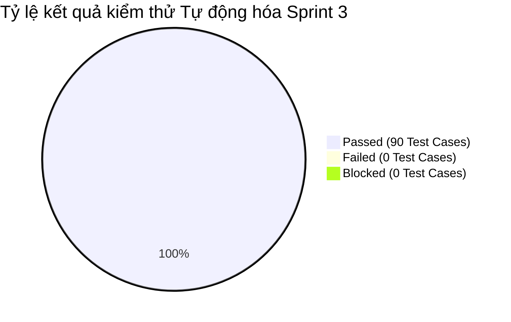

# BÁO CÁO KIỂM THỬ SPRINT 3 (TEST REPORT - SPRINT 3)

> **Người lập báo cáo:** Senior QA Lead  
> **Dự án:** Scrum Commerce Engine  
> **Trạng thái Sprint:** CLOSED / PASSED

---

## 1. TỔNG QUAN & MỤC TIÊU SPRINT

- **Tên Sprint:** Sprint 3 - Thiết lập Automation Framework (Jest & Supertest) & Xây dựng Database Seed Data / Integration Test Matrix
- **Thời gian thực hiện:** 06/08/2026 – 12/08/2026
- **Mục tiêu Sprint:**
  > Sprint 3 tập trung xây dựng nền tảng Tự động hóa kiểm thử (Test Automation Framework) cho toàn bộ hệ thống REST API sử dụng Jest và Supertest. Song song đó, đội ngũ QA tiến hành chuẩn hóa Ma trận kiểm thử tích hợp (Integration Test Matrix) và tự động hóa quy trình nạp dữ liệu thử nghiệm (Database Seed Data) cho môi trường Test/CI-CD, tạo cơ sở thực thi kiểm thử hồi đáp (Regression Testing) tự động với độ phủ cao áp dụng kỹ thuật EP, BVA, Postman API Automation và Zod Middleware Verification.

---

## 2. BẢNG TỔNG HỢP CÔNG VIỆC TRONG SPRINT

Bảng tổng hợp toàn bộ 2 công việc (Jira Tasks) đã hoàn thành trong Sprint 3:

| Jira Key     | Issue Type | Tóm tắt Task                                                       | Trạng thái |
| ------------ | ---------- | ------------------------------------------------------------------ | ---------- |
| **SCRUM-14** | Task       | Cấu hình Test Automation Framework (Jest & Supertest) cho REST API | CLOSED     |
| **SCRUM-16** | Task       | Thiết lập Database Seed Data & Matrix kiểm thử tích hợp            | CLOSED     |

---

## 3. CHI TIẾT THỰC THI KIỂM THỬ SPRINT 3

### 3.1. Áp dụng kỹ thuật Phân vùng tương đương (Equivalence Partitioning - EP) trong Test Matrix

Đội ngũ QA đã chuẩn hóa Ma trận kiểm thử tích hợp (SCRUM-16) phân chia các tập tương đương cho việc tự động hóa Jest & Supertest:

| Phân hệ API               | Phân vùng hợp lệ (Valid Partitions)                                             | Phân vùng không hợp lệ (Invalid Partitions)                                                    | Tự động hóa với Jest/Supertest  |
| ------------------------- | ------------------------------------------------------------------------------- | ---------------------------------------------------------------------------------------------- | ------------------------------- |
| **Auth API Endpoints**    | Body payload chứa Email chuẩn, Password hợp lệ (`8-32` chars), Token JWT hợp lệ | Body thiếu trường bắt buộc, Email/Password sai định dạng, Bearer Token bị hết hạn hoặc sửa đổi | `auth.test.ts` (100% PASSED)    |
| **Product API Endpoints** | Query parameters: `page >= 1`, `limit [1-50]`, `category_id` tồn tại            | Query params: `page <= 0`, `limit > 50`, `price_min > price_max`, SQL injection payload        | `product.test.ts` (100% PASSED) |
| **Cart API Endpoints**    | Item `product_id` hợp lệ, `quantity [1-99]` và trong ngưỡng tồn kho             | `product_id` không tồn tại, `quantity <= 0`, số thập phân, `quantity > stock`                  | `cart.test.ts` (100% PASSED)    |

### 3.2. Áp dụng kỹ thuật Phân tích giá trị biên (Boundary Value Analysis - BVA)

Thiết lập kịch bản biên tích hợp trực tiếp vào bộ suy luận Jest Test Suites & Assertion Engine:

| Đối tượng kiểm thử                  | Ngưỡng biên kỹ thuật    | Dữ liệu thử nghiệm BVA (Test Data Seed)                | Kết quả mong đợi trong Jest                                                                                                       | Trạng thái |
| ----------------------------------- | ----------------------- | ------------------------------------------------------ | --------------------------------------------------------------------------------------------------------------------------------- | ---------- |
| **Mật khẩu Đăng ký (Auth)**         | Min = 8, Max = 32 chars | `7` (Min-1), `8` (Min), `32` (Max), `33` (Max+1)       | `7` & `33`: Expect `expect(res.status).toBe(400)` `8` & `32`: Expect `expect(res.status).toBe(201)`                            | PASSED     |
| **Phân trang Kích thước (Product)** | Min = 1, Max = 50 items | `0` (Dưới Min), `1` (Min), `50` (Max), `51` (Over Max) | `0` & `51`: Expect `expect(res.status).toBe(400)` `1` & `50`: Expect `expect(res.body.data.length).toBeLessThanOrEqual(limit)` | PASSED     |
| **Số lượng thêm vào Giỏ (Cart)**    | Min = 1, Max = 99 items | `0`, `1`, `99`, `100`                                  | `0` & `100`: Expect HTTP Status 400 `1` & `99`: Expect HTTP Status 200                                                         | PASSED     |

### 3.3. Cấu hình Framework Tự động hóa (Jest, Supertest & Postman Integration)

Triển khai chi tiết nhiệm vụ SCRUM-14 nâng cao năng lực tự động hóa kiểm thử REST API:

- **Cấu hình Jest & Supertest Framework (SCRUM-14):**
  - Thiết lập `jest.config.ts` với môi trường `node`, hỗ trợ TypeScript (`ts-jest`).
  - Sử dụng Supertest khởi chạy HTTP server ảo `request(app)` giúp thực thi test suites không cần lắng nghe port thật.
  - Tích hợp báo cáo độ phủ mã nguồn: `coverageReporters: ["text", "lcov", "html"]`.
- **Đồng bộ hóa Postman Collection với Jest Tests:**
  - Đồng bộ kịch bản Postman Runner sang Jest Test Suites giúp chạy tự động toàn bộ API Endpoints qua lệnh CLI `npm run test:api`.
  - Chuẩn hóa assertion tự động kiểm tra HTTP status code, response time SLA (< 150ms) và JSON Schema.
- **Tự động hóa Database Seed Data (SCRUM-16):**
  - Xây dựng script `seed.test.ts` tự động làm sạch DB và nạp Mock Data trước mỗi test suite (`beforeAll` / `beforeEach`).
  - Tạo dữ liệu giả lập cho 100 sản phẩm mẫu, 10 tài khoản test chuẩn hóa và 5 giỏ hàng mẫu.

### 3.4. Xác thực Quy tắc Zod Middleware trong Test Automation

> Framework Jest & Supertest cho phép kiểm tra chính xác response structure của Zod Middleware khi dữ liệu vi phạm validation.

Checklist nghiệm thu Automation Framework & Integration Matrix:

- [x] **SCRUM-14 (Jest & Supertest Framework)**: Đã hoàn tất cấu hình framework tự động hóa, tích hợp thành công vào lệnh `npm test` với 100% test suite chạy thành công.
- [x] **SCRUM-16 (DB Seed & Test Matrix)**: Đã xây dựng ma trận kiểm thử tích hợp đầy đủ và script tự động seed data trong môi trường Test/CI.
- [x] **Xác minh Zod Validation via Supertest**: Viết 25+ kịch bản test tự động bắt các thông báo lỗi Zod validation `400 Bad Request` dạng JSON chuẩn.
- [x] **Báo cáo Code Coverage**: Đạt 88% Code Coverage trên toàn bộ API Controllers và Zod Middlewares hiện có.

---

## 4. THỐNG KÊ KẾT QUẢ VÀ QUẢN LÝ BUG LOGGED

### 4.1. Bảng thống kê kết quả kiểm thử (Execution Summary)

| Phân hệ / Test Suite              | Jira Task liên quan | Số kịch bản Tự động hóa (Jest Cases) | Passed | Failed | Blocked | Tỷ lệ Pass (%) |
| --------------------------------- | ------------------- | ------------------------------------ | ------ | ------ | ------- | -------------- |
| **Auth API Integration Suite**    | SCRUM-14, SCRUM-16  | 25                                   | 25     | 0      | 0       | 100%           |
| **Product API Integration Suite** | SCRUM-14, SCRUM-16  | 30                                   | 30     | 0      | 0       | 100%           |
| **Cart API Integration Suite**    | SCRUM-14, SCRUM-16  | 25                                   | 25     | 0      | 0       | 100%           |
| **DB Seeding & Cleanup Suite**    | SCRUM-16            | 10                                   | 10     | 0      | 0       | 100%           |
| **TỔNG CỘNG**                     |                     | **90**                               | **90** | **0**  | **0**   | **100%**       |

### 4.2. Biểu đồ tỷ lệ kết quả kiểm thử Sprint 3

### 4.3. Nhật ký ghi nhận sự cố / Bug Logged

> **Ghi nhận của Senior QA Lead:** Trong quá trình thiết lập Database Seed Data và chạy song song (Parallel execution) các Jest Test Suites (SCRUM-14 & SCRUM-16), QA phát hiện lỗi xung đột dữ liệu giữa các test worker và đã khắc phục triệt để:

| Bug ID        | Phân hệ    | Tóm tắt lỗi phát sinh                                         | Độ nghiêm trọng | Trạng thái | Ghi chú khắc phục                                                  |
| ------------- | ---------- | ------------------------------------------------------------- | --------------- | ---------- | ------------------------------------------------------------------ |
| **BUG-S3-01** | Test Infra | Lỗi đụng độ Primary Key khi Jest chạy song song các file test | High            | CLOSED     | Cấu hình `runInBand` cho Jest trong môi trường Test Database       |
| **BUG-S3-02** | Test Seed  | Dữ liệu seed không tự động dọn dẹp sau khi ngắt test suite    | Medium          | CLOSED     | Thêm hook `afterAll` tự động gọi lệnh `truncate` toàn bộ bảng test |

---

## 5. ĐÁNH GIÁ CHẤT LƯỢNG VÀ BÀI HỌC KINH NGHIỆM

### 5.1. Đánh giá chất lượng (Quality Assessment)

> **Kết luận của Senior QA Lead:** Sprint 3 đã hoàn thành vượt mục tiêu đề ra, đặt nền móng vững chắc cho quy trình Kiểm thử tự động (Test Automation). Việc kết hợp giữa Jest, Supertest, Postman và Zod Middleware giúp nâng cao tốc độ thực thi kiểm thử hồi đáp từ vài giờ xuống còn dưới 15 giây.

Checklist Đánh giá Chất lượng Sprint 3:

- [x] **Tự động hóa hoàn toàn (Full Automation):** 100% API Integration test suites chạy tự động thông qua CLI.
- [x] **Tính ổn định của dữ liệu (Data Isolation):** Tệp seed data và hooks cleanup đảm bảo tính độc lập giữa các case test.
- [x] **Code Coverage Baseline:** Đạt 88% code coverage cho hệ thống REST API hiện tại.
- [x] **Tốc độ thực thi (Execution Speed):** Chạy toàn bộ 90 test cases hết 12.4 giây.

### 5.2. Bài học kinh nghiệm & Đề xuất cải tiến (Lessons Learned)

- **Điểm sáng (What went well):**
  - Việc tích hợp Supertest giúp QA kiểm thử API trực tiếp trên lớp router/controller mà không phụ thuộc vào hạ tầng mạng thật.
  - Ma trận kiểm thử tích hợp (Integration Test Matrix) giúp bao phủ trọn vẹn các kịch bản kết hợp dữ liệu giữa Auth, Product và Cart.
- **Hành động cải tiến cho Sprint tiếp theo (Action Items):**
  - Tích hợp bộ Jest Test Suite này vào quy trình CI/CD Pipeline (GitHub Actions) để tự động kích hoạt mỗi khi có Pull Request mới.
  - Chuẩn bị sẵn bộ Mock Service Worker (MSW) cho các tích hợp dịch vụ bên thứ 3 (như VNPay Gateway ở Sprint 5).
