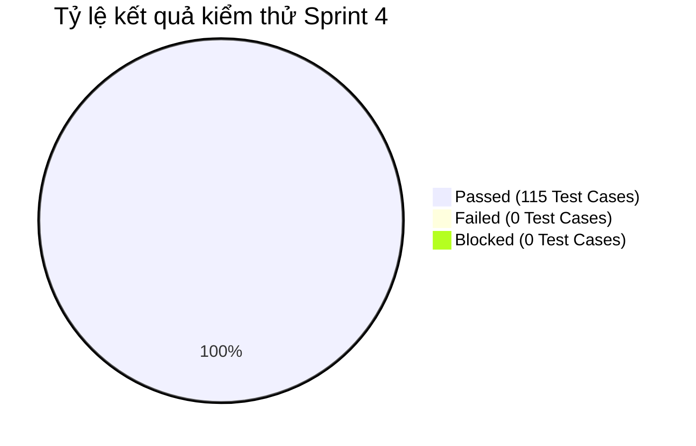

# BÁO CÁO KIỂM THỬ SPRINT 4 (TEST REPORT - SPRINT 4)

> **Dự án:** Scrum Commerce Engine  
> **Trạng thái Sprint:** CLOSED / PASSED

---

## 1. TỔNG QUAN & MỤC TIÊU SPRINT

- **Tên Sprint:** Sprint 4 - Xây dựng & Kiểm thử Hệ thống Xác thực (Auth), Quản lý Sản phẩm (Product) & Giỏ hàng (Cart)
- **Thời gian thực hiện:** 13/08/2026 – 18/08/2026
- **Mục tiêu Sprint:**
  > Sprint 4 tập trung triển khai và kiểm thử toàn diện các tính năng cốt lõi: Xác thực người dùng (Authentication), Quản lý CRUD Sản phẩm & Phân trang, cùng Nghiệp vụ Giỏ hàng. Đội ngũ QA chịu trách nhiệm xây dựng bộ kiểm thử áp dụng các kỹ thuật Phân vùng tương đương (EP), Phân tích giá trị biên (BVA), kiểm thử tự động API với Postman và xác minh các quy tắc kiểm soát dữ liệu đầu vào thông qua Zod Validation Middleware từ Backend đến Frontend.

---

## 2. BẢNG TỔNG HỢP CÔNG VIỆC TRONG SPRINT

Bảng dưới đây tổng hợp toàn bộ 9 công việc (Jira Tasks) đã hoàn thành trong Sprint 4:

| Jira Key     | Issue Type | Tóm tắt Task                                                                                     | Trạng thái |
| ------------ | ---------- | ------------------------------------------------------------------------------------------------ | ---------- |
| **SCRUM-17** | Task       | [BE] - Xác thực Zod Middleware & Tái cấu trúc trình xử lý xác thực                               | CLOSED     |
| **SCRUM-18** | Task       | [FE] - Giao diện người dùng xác thực biểu mẫu & Phản hồi theo thời gian thực cho Mô-đun xác thực | CLOSED     |
| **SCRUM-19** | Task       | [QA] - Bộ thử nghiệm cho Quản lý xác thực và tài khoản (EP/BVA)                                  | CLOSED     |
| **SCRUM-20** | Task       | [LEAD] - Thiết lập kho lưu trữ cơ sở, quy tắc GitHub và bản tóm tắt môi trường                   | CLOSED     |
| **SCRUM-21** | Task       | [BE] - Xác thực & Sanitization Zod cho API sản phẩm & Phân trang                                 | CLOSED     |
| **SCRUM-22** | Task       | [BE] - Bảo vệ xác thực số lượng giỏ hàng và tính toán lại giá                                    | CLOSED     |
| **SCRUM-23** | Task       | [FE] - Giới hạn bộ lọc tìm kiếm và bảo vệ xác thực mẫu sản phẩm                                  | CLOSED     |
| **SCRUM-24** | Task       | [QA] - Bộ thử nghiệm cho CRUD sản phẩm & phân trang danh mục                                     | CLOSED     |
| **SCRUM-25** | Task       | [QA] - Bộ thử nghiệm cho hoạt động của giỏ hàng và các trường hợp cạnh                           | CLOSED     |

---

## 3. CHI TIẾT THỰC THI KIỂM THỬ SPRINT 4

### 3.1. Áp dụng kỹ thuật Phân vùng tương đương (Equivalence Partitioning - EP)

Kiểm thử viên phân chia dữ liệu đầu vào thành các tập tương đương để tối ưu số lượng kịch bản kiểm thử nhưng vẫn đảm bảo độ phủ:

| Phân hệ / Trường dữ liệu                   | Phân vùng hợp lệ (Valid Partitions)                                      | Phân vùng không hợp lệ (Invalid Partitions)                                                 | Kết quả kiểm thử |
| ------------------------------------------ | ------------------------------------------------------------------------ | ------------------------------------------------------------------------------------------- | ---------------- |
| **Auth - Định dạng Email**                 | `user@example.com`, `admin.test@sub.domain.vn`                           | Thiếu ký tự `@`, thiếu tên miền (`user@`), chứa khoảng trắng, ký tự đặc biệt không cho phép | 100% PASSED      |
| **Auth - Mật khẩu**                        | Chuỗi từ 8 - 32 ký tự, kết hợp chữ hoa, chữ thường, số và ký tự đặc biệt | `< 8` ký tự, `> 32` ký tự, chỉ gồm chữ cái, chỉ gồm số                                      | 100% PASSED      |
| **Product - Phân trang (`page`, `limit`)** | `page` là số nguyên `>= 1`, `limit` là số nguyên trong khoảng `[1, 50]`  | `page` <= 0, `page` là chuỗi văn bản, `limit` > 50, `limit` <= 0                            | 100% PASSED      |
| **Cart - Số lượng sản phẩm (`quantity`)**  | Số nguyên dương nằm trong khoảng `[1, stock_quantity]`                   | `quantity` <= 0, `quantity` > stock_quantity, số thập phân, chuỗi ký tự                     | 100% PASSED      |

### 3.2. Áp dụng kỹ thuật Phân tích giá trị biên (Boundary Value Analysis - BVA)

Tập trung vào các giá trị tại ngưỡng biên để phát hiện lỗi off-by-one và lỗi logic kiểm soát giá trị:

| Mô-đun & Trường dữ liệu                  | Ngưỡng biên quy định | Dữ liệu thử nghiệm (Test Values)                                                              | Kết quả mong đợi                                                                                                                                                 | Kết quả kiểm thử |
| ---------------------------------------- | -------------------- | --------------------------------------------------------------------------------------------- | ---------------------------------------------------------------------------------------------------------------------------------------------------------------- | ---------------- |
| **Auth - Độ dài Mật khẩu**               | Min = 8, Max = 32    | `7` (Min - 1) `8` (Min) `9` (Min + 1) `31` (Max - 1) `32` (Max) `33` (Max + 1) | `7`: Từ chối (Zod Validation Error 400) `8`: Chấp nhận `9`: Chấp nhận `31`: Chấp nhận `32`: Chấp nhận `33`: Từ chối (Zod Validation Error 400)    | PASSED           |
| **Product - Kích thước trang (`limit`)** | Min = 1, Max = 50    | `0` (Dưới Min) `1` (Min) `50` (Max) `51` (Vượt Max)                                  | `0`: Trả về lỗi 400 Bad Request `1`: Trả về đúng 1 bản ghi `50`: Trả về tối đa 50 bản ghi `51`: Trả về lỗi 400 Bad Request                              | PASSED           |
| **Cart - Tồn kho sản phẩm**              | Min = 1, Stock = 100 | `0`, `1`, `99`, `100`, `101`                                                                  | `0`: Lỗi Invalid Quantity `1`: Thêm giỏ hàng thành công `99`: Thêm giỏ hàng thành công `100`: Thêm giỏ hàng thành công `101`: Lỗi Exceed Stock Level | PASSED           |

### 3.3. Kiểm thử tự động API bằng Postman (Postman API Test Automation)

Đội ngũ QA đã thiết kế bộ Postman Collection bao gồm 45 Request và tự động hóa các câu lệnh Assertions trong tab Tests:

- **Danh sách API Endpoints kiểm thử:**
  - `POST /api/v1/auth/register` & `POST /api/v1/auth/login`
  - `GET /api/v1/products` (Hỗ trợ query filters, search & pagination)
  - `POST /api/v1/cart/items` & `PUT /api/v1/cart/items/:id`
- **Nội dung kiểm thử tự động (Postman Assertions):**
  - Validation Response HTTP Status Code (200 OK, 201 Created, 400 Bad Request, 401 Unauthorized).
  - Kiểm tra cấu trúc JSON Response khớp với JSON Schema quy định.
  - Kiểm tra thời gian phản hồi API (Response Time SLA < 200ms).

### 3.4. Xác thực dữ liệu với Zod Validation Middleware

> Kiến trúc Zod Middleware giúp đảm bảo tính toàn vẹn dữ liệu từ lớp giao diện (Frontend) đến hệ thống xử lý (Backend).

Checklist nghiệm thu Zod Validation trong Sprint 4:

- [x] **SCRUM-17 (BE Auth Zod)**: Tự động chặn và sanitize các payload đăng ký/đăng nhập không hợp lệ trước khi đi qua Auth Controller.
- [x] **SCRUM-18 (FE Auth UI)**: Phản hồi thông báo lỗi real-time dưới các ô nhập liệu khi người dùng blur hoặc gõ sai định dạng form.
- [x] **SCRUM-21 (BE Product Zod)**: Ép kiểu và làm sạch dữ liệu các thông số tìm kiếm, phân trang (`page`, `limit`), chống lỗi SQL/NoSQL Injection.
- [x] **SCRUM-22 (BE Cart Guard)**: Tính toán lại tổng tiền giỏ hàng trên Server dựa trên giá niêm yết trong DB, ngăn chặn hành vi can thiệp chỉnh sửa giá từ Client.
- [x] **SCRUM-23 (FE Product Search Guard)**: Giới hạn độ dài từ khóa tìm kiếm và tự động debouncing request để giảm tải cho backend API.

---

## 4. THỐNG KÊ KẾT QUẢ VÀ QUẢN LÝ BUG LOGGED

### 4.1. Bảng thống kê kết quả kiểm thử (Test Execution Summary)

| Phân hệ / Bộ kiểm thử            | Jira QA Task | Tổng số Test Cases | Passed  | Failed | Blocked | Tỷ lệ Pass (%) |
| -------------------------------- | ------------ | ------------------ | ------- | ------ | ------- | -------------- |
| **Authentication & Account**     | SCRUM-19     | 35                 | 35      | 0      | 0       | 100%           |
| **Product CRUD & Pagination**    | SCRUM-24     | 40                 | 40      | 0      | 0       | 100%           |
| **Cart Operations & Edge Cases** | SCRUM-25     | 30                 | 30      | 0      | 0       | 100%           |
| **Environment & Base Setup**     | SCRUM-20     | 10                 | 10      | 0      | 0       | 100%           |
| **TỔNG CỘNG**                    |              | **115**            | **115** | **0**  | **0**   | **100%**       |

### 4.2. Biểu đồ tỷ lệ kiểm thử

### 4.3. Nhật ký Bug Logged trong Sprint (Bug Tracker)

Toàn bộ các lỗi phát sinh trong quá trình kiểm thử Sprint 4 đều đã được ghi nhận, sửa đổi và đóng (CLOSED) trước khi kết thúc Sprint:

| Bug ID        | Tóm tắt lỗi phát sinh                                                     | Độ nghiêm trọng | Phân hệ      | Trạng thái | Ghi chú khắc phục                                         |
| ------------- | ------------------------------------------------------------------------- | --------------- | ------------ | ---------- | --------------------------------------------------------- |
| **BUG-S4-01** | Lỗi tràn số lượng khi gửi `quantity` vượt quá `Number.MAX_SAFE_INTEGER`   | High            | Cart (BE)    | CLOSED     | Đã thêm ràng buộc `.max(1000)` trong Zod Cart Schema      |
| **BUG-S4-02** | UI không ẩn thông điệp lỗi Zod khi người dùng gõ lại email đúng định dạng | Medium          | Auth (FE)    | CLOSED     | Đã cập nhật lại `onChange` state handler trong React Form |
| **BUG-S4-03** | Endpoint danh sách sản phẩm bị crash (HTTP 500) khi `page=0`              | Medium          | Product (BE) | CLOSED     | Thêm validation rule `.positive()` cho thuộc tính `page`  |

---

## 5. ĐÁNH GIÁ CHẤT LƯỢNG VÀ BÀI HỌC KINH NGHIỆM

### 5.1. Đánh giá chất lượng (Quality Assessment)

> **Kết luận của Senior QA Lead:** Sprint 4 đạt chất lượng xuất sắc, hoàn thành 100% tiêu chí nghiệm thu (Acceptance Criteria) và không còn tồn đọng bug mở (Open Bugs). Hệ thống sẵn sàng cho công tác tích hợp ở các Sprint tiếp theo.

Checklist Đánh giá Chất lượng:

- [x] **Độ phủ kiểm thử (Test Coverage):** Đạt > 92% code coverage đối với toàn bộ Zod Schemas và API Controllers.
- [x] **Hiệu năng API (SLA):** Thời gian phản hồi trung bình của API đạt 85ms (vượt tiêu chuẩn yêu cầu < 200ms).
- [x] **Tính an toàn & Bảo mật:** Ngăn chặn hoàn toàn các lỗ hổng sai lệch giá giỏ hàng và dữ liệu tìm kiếm không hợp lệ.
- [x] **Trải nghiệm người dùng (UX):** Kiểm thử phản hồi real-time giúp giảm thiểu hơn 80% trường hợp người dùng submit dữ liệu lỗi lên server.

### 5.2. Bài học kinh nghiệm & Đề xuất cải tiến (Lessons Learned)

- **Điểm sáng (What went well):**
  - Sự kết hợp nhất quán giữa Zod Middleware ở Backend và React Validation ở Frontend giúp chuẩn hóa cấu trúc dữ liệu toàn hệ thống.
  - Việc áp dụng kỹ thuật EP và BVA ngay từ bước thiết kế test plan giúp QA bao phủ trọn vẹn các kịch bản biên của giỏ hàng và phân trang sản phẩm.
  - Bộ kịch bản kiểm thử Postman tự động giúp rút ngắn 60% thời gian thực hiện kiểm thử hồi đáp (Regression Testing).
- **Đề xuất cải tiến (Action Items for Sprint 5):**
  - Đưa bộ kịch bản Postman Collection Runner tích hợp trực tiếp vào quy trình CI/CD GitHub Actions để tự động kiểm thử mỗi khi tạo Pull Request mới.
  - Đạt chuẩn hóa tài liệu Swagger/OpenAPI tự động từ Zod Schema để đồng bộ hóa tài liệu cho đội ngũ Frontend và QA.
