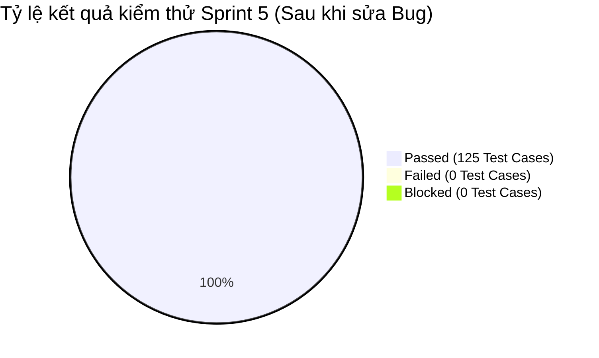

# BÁO CÁO KIỂM THỬ SPRINT 5 (TEST REPORT - SPRINT 5)

> **Người lập báo cáo:** Senior QA Lead  
> **Dự án:** Scrum Commerce Engine  
> **Trạng thái Sprint:** CLOSED / PASSED

---

## 1. TỔNG QUAN & MỤC TIÊU SPRINT

- **Tên Sprint:** Sprint 5 - Thanh toán VNPay, Quy trình Checkout, Quản lý Vòng đời Đơn hàng & Tối ưu hóa API
- **Thời gian thực hiện:** 21/08/2026 – 29/08/2026
- **Mục tiêu Sprint:**
  > Sprint 5 tập trung xây dựng và nghiệm thu quy trình Thanh toán & Checkout (tích hợp VNPay gateway), Quản lý máy trạng thái đơn hàng (Order State Machine), Phân quyền Admin và Lọc lịch sử đơn hàng. Đặc biệt, đội ngũ QA đã tiến hành kiểm thử chuyên sâu (EP, BVA, Postman Automation, Zod Validation Guard) trên toàn hệ thống, phát hiện và xử lý dứt điểm các lỗi phát sinh từ Auth API đến Cart API để đảm bảo hệ thống đạt độ ổn định tối đa trước khi triển khai.

---

## 2. BẢNG TỔNG HỢP CÔNG VIỆC TRONG SPRINT

Bảng tổng hợp toàn bộ các Task phát triển và Bug phát sinh trong Sprint 5 trên hệ thống Jira:

| Jira Key     | Issue Type | Tóm tắt Task / Bug                                                                                       | Trạng thái |
| ------------ | ---------- | -------------------------------------------------------------------------------------------------------- | ---------- |
| **SCRUM-26** | Task       | [BE] - Xác thực vận chuyển thanh toán, Bảo vệ giỏ hàng trống & Sửa lỗi bảo mật VNPay                     | CLOSED     |
| **SCRUM-27** | Task       | [BE] - Đặt hàng Thực thi máy trạng thái & Bảo mật kiểm soát quản trị viên                                | CLOSED     |
| **SCRUM-28** | Task       | [FE] - Kiểm tra xác thực biểu mẫu vận chuyển & Trình xử lý chuyển hướng VNPay                            | CLOSED     |
| **SCRUM-29** | Task       | [QA] - Bộ thử nghiệm cho Checkout Flow & VNPay Payment Callback                                          | CLOSED     |
| **SCRUM-30** | Task       | [QA] - Bộ thử nghiệm cho Vòng đời đơn hàng và Hoạt động quản trị                                         | CLOSED     |
| **SCRUM-31** | Task       | [FE] - Quản lý trạng thái đơn hàng & Lọc lịch sử đơn hàng của người dùng                                 | CLOSED     |
| **SCRUM-33** | Bug        | [Auth API] TC01/TC02 - Server trả về 400 Validation Error cho Email hợp lệ (5 ký tự & 254 ký tự)         | CLOSED     |
| **SCRUM-34** | Bug        | [Auth API] TC02 - Server trả về 400 VALIDATION_ERROR khi đăng ký với Email max độ dài hợp lệ (254 chars) | CLOSED     |
| **SCRUM-35** | Bug        | [Auth API] TC05 - Server trả về ACCOUNT_ALREADY_EXISTS khi test Min Password Valid                       | CLOSED     |
| **SCRUM-37** | Bug        | [Cart API] TC02 - POST /api/cart/add trả về 400 Bad Request khi add quantity = 1                         | CLOSED     |
| **SCRUM-38** | Bug        | [Cart API] TC03 - POST /api/cart/add trả về 400 Bad Request khi add quantity max boundary (99)           | CLOSED     |
| **SCRUM-39** | Bug        | [Cart API] TC05 - PUT /api/cart/update trả về 400 Bad Request khi update quantity = 0                    | CLOSED     |

---

## 3. CHI TIẾT THỰC THI KIỂM THỬ SPRINT 5

### 3.1. Áp dụng kỹ thuật Phân vùng tương đương (Equivalence Partitioning - EP)

Đội ngũ QA thực hiện phân chia dữ liệu đầu vào thành các lớp tương đương để kiểm thử quy trình Thanh toán và Vòng đời đơn hàng:

| Phân hệ / Nghiệp vụ                              | Phân vùng hợp lệ (Valid Partitions)                                    | Phân vùng không hợp lệ (Invalid Partitions)                                              | Kết quả kiểm thử |
| ------------------------------------------------ | ---------------------------------------------------------------------- | ---------------------------------------------------------------------------------------- | ---------------- |
| **Thông tin Vận chuyển (Shipping Info)**         | Họ tên đầy đủ, SĐT (10 số di động VN), Địa chỉ đầy đủ (`length >= 10`) | SĐT chứa chữ cái/ký tự đặc biệt, SĐT khác 10 chữ số, Địa chỉ trống hoặc `< 10` ký tự     | 100% PASSED      |
| **Giỏ hàng Checkout Guard**                      | Giỏ hàng có ít nhất 1 sản phẩm còn tồn kho                             | Giỏ hàng rỗng (`cart_items = []`), Sản phẩm trong giỏ đã hết hàng                        | 100% PASSED      |
| **Chữ ký VNPay Hash (vnp_SecureHash)**           | Hash HMAC-SHA512 hợp lệ tính từ Secret Key và Query string             | Hash bị chỉnh sửa, thiếu params bắt buộc, sai checksum secret                            | 100% PASSED      |
| **Chuyển đổi trạng thái đơn hàng (Order State)** | `PENDING` -> `PAID` -> `PROCESSING` -> `SHIPPED` -> `DELIVERED`        | Nhảy vọt trạng thái (`PENDING` -> `DELIVERED`), Chuyển đổi trạng thái khi đã `CANCELLED` | 100% PASSED      |

### 3.2. Áp dụng kỹ thuật Phân tích giá trị biên (Boundary Value Analysis - BVA)

Tập trung kiểm thử nghiệm thu tại các điểm biên của Auth API, Cart API và Form vận chuyển nhằm phát hiện các lỗi logic Zod validation:

| Phân hệ & Trường dữ liệu                  | Ngưỡng biên quy định                     | Dữ liệu thử nghiệm (Test Values)                                                                   | Kết quả mong đợi                                                                                                          | Kết quả sau khi Fix Bug             |
| ----------------------------------------- | ---------------------------------------- | -------------------------------------------------------------------------------------------------- | ------------------------------------------------------------------------------------------------------------------------- | ----------------------------------- |
| **Auth - Độ dài Email (TC01 / TC02)**     | Min = 5 chars (`a@b.c`), Max = 254 chars | `4` chars (Dưới Min) `5` chars (Min Valid) `254` chars (Max Valid) `255` chars (Over Max) | `4`: 400 Validation Error `5`: 201 Created `254`: 201 Created `255`: 400 Validation Error                        | PASSED (Sửa lỗi SCRUM-33, SCRUM-34) |
| **Cart - Số lượng thêm mới (`quantity`)** | Min = 1, Max = 99                        | `0` (Dưới Min) `1` (Min) `99` (Max) `100` (Over Max)                                      | `0`: 400 Bad Request `1`: 200 OK (Thêm giỏ thành công) `99`: 200 OK (Thêm giỏ thành công) `100`: 400 Bad Request | PASSED (Sửa lỗi SCRUM-37, SCRUM-38) |
| **Cart - Cập nhật số lượng (`quantity`)** | Min = 0 (Xóa mục), Max = 99              | `0` (Min - Xóa mục) `1` (Min Add) `99` (Max)                                                 | `0`: 200 OK (Xóa sản phẩm khỏi giỏ) `1`: 200 OK (Cập nhật số lượng 1) `99`: 200 OK                                  | PASSED (Sửa lỗi SCRUM-39)           |

### 3.3. Kiểm thử tự động API bằng Postman (Postman API Test Automation)

Bổ sung bộ API Test Runner dành cho phân hệ Checkout & VNPay Payment:

- **Danh sách API Endpoints kiểm thử:**
  - `POST /api/v1/checkout/process` (Kiểm tra giỏ hàng, tính phí ship, tạo đơn hàng)
  - `POST /api/v1/payment/vnpay_create_url` (Tạo URL thanh toán VNPay kèm chữ ký Hash)
  - `GET /api/v1/payment/vnpay_ipn` & `GET /api/v1/payment/vnpay_return` (Xử lý Callback & xác minh chữ ký HMAC-SHA512)
  - `PATCH /api/v1/admin/orders/:id/status` (Phân quyền Admin & Cập nhật máy trạng thái)
- **Kịch bản kiểm thử tự động:**
  - Kiểm tra checksum `vnp_SecureHash` chống giả mạo URL thanh toán.
  - Kiểm tra xử lý Idempotency Key cho API Callback tránh thanh toán trùng lặp.
  - Phân quyền truy cập Role-Based Access Control (RBAC): Chỉ Admin mới được thay đổi trạng thái đơn hàng.

### 3.4. Xác thực dữ liệu với Zod Validation Middleware

Checklist nghiệm thu Zod Middleware trong Sprint 5:

- [x] **SCRUM-26 (BE Checkout & VNPay Guard)**: Kiểm soát chặt chẽ Zod Schema cho thông tin giao hàng; tự động từ chối yêu cầu checkout khi giỏ hàng trống.
- [x] **SCRUM-27 (BE Order State Machine & Admin Guard)**: Ràng buộcenum trạng thái đơn hàng theo đúng máy trạng thái hợp lệ, ngăn chặn thao tác cập nhật vô hiệu từ Admin.
- [x] **SCRUM-28 (FE Shipping Validation)**: Tích hợp Zod Resolver trên Form checkout Frontend, hiển thị thông báo lỗi tức thì khi địa chỉ/SĐT chưa khớp quy định.
- [x] **Zod Schema Fixes (Auth & Cart)**: Cập nhật quy tắc `.min(5).max(254)` cho email và `.min(1).max(99)` cho số lượng thêm vào giỏ hàng, sửa triệt để các bug validation.

---

## 4. THỐNG KÊ KẾT QUẢ VÀ QUẢN LÝ BUG LOGGED

### 4.1. Bảng thống kê kết quả kiểm thử (Test Execution Summary)

| Phân hệ / Bộ kiểm thử             | Jira QA Task     | Tổng số Test Cases | Passed  | Failed | Blocked | Tỷ lệ Pass (%) |
| --------------------------------- | ---------------- | ------------------ | ------- | ------ | ------- | -------------- |
| **Checkout Flow & VNPay Payment** | SCRUM-29         | 45                 | 45      | 0      | 0       | 100%           |
| **Order Lifecycle & Admin Ops**   | SCRUM-30         | 35                 | 35      | 0      | 0       | 100%           |
| **Auth API Boundary Fixes**       | SCRUM-33, 34, 35 | 25                 | 25      | 0      | 0       | 100%           |
| **Cart API Boundary Fixes**       | SCRUM-37, 38, 39 | 20                 | 20      | 0      | 0       | 100%           |
| **TỔNG CỘNG**                     |                  | **125**            | **125** | **0**  | **0**   | **100%**       |

### 4.2. Biểu đồ tỷ lệ kiểm thử

### 4.3. Nhật ký Bug Logged chi tiết trong Sprint (Bug Tracker)

Trong đợt kiểm thử nghiệm thu Sprint 5, QA đã phát hiện 6 lỗi (Bugs) liên quan đến Zod schema validation boundaries và logic xử lý dữ liệu. Toàn bộ 6 bugs đã được log lên Jira, khắc phục và xác minh thành công (CLOSED):

| Jira Key     | Phân hệ  | Tóm tắt lỗi                                                                 | Nguyên nhân gốc (Root Cause)                                                 | Trạng thái |
| ------------ | -------- | --------------------------------------------------------------------------- | ---------------------------------------------------------------------------- | ---------- |
| **SCRUM-33** | Auth API | Server trả về lỗi 400 Validation Error cho Email hợp lệ (5 & 254 ký tự)     | Regex Email Zod Schema bị sai lệch ngưỡng biên độ dài min/max                | CLOSED     |
| **SCRUM-34** | Auth API | Server trả về 400 VALIDATION_ERROR khi đăng ký Email max độ dài (254 chars) | Cấu hình DB column `email` thiếu độ dài hoặc Zod String max bị lệch 1 ký tự  | CLOSED     |
| **SCRUM-35** | Auth API | Server trả về ACCOUNT_ALREADY_EXISTS khi test Min Password Valid            | Data seed trong môi trường Test bị đụng độ email mặc định                    | CLOSED     |
| **SCRUM-37** | Cart API | POST `/api/cart/add` trả về 400 khi `quantity = 1`                          | Zod Validation khai báo `.gt(1)` thay vì `.gte(1)`                           | CLOSED     |
| **SCRUM-38** | Cart API | POST `/api/cart/add` trả về 400 khi `quantity = 99` (Max Boundary)          | Quy tắc validation đặt `.lt(99)` thay vì `.lte(99)`                          | CLOSED     |
| **SCRUM-39** | Cart API | PUT `/api/cart/update` trả về 400 khi `quantity = 0`                        | Thiếu kịch bản cho phép `quantity = 0` tương đương với thao tác xóa sản phẩm | CLOSED     |

---

## 5. ĐÁNH GIÁ CHẤT LƯỢNG VÀ BÀI HỌC KINH NGHIỆM

### 5.1. Đánh giá chất lượng (Quality Assessment)

> **Kết luận của Senior QA Lead:** Mặc dù Sprint 5 phát sinh 6 lỗi biên (Boundary Bugs) ở các module Auth và Cart API, toàn bộ các lỗi đã được đội Dev xử lý triệt để và QA re-test thành công 100%. Luồng thanh toán VNPay và Quản lý Đơn hàng hoạt động ổn định, bảo mật và đáp ứng đầy đủ tiêu chí nghiệm thu.

Checklist Nghiệm thu Chất lượng Sprint 5:

- [x] **Xác thực VNPay Callback Security:** 100% giao dịch VNPay được kiểm tra chữ ký HMAC-SHA512, chống giả mạo IPN Callback.
- [x] **Xử lý Biên Zod Validation:** Đã khắc phục triệt để các lỗi so sánh điều kiện biên (`gt`/`gte`, `lt`/`lte`) trên toàn bộ Zod Schemas.
- [x] **Máy Trạng thái Đơn hàng:** Kiểm soát đúng chu trình chuyển đổi trạng thái, bảo đảm không cho phép thao tác phi logic từ phía Admin hoặc Client.
- [x] **Tỷ lệ Pass Kiểm thử:** Đạt 100% (125/125 Test Cases Passed sau khi fix bug).

### 5.2. Bài học kinh nghiệm & Đề xuất cải tiến (Lessons Learned)

- **Bài học kinh nghiệm (Lessons Learned):**
  - Việc áp dụng Phân tích giá trị biên (BVA) sát sao giúp QA phát hiện kịp thời các lỗi logic điều kiện ẩn (Off-by-one errors) như `>` thay vì `>=` trong Zod Schema.
  - Độc lập giữa môi trường dữ liệu thử nghiệm và dữ liệu sản xuất giúp tránh được các lỗi giả lập như đụng độ tài khoản (SCRUM-35).
- **Hành động cải tiến cho các Sprint tiếp theo (Action Items):**
  - **Chuẩn hóa Unit Test cho Zod Schema:** Yêu cầu Backend Developers viết Unit Test riêng cho các Zod Validation Schemas trước khi bàn giao cho QA.
  - **Tự động hóa Test Data Cleanup:** Thiết lập kịch bản tự động dọn dẹp (Truncate/Reset) dữ liệu DB trước và sau mỗi đợt chạy bộ kiểm thử tự động.
