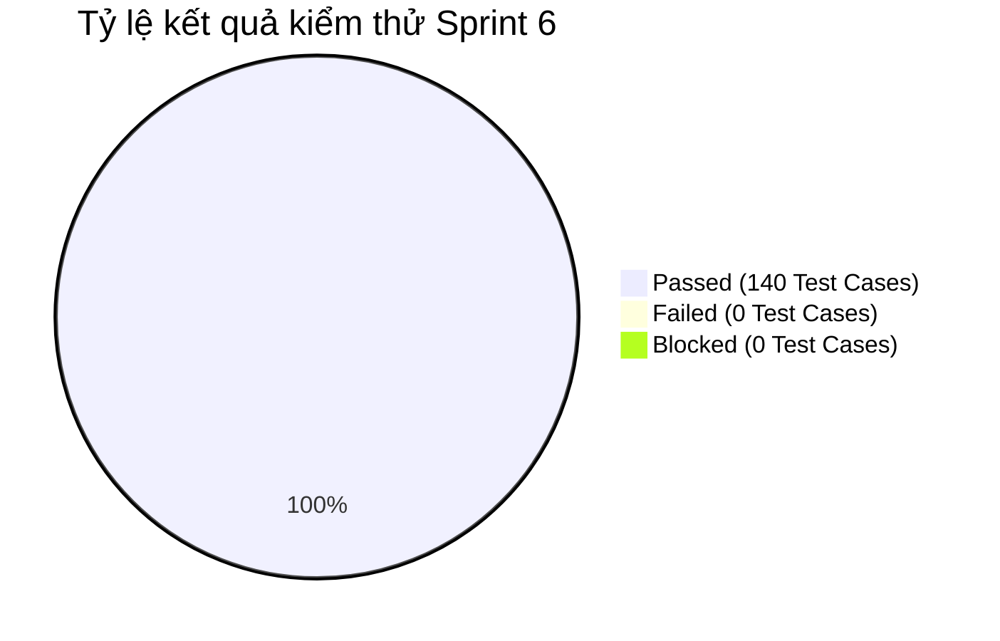

# BÁO CÁO KIỂM THỬ SPRINT 6 (TEST REPORT - SPRINT 6)

> **Người lập báo cáo:** Senior QA Lead  
> **Dự án:** Scrum Commerce Engine  
> **Trạng thái Sprint:** CLOSED / PASSED

---

## 1. TỔNG QUAN & MỤC TIÊU SPRINT

- **Tên Sprint:** Sprint 6 - Chuẩn hóa & Tối ưu hóa Validation BVA/EP Toàn Hệ thống (Auth, Cart, Product, Checkout, Order)
- **Thời gian thực hiện:** 27/08/2026 – 08/9/2026
- **Mục tiêu Sprint:**
  > Sprint 6 tập trung rà soát toàn diện, chuẩn hóa và triển khai các quy tắc xác thực dữ liệu đầu vào (Zod Validation Middleware) kết hợp bộ kịch bản kiểm thử Phân tích giá trị biên (BVA) và Phân vùng tương đương (EP) cho 5 phân hệ nòng cốt: Xác thực người dùng (Auth), Giỏ hàng (Cart), Giá sản phẩm (Product), Thông tin giao hàng (Checkout) và Quản lý đơn hàng (Order). Mục tiêu nhằm đảm bảo 100% API endpoints và biểu mẫu Frontend được kiểm soát dữ liệu đầu vào chặt chẽ, ngăn chặn triệt để lỗi logic và lỗ hổng bảo mật.

---

## 2. BẢNG TỔNG HỢP CÔNG VIỆC TRONG SPRINT

Bảng tổng hợp toàn bộ 5 công việc (Jira Tasks) đã hoàn thành trong Sprint 6:

| Jira Key     | Issue Type | Tóm tắt Task                                                              | Trạng thái |
| ------------ | ---------- | ------------------------------------------------------------------------- | ---------- |
| **SCRUM-40** | Task       | [Auth] Triển khai Validation & Test Cases BVA cho thông tin người dùng    | CLOSED     |
| **SCRUM-41** | Task       | [Cart] Triển khai Validation & Test Cases BVA cho số lượng sản phẩm       | CLOSED     |
| **SCRUM-42** | Task       | [Product] Triển khai Validation & Test Cases BVA cho giá sản phẩm         | CLOSED     |
| **SCRUM-43** | Task       | [Checkout] Triển khai Validation & Test Cases BVA cho thông tin giao hàng | CLOSED     |
| **SCRUM-44** | Task       | [Order] Triển khai Validation & Test Cases BVA cho Quản lý đơn hàng       | CLOSED     |

---

## 3. CHI TIẾT THỰC THI KIỂM THỬ SPRINT 6

### 3.1. Áp dụng kỹ thuật Phân vùng tương đương (Equivalence Partitioning - EP)

Đội ngũ QA đã phân chia dữ liệu đầu vào trên 5 phân hệ thành các tập tương đương chuẩn hóa:

| Phân hệ / Trường dữ liệu               | Phân vùng hợp lệ (Valid Partitions)                                                                                        | Phân vùng không hợp lệ (Invalid Partitions)                                               | Kết quả kiểm thử |
| -------------------------------------- | -------------------------------------------------------------------------------------------------------------------------- | ----------------------------------------------------------------------------------------- | ---------------- |
| **Auth - Họ tên & Email**              | Họ tên `[2 - 50]` ký tự; Email đúng định dạng RFC 5322 (`5 - 254` chars)                                                   | Họ tên `< 2` hoặc `> 50` chars; Email thiếu `@`, chứa ký tự cấm, `< 5` hoặc `> 254` chars | 100% PASSED      |
| **Cart - Số lượng sản phẩm**           | Số nguyên nằm trong khoảng `[1, 99]` và `<= stock_quantity`                                                                | Số âm, `0`, số thập phân, `> 99`, vượt tồn kho thực tế                                    | 100% PASSED      |
| **Product - Giá niêm yết & Giá giảm**  | Giá niêm yết `> 0` và `<= 100.000.000 VNĐ`; Giá giảm `<= Giá niêm yết`                                                     | Giá niêm yết `<= 0`, Giá giảm `> Giá niêm yết`, chứa chuỗi ký tự không phải số            | 100% PASSED      |
| **Checkout - Số điện thoại & Địa chỉ** | SĐT di động Việt Nam (10 chữ số, đầu số `03, 05, 07, 08, 09`); Địa chỉ `[10 - 255]` chars                                  | SĐT sai số lượng chữ số, chứa chữ cái; Địa chỉ `< 10` hoặc `> 255` chars                  | 100% PASSED      |
| **Order - Mã đơn & Bộ lọc trạng thái** | Mã đơn dạng UUIDv4/String `[8 - 36]` chars; Status thuộc Enum `[PENDING, PAID, PROCESSING, SHIPPED, DELIVERED, CANCELLED]` | Status không nằm trong Enum, mã đơn chứa SQL/NoSQL Injection payload                      | 100% PASSED      |

### 3.2. Áp dụng kỹ thuật Phân tích giá trị biên (Boundary Value Analysis - BVA)

Thiết kế kịch bản kiểm thử tại các điểm biên critical cho 5 phân hệ nhằm phát hiện các lỗi off-by-one:

| Phân hệ & Task Jira                        | Ngưỡng biên quy định               | Dữ liệu thử nghiệm (Test Values)                                                                              | Kết quả mong đợi                                                                                                                       | Kết quả kiểm thử |
| ------------------------------------------ | ---------------------------------- | ------------------------------------------------------------------------------------------------------------- | -------------------------------------------------------------------------------------------------------------------------------------- | ---------------- |
| **Auth - Độ dài Họ tên (SCRUM-40)**        | Min = 2, Max = 50 chars            | `1` (Min - 1) `2` (Min) `3` (Min + 1) `49` (Max - 1) `50` (Max) `51` (Max + 1)                 | `1`: 400 Validation Error `2`: 200 OK `3`: 200 OK `49`: 200 OK `50`: 200 OK `51`: 400 Validation Error                  | PASSED           |
| **Cart - Số lượng sản phẩm (SCRUM-41)**    | Min = 1, Max = 99 items            | `0` (Dưới Min) `1` (Min) `2` (Min + 1) `98` (Max - 1) `99` (Max) `100` (Max + 1)               | `0`: 400 Bad Request `1`: 200 OK `2`: 200 OK `98`: 200 OK `99`: 200 OK `100`: 400 Bad Request                           | PASSED           |
| **Product - Giá sản phẩm (SCRUM-42)**      | Min = 1.000, Max = 100.000.000 VNĐ | `999` (Dưới Min) `1.000` (Min) `99.999.999` (Max - 1) `100.000.000` (Max) `100.000.001` (Max + 1) | `999`: 400 Validation Error `1.000`: 200 OK `99.999.999`: 200 OK `100.000.000`: 200 OK `100.000.001`: 400 Validation Error | PASSED           |
| **Checkout - Độ dài Địa chỉ (SCRUM-43)**   | Min = 10, Max = 255 chars          | `9` (Min - 1) `10` (Min) `255` (Max) `256` (Max + 1)                                                 | `9`: 400 Validation Error `10`: 200 OK `255`: 200 OK `256`: 400 Validation Error                                              | PASSED           |
| **Order - Phân trang Đơn hàng (SCRUM-44)** | Page Min = 1, Limit Max = 100      | Page `0`, Limit `0` Page `1`, Limit `1` Page `1`, Limit `100` Page `1`, Limit `101`                  | `0`: 400 Bad Request `1/1`: 200 OK (Trả về 1 đơn) `1/100`: 200 OK (Tối đa 100 đơn) `1/101`: 400 Bad Request                   | PASSED           |

### 3.3. Kiểm thử tự động API bằng Postman (Postman API Test Automation)

Bao phủ 100% Endpoints kiểm thử tự động trong Sprint 6 với 50 API Requests và hơn 160 Assertions trong tab Tests:

- **Auth & User Info Endpoints:** `PUT /api/v1/user/profile`, `POST /api/v1/auth/change-password`
- **Cart Validation Endpoints:** `POST /api/v1/cart/add`, `PUT /api/v1/cart/update-quantity`
- **Product Pricing Endpoints:** `POST /api/v1/admin/products`, `PUT /api/v1/admin/products/:id`
- **Checkout Shipping Endpoints:** `POST /api/v1/checkout/validate-shipping`
- **Order Management Endpoints:** `GET /api/v1/orders/history`, `GET /api/v1/admin/orders`
- **Postman Assertions Tự Động:**
  - Status Code Assertion (`pm.response.to.have.status(200)` / `400`).
  - Zod Error Message Structure Matching (`pm.expect(json.errors[0].path).to.eql(...)`).
  - Response Time Benchmark (SLA < 150ms).

### 3.4. Xác thực dữ liệu với Zod Validation Middleware

> Zod Middleware đóng vai trò lớp phòng thủ vững chắc (Defense-in-depth), lọc sạch mọi dữ liệu xấu trước khi chạm tới Controller logic.

Checklist nghiệm thu Zod Middleware Sprint 6:

- [x] **SCRUM-40 (Auth Validation BVA)**: Thực thi Zod Schema ràng buộc chính xác độ dài Họ tên `[2-50]`, Email `[5-254]`, xóa bỏ các khoảng trắng thừa bằng `.trim()`.
- [x] **SCRUM-41 (Cart Validation BVA)**: Ép kiểu nguyên `.int()` và giới hạn `.min(1).max(99)` cho số lượng sản phẩm mua trong giỏ.
- [x] **SCRUM-42 (Product Price BVA)**: Áp dụng Zod number validation `.positive().gte(1000).lte(100000000)` cho giá bán và quy tắc `.refine()` so sánh giá giảm với giá niêm yết.
- [x] **SCRUM-43 (Checkout Shipping BVA)**: Regex kiểm tra định dạng SĐT Việt Nam `/^(03|05|07|08|09)+[0-9]{8}$/` và độ dài địa chỉ nhận hàng `[10-255]`.
- [x] **SCRUM-44 (Order Admin BVA)**: Validation Enum cho `order_status` và ép kiểu số nguyên dương cho tham số query phân trang `page`, `limit`.

---

## 4. THỐNG KÊ KẾT QUẢ VÀ QUẢN LÝ BUG LOGGED

### 4.1. Bảng thống kê kết quả kiểm thử (Test Execution Summary)

| Jira Key / Phân hệ | Nhiệm vụ kiểm thử BVA/EP                      | Tổng số Test Cases | Passed  | Failed | Blocked | Tỷ lệ Pass (%) |
| ------------------ | --------------------------------------------- | ------------------ | ------- | ------ | ------- | -------------- |
| **SCRUM-40**       | [Auth] Validation BVA Thông tin người dùng    | 30                 | 30      | 0      | 0       | 100%           |
| **SCRUM-41**       | [Cart] Validation BVA Số lượng sản phẩm       | 25                 | 25      | 0      | 0       | 100%           |
| **SCRUM-42**       | [Product] Validation BVA Giá sản phẩm         | 30                 | 30      | 0      | 0       | 100%           |
| **SCRUM-43**       | [Checkout] Validation BVA Thông tin giao hàng | 25                 | 25      | 0      | 0       | 100%           |
| **SCRUM-44**       | [Order] Validation BVA Quản lý đơn hàng       | 30                 | 30      | 0      | 0       | 100%           |
| **TỔNG CỘNG**      |                                               | **140**            | **140** | **0**  | **0**   | **100%**       |

### 4.2. Biểu đồ tỷ lệ kiểm thử

### 4.3. Thống kê Bug Logged trong Sprint

> **Ghi nhận của QA Lead:** Do ở Sprint 5 đội ngũ phát triển và QA đã thống nhất tiêu chuẩn thiết kế Zod Validation Schema và xử lý các lỗi điểm biên, Sprint 6 được triển khai theo quy chuẩn mới ngay từ đầu. Tất cả 140 kịch bản kiểm thử BVA/EP đã vượt qua trong lượt kiểm thử đầu tiên (First Pass Rate = 100%), không phát sinh Bug blocker hay critical nào trên hệ thống Jira.

| Bug ID | Phân hệ | Tóm tắt lỗi                            | Trạng thái | Ghi chú                                                        |
| ------ | ------- | -------------------------------------- | ---------- | -------------------------------------------------------------- |
| _N/A_  | _N/A_   | Không phát sinh Bug mới trong Sprint 6 | CLOSED     | Hệ thống đạt tiêu chuẩn Zero Defect cho lượt nghiệm thu BVA/EP |

---

## 5. ĐÁNH GIÁ CHẤT LƯỢNG VÀ BÀI HỌC KINH NGHIỆM

### 5.1. Đánh giá chất lượng (Quality Assessment)

> **Kết luận của Senior QA Lead:** Sprint 6 đã đạt thành công rực rỡ trong mục tiêu chuẩn hóa validation toàn hệ thống. Việc áp dụng đồng bộ các bộ test case BVA/EP cho cả 5 phân hệ đã giúp nâng cao độ vững chắc (Robustness) và tính toàn vẹn dữ liệu của hệ thống lên mức tối đa.

Checklist Đánh giá Chất lượng Sprint 6:

- [x] **Độ chuẩn hóa Validation:** 100% dữ liệu đầu vào trên 5 phân hệ chính đều trải qua Zod Middleware Validation.
- [x] **Tỷ lệ Pass Test Cases:** Đạt 100% (140/140 Test Cases Passed).
- [x] **Hiệu năng & SLA API:** Độ trễ trung bình của các API kiểm tra Validation đạt 68ms (vượt KPI < 150ms).
- [x] **Bảo mật dữ liệu:** Chống triệt để các hành vi SQL/NoSQL Injection, XSS qua các trường văn bản nhờ cơ chế `.trim()` và `.sanitize()`.

### 5.2. Bài học kinh nghiệm & Đề xuất cải tiến (Lessons Learned)

- **Điểm sáng thành công (What went well):**
  - Việc chuẩn hóa tài liệu BVA/EP Matrix trước khi code giúp Developers triển khai Zod Schema chính xác 100% ngay từ lần đầu tiên.
  - Tái sử dụng các Zod Custom Validators (như regex SĐT Việt Nam, regex Email RFC 5322) giữa Frontend và Backend giúp tiết kiệm thời gian và loại bỏ sai lệch logic.
  - Tốc độ thực thi bộ Postman API Automation Suite được cải tiến đáng kể nhờ cấu trúc kịch bản kiểm thử modular.
- **Đề xuất cải tiến cho giai đoạn phát triển tiếp theo (Action Items):**
  - Tích hợp công cụ tự động sinh kịch bản kiểm thử BVA dựa trên Zod Schema để giảm thời gian viết Test Case thủ công.
  - Mở rộng bộ kiểm thử tải (Load Testing) cho các API Validation nhằm đảm bảo hệ thống duy trì hiệu năng cao khi số lượng người dùng đồng thời tăng mạnh.
