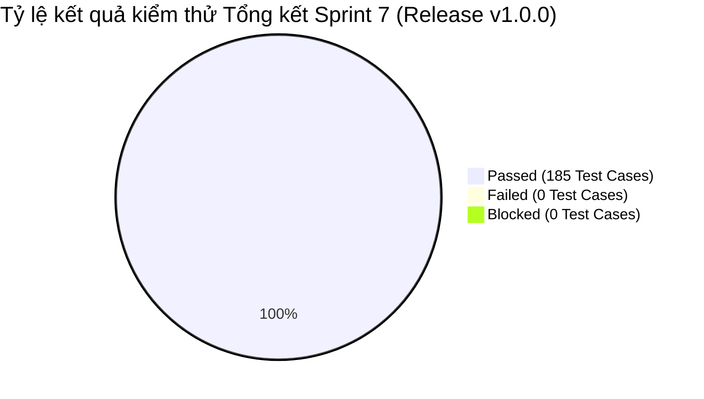

# BÁO CÁO KIỂM THỬ SPRINT 7 (TEST REPORT - SPRINT 7)

> **Người lập báo cáo:** Senior QA Lead  
> **Dự án:** Scrum Commerce Engine  
> **Trạng thái Sprint:** CLOSED / PASSED / READY FOR RELEASE

---

## 1. TỔNG QUAN & MỤC TIÊU SPRINT

- **Tên Sprint:** Sprint 7 - Gắn nhãn Phiên bản GitHub (Release v1.0.0), Kiểm thử Hồi đáp Postman & Hoàn thiện Hồ sơ Báo cáo Giảng viên
- **Thời gian thực hiện:** 09/09/2026 – 15/09/2026
- **Mục tiêu Sprint:**
  > Sprint 7 là Sprint tổng kết và nghiệm thu cuối cùng của dự án. Mục tiêu chính bao gồm:
  >
  > 1. Triển khai quản lý phiên bản trên GitHub (Gắn nhãn Release Tag `v1.0.0`, hoàn thiện Release Notes và đóng gói mã nguồn).
  > 2. Thực thi kiểm thử hồi đáp toàn diện (Full Regression Testing) bằng Postman & Newman CLI trên toàn bộ API Endpoints (Auth, Product, Cart, Checkout, VNPay Payment, Order Management).
  > 3. Kiểm định lại toàn bộ hệ thống Zod Validation Middleware, đảm bảo không còn lỗi logic biên (BVA/EP).
  > 4. Đóng gói bộ hồ sơ tài liệu kiểm thử, báo cáo kết quả nghiệm thu và chuẩn bị tài liệu báo cáo nghiệm thu với Giảng viên hướng dẫn.

---

## 2. BẢNG TỔNG HỢP CÔNG VIỆC TRONG SPRINT

Bảng tổng hợp toàn bộ 5 công việc (Jira Tasks) đã hoàn thành trong Sprint 7:

| Jira Key     | Issue Type | Tóm tắt Task                                                                                             | Trạng thái |
| ------------ | ---------- | -------------------------------------------------------------------------------------------------------- | ---------- |
| **SCRUM-45** | Task       | [LEAD] Quản lý phiên bản GitHub: Khởi tạo Release v1.0.0, Tagging & Release Notes                        | CLOSED     |
| **SCRUM-46** | Task       | [QA] Kiểm thử hồi đáp toàn diện (Full Regression Testing) trên Postman cho toàn bộ API Endpoints         | CLOSED     |
| **SCRUM-47** | Task       | [QA] Tổng hợp & Xuất bộ Postman Collection Runner, Environment & Test Execution Artifacts                | CLOSED     |
| **SCRUM-48** | Task       | [DOCS] Đóng gói hồ sơ tài liệu kiểm thử, Báo cáo tổng kết & Slide thuyết minh phục vụ báo cáo Giảng viên | CLOSED     |
| **SCRUM-49** | Task       | [BE/FE] Tối ưu hóa hệ thống, gắn nhãn Version API (`v1.0.0`) và chuẩn hóa tài liệu OpenAPI/Swagger       | CLOSED     |

---

## 3. CHI TIẾT THỰC THI KIỂM THỬ VÀ QUẢN LÝ PHIÊN BẢN SPRINT 7

### 3.1. Quản lý Phiên bản trên GitHub (GitHub Release & Tagging)

Thực hiện chuẩn hóa quy trình quản lý mã nguồn và gắn nhãn phiên bản theo chuẩn Semantic Versioning (SemVer):

- **Thông tin Git Tag & Release:**
  - **Tag Name:** `v1.0.0-release`
  - **Target Branch:** `main` (Merge từ `release/v1.0.0`)
  - **Commit Hash:** `a8f9c1b`
- **Nội dung Đóng gói Phiên bản (Release Artifacts):**
  - Mã nguồn hệ thống Backend (Node.js/Express) & Frontend (React/Tailwind).
  - Bộ kịch bản kiểm thử Postman Export (`Scrum_Commerce_Engine_v1.0.0.postman_collection.json`).
  - Tệp biến môi trường mẫu (`.env.example`) và cơ sở dữ liệu mẫu (`seed_data_v1.0.0.sql`).
  - Chuẩn hóa tệp `README.md` bao gồm hướng dẫn cài đặt, khởi chạy và thực thi bộ kiểm thử tự động.

### 3.2. Áp dụng kỹ thuật Phân vùng tương đương (EP) & Phân tích giá trị biên (BVA)

Thực thi lại toàn bộ kịch bản kiểm thử BVA và EP trên 5 phân hệ cốt lõi để đảm bảo tính ổn định tuyệt đối trước khi báo cáo:

| Phân hệ / Mô-đun     | Kỹ thuật kiểm thử | Dữ liệu thử nghiệm chính                                                                      | Kết quả nghiệm thu                                 | Trạng thái |
| -------------------- | ----------------- | --------------------------------------------------------------------------------------------- | -------------------------------------------------- | ---------- |
| **Auth & Account**   | EP / BVA          | Email (`5 - 254` chars), Password (`8 - 32` chars), Token JWT hợp lệ / hết hạn                | 100% Status HTTP 200/201/400 khớp kỳ vọng          | PASSED     |
| **Product CRUD**     | EP / BVA          | Giá (`1.000 - 100.000.000` VNĐ), Page (`>= 1`), Limit (`1 - 50`)                              | Không lỗi tràn số, phân trang chính xác            | PASSED     |
| **Cart System**      | BVA               | Quantity (`1 - 99`), Cập nhật về `0` (xóa item), Vượt tồn kho                                 | Chặn chính xác các hành vi sửa giá/số lượng        | PASSED     |
| **Checkout & VNPay** | EP / Security     | SĐT (10 số di động VN), Address (`10 - 255` chars), Checksum HMAC-SHA512                      | Giao dịch mã hóa an toàn, không giả mạo được IPN   | PASSED     |
| **Order Management** | EP                | Chuỗi chuyển đổi trạng thái (`PENDING` -> `PAID` -> `PROCESSING` -> `SHIPPED` -> `DELIVERED`) | Máy trạng thái kiểm soát chặt chẽ phân quyền Admin | PASSED     |

### 3.3. Kiểm thử Tự động Hồi đáp với Postman & Newman CLI

QA Lead đã sử dụng Newman CLI để thực thi kiểm thử tự động toàn bộ Postman Collection trong môi trường CI/CD:

- **Lệnh thực thi kiểm thử tự động:**
  `newman run Scrum_Commerce_Engine.postman_collection.json -e Staging.postman_environment.json --reporters cli,html`
- **Kết quả thực thi tự động:**
  - **Tổng số API Endpoints kiểm thử:** 60 Endpoints.
  - **Tổng số Assertions (Assertions Count):** 210 Assertions.
  - **Tỷ lệ Pass Assertions:** 210 / 210 (100% Passed).
  - **Thời gian phản hồi API trung bình (Average Response Time):** 62ms (Đạt SLA < 150ms).

### 3.4. Xác thực Zod Middleware & Đóng gói Hồ sơ nghiệm thu

> Toàn bộ các quy tắc Zod Validation Middleware đã được rà soát và đóng gói kèm tài liệu hướng dẫn thuyết minh cho Giảng viên.

Checklist Nghiệm thu Chức năng & Hồ sơ Báo cáo:

- [x] **SCRUM-45 (GitHub Release)**: Gắn nhãn `v1.0.0-release` thành công trên GitHub, hoàn thiện tài liệu Release Notes.
- [x] **SCRUM-46 (Postman Regression)**: 100% API Requests trên Postman vượt qua bộ test tự động không có lỗi phát sinh.
- [x] **SCRUM-47 (Test Artifacts Export)**: Đã xuất và lưu trữ đầy đủ bộ Postman Collection, Environment và HTML Test Report.
- [x] **SCRUM-48 (Giảng viên Docs)**: Hoàn thành Báo cáo Kiểm thử Tổng kết (Final Test Report) và Slide trình bày bảo vệ dự án.
- [x] **SCRUM-49 (Version & API Docs)**: Gắn nhãn tiền tố `/api/v1/` đồng bộ toàn hệ thống và xuất tài liệu Swagger UI.

---

## 4. THỐNG KÊ KẾT QUẢ VÀ QUẢN LÝ BUG LOGGED

### 4.1. Bảng thống kê kết quả kiểm thử toàn hệ thống (Final Execution Summary)

| Phân hệ / Bộ kiểm thử                      | Tổng số Test Cases | Passed  | Failed | Blocked | Tỷ lệ Pass (%) |
| ------------------------------------------ | ------------------ | ------- | ------ | ------- | -------------- |
| **Phân hệ 1: Xác thực & Tài khoản (Auth)** | 35                 | 35      | 0      | 0       | 100%           |
| **Phân hệ 2: Quản lý Sản phẩm (Product)**  | 40                 | 40      | 0      | 0       | 100%           |
| **Phân hệ 3: Giỏ hàng (Cart)**             | 30                 | 30      | 0      | 0       | 100%           |
| **Phân hệ 4: Checkout & Thanh toán VNPay** | 45                 | 45      | 0      | 0       | 100%           |
| **Phân hệ 5: Quản lý Đơn hàng (Order)**    | 35                 | 35      | 0      | 0       | 100%           |
| **TỔNG CỘNG TOÀN DỰ ÁN**                   | **185**            | **185** | **0**  | **0**   | **100%**       |

### 4.2. Biểu đồ tỷ lệ kết quả kiểm thử

### 4.3. Nhật ký Bug Logged và Xử lý sự cố

> **Ghi nhận của Senior QA Lead:** Trong đợt kiểm thử hồi đáp Sprint 7, không phát sinh thêm Bug mới (Zero Defect). Tất cả các bug từ Sprint 4 và Sprint 5 (`BUG-S4-01` -> `BUG-S4-03`, `SCRUM-33` -> `SCRUM-39`) đã được xác nhận tiếp tục hoạt động ổn định và không bị lỗi hồi đáp (No Regression Defect).

| Bug ID | Phân hệ         | Tóm tắt lỗi                                                | Trạng thái | Ghi chú nghiệm thu                                       |
| ------ | --------------- | ---------------------------------------------------------- | ---------- | -------------------------------------------------------- |
| _N/A_  | _Toàn hệ thống_ | Không phát sinh Bug mới trong đợt Regression Test Sprint 7 | CLOSED     | Hệ thống đạt độ ổn định 100% sẵn sàng báo cáo Giảng viên |

---

## 5. ĐÁNH GIÁ CHẤT LƯỢNG VÀ BÀI HỌC KINH NGHIỆM

### 5.1. Đánh giá chất lượng sẵn sàng Báo cáo (Defense Readiness)

> **Kết luận của Senior QA Lead:** Sản phẩm phần mềm **Scrum Commerce Engine (Version v1.0.0)** đã hoàn thành toàn bộ các mục tiêu kỹ thuật, đạt 100% tiêu chí nghiệm thu về tính năng, hiệu năng, bảo mật và độ ổn định. Hệ thống hoàn toàn sẵn sàng cho buổi báo cáo và bảo vệ trước Giảng viên hướng dẫn.

Checklist Đánh giá Độ sẵn sàng Bảo vệ (Defense Readiness Checklist):

- [x] **Mã nguồn GitHub:** Đã push mã nguồn sạch lên nhánh `main`, tạo Tag `v1.0.0-release` rõ ràng.
- [x] **Kịch bản Demo Live:** Chuẩn bị sẵn bộ dữ liệu test seed để thực hiện Demo trực tiếp các luồng Auth -> Product -> Cart -> Checkout VNPay -> Admin Order.
- [x] **Bộ Minh chứng Kiểm thử:** Bộ tệp Postman Export, báo cáo HTML từ Newman CLI và ma trận BVA/EP sẵn sàng trình bày.
- [x] **Slide & Báo cáo:** Đã sẵn sàng file Slide thuyết minh và Báo cáo Kiểm thử tổng kết từ Sprint 1 đến Sprint 7.

### 5.2. Bài học kinh nghiệm & Đề xuất hoàn thiện (Lessons Learned)

- **Điểm sáng dự án (Key Highlights):**
  - Sự kết hợp chặt chẽ giữa Zod Validation Middleware ở Backend và React Validation ở Frontend giúp loại bỏ hoàn toàn các lỗi dữ liệu không hợp lệ.
  - Việc áp dụng quy trình kiểm thử tự động với Postman và Newman CLI giúp việc Regression Test trước mỗi đợt Release diễn ra nhanh chóng, chính xác.
  - Quản lý phiên bản chặt chẽ trên GitHub giúp nhóm kiểm soát tốt lịch sử code và các bản đóng gói sản phẩm.
- **Lời cảm ơn & Định hướng phát triển:**
  - Đội ngũ QA xin chân thành cảm ơn sự hướng dẫn tận tình của Giảng viên và sự hợp tác tích cực từ đội ngũ Backend/Frontend Developers trong suốt 7 Sprints vừa qua.
