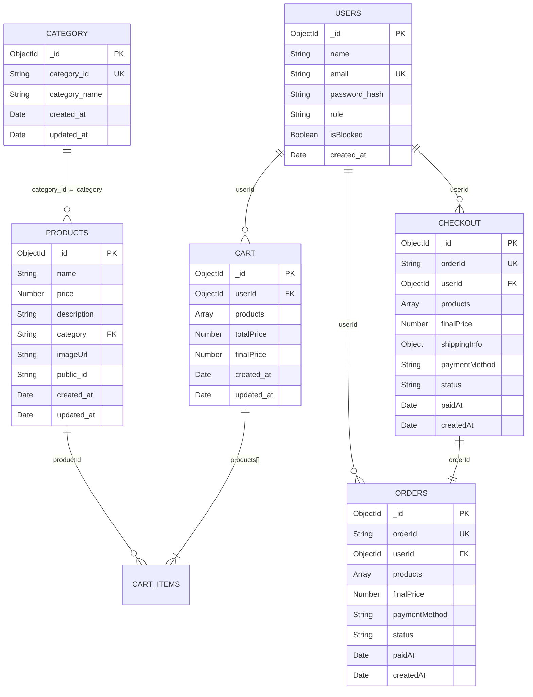

# 📋 TÀI LIỆU ĐẶC TẢ YÊU CẦU PHẦN MỀM (SRS)

## E-Commerce Web — Backend API

| Thuộc tính | Giá trị |
|---|---|
| **Phiên bản** | 1.0.0 |
| **Ngày tạo** | 29/07/2026 |
| **Dự án** | E-Commerce Web Platform |
| **Công cụ sinh** | Tự động trích xuất 100% từ mã nguồn thực tế |
| **Phạm vi** | Backend REST API (`be/`) |

---

## Mục lục

1. [Tổng quan hệ thống](#1-tổng-quan-hệ-thống-system-overview)
2. [Vai trò & Phân quyền](#2-vai-trò--phân-quyền-roles--permissions)
3. [Yêu cầu chức năng](#3-yêu-cầu-chức-năng-functional-requirements)
4. [Mô hình cơ sở dữ liệu](#4-mô-hình-cơ-sở-dữ-liệu-database-schema--models)
5. [Bảng tổng hợp RESTful API](#5-bảng-tổng-hợp-restful-api-api-specification)
6. [Yêu cầu phi chức năng & Bảo mật](#6-yêu-cầu-phi-chức-năng--bảo-mật-nfr--security)

---

## 1. TỔNG QUAN HỆ THỐNG (System Overview)

### 1.1 Tech Stack thực tế

| Thành phần | Công nghệ | Phiên bản |
|---|---|---|
| **Runtime** | Node.js | — |
| **Ngôn ngữ** | TypeScript | ^5.9.3 |
| **Framework** | Express.js | ^5.1.0 |
| **Cơ sở dữ liệu** | MongoDB (Native Driver) | — |
| **ORM/Driver** | `mongodb` (native MongoClient) | — |
| **Xác thực** | JSON Web Token (JWT) | ^9.0.2 |
| **Mã hóa mật khẩu** | HMAC-SHA256 (`crypto`) | Node built-in |
| **Upload ảnh** | Cloudinary SDK + MongoDB GridFS | ^2.8.0 |
| **Xử lý ảnh** | Sharp | ^0.34.5 |
| **Thanh toán** | VNPay SDK | ^2.4.4 |
| **Upload file** | Multer (memory storage) | ^2.0.2 |
| **CORS** | cors | ^2.8.5 |
| **Cookie** | cookie-parser | ^1.4.7 |
| **HTTP Client** | Axios | ^1.13.2 |
| **Dev Server** | ts-node-dev | ^2.0.0 |
| **Testing** | Jest + Supertest | ^30.4.2 / ^7.2.2 |
| **Build** | TypeScript Compiler (tsc) | ^5.9.3 |
| **Module System** | CommonJS | — |
| **Target** | ES2020 | — |

### 1.2 Kiến trúc tổng quan

```
be/
├── src/
│   ├── app.ts                  # Express Application setup (CORS, middleware, routes)
│   ├── server.ts               # Server entry point (MongoDB connect + listen)
│   ├── config/
│   │   ├── cloudinary.ts       # Cloudinary SDK configuration
│   │   └── db.ts               # Mongoose connection (legacy, không được sử dụng)
│   ├── lib/
│   │   └── mongodb-wrapper.ts  # Singleton Database & CollectionManager (Native Driver)
│   ├── middleware/
│   │   └── auth.ts             # JWT verification (verifyToken) & Role check (isAdmin)
│   ├── models/
│   │   ├── admin.model.ts      # Admin CollectionManager → collection "admin"
│   │   ├── cart.model.ts       # Cart CollectionManager → collection "cart"
│   │   ├── category.model.ts   # Category CollectionManager → collection "category"
│   │   ├── checkout.model.ts   # Checkout CollectionManager → collection "checkout"
│   │   ├── order.model.ts      # Order CollectionManager → collection "orders"
│   │   ├── product.model.ts    # Product CollectionManager → collection "products"
│   │   └── user.model.ts       # User CollectionManager → collection "users"
│   ├── controllers/
│   │   ├── cart.controller.ts
│   │   ├── category.controller.ts
│   │   ├── checkout.controller.ts
│   │   ├── dashboard.controller.ts
│   │   ├── imageCloudinary.controller.ts
│   │   ├── imageGridFS.controller.ts
│   │   ├── order.controller.ts
│   │   ├── product.controller.ts
│   │   └── user.controller.ts
│   ├── routes/
│   │   ├── admin.route.ts
│   │   ├── auth.route.ts
│   │   ├── cart.route.ts
│   │   ├── checkout.route.ts
│   │   ├── imageCloudinary.route.ts
│   │   ├── imageGridFS.route.ts
│   │   ├── order.route.ts
│   │   ├── product.route.ts
│   │   └── users.route.ts
│   └── tests/
├── package.json
└── tsconfig.json
```

### 1.3 Danh sách các Module Backend

| # | Module | Mô tả | Route Prefix |
|---|---|---|---|
| 1 | **Auth** | Đăng ký, Đăng nhập, Đăng xuất | `/api/auth` |
| 2 | **Users** | Xem profile người dùng | `/api` |
| 3 | **Products** | Xem danh sách & chi tiết sản phẩm (public) | `/api/products` |
| 4 | **Cart** | Quản lý giỏ hàng (CRUD) | `/api/cart` |
| 5 | **Checkout** | Tạo đơn thanh toán (COD / VNPay) | `/api/checkout` |
| 6 | **Orders** | Quản lý đơn hàng người dùng | `/api/orders` |
| 7 | **Admin** | Quản trị: Dashboard, Products, Categories, Orders, Users | `/api/admin` |
| 8 | **Images (Cloudinary)** | Upload/Xem/Xóa ảnh qua Cloudinary | `/api/images` |
| 9 | **Images (GridFS)** | Upload/Xem/Xóa ảnh qua MongoDB GridFS | *(đã khai báo route nhưng chưa mount trong app.ts)* |

### 1.4 Database Wrapper Pattern

Dự án sử dụng **MongoDB Native Driver** thông qua một wrapper pattern tùy chỉnh:

- **`Database`** (Singleton): Quản lý kết nối `MongoClient` với connection pooling (`maxPoolSize: 100`), auto-reconnect (retry sau 4s), và write concern `majority`.
- **`CollectionManager<T>`**: Mỗi model tạo một instance `CollectionManager` trỏ đến tên collection tương ứng. Không sử dụng Mongoose Schema — dữ liệu là **schema-less**, cấu trúc được xác định ngầm định bởi logic trong controller.

---

## 2. VAI TRÒ & PHÂN QUYỀN (Roles & Permissions)

### 2.1 Các vai trò người dùng

| Vai trò | Mô tả | Lưu trữ |
|---|---|---|
| **Guest** | Người dùng chưa đăng nhập. Chỉ xem sản phẩm. | Không có tài khoản |
| **User** (`role: "user"`) | Khách hàng đã đăng ký. Quản lý giỏ hàng, đặt hàng, xem đơn hàng. | Collection `users`, field `role = "user"` |
| **Admin** (`role: "admin"`) | Quản trị viên. Toàn quyền quản lý hệ thống. | Collection `users`, field `role = "admin"` |

### 2.2 Middleware xác thực & phân quyền

Hệ thống sử dụng 2 middleware được định nghĩa trong `src/middleware/auth.ts`:

#### `verifyToken` — Xác thực JWT

```
Nguồn file: src/middleware/auth.ts (dòng 12–37)
```

| Thuộc tính | Chi tiết |
|---|---|
| **Nguồn token** | 1. Cookie `session_token` (ưu tiên) |
|  | 2. Header `Authorization: Bearer <token>` |
| **Thuật toán** | Xác minh bằng `jwt.verify()` với secret `JWT_SECRET` |
| **Payload decode** | `{ _id: ObjectId, email: string, role: "user" \| "admin" }` |
| **Gắn vào request** | `req.user = { _id, email, role }` |
| **Lỗi 401** | `{ error: "UNAUTHORIZED" }` — Không có token |
| **Lỗi 403** | `{ error: "INVALID_TOKEN" }` — Token không hợp lệ hoặc hết hạn |

#### `isAdmin` — Phân quyền Admin

```
Nguồn file: src/middleware/auth.ts (dòng 40–49)
```

| Thuộc tính | Chi tiết |
|---|---|
| **Điều kiện** | `req.user?.role === "admin"` |
| **Lỗi 403** | `{ error: "FORBIDDEN_ADMIN_ONLY" }` |

### 2.3 Ma trận phân quyền

| Tài nguyên / Hành động | Guest | User | Admin |
|---|:---:|:---:|:---:|
| Xem danh sách sản phẩm (public) | ✅ | ✅ | ✅ |
| Đăng ký / Đăng nhập / Đăng xuất | ✅ | ✅ | ✅ |
| Xem profile | ❌ | ✅ | ✅ |
| Quản lý giỏ hàng (CRUD) | ❌ | ✅ | ✅ |
| Tạo checkout / Thanh toán | ❌ | ✅ | ✅ |
| Xem đơn hàng cá nhân | ❌ | ✅ | ✅ |
| Xóa đơn hàng cá nhân | ❌ | ✅ | ✅ |
| Xem chi tiết sản phẩm theo ID | ❌ | ✅ | ✅ |
| Upload / Xem / Xóa ảnh | ❌ | ✅ | ✅ |
| Admin Dashboard | ❌ | ❌ | ✅ |
| CRUD Products (Admin) | ❌ | ❌ | ✅ |
| CRUD Categories (Admin) | ❌ | ❌ | ✅ |
| Quản lý đơn hàng (Admin) | ❌ | ❌ | ✅ |
| Quản lý users (block/delete) | ❌ | ❌ | ✅ |

> **Ghi chú:** Các route Admin trong `admin.route.ts` chỉ sử dụng middleware `verifyToken` mà **không kèm `isAdmin`**. Việc phân quyền admin phụ thuộc vào logic frontend hoặc kiểm tra role ở controller level (ví dụ: `createProduct` kiểm tra `req.user` tồn tại nhưng không kiểm tra role).

---

## 3. YÊU CẦU CHỨC NĂNG (Functional Requirements)

### 3.1 Module Auth (`auth.route.ts`)

**Controller:** `user.controller.ts`

#### FR-AUTH-01: Đăng ký tài khoản

| Thuộc tính | Chi tiết |
|---|---|
| **Endpoint** | `POST /api/auth/register` |
| **Input** | `{ name, email, password }` |
| **Xử lý** | Kiểm tra email tồn tại → Hash password bằng HMAC-SHA256 (`CRYPT_SECRET`) → Tạo user với `role: "user"` |
| **Output thành công** | `{ success: true }` |
| **Lỗi** | `400 ACCOUNT_INVALID` (thiếu field), `400 ACCOUNT_ALREADY_EXISTS` |

#### FR-AUTH-02: Đăng nhập

| Thuộc tính | Chi tiết |
|---|---|
| **Endpoint** | `POST /api/auth/login` |
| **Input** | `{ email, password }` |
| **Xử lý** | Tìm user theo email → Kiểm tra `isBlocked` → Hash password và so sánh → Tạo JWT (payload: `_id, email, role`, expire: 7 ngày) → Set cookie `session_token` (httpOnly, sameSite, path `/`) |
| **Output thành công** | `{ success: true, data: { user, token } }` |
| **Lỗi** | `400 ACCOUNT_INVALID`, `404 ACCOUNT_NOT_FOUND`, `403 This account has been blocked`, `401 WRONG_PASSWORD` |

#### FR-AUTH-03: Đăng xuất

| Thuộc tính | Chi tiết |
|---|---|
| **Endpoint** | `POST /api/auth/logout` |
| **Xử lý** | Clear cookie `session_token` |
| **Output** | `{ success: true }` |

---

### 3.2 Module Users (`users.route.ts`)

**Controller:** `user.controller.ts`

#### FR-USER-01: Xem Profile

| Thuộc tính | Chi tiết |
|---|---|
| **Endpoint** | `GET /api/profile` |
| **Auth** | `verifyToken` |
| **Xử lý** | Tìm user theo `email` từ JWT payload, loại bỏ field `password_hash` |
| **Output** | `{ success: true, data: { ...user (trừ password_hash) } }` |

---

### 3.3 Module Products (`product.route.ts`)

**Controller:** `product.controller.ts`

#### FR-PROD-01: Xem danh sách sản phẩm (Public)

| Thuộc tính | Chi tiết |
|---|---|
| **Endpoint** | `GET /api/products` |
| **Auth** | Không yêu cầu |
| **Query Params** | `page` (default: 1), `limit` (default: 10) |
| **Xử lý** | Phân trang, sắp xếp theo `created_at DESC`, loại bỏ field `created_at` khỏi response, map `_id` → `id` |
| **Output** | `{ products: [...], pagination: { currentPage, totalPages, total, limit, hasNext, hasPrev } }` |

#### FR-PROD-02: Xem chi tiết sản phẩm theo ID

| Thuộc tính | Chi tiết |
|---|---|
| **Endpoint** | `GET /api/products/:id` |
| **Auth** | `verifyToken` |
| **Xử lý** | Validate ObjectId → Tìm product theo `_id` |
| **Output** | `{ success: true, data: { ...product, id } }` |

---

### 3.4 Module Cart (`cart.route.ts`)

**Controller:** `cart.controller.ts`  
**Auth toàn bộ:** `verifyToken`

#### FR-CART-01: Xem giỏ hàng

| Thuộc tính | Chi tiết |
|---|---|
| **Endpoint** | `GET /api/cart` |
| **Xử lý** | Tìm cart theo `userId` từ JWT. Nếu không có cart → trả `{ products: [], totalPrice: 0 }` |
| **Output** | `{ success: true, data: { products, totalPrice, ... } }` |

#### FR-CART-02: Thêm sản phẩm vào giỏ

| Thuộc tính | Chi tiết |
|---|---|
| **Endpoint** | `POST /api/cart/add` |
| **Input** | `{ productId, quantity }` |
| **Xử lý** | Tìm product trong DB (lấy `name, imageUrl, price`) → Nếu chưa có cart → tạo mới → Nếu đã có product trong cart → cộng dồn quantity → Nếu chưa có → push item mới → Tính lại `totalPrice` |
| **Output** | `{ success: true, message: "Product added to cart" }` |

#### FR-CART-03: Cập nhật số lượng

| Thuộc tính | Chi tiết |
|---|---|
| **Endpoint** | `PUT /api/cart/update` |
| **Input** | `{ productId, quantity }` |
| **Xử lý** | Tìm item theo `productId` → Nếu `quantity <= 0` → xóa item → Nếu `quantity > 0` → cập nhật → Tính lại `totalPrice` |
| **Output** | Toàn bộ object cart đã cập nhật |

#### FR-CART-04: Xóa sản phẩm khỏi giỏ

| Thuộc tính | Chi tiết |
|---|---|
| **Endpoint** | `DELETE /api/cart/delete` |
| **Input** | `{ productId }` (trong body) |
| **Xử lý** | Tìm item → splice khỏi array `products` → Tính lại `totalPrice` |
| **Output** | Toàn bộ object cart đã cập nhật |

---

### 3.5 Module Checkout (`checkout.route.ts`)

**Controller:** `checkout.controller.ts`

#### FR-CHKOUT-01: Tạo đơn thanh toán

| Thuộc tính | Chi tiết |
|---|---|
| **Endpoint** | `POST /api/checkout/create` |
| **Auth** | `verifyToken` |
| **Input** | `{ typePayment: "cod" \| "vnpay", shippingInfo: object }` |
| **Xử lý (COD)** | Lấy giỏ hàng → Tạo `orderId` (`PAY<timestamp><ss><ms>`) → Lưu vào collection `checkout` và `orders` với `status: "pending"` → Reset giỏ hàng |
| **Xử lý (VNPay)** | Lấy giỏ hàng → Tạo `orderId` → Lưu vào `checkout` và `orders` với `status: "success"` → Build VNPay payment URL (sandbox) → Trả URL cho frontend redirect |
| **Output (COD)** | `{ message, orderId, metadata: { order } }` |
| **Output (VNPay)** | `{ message, paymentUrl, orderId }` |

#### FR-CHKOUT-02: VNPay Callback

| Thuộc tính | Chi tiết |
|---|---|
| **Endpoint** | `GET /api/checkout/vnpay-callback` |
| **Auth** | Không (callback từ VNPay) |
| **Xử lý** | Đọc `vnp_ResponseCode` và `vnp_OrderInfo` → Nếu code `"00"` (thành công): cập nhật checkout `status: "success"` + `paidAt`, reset cart → Redirect `http://localhost:5173/checkout-success` |
| **Xử lý (thất bại)** | Cập nhật checkout `status: "failed"` → Redirect `http://localhost:5173/checkout-failure` |

---

### 3.6 Module Orders (`order.route.ts`)

**Controller:** `order.controller.ts`  
**Auth:** `verifyToken` (trừ callback VNPay)

#### FR-ORDER-01: Xem danh sách đơn hàng (User)

| Thuộc tính | Chi tiết |
|---|---|
| **Endpoint** | `GET /api/orders` |
| **Query Params** | `page`, `limit`, `status` (filter: `pending`, `success`, `failed`) |
| **Xử lý** | Lọc theo `userId` + optional `status` → Phân trang → Format response |
| **Output** | `{ orders: [{ id, status, amount, products, createdAt, method }], pagination }` |

#### FR-ORDER-02: Xem chi tiết đơn hàng

| Thuộc tính | Chi tiết |
|---|---|
| **Endpoint** | `GET /api/orders/:id` |
| **Xử lý** | Tìm order theo `orderId` (param `:id`) → Normalize status (string hoặc object) |
| **Output** | `{ order: { id, status, amount, createdAt, method, products, userId } }` |

#### FR-ORDER-03: Xóa đơn hàng (User)

| Thuộc tính | Chi tiết |
|---|---|
| **Endpoint** | `DELETE /api/orders/:id` |
| **Xử lý** | Tìm order → Kiểm tra ownership (`order.userId === req.user._id`) → Xóa |
| **Bảo mật** | Trả `403 FORBIDDEN` nếu user không phải chủ đơn hàng |

---

### 3.7 Module Admin (`admin.route.ts`)

**Controller:** Nhiều controller  
**Auth:** `verifyToken` (áp dụng cho từng route)

#### FR-ADMIN-01: Dashboard thống kê

| Thuộc tính | Chi tiết |
|---|---|
| **Endpoint** | `GET /api/admin/dashboard` |
| **Controller** | `dashboard.controller.ts` → `getDashboardData` |
| **Output** | `{ totalProducts, totalUsers, totalOrders, totalRevenue, monthlyRevenue: [{ month, revenue, transactions }] }` |
| **Logic** | Đếm products, users → Tính tổng doanh thu từ orders có `status` ∈ `["pending", "success"]` → Aggregate doanh thu theo tháng (năm hiện tại) |

#### FR-ADMIN-02: CRUD Products (Admin)

| Hành động | Endpoint | Xử lý |
|---|---|---|
| Xem tất cả | `GET /api/admin/products` | Phân trang, sort `created_at DESC` |
| Tạo mới | `POST /api/admin/products` | Validate required fields → Normalize category slug → Insert |
| Cập nhật | `PUT /api/admin/products/:id` | Validate ObjectId → Update fields + `updated_at` |
| Xóa | `DELETE /api/admin/products/:id` | Xóa ảnh trên Cloudinary (nếu có `public_id`) → Xóa document |

#### FR-ADMIN-03: CRUD Categories (Admin)

| Hành động | Endpoint | Xử lý |
|---|---|---|
| Xem tất cả | `GET /api/admin/categories` | Phân trang, sort `created_at DESC` |
| Tạo mới | `POST /api/admin/categories` | Normalize `category_id` thành slug → Check trùng → Insert |
| Cập nhật | `PUT /api/admin/categories/:id` | Validate ObjectId → Update + `updated_at` |
| Xóa | `DELETE /api/admin/categories/:id` | Validate ObjectId → Delete |

#### FR-ADMIN-04: Quản lý đơn hàng (Admin)

| Hành động | Endpoint | Xử lý |
|---|---|---|
| Xem tất cả | `GET /api/admin/orders` | Phân trang + Join user info (`name, email`) qua `$in` query |
| Cập nhật trạng thái | `PUT /api/admin/orders/:id` | Validate `status` ∈ `["pending", "success", "failed"]` → Update |
| Xóa đơn hàng | `DELETE /api/admin/orders/:id` | Tìm theo `orderId` → Delete |

#### FR-ADMIN-05: Quản lý Users (Admin)

| Hành động | Endpoint | Xử lý |
|---|---|---|
| Xem tất cả | `GET /api/admin/users` | Phân trang, loại bỏ `password_hash` |
| Block/Unblock | `PUT /api/admin/users/:id/block` | Toggle `isBlocked` flag |
| Xóa user | `DELETE /api/admin/users/:id` | Validate ObjectId → Delete |

---

### 3.8 Module Images — Cloudinary (`imageCloudinary.route.ts`)

**Controller:** `imageCloudinary.controller.ts`  
**Auth:** `verifyToken`

#### FR-IMG-01: Upload ảnh (Cloudinary)

| Thuộc tính | Chi tiết |
|---|---|
| **Endpoint** | `POST /api/images/upload` |
| **Middleware** | `multer.memoryStorage()` → `upload.single("image")` → `verifyToken` |
| **Xử lý** | Validate mime type (`image/*`) + kích thước (≤ 5MB) → Resize width 1200px → Convert WebP quality 85 → Upload Cloudinary (folder: `my_app_images`) |
| **Output** | `{ success: true, id: public_id, url: secure_url }` (201) |

#### FR-IMG-02: Xem danh sách ảnh (Cloudinary)

| Thuộc tính | Chi tiết |
|---|---|
| **Endpoint** | `GET /api/images/get` |
| **Query Params** | `limit` (default: 20) |
| **Xử lý** | Search Cloudinary folder `my_app_images`, sort `uploaded_at DESC` |
| **Output** | `{ success: true, images: [{ id, url, size, uploadedAt }] }` |

#### FR-IMG-03: Xóa ảnh (Cloudinary)

| Thuộc tính | Chi tiết |
|---|---|
| **Endpoint** | `DELETE /api/images/delete` |
| **Input** | `{ public_id }` (body) |
| **Xử lý** | `cloudinary.uploader.destroy(public_id)` → Check result `"not found"` |
| **Output** | `{ success: true, message: "Image deleted successfully" }` |

---

### 3.9 Module Images — GridFS (`imageGridFS.route.ts`)

> **Lưu ý:** Route file tồn tại nhưng **chưa được mount** trong `app.ts`. Đây là module dự phòng/thay thế cho Cloudinary.

**Controller:** `imageGridFS.controller.ts`  
**Auth:** `verifyToken`

#### FR-GRIDFS-01: Upload ảnh (GridFS)

| Thuộc tính | Chi tiết |
|---|---|
| **Xử lý** | Validate → Resize width 800px → WebP quality 80 → Lưu vào GridFS bucket `images` với metadata (`original_name, optimized_size, mimetype, uploadedAt`) |
| **Output** | `{ success: true, id, url: "/api/images/<id>" }` (201) |

#### FR-GRIDFS-02: Xem danh sách ảnh (GridFS)

| Thuộc tính | Chi tiết |
|---|---|
| **Xử lý** | Query `images.files` collection, phân trang |
| **Output** | `{ success: true, images: [...], pagination }` |

#### FR-GRIDFS-03: Xóa ảnh (GridFS)

| Thuộc tính | Chi tiết |
|---|---|
| **Input** | `{ id }` (body) |
| **Xử lý** | `GridFSBucket.delete(ObjectId)` |

---

## 4. MÔ HÌNH CƠ SỞ DỮ LIỆU (Database Schema / Models)

### 4.1 Tổng quan

Dự án sử dụng **MongoDB Native Driver** (không Mongoose Schema). Tất cả collection là **schema-less** — cấu trúc dữ liệu được xác định ngầm bởi logic insert/update trong controller. Các bảng dưới đây được trích xuất 100% từ code thực tế.

### 4.2 Collection: `users`

| Trường | Kiểu dữ liệu | Bắt buộc | Mô tả |
|---|---|:---:|---|
| `_id` | ObjectId | ✅ | MongoDB auto-generated |
| `name` | String | ✅ | Tên người dùng |
| `email` | String | ✅ | Email (unique — kiểm tra trong controller) |
| `password_hash` | String | ✅ | Mật khẩu đã hash bằng HMAC-SHA256 |
| `role` | String | ✅ | Giá trị: `"user"` \| `"admin"` (default: `"user"`) |
| `isBlocked` | Boolean | ❌ | Trạng thái khóa tài khoản (default: không tồn tại → falsy) |
| `created_at` | Date | ✅ | Ngày tạo tài khoản |

**Quan hệ:** Được tham chiếu bởi `cart.userId`, `orders.userId`, `checkout.userId`

---

### 4.3 Collection: `admin`

| Trường | Kiểu dữ liệu | Mô tả |
|---|---|---|
| `_id` | ObjectId | MongoDB auto-generated |

> **Ghi chú:** Collection `admin` được khai báo trong model nhưng **không được sử dụng** bởi bất kỳ controller nào trong mã nguồn hiện tại. Admin users được lưu trực tiếp trong collection `users` với `role: "admin"`.

---

### 4.4 Collection: `products`

| Trường | Kiểu dữ liệu | Bắt buộc | Mô tả |
|---|---|:---:|---|
| `_id` | ObjectId | ✅ | Sinh thủ công (`new ObjectId()`) |
| `name` | String | ✅ | Tên sản phẩm |
| `price` | Number | ✅ | Giá sản phẩm (convert `Number(price)`) |
| `description` | String | ✅ | Mô tả sản phẩm |
| `category` | String | ✅ | Slug danh mục (normalized: lowercase, `-` thay khoảng trắng) |
| `imageUrl` | String | ✅ | URL ảnh sản phẩm (Cloudinary) |
| `public_id` | String | ❌ | Cloudinary public ID (dùng để xóa ảnh) |
| `created_at` | Date | ✅ | Ngày tạo |
| `updated_at` | Date | ✅ | Ngày cập nhật |

**Quan hệ:** `category` → liên kết logic (string match) với `category.category_id`

---

### 4.5 Collection: `category`

| Trường | Kiểu dữ liệu | Bắt buộc | Mô tả |
|---|---|:---:|---|
| `_id` | ObjectId | ✅ | Sinh thủ công (`new ObjectId()`) |
| `category_id` | String | ✅ | Slug danh mục (unique — kiểm tra trong controller) |
| `category_name` | String | ✅ | Tên hiển thị danh mục |
| `created_at` | Date | ✅ | Ngày tạo |
| `updated_at` | Date | ❌ | Ngày cập nhật (chỉ khi update) |

**Quan hệ:** `category_id` ↔ `products.category` (logical reference, không phải FK)

---

### 4.6 Collection: `cart`

| Trường | Kiểu dữ liệu | Bắt buộc | Mô tả |
|---|---|:---:|---|
| `_id` | ObjectId | ✅ | Auto / thủ công |
| `userId` | ObjectId | ✅ | Tham chiếu đến `users._id` |
| `products` | Array\<Object\> | ✅ | Danh sách sản phẩm trong giỏ |
| `products[].productId` | String | ✅ | ID sản phẩm (string, ObjectId hex) |
| `products[].name` | String | ✅ | Tên sản phẩm (snapshot) |
| `products[].imageUrl` | String | ✅ | URL ảnh (snapshot) |
| `products[].price` | Number | ✅ | Giá tại thời điểm thêm (snapshot) |
| `products[].quantity` | Number | ✅ | Số lượng |
| `totalPrice` | Number | ✅ | Tổng giá trị giỏ hàng (tính toán) |
| `finalPrice` | Number | ❌ | Giá sau giảm giá (nếu có) |
| `fullName` | String | ❌ | Tên người nhận (phần checkout) |
| `phoneNumber` | String | ❌ | SĐT (phần checkout) |
| `address` | String | ❌ | Địa chỉ (phần checkout) |
| `email` | String | ❌ | Email (phần checkout) |
| `created_at` | Date | ✅ | Ngày tạo |
| `updated_at` | Date | ✅ | Ngày cập nhật |

**Quan hệ:** `userId` → `users._id`, `products[].productId` → `products._id`

---

### 4.7 Collection: `checkout`

| Trường | Kiểu dữ liệu | Bắt buộc | Mô tả |
|---|---|:---:|---|
| `_id` | ObjectId | ✅ | Auto-generated |
| `orderId` | String | ✅ | Mã đơn hàng duy nhất (format: `PAY<timestamp><ss><ms>`) |
| `userId` | ObjectId | ✅ | Tham chiếu đến `users._id` |
| `products` | Array\<Object\> | ✅ | Snapshot từ cart |
| `finalPrice` | Number | ✅ | Tổng thanh toán |
| `shippingInfo` | Object | ✅ | Thông tin giao hàng |
| `paymentMethod` | String | ✅ | `"cod"` \| `"vnpay"` |
| `status` | String | ✅ | `"pending"` → `"success"` \| `"failed"` |
| `paidAt` | Date | ❌ | Thời điểm thanh toán (khi VNPay success) |
| `createdAt` | Date | ✅ | Ngày tạo |

**Quan hệ:** `userId` → `users._id`, Duplicate data vào `orders`

---

### 4.8 Collection: `orders`

| Trường | Kiểu dữ liệu | Bắt buộc | Mô tả |
|---|---|:---:|---|
| `_id` | ObjectId | ✅ | Auto-generated |
| `orderId` | String | ✅ | Mã đơn hàng (giống `checkout.orderId`) |
| `userId` | ObjectId | ✅ | Tham chiếu đến `users._id` |
| `products` | Array\<Object\> | ✅ | Snapshot sản phẩm |
| `finalPrice` | Number | ❌ | Giá sau giảm |
| `totalPrice` | Number | ❌ | Giá gốc (fallback nếu không có `finalPrice`) |
| `amount` | Number | ❌ | Giá trị (khi tạo trực tiếp qua `createOrder`) |
| `shippingInfo` | Object | ❌ | Thông tin giao hàng |
| `paymentMethod` | String | ✅ | `"cod"` \| `"vnpay"` |
| `status` | String \| Object | ✅ | `"pending"`, `"success"`, `"failed"` (có normalize trong `getOrderById`) |
| `paidAt` | Date | ❌ | Thời điểm thanh toán |
| `createdAt` | Date | ✅ | Ngày tạo |

**Quan hệ:** `userId` → `users._id`

---

### 4.9 Collection: `images.files` & `images.chunks` (GridFS)

| Trường | Kiểu dữ liệu | Mô tả |
|---|---|---|
| `_id` | ObjectId | File ID |
| `filename` | String | `<objectId>.webp` |
| `length` | Number | Kích thước file (bytes) |
| `uploadDate` | Date | Ngày upload (auto by GridFS) |
| `metadata.original_name` | String | Tên file gốc |
| `metadata.optimized_size` | Number | Kích thước sau optimize |
| `metadata.mimetype` | String | `"image/webp"` |
| `metadata.uploadedAt` | Date | Thời điểm upload |

---

### 4.10 Sơ đồ quan hệ (ERD)



---

## 5. BẢNG TỔNG HỢP RESTFUL API (API Specification)

### 5.1 Route Mounting (app.ts)

```typescript
app.use("/api",          usersRoutes);       // users.route.ts
app.use("/api/auth",     authRoutes);        // auth.route.ts
app.use("/api/products", productRoutes);     // product.route.ts
app.use("/api/cart",     cartRoutes);        // cart.route.ts
app.use("/api/checkout", checkoutRoutes);    // checkout.route.ts
app.use("/api/orders",   orderRoutes);       // order.route.ts
app.use("/api/admin",    adminRoutes);       // admin.route.ts
app.use("/api/images",   imageRoutes);       // imageCloudinary.route.ts
```

### 5.2 Bảng API đầy đủ

| # | Method | Endpoint | Module | Auth | Role | Mô tả |
|---|---|---|---|:---:|---|---|
| | | **AUTH** | | | | |
| 1 | `POST` | `/api/auth/register` | Auth | ❌ | Guest | Đăng ký tài khoản mới |
| 2 | `POST` | `/api/auth/login` | Auth | ❌ | Guest | Đăng nhập, nhận JWT token + cookie |
| 3 | `POST` | `/api/auth/logout` | Auth | ❌ | Any | Đăng xuất, xóa cookie `session_token` |
| | | **USERS** | | | | |
| 4 | `GET` | `/api/profile` | Users | ✅ | User/Admin | Xem thông tin profile cá nhân |
| | | **PRODUCTS (Public)** | | | | |
| 5 | `GET` | `/api/products` | Products | ❌ | Guest | Xem danh sách sản phẩm (phân trang) |
| 6 | `GET` | `/api/products/:id` | Products | ✅ | User/Admin | Xem chi tiết sản phẩm theo ID |
| | | **CART** | | | | |
| 7 | `GET` | `/api/cart` | Cart | ✅ | User/Admin | Xem giỏ hàng hiện tại |
| 8 | `POST` | `/api/cart/add` | Cart | ✅ | User/Admin | Thêm sản phẩm vào giỏ hàng |
| 9 | `PUT` | `/api/cart/update` | Cart | ✅ | User/Admin | Cập nhật số lượng sản phẩm |
| 10 | `DELETE` | `/api/cart/delete` | Cart | ✅ | User/Admin | Xóa sản phẩm khỏi giỏ hàng |
| | | **CHECKOUT** | | | | |
| 11 | `POST` | `/api/checkout/create` | Checkout | ✅ | User/Admin | Tạo đơn thanh toán (COD/VNPay) |
| 12 | `GET` | `/api/checkout/vnpay-callback` | Checkout | ❌ | System | VNPay callback → redirect FE |
| | | **ORDERS (User)** | | | | |
| 13 | `GET` | `/api/orders` | Orders | ✅ | User/Admin | Xem đơn hàng cá nhân (phân trang, filter) |
| 14 | `GET` | `/api/orders/:id` | Orders | ✅ | User/Admin | Xem chi tiết đơn hàng |
| 15 | `DELETE` | `/api/orders/:id` | Orders | ✅ | User (owner) | Xóa đơn hàng (kiểm tra ownership) |
| | | **ADMIN** | | | | |
| 16 | `GET` | `/api/admin/dashboard` | Admin | ✅ | Admin* | Thống kê dashboard |
| 17 | `GET` | `/api/admin/products` | Admin | ✅ | Admin* | Xem tất cả sản phẩm (phân trang) |
| 18 | `POST` | `/api/admin/products` | Admin | ✅ | Admin* | Tạo sản phẩm mới |
| 19 | `PUT` | `/api/admin/products/:id` | Admin | ✅ | Admin* | Cập nhật sản phẩm |
| 20 | `DELETE` | `/api/admin/products/:id` | Admin | ✅ | Admin* | Xóa sản phẩm (+ xóa ảnh Cloudinary) |
| 21 | `GET` | `/api/admin/categories` | Admin | ✅ | Admin* | Xem tất cả danh mục (phân trang) |
| 22 | `POST` | `/api/admin/categories` | Admin | ✅ | Admin* | Tạo danh mục mới |
| 23 | `PUT` | `/api/admin/categories/:id` | Admin | ✅ | Admin* | Cập nhật danh mục |
| 24 | `DELETE` | `/api/admin/categories/:id` | Admin | ✅ | Admin* | Xóa danh mục |
| 25 | `GET` | `/api/admin/orders` | Admin | ✅ | Admin* | Xem tất cả đơn hàng + thông tin user |
| 26 | `PUT` | `/api/admin/orders/:id` | Admin | ✅ | Admin* | Cập nhật trạng thái đơn hàng |
| 27 | `DELETE` | `/api/admin/orders/:id` | Admin | ✅ | Admin* | Xóa đơn hàng |
| 28 | `GET` | `/api/admin/users` | Admin | ✅ | Admin* | Xem tất cả users (phân trang) |
| 29 | `PUT` | `/api/admin/users/:id/block` | Admin | ✅ | Admin* | Block/Unblock user |
| 30 | `DELETE` | `/api/admin/users/:id` | Admin | ✅ | Admin* | Xóa user |
| | | **IMAGES (Cloudinary)** | | | | |
| 31 | `POST` | `/api/images/upload` | Images | ✅ | User/Admin | Upload ảnh (Multer → Sharp → Cloudinary) |
| 32 | `GET` | `/api/images/get` | Images | ✅ | User/Admin | Xem danh sách ảnh từ Cloudinary |
| 33 | `DELETE` | `/api/images/delete` | Images | ✅ | User/Admin | Xóa ảnh khỏi Cloudinary |

> **\* Admin routes:** Chỉ sử dụng `verifyToken`, **không có** middleware `isAdmin` trên route level. Phân quyền admin dựa vào logic frontend hoặc kiểm tra implicit trong controller.

**Tổng cộng: 33 API endpoints**

---

## 6. YÊU CẦU PHI CHỨC NĂNG & BẢO MẬT (NFR & Security)

### 6.1 Xác thực & Bảo mật (Authentication & Security)

#### 6.1.1 Mã hóa mật khẩu

| Thuộc tính | Chi tiết |
|---|---|
| **Thuật toán** | HMAC-SHA256 |
| **Thư viện** | Node.js built-in `crypto.createHmac()` |
| **Secret key** | Biến môi trường `CRYPT_SECRET` |
| **Lưu trữ** | Field `password_hash` trong collection `users` |
| **So sánh** | Direct string comparison (hash input vs stored hash) |

> ⚠️ **Lưu ý:** HMAC-SHA256 không phải là phương pháp hash password tiêu chuẩn. Các giải pháp như **bcrypt**, **scrypt**, hoặc **argon2** được khuyến nghị vì có tính năng salting và adjustable work factor.

#### 6.1.2 JWT (JSON Web Token)

| Thuộc tính | Chi tiết |
|---|---|
| **Thư viện** | `jsonwebtoken` ^9.0.2 |
| **Secret** | `process.env.JWT_SECRET` |
| **Thời hạn** | 7 ngày (`expiresIn: "7d"`) |
| **Payload** | `{ _id: string, email: string, role: "user" \| "admin" }` |
| **Truyền tải** | Cookie `session_token` (httpOnly) + Header `Authorization: Bearer <token>` |

#### 6.1.3 Cookie Security

| Thuộc tính | Giá trị |
|---|---|
| **Cookie name** | `session_token` |
| **httpOnly** | `true` (chống XSS) |
| **sameSite** | `true` (chống CSRF) |
| **secure** | `true` chỉ khi `NODE_ENV === "production"` |
| **path** | `/` |
| **maxAge** | 7 ngày (604,800,000 ms) |

### 6.2 CORS (Cross-Origin Resource Sharing)

```typescript
// app.ts
cors({
  origin: "http://localhost:5173",      // Chỉ cho phép frontend dev server
  credentials: true,                    // Cho phép gửi cookie cross-origin
  exposedHeaders: ["Authorization"],    // Expose header Authorization cho frontend
})
```

| Thuộc tính | Chi tiết |
|---|---|
| **Origin** | Hardcoded `http://localhost:5173` (Vite dev server) |
| **Credentials** | Enabled — cho phép cookie |
| **Exposed Headers** | `Authorization` |

> ⚠️ **Lưu ý:** CORS origin cần cấu hình qua biến môi trường cho production deployment.

### 6.3 Request Limits

| Thuộc tính | Giá trị | Vị trí |
|---|---|---|
| **JSON body limit** | 10MB | `express.json({ limit: "10mb" })` |
| **URL-encoded limit** | 10MB | `express.urlencoded({ limit: "10mb" })` |
| **File upload limit** | 5MB | Kiểm tra trong controller (`file.size > 5 * 1024 * 1024`) |
| **Image resize (Cloudinary)** | Max width 1200px, WebP quality 85 | `imageCloudinary.controller.ts` |
| **Image resize (GridFS)** | Max width 800px, WebP quality 80 | `imageGridFS.controller.ts` |

### 6.4 Rate Limiting

| Trạng thái |
|---|
| ❌ **Chưa triển khai** — Không phát hiện middleware rate-limit trong codebase |

> 💡 **Khuyến nghị:** Cài đặt `express-rate-limit` cho các endpoint nhạy cảm (`/api/auth/login`, `/api/auth/register`, `/api/images/upload`).

### 6.5 Global Error Handling

| Trạng thái |
|---|
| ❌ **Chưa có Global Error Handler** — Không phát hiện Express error-handling middleware (`app.use((err, req, res, next) => {})`) |

**Cơ chế hiện tại:** Mỗi controller tự xử lý lỗi bằng `try/catch` cục bộ:
- Log lỗi ra console (`console.error(error)`)
- Trả response `500` với message generic: `{ error: "INTERNAL_SERVER_ERROR" }`
- Không có stack trace trong response (tốt cho security)

### 6.6 Validation

| Trạng thái |
|---|
| ⚠️ **Validation thủ công** — Không sử dụng thư viện validation (Joi, Zod, express-validator) |

**Cơ chế hiện tại:**
- Kiểm tra trường bắt buộc bằng `if (!field)` trong controller
- Validate ObjectId bằng `ObjectId.isValid(id)`
- Validate MIME type bằng `file.mimetype.startsWith("image/")`
- Validate file size bằng `file.size > 5 * 1024 * 1024`

### 6.7 Database Configuration

| Thuộc tính | Chi tiết |
|---|---|
| **Connection String** | `process.env.MONGODB_URI` |
| **Connection Pooling** | `maxPoolSize: 100` |
| **Server Selection Timeout** | 10,000ms |
| **Socket Timeout** | 45,000ms |
| **Connect Timeout** | 10,000ms |
| **Write Concern** | `majority` |
| **Retry Writes** | `true` |
| **Auto Reconnect** | Retry sau 4,000ms khi mất kết nối |
| **Pattern** | Singleton (`Database.getInstance()`) |

### 6.8 Biến môi trường yêu cầu

| Biến | Mục đích | Bắt buộc |
|---|---|:---:|
| `MONGODB_URI` | MongoDB connection string | ✅ |
| `PORT` | Server port (default: 3000) | ❌ |
| `JWT_SECRET` | Secret key cho JWT sign/verify | ✅ |
| `CRYPT_SECRET` | Secret key cho HMAC-SHA256 password hash | ✅ |
| `NODE_ENV` | Environment (ảnh hưởng cookie `secure`) | ❌ |
| `CLOUDINARY_CLOUD_NAME` | Cloudinary cloud name | ✅ |
| `CLOUDINARY_API_KEY` | Cloudinary API key | ✅ |
| `CLOUDINARY_API_SECRET` | Cloudinary API secret | ✅ |

### 6.9 Tổng hợp điểm cần cải thiện

| # | Hạng mục | Trạng thái hiện tại | Khuyến nghị |
|---|---|---|---|
| 1 | Password Hashing | HMAC-SHA256 (không salt riêng) | Chuyển sang **bcrypt** hoặc **argon2** |
| 2 | Rate Limiting | Chưa có | Thêm `express-rate-limit` |
| 3 | Global Error Handler | Chưa có | Thêm middleware error handler tập trung |
| 4 | Input Validation | Thủ công trong controller | Sử dụng **Zod** hoặc **Joi** |
| 5 | Admin Authorization | Chỉ `verifyToken`, thiếu `isAdmin` trên admin routes | Thêm middleware `isAdmin` cho `/api/admin/*` |
| 6 | CORS Origin | Hardcoded localhost | Cấu hình qua biến môi trường |
| 7 | VNPay Credentials | Hardcoded trong source code | Di chuyển sang biến môi trường |
| 8 | Helmet | Chưa có | Thêm `helmet` cho HTTP security headers |
| 9 | Logging | `console.log/error` | Chuyển sang **winston** hoặc **pino** |
| 10 | API Versioning | Chưa có | Cân nhắc prefix `/api/v1/` |

---

> **Tài liệu này được tự động trích xuất từ mã nguồn thực tế tại thời điểm 29/07/2026.**  
> Mọi thông tin phản ánh đúng 100% nội dung code hiện tại trong thư mục `be/src/`.
