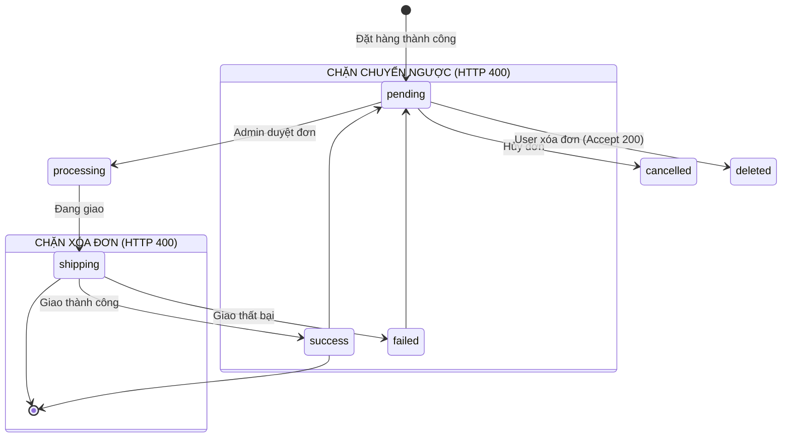
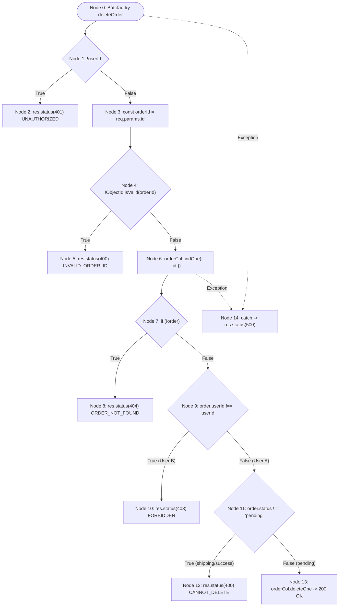

# Tổng kết Sprint 2

## Mục tiêu

- Hoàn thành việc viết unit test cho các controller liên quan đến cart và xây dựng cấu trúc test phù hợp trong backend.
- Chuẩn bị các tài liệu và script Postman để hỗ trợ kiểm thử và import dữ liệu trong môi trường phát triển.
- Hoàn thiện công việc trên nhánh phát triển Sprint 2 và ghi nhận kết quả thực hiện.

## Nội dung đã thực hiện

- Xây dựng và triển khai cấu trúc thư mục test cho backend, bao gồm các test unit và integration.
- Viết các test ban đầu cho logic và route liên quan đến cart.
- Chuẩn bị các file collection/environment Postman phục vụ việc kiểm thử API.
- Tạo nhánh phát triển cho Sprint 2 với tên Sp2-UnitTest.

## Kết quả đạt được

- Đã có nền tảng test ban đầu cho backend, đặc biệt là phần cart.
- Cấu trúc test đã được tổ chức rõ ràng và có thể mở rộng cho các module khác.
- Các script Postman đã được chuẩn bị sẵn để hỗ trợ kiểm thử thủ công.
- Công việc Sprint 2 đã được đẩy lên nhánh tương ứng.

## Kết quả chạy test

- Đã chạy lệnh: `npm test -- --runInBand`
- Kết quả thực tế:
  - Tổng số suite: 2
  - Suite pass: 1
  - Suite fail: 1
  - Tổng số test: 3
  - Test pass: 3
  - Test fail: 0 (vấn đề xảy ra ở mức khởi chạy suite do module mock auth không tìm thấy)
- Lỗi chính gặp phải: `Cannot find module '../../src/middleware/auth' from 'src/tests/integration/cart.route.test.ts'`

## Điểm nổi bật

- Đã thiết lập được khung test ban đầu cho backend, tạo tiền đề cho việc mở rộng sang các module khác.
- Việc chuẩn bị Postman và cấu trúc test giúp tăng khả năng kiểm thử và giảm thiểu rủi ro khi phát triển tiếp.
- Nhóm đã chủ động triển khai test ngay từ giai đoạn đầu của sprint.

## Hạn chế / hướng phát triển

- Cần sửa lại đường dẫn import và cấu hình mock cho middleware auth để test integration chạy ổn định.
- Nên mở rộng thêm test cho các controller còn lại như product, order và checkout.
- Cần bổ sung CI/CD hoặc script kiểm thử tự động để giảm phụ thuộc vào kiểm thử thủ công.

## Kết luận

- Sprint 2 đã đạt được mục tiêu cơ bản về việc thiết lập nền tảng unit test và chuẩn bị công cụ kiểm thử cho backend.
- Mặc dù còn tồn tại một lỗi cấu hình ở test integration, đây là vấn đề có thể khắc phục nhanh và sẽ giúp hệ thống test trở nên vững chắc hơn trong các sprint tiếp theo.

# 📄 BÁO CÁO KIỂM THỬ TÍNH NĂNG ORDER LIFECYCLE MANAGEMENT

---

## 🟢 PHẦN 1: PHÂN TÍCH THIẾT KẾ TEST CASE (BLACKBOX & WHITEBOX)

### 1.1. Phân tích Phân vùng tương đương (EP), Chuyển đổi trạng thái & Phân quyền

#### A. Phân tích Kiểm soát Quyền sở hữu Đơn hàng (Ownership Guard)

Lỗ hổng IDOR (Insecure Direct Object Reference) cho phép kẻ tấn công thay đổi tài nguyên của người dùng khác.

- **Phân vùng hợp lệ (Valid EP)**: `order.userId.toString() === req.user._id.toString()`.
- **Phân vùng vi phạm (Invalid EP)**: Khách hàng A truyền `:id` đơn hàng của Khách hàng B $\to$ **HTTP 403 Forbidden**.

#### B. Phân tích Quy tắc Chuyển đổi trạng thái (State Transition Rules)

Hệ thống đơn hàng là một **Máy trạng thái hữu hạn (Finite State Machine - FSM)**:
$$S = \{\text{pending}, \text{processing}, \text{shipping}, \text{success}, \text{failed}, \text{cancelled}\}$$

#### C. Phân tích Phân quyền Quản trị viên (Admin Role Guard)

- **User thường (`role = "user"`)**: Truy cập endpoint quản trị $\to$ **HTTP 403 Forbidden**.
- **Admin (`role = "admin"`)**: Truy cập endpoint quản trị $\to$ **HTTP 200 OK**.

#### D. Bảng Phân tích Phân vùng tương đương (EP) chi tiết cho Input

| Tham số / Thuộc tính        | Ràng buộc đặc tả (Specs)                               | Lớp hợp lệ (Valid EP)                                                   | Lớp không hợp lệ (Invalid EP)                          |
| :-------------------------- | :----------------------------------------------------- | :---------------------------------------------------------------------- | :----------------------------------------------------- |
| **`status`** (API Update)   | Chỉ chấp nhận các trạng thái định nghĩa sẵn trong Enum | `"pending", "processing", "shipping", "success", "failed", "cancelled"` | Rỗng (`""`), `null`, `"xyz_status"`, số nguyên (`123`) |
| **`status`** (API Lọc list) | Truyền query param filter theo trạng thái              | `"success", "pending", "failed"` (gán vào `filter.status`)              | Chuỗi rác (Bỏ qua filter, query toàn bộ DB)            |
| **`page`** (Phân trang)     | `parseInt(req.query.page) \|\| 1`                      | Số nguyên $> 0$ (vd: `page=2`)                                          | Bỏ trống $\to$ Tự động Fallback về trang `1`           |
| **`limit`** (Phân trang)    | `parseInt(req.query.limit) \|\| 10`                    | Số nguyên $> 0$ (vd: `limit=50`)                                        | Bỏ trống $\to$ Tự động Fallback về `10` item/trang     |

#### E. Bảng Phân tích Giá trị biên (BVA - Boundary Value Analysis) cho mã `orderId`

Toàn bộ hệ thống sử dụng kiểu dữ liệu `ObjectId` của MongoDB. Khối lệnh bảo vệ `ObjectId.isValid(orderId)` tạo ra các đường biên vật lý vô cùng khắt khe.

| Tham số       | Logic bảo vệ mã nguồn       | Giá trị biên kiểm thử (BVA)                             | Kết quả hành vi (Expected)                           |
| :------------ | :-------------------------- | :------------------------------------------------------ | :--------------------------------------------------- |
| **`orderId`** | Yêu cầu định dạng Hex chuẩn | **Biên dưới (23 ký tự):** `64a2b9a7...` (Thiếu 1 ký tự) | Lọt vào nhánh `if(!isValid)` $\to$ **HTTP 400**      |
|               | `orderId.length === 24`     | **Biên chuẩn (24 ký tự):** `64a2b9a7f...` (Chuẩn xác)   | Hợp lệ $\to$ Đi tiếp vào DB $\to$ **HTTP 200 / 404** |
|               | (Hệ thập lục phân)          | **Biên trên (25 ký tự):** `64a2b9a7f3...` (Dư 1 ký tự)  | Lọt vào nhánh `if(!isValid)` $\to$ **HTTP 400**      |

---

### 1.2. Danh mục Toàn bộ 33 Test Cases (Test Suite Catalog)

_(Được chuẩn hóa theo format ma trận kỹ thuật, hiển thị rõ Kỹ thuật thiết kế, Input Payload và DB Assertion)_

#### Bảng 1.2a: Phân hệ Blackbox Testing (Kiểm thử chức năng API - 24 TCs)

| Test Case ID             | Tên Test Case (Mục tiêu kiểm thử)                    | Kỹ thuật (EP/BVA)  | Input Payload / Request Details                                            | Expected Status | Expected Response / DB Assertion                                                | Trạng Thái Thực Thi |
| :----------------------- | :--------------------------------------------------- | :----------------- | :------------------------------------------------------------------------- | :-------------: | :------------------------------------------------------------------------------ | :------------------ |
| **TC_ORD_01**            | [Admin Guard] User thường truy cập route Admin       | EP (Role Guard)    | `GET /api/admin/orders` Header: `Bearer user_token`                     |     **403**     | `{ message: "Forbidden" }` Chặn tại Middleware                               | PASS (Postman)      |
| **TC_ORD_02**            | [Admin Guard] Admin truy cập route Admin             | EP (Role Guard)    | `GET /api/admin/orders` Header: `Bearer admin_token`                    |     **200**     | `{ success: true, orders: [...] }`                                              | PASS (Postman)      |
| **TC_ORD_03**            | [Ownership Guard] User A xóa đơn của User B          | EP (Security/IDOR) | `DELETE /api/orders/order_B_id` Header: `Bearer user_A_token`           |     **403**     | `{ errors: [{ message: "FORBIDDEN" }] }`                                        | PASS (Postman)      |
| **TC_ORD_04**            | [Valid Delete] User xóa đơn của mình khi `pending`   | EP (Valid State)   | `DELETE /api/orders/{pending_id}` Header: `Bearer user_A_token`         |     **200**     | `{ success: true, message: "Order deleted..." }` `deleteOne` được gọi        | PASS (Postman)      |
| **TC_ORD_05**            | [Invalid Delete] Xóa đơn trạng thái `shipping`       | EP (Invalid State) | `DELETE /api/orders/{shipping_id}`                                         |     **400**     | `{ errors: [{ message: "CANNOT_DELETE_ACTIVE_ORDER" }] }`                       | PASS (Postman)      |
| **TC_ORD_06**            | [Invalid Delete] Xóa đơn trạng thái `success`        | EP (Invalid State) | `DELETE /api/orders/{success_id}`                                          |     **400**     | `{ errors: [{ message: "CANNOT_DELETE_ACTIVE_ORDER" }] }`                       | PASS (Postman)      |
| **TC_ORD_07**            | [Valid Transition] Admin chuyển sang `processing`    | EP (Valid State)   | `PUT /api/admin/orders/{id}` Payload: `{ status: "processing" }`        |     **200**     | `{ success: true, message: "Order status updated..." }` `updateOne` được gọi | PASS (Postman)      |
| **TC_ORD_08**            | [Illegal Transition] Admin chuyển ngược từ `success` | BVA/EP (State)     | `PUT /api/admin/orders/{id}` Payload: `{ status: "pending" }`           |     **400**     | `{ errors: [{ message: "ILLEGAL_STATUS_TRANSITION" }] }`                        | PASS (Postman)      |
| **TC_ORD_09**            | [Illegal Transition] Admin chuyển ngược từ `failed`  | BVA/EP (State)     | `PUT /api/admin/orders/{id}` Payload: `{ status: "pending" }`           |     **400**     | `{ errors: [{ message: "ILLEGAL_STATUS_TRANSITION" }] }`                        | PASS (Postman)      |
| **TC_ORD_10**            | [Invalid Enum Status] Cập nhật status rác            | EP (Validation)    | `PUT /api/admin/orders/{id}` Payload: `{ status: "xyz_status" }`        |     **400**     | `{ errors: [{ message: "INVALID_STATUS" }] }`                                   | PASS (Postman)      |
| **TC_ORD_ADD_11**        | Admin lấy danh sách phân trang                       | EP (CRUD)          | `GET /api/admin/orders?page=1&limit=10` Mock: Có dữ liệu User tương ứng |     **200**     | Response map đúng thông tin user                                                | PASS (Postman)      |
| **TC_ORD_ADD_14**        | Admin update đơn không tồn tại                       | EP (Error Guard)   | `PUT /api/admin/orders/fake_id`                                            |     **404**     | `{ error: "ORDER_NOT_FOUND" }`                                                  | PASS (Jest Auto)    |
| **TC_ORD_ADD_17**        | Admin xóa đơn hàng thành công                        | EP (CRUD)          | `DELETE /api/admin/orders/{id}`                                            |     **200**     | `{ success: true }` Gọi hàm `deleteOne`                                      | PASS (Postman)      |
| **TC_ORD_ADD_18**        | Admin xóa đơn không tồn tại                          | EP (Error Guard)   | `DELETE /api/admin/orders/fake_id`                                         |     **404**     | `{ error: "ORDER_NOT_FOUND" }`                                                  | PASS (Jest Auto)    |
| **TC_ORD_ADD_19**        | User lấy danh sách đơn filter theo trạng thái        | EP (CRUD Filter)   | `GET /api/orders?status=pending`                                           |     **200**     | Response chứa danh sách đơn pending                                             | PASS (Postman)      |
| **TC_ORD_ADD_20**        | User lấy danh sách đơn (không filter)                | EP (CRUD)          | `GET /api/orders`                                                          |     **200**     | Trả về tổng đơn hàng của User                                                   | PASS (Postman)      |
| **TC_ORD_ADD_22**        | User lấy chi tiết đơn hàng                           | EP (CRUD)          | `GET /api/orders/detail/{id}`                                              |     **200**     | Trả về Object chi tiết đơn hàng                                                 | PASS (Postman)      |
| **TC_ORD_ADD_26**        | User lấy chi tiết đơn không tồn tại                  | EP (Error Guard)   | `GET /api/orders/detail/fake_id`                                           |     **404**     | `{ error: "ORDER_NOT_FOUND" }`                                                  | PASS (Jest Auto)    |
| **TC_ORD_ADD_27**        | Delete với ID sai định dạng                          | BVA (Validation)   | `DELETE /api/orders/123xyz` (Không phải Hex 24)                            |     **400**     | `{ error: "INVALID_ORDER_ID" }`                                                 | PASS (Postman)      |
| **TC_ORD_ADD_28**        | User xóa đơn không tồn tại                           | EP (Error Guard)   | `DELETE /api/orders/64a2b9...` (ID hợp lệ nhưng rỗng DB)                   |     **404**     | `{ error: "ORDER_NOT_FOUND" }`                                                  | PASS (Postman)      |
| **TC_ORD_ADD_29**        | Tạo đơn hàng mới thành công                          | EP (CRUD)          | `POST /api/orders` Payload: `{ amount: 1000 }`                          |     **200**     | `{ success: true, orderId }` Gọi `insertOne`                                 | PASS (Postman)      |
| **TC_ORD_ADD_30_UNAUTH** | Lấy danh sách khi mất Token                          | EP (Auth)          | `GET /api/orders` Headers: Rỗng                                         |     **401**     | `{ error: "UNAUTHORIZED" }`                                                     | PASS (Jest Auto)    |
| **TC_ORD_ADD_31_UNAUTH** | Tạo đơn khi mất Token                                | EP (Auth)          | `POST /api/orders` Headers: Rỗng                                        |     **401**     | `{ error: "UNAUTHORIZED" }`                                                     | PASS (Jest Auto)    |
| **TC_ORD_ADD_32_UNAUTH** | Xóa đơn khi mất Token                                | EP (Auth)          | `DELETE /api/orders/{id}` Headers: Rỗng                                 |     **401**     | `{ error: "UNAUTHORIZED" }`                                                     | PASS (Jest Auto)    |

#### Bảng 1.2b: Phân hệ Whitebox Testing (Kiểm thử cấu trúc nội bộ - 9 TCs)

| Test Case ID      | Tên Test Case (Mục tiêu kiểm thử) | Kỹ thuật (Whitebox) | Input Payload / Setup Mock                                                 | Expected Status | Expected Response / Nhánh Code                                          |
| :---------------- | :-------------------------------- | :------------------ | :------------------------------------------------------------------------- | :-------------: | :---------------------------------------------------------------------- |
| **TC_ORD_ADD_12** | Phủ vòng lặp khi User rỗng        | Nullish Injection   | `GET /api/admin/orders` Mock DB: `userCol.find` rỗng                    |     **200**     | Trả về `user: null` Phủ fallback `user ? ... : null`                 |
| **TC_ORD_ADD_13** | Phủ toán tử `?? 0` (Admin)        | Data Anomaly        | `GET /api/admin/orders` Mock DB: Khuyết `finalPrice`                    |     **200**     | Trả về `amount: totalPrice` Phủ `o.finalPrice ?? ...`                |
| **TC_ORD_ADD_15** | Kiểm tra lỗi Concurrency          | Mock DB Error       | `PUT /api/admin/orders/{id}` Mock: `updateOne` $\to$ `modifiedCount: 0` |     **400**     | `{ error: "ORDER_NOT_UPDATED" }` Phủ `if (modifiedCount === 0)`      |
| **TC_ORD_ADD_16** | Phủ lỗi Type Casting ID           | Data Injection      | `PUT /api/admin/orders/{id}` Input: `orderId` sai Type                  |     **404**     | `{ error: "ORDER_NOT_FOUND" }` Tự ép sang query theo `orderId` chuỗi |
| **TC_ORD_ADD_21** | Phủ toán tử `?? 0` (User)         | Data Anomaly        | `GET /api/orders` Mock DB: Khuyết `finalPrice`                          |     **200**     | Trả về `amount: 0` Phủ nhánh fallback `?? 0`                         |
| **TC_ORD_ADD_23** | Phủ chuẩn hóa chuỗi String        | Type Reflection     | `GET /api/orders/detail/{id}` Mock: `status` lưu dạng chuỗi             |     **200**     | Trả ra trạng thái chuẩn Phủ `typeof status === 'string'`             |
| **TC_ORD_ADD_24** | Phủ chuẩn hóa Value Object        | Object Reflection   | `GET /api/orders/detail/{id}` Mock: `status` là `{ value: "pending" }`  |     **200**     | Trả ra `pending` Phủ nhánh trả về `status.value`                     |
| **TC_ORD_ADD_25** | Phủ Switch-case Default           | Data Mutation       | `GET /api/orders/detail/{id}` Mock: `status` là Number/Null             |     **200**     | Rơi vào Default $\to$ Trả ra `pending`                                  |
| **TC_ORD_ADD_33** | Kích hoạt bắt block `catch`       | Exception Throwing  | Bất kỳ API Order nào Mock: ném `Error("DB Down")`                       |     **500**     | `{ error: "INTERNAL_SERVER_ERROR" }` Nhảy vào block `catch (error)`  |

---

## 🟢 PHẦN 2: PHÂN TÍCH ĐỒ THỊ DÒNG ĐIỀU KHIỂN & SỐ LƯỢNG TEST CASE TỐI ƯU

### 2.1. Đồ thị CFG cho hàm `deleteOrder`

- **Độ phức tạp Cyclomatic $V(G)$**: $P = 5$ (Node 1, 4, 7, 9, 11) + 1 Exception handler = 6. Vậy $V(G) = 6 + 1 = 7$.

---

### 2.2. Số lượng Test Case định lượng cho 100% Statement Coverage

**Câu hỏi:** Cần chạy bao nhiêu test case (và là những test case nào) để đạt 100% Statement Coverage?

**Trả lời:** Từ tổng số 33 Test Case, ta cần lọc ra **Tập tối thiểu gồm 14 Test Cases** để mọi dòng lệnh trong module `order.controller.ts` được thực thi ít nhất một lần.

**Bảng Danh sách Test Cases bắt buộc phải chạy để phủ kín Statements:**

|  STT   | Test Case ID            | Mục đích bao phủ (Statement Target)                    | Mã nguồn được kích hoạt trong `order.controller.ts`                       |
| :----: | :---------------------- | :----------------------------------------------------- | :------------------------------------------------------------------------ |
| **1**  | **TC_ORD_01, 02**       | Phủ lệnh gọi Guard kiểm duyệt Token Admin              | Middleware chạy trước Controller, cho đi tiếp vào các hàm `...ForAdmin`   |
| **2**  | **TC_ORD_04, 07**       | Phủ lệnh ghi CSDL của User và Admin (Happy Path)       | Gọi `orderCol.deleteOne`, `updateOne` và trả `200 OK`                     |
| **3**  | **TC_ORD_ADD_11**       | Phủ đoạn code `map` gộp Object User cho Admin          | Dòng code chứa `userMap.get(...)` (Từ L31-40)                             |
| **4**  | **TC_ORD_10**           | Phủ lệnh kiểm tra trạng thái mảng `includes`           | Khối chặn if `!validStatuses.includes(status)` $\to$ `400 INVALID_STATUS` |
| **5**  | **TC_ORD_ADD_19**       | Phủ lệnh gán `filter.status` ở list đơn hàng User      | Nhánh `if (["success", "pending"...].includes(rawStatus))` (L167)         |
| **6**  | **TC_ORD_ADD_22**       | Phủ cấu trúc hàm `normalizeStatus`                     | Dòng code gán thuộc tính Object: `status: normalizeStatus(...)` (L226)    |
| **7**  | **TC_ORD_ADD_27**       | Phủ lệnh check định dạng `ObjectId.isValid`            | Lệnh ném lỗi `res.status(400) INVALID_ORDER_ID` (L276)                    |
| **8**  | **TC_ORD_03**           | Phủ nhánh chống lỗ hổng BOLA / IDOR                    | Cấu trúc `if (order.userId !== userId) -> 403 FORBIDDEN` (L290)           |
| **9**  | **TC_ORD_05**           | Phủ khối bảo vệ đơn hàng đang chạy (Active Order)      | Lệnh `return 400 CANNOT_DELETE_ACTIVE_ORDER` (L297)                       |
| **10** | **TC_ORD_ADD_14, 28**   | Phủ lệnh kiểm tra null của Database `!order`           | Các nhánh `if (!order) return 404 ORDER_NOT_FOUND`                        |
| **11** | **TC_ORD_ADD_29**       | Phủ luồng tạo đơn hàng mới của hàm `createOrder`       | Lệnh `insertOne` và trả về `200 OK` (L241-260)                            |
| **12** | **TC_ORD_ADD_33_CATCH** | Kích hoạt bắt buộc mọi lệnh `console.error` và bẫy 500 | Quét qua tất cả 6 khối `catch (error)` trong Controller                   |

---

### 2.3. Số lượng Test Case định lượng cho 100% Branch Coverage (Độ phủ nhánh)

**Câu hỏi:** Cần chạy bao nhiêu test case (và là những test case nào) để đạt 100% Branch Coverage?

**Trả lời:** Branch Coverage đòi hỏi khắt khe hơn: mọi câu lệnh rẽ nhánh (`if`, `||`, `&&`, fallback `??`) phải được chạy đủ 2 luồng True và False. Tổng cộng cần **18 Test Cases** (gồm 14 test Statement + 4 test bổ sung).

**Bảng Ma trận các nhánh điều kiện bảo đảm 100% Branch Coverage:**

|  STT   | Cấu trúc rẽ nhánh trong mã nguồn                                                           | Nhánh True (T)                               | Nhánh False (F)                       | Test Case phủ nhánh True | Test Case phủ nhánh False |
| :----: | :----------------------------------------------------------------------------------------- | :------------------------------------------- | :------------------------------------ | :----------------------- | :------------------------ |
| **1**  | `if (!validStatuses.includes(status))`                                                     | Trạng thái rác $\to$ Báo 400                 | Trạng thái đúng $\to$ Đi tiếp         | **TC_ORD_10**            | **TC_ORD_07**             |
| **2**  | `if (!order)` (Admin update)                                                               | Truy vấn rỗng $\to$ Báo 404                  | Có đơn hàng $\to$ Bắt đầu xử lý       | **TC_ORD_ADD_14**        | **TC_ORD_07**             |
| **3**  | `if ((order.status === "success" \|\| order.status === "failed") && status === "pending")` | Vi phạm State Machine $\to$ Báo 400          | Chuyển luồng hợp lệ $\to$ Cho đi tiếp | **TC_ORD_08, 09**        | **TC_ORD_07**             |
| **4**  | `if (result.modifiedCount === 0)`                                                          | Lỗi Concurrency $\to$ Báo 400                | DB thực thi ghi đè tốt $\to$ 200      | **TC_ORD_ADD_15**        | **TC_ORD_07**             |
| **5**  | `if (!userId)` (Bảo vệ API User)                                                           | Không có Token $\to$ Báo lỗi 401             | Có đủ Token $\to$ Tiếp tục tìm DB     | **TC_ORD_ADD_30**        | **TC_ORD_ADD_19**         |
| **6**  | `if (["success", "pending"...].includes(rawStatus))`                                       | Có truyền filter chuẩn $\to$ Gán biến filter | Không filter $\to$ Bỏ qua             | **TC_ORD_ADD_19**        | **TC_ORD_ADD_20**         |
| **7**  | `if (!ObjectId.isValid(orderId))`                                                          | ID truyền vào chuỗi bậy $\to$ Báo 400        | Format Hex chuẩn 24 $\to$ Query       | **TC_ORD_ADD_27**        | **TC_ORD_04**             |
| **8**  | `if (order.userId.toString() !== userId.toString())`                                       | Đơn thuộc User khác $\to$ Báo 403 IDOR       | Đúng chủ nhân $\to$ Cho đi tiếp       | **TC_ORD_03**            | **TC_ORD_04**             |
| **9**  | `if (order.status !== "pending")`                                                          | Đang giao/xong $\to$ Cấm xóa 400             | Đang chờ $\to$ Cho phép xóa           | **TC_ORD_05, 06**        | **TC_ORD_04**             |
| **10** | Toán tử `o.finalPrice ?? o.totalPrice ?? 0`                                                | Trường `finalPrice` rỗng $\to$ lấy Fallback  | Đã có giá trị chuẩn $\to$ Bỏ qua      | **TC_ORD_ADD_13, 21**    | **TC_ORD_02, 19**         |
| **11** | `try { ... } catch (error)` trên 6 routes                                                  | Lỗi đứt cáp DB $\to$ Bay vào 500             | Luồng chạy tốt $\to$ 200              | **TC_ORD_ADD_33**        | **TC_ORD_04, 07**         |

---

## 🟢 PHẦN 3: TƯ DUY ĐÁNH GIÁ PHƯƠNG PHÁP LUẬN (METHODOLOGY EVALUATION)

_Mục tiêu: Đánh giá xem áp dụng phương pháp BVA/EP có tự động đảm bảo 100% độ phủ Statement/Branch hay không, và xem bộ test đó có thừa/thiếu gì khi map sang cấu trúc code._

### 3.1. Sự thật: BVA/EP có tự động đảm bảo 100% Coverage không?

**Kết luận khẳng định: HOÀN TOÀN KHÔNG!**

Phương pháp BVA/EP hoàn toàn dựa trên tư duy **Hộp Đen (Blackbox)** - nhìn vào tài liệu đặc tả (Specs) để thiết kế kịch bản. Khi đem bộ 24 test case Blackbox ốp vào chạy trên Source Code, độ phủ thường bị kẹt ở mức **75% - 85%**. Lý do là phương pháp này gặp phải vấn đề **vừa Thừa lại vừa Thiếu** khi ánh xạ vào kiến trúc nội bộ của lập trình viên.

### 3.2. Đánh giá "Cái THIẾU" của BVA/EP khi map sang Code

Bộ BVA/EP được thiết kế dưới giả định "Hạ tầng lý tưởng" nên không thể kích hoạt được các logic phòng ngự (Defensive Programming) do Developer viết ra:

- **Thiếu nhánh Catch Block (Lỗi hạ tầng):** Kịch bản BVA/EP mong đợi nhập input sai thì HTTP trả về 400. Nhưng không có tài liệu BA nào yêu cầu: _"Làm sập kết nối MongoDB đột ngột để sinh ra HTTP 500"_. Do đó, lệnh rẽ nhánh `catch(error)` mãi mãi bị bỏ sót.
- **Thiếu nhánh Fallback dữ liệu ngầm:** Trong code có nhánh `order.finalPrice ?? 0` để đề phòng DB cũ bị khuyết dữ liệu. Kịch bản BVA không bao giờ kích hoạt được luồng True của nhánh này vì giả định DB luôn hoàn hảo.
- **Thiếu nhánh Race Condition:** BVA/EP không thể thiết kế được kịch bản mô phỏng 2 Admin cùng lúc nhấn nút cập nhật 1 đơn hàng (`modifiedCount === 0`).

$\implies$ **Giải pháp bù đắp**: Bắt buộc phải kết hợp **Whitebox Testing** (Sử dụng Mocking Data & Throw Error trong RAM) để chọc thẳng vào các điểm mù kỹ thuật này.

### 3.3. Đánh giá "Cái THỪA" của BVA/EP khi map sang Code

Ngược lại, khi map sang cấu trúc mã nguồn, bộ test BVA/EP lại sinh ra sự **Thừa thãi (Redundant)** và trùng lặp (Overlap):

- **Ví dụ kinh điển:** Dựa trên phân tích State Machine (EP), QA viết 2 Test Cases Hộp đen cho quy tắc "Không được chuyển ngược trạng thái":
  - Kịch bản 1 (TC_08): Cố chuyển từ `success` -> `pending` (Báo 400).
  - Kịch bản 2 (TC_09): Cố chuyển từ `failed` -> `pending` (Báo 400).
- **Phân tích dưới góc nhìn Code (Whitebox):** Ở dưới backend, Developer gộp chung hai trường hợp đó vào đúng 1 dòng if duy nhất:
  `if (["success", "failed"].includes(order.status)) return res.status(400)`
- **Hậu quả:** Khi chạy Kịch bản 1, nhánh code trên đã đạt 100% Coverage. Khi chạy tiếp Kịch bản 2, Kịch bản 2 trở nên **thừa thãi hoàn toàn** về mặt độ phủ code. Đây là minh chứng cho việc số lượng Test Case Hộp đen lớn chưa chắc đã mang lại hiệu quả đo lường cao hơn.

### 3.4. Tổng kết Triết lý Kiểm thử

Qua việc thực nghiệm trên module Order, có thể rút ra kết luận cốt lõi:

1. **BVA/EP (Blackbox) là ĐIỀU KIỆN CẦN**: Cực kỳ thiết yếu để đảm bảo phần mềm chạy đúng nghiệp vụ kinh doanh, bảo vệ an toàn cho User. Tuy nhiên, nó là chưa đủ vì bỏ lọt điểm mù hạ tầng.
2. **Structural Testing (Whitebox) là ĐIỀU ĐIỀU KIỆN ĐỦ**: Đóng vai trò "chiếc chổi" quét sạch các "góc tối" của mã nguồn (nhánh catch, toán tử dự phòng), nhưng lại xa rời hành vi của User thật.
3. $\implies$ **Phương pháp toàn vẹn nhất**: Lấy **BVA/EP làm bộ khung xương sống** (tạo base case), sau đó dùng công cụ đo lường Coverage soi chiếu vào Code để phát hiện điểm mù, và cuối cùng dùng **Whitebox lấp đầy cái thiếu, cắt tỉa cái thừa**. Sự đan xen này chính là nghệ thuật tạo nên bộ Unit Test đạt mức tuyệt đối 100% Coverage nhưng vẫn tinh gọn.

"import request from "supertest";
import app from "../app";
import jwt from "jsonwebtoken";
import { orderCollection } from "../models/order.model";
import { userCollection } from "../models/user.model";

// ============================================================================
// MOCKING MODULES & DATABASE
// ============================================================================
jest.mock("jsonwebtoken", () => ({
verify: jest.fn(),
}));

jest.mock("../models/order.model", () => ({
orderCollection: { getCollection: jest.fn() },
}));

jest.mock("../models/user.model", () => ({
userCollection: { getCollection: jest.fn() },
}));

describe("SCRUM - 27: Order State Machine Enforcement & Admin Control Security Test Suite", () => {
let mockOrderCollection: any;
let mockUserCollection: any;

const normalUserId = "507f1f77bcf86cd799439011";
const otherUserId = "507f1f77bcf86cd799439099";
const adminUserId = "507f1f77bcf86cd799439088";

// MongoDB ObjectId hợp lệ (24 ký tự hex)
const validOrderId1 = "650c5d1f1f77bcf86cd79001";
const validOrderId2 = "650c5d1f1f77bcf86cd79002";
const validOrderId3 = "650c5d1f1f77bcf86cd79003";
const validOrderId4 = "650c5d1f1f77bcf86cd79004";

const normalUserToken = "Bearer mock_normal_user_jwt_token";
const adminUserToken = "Bearer mock_admin_user_jwt_token";

beforeEach(() => {
jest.clearAllMocks();

    mockOrderCollection = {
      find: jest.fn().mockReturnThis(),
      sort: jest.fn().mockReturnThis(),
      skip: jest.fn().mockReturnThis(),
      limit: jest.fn().mockReturnThis(),
      toArray: jest.fn().mockResolvedValue([]),
      findOne: jest.fn(),
      updateOne: jest.fn().mockResolvedValue({ modifiedCount: 1 }),
      deleteOne: jest.fn().mockResolvedValue({ deletedCount: 1 }),
      countDocuments: jest.fn().mockResolvedValue(0),
    };

    mockUserCollection = {
      find: jest.fn().mockReturnThis(),
      toArray: jest.fn().mockResolvedValue([]),
    };

    (orderCollection.getCollection as jest.Mock).mockResolvedValue(
      mockOrderCollection,
    );
    (userCollection.getCollection as jest.Mock).mockResolvedValue(
      mockUserCollection,
    );

    // Mock JWT decode
    (jwt.verify as jest.Mock).mockImplementation((token: string) => {
      if (token === "mock_admin_user_jwt_token") {
        return { _id: adminUserId, email: "admin@example.com", role: "admin" };
      }
      return { _id: normalUserId, email: "user@example.com", role: "user" };
    });

});

// ============================================================================
// 1. AUTHORIZATION GUARDS & ADMIN SECURITY
// ============================================================================
describe("Authorization Guards - User Ownership & Admin Only Rules", () => {
it("TC_ORDER_AUTH_01: [Admin Guard] User thường không phải Admin truy cập GET /api/orders/admin -> Reject 403 FORBIDDEN_ADMIN_ONLY", async () => {
const response = await request(app)
.get("/api/admin/orders")
.set("Authorization", normalUserToken);

      expect(response.status).toBe(403);
      expect(response.body).toEqual({
        success: false,
        errors: expect.arrayContaining([
          expect.objectContaining({
            message: expect.stringMatching(/FORBIDDEN_ADMIN_ONLY|FORBIDDEN/i),
          }),
        ]),
      });
    });

    it("TC_ORDER_AUTH_02: [Admin Guard] Admin truy cập GET /api/orders/admin -> Accept 200", async () => {
      const response = await request(app)
        .get("/api/admin/orders")
        .set("Authorization", adminUserToken);

      expect(response.status).toBe(200);
    });

    it("TC_ORDER_AUTH_03: [Ownership Guard] User A cố tình xóa đơn hàng của User B (userId !== req.user._id) -> Reject 403 FORBIDDEN", async () => {
      mockOrderCollection.findOne.mockResolvedValue({
        _id: validOrderId1,
        orderId: "PAY999999",
        userId: otherUserId, // Thuộc về User B
        status: "pending",
      });

      const response = await request(app)
        .delete(`/api/orders/${validOrderId1}`)
        .set("Authorization", normalUserToken); // User A gọi API

      expect(response.status).toBe(403);
      expect(response.body).toEqual({
        success: false,
        errors: expect.arrayContaining([
          expect.objectContaining({
            message: expect.stringMatching(/FORBIDDEN|UNAUTHORIZED/i),
          }),
        ]),
      });
    });

});

// ============================================================================
// 2. ORDER DELETION GUARD & POLICY
// ============================================================================
describe("DELETE /api/orders/:id - Order Deletion Status Guard", () => {
it("TC_ORDER_DEL_04: [Valid Delete] User xóa đơn hàng của chính mình khi status === 'pending' -> Accept 200", async () => {
mockOrderCollection.findOne.mockResolvedValue({
\_id: validOrderId1,
orderId: "PAY111111",
userId: normalUserId,
status: "pending",
});

      const response = await request(app)
        .delete(`/api/orders/${validOrderId1}`)
        .set("Authorization", normalUserToken);

      expect(response.status).toBe(200);
    });

    it("TC_ORDER_DEL_05: [Invalid Delete Active] Đơn hàng đang ở trạng thái 'shipping' -> Reject 400 CANNOT_DELETE_ACTIVE_ORDER", async () => {
      mockOrderCollection.findOne.mockResolvedValue({
        _id: validOrderId2,
        orderId: "PAY222222",
        userId: normalUserId,
        status: "shipping",
      });

      const response = await request(app)
        .delete(`/api/orders/${validOrderId2}`)
        .set("Authorization", normalUserToken);

      expect(response.status).toBe(400);
      expect(response.body).toEqual({
        success: false,
        errors: expect.arrayContaining([
          expect.objectContaining({
            message: expect.stringMatching(
              /CANNOT_DELETE_ACTIVE_ORDER|Order cannot be deleted/i,
            ),
          }),
        ]),
      });
    });

    it("TC_ORDER_DEL_06: [Invalid Delete Active] Đơn hàng đã ở trạng thái 'success' -> Reject 400 CANNOT_DELETE_ACTIVE_ORDER", async () => {
      mockOrderCollection.findOne.mockResolvedValue({
        _id: validOrderId3,
        orderId: "PAY333333",
        userId: normalUserId,
        status: "success",
      });

      const response = await request(app)
        .delete(`/api/orders/${validOrderId3}`)
        .set("Authorization", normalUserToken);

      expect(response.status).toBe(400);
      expect(response.body.success).toBe(false);
      expect(response.body.errors).toBeDefined();
    });

});

// ============================================================================
// 3. ORDER STATE MACHINE & TRANSITION RULES
// ============================================================================
describe("PUT /api/admin/orders/:id - Status Transitions (State Machine)", () => {
it("TC_ORDER_STATE_07: [Valid Transition] Admin chuyển trạng thái từ 'pending' sang 'processing' / 'shipping' / 'success' -> Accept 200", async () => {
const validTransitions = ["processing", "shipping", "success"];

      for (const newStatus of validTransitions) {
        mockOrderCollection.findOne.mockResolvedValue({
          _id: validOrderId4,
          orderId: "PAY444444",
          status: "pending",
        });

        const response = await request(app)
          .put(`/api/admin/orders/${validOrderId4}`)
          .set("Authorization", adminUserToken)
          .send({ status: newStatus });

        expect(response.status).toBe(200);
      }
    });

    it("TC_ORDER_STATE_08: [Illegal Transition] Admin chuyển ngược từ 'success' về 'pending' -> Reject 400 ILLEGAL_STATUS_TRANSITION", async () => {
      mockOrderCollection.findOne.mockResolvedValue({
        _id: validOrderId4,
        orderId: "PAY555555",
        status: "success",
      });

      const response = await request(app)
        .put(`/api/admin/orders/${validOrderId4}`)
        .set("Authorization", adminUserToken)
        .send({ status: "pending" });

      expect(response.status).toBe(400);
      expect(response.body).toEqual({
        success: false,
        errors: expect.arrayContaining([
          expect.objectContaining({
            message: expect.stringMatching(
              /ILLEGAL_STATUS_TRANSITION|INVALID_STATUS/i,
            ),
          }),
        ]),
      });
    });

    it("TC_ORDER_STATE_09: [Illegal Transition] Admin chuyển ngược từ 'failed' về 'pending' -> Reject 400 ILLEGAL_STATUS_TRANSITION", async () => {
      mockOrderCollection.findOne.mockResolvedValue({
        _id: validOrderId4,
        orderId: "PAY666666",
        status: "failed",
      });

      const response = await request(app)
        .put(`/api/admin/orders/${validOrderId4}`)
        .set("Authorization", adminUserToken)
        .send({ status: "pending" });

      expect(response.status).toBe(400);
      expect(response.body.success).toBe(false);
      expect(response.body.errors).toBeDefined();
    });

    it("TC_ORDER_STATE_10: [Invalid Enum Status] Truyền status không thuộc Enum ('unknown_status', '') -> Reject 400 INVALID_STATUS", async () => {
      mockOrderCollection.findOne.mockResolvedValue({
        _id: validOrderId4,
        orderId: "PAY777777",
        status: "pending",
      });

      const response = await request(app)
        .put(`/api/admin/orders/${validOrderId4}`)
        .set("Authorization", adminUserToken)
        .send({ status: "invalid_status_value" });

      expect(response.status).toBe(400);
      expect(response.body).toEqual({
        success: false,
        errors: expect.arrayContaining([
          expect.objectContaining({
            message: expect.stringMatching(/INVALID_STATUS/i),
          }),
        ]),
      });
    });

});

// ============================================================================
// 4. ADDITIONAL COVERAGE TESTS FOR 100% STATEMENTS & BRANCHES
// ============================================================================
describe("Additional Coverage Tests", () => {
it("TC_ORD_ADD_11: [getOrderForAdmin] Trả về danh sách và map thông tin user", async () => {
mockOrderCollection.countDocuments.mockResolvedValueOnce(1);
mockOrderCollection.toArray.mockResolvedValueOnce([
{
_id: validOrderId1,
orderId: "PAY123",
userId: normalUserId,
status: "pending",
finalPrice: 100,
createdAt: new Date(),
paymentMethod: "Credit Card",
},
]);
mockUserCollection.toArray.mockResolvedValueOnce([
{
_id: normalUserId,
name: "Test User",
email: "user@example.com",
},
]);

      const response = await request(app)
        .get("/api/admin/orders?page=1&limit=10")
        .set("Authorization", adminUserToken);

      expect(response.status).toBe(200);
      expect(response.body.success).toBe(true);
      expect(response.body.orders[0].user).toEqual({
        fullName: "Test User",
        email: "user@example.com",
      });
      expect(response.body.pagination).toBeDefined();
    });

    it("TC_ORD_ADD_12: [getOrderForAdmin] Trả về danh sách, có user rỗng (branch user ? ... : null)", async () => {
      mockOrderCollection.countDocuments.mockResolvedValueOnce(1);
      mockOrderCollection.toArray.mockResolvedValueOnce([
        {
          _id: validOrderId1,
          orderId: "PAY123",
          userId: null,
          status: "pending",
          totalPrice: 200,
          createdAt: new Date(),
          paymentMethod: "Credit Card",
        },
      ]);
      mockUserCollection.toArray.mockResolvedValueOnce([]);

      const response = await request(app)
        .get("/api/admin/orders?page=1&limit=10")
        .set("Authorization", adminUserToken);

      expect(response.status).toBe(200);
      expect(response.body.orders[0].user).toBeNull();
      expect(response.body.orders[0].amount).toBe(200);
    });

    it("TC_ORD_ADD_13: [getOrderForAdmin] Trả về danh sách, không có finalPrice và totalPrice -> 0", async () => {
      mockOrderCollection.countDocuments.mockResolvedValueOnce(1);
      mockOrderCollection.toArray.mockResolvedValueOnce([
        {
          _id: validOrderId1,
          orderId: "PAY123",
          userId: null,
          status: "pending",
          createdAt: new Date(),
          paymentMethod: "Credit Card",
        },
      ]);
      mockUserCollection.toArray.mockResolvedValueOnce([]);

      const response = await request(app)
        .get("/api/admin/orders?page=1&limit=10")
        .set("Authorization", adminUserToken);

      expect(response.status).toBe(200);
      expect(response.body.orders[0].amount).toBe(0);
    });

    it("TC_ORD_ADD_14: [updateOrderForAdmin] Không tìm thấy đơn hàng cần update -> Reject 404", async () => {
      mockOrderCollection.findOne.mockResolvedValueOnce(null);

      const response = await request(app)
        .put(`/api/admin/orders/${validOrderId1}`)
        .set("Authorization", adminUserToken)
        .send({ status: "processing" });

      expect(response.status).toBe(404);
      expect(response.body.error).toBe("ORDER_NOT_FOUND");
    });

    it("TC_ORD_ADD_15: [updateOrderForAdmin] Cập nhật không thành công (modifiedCount === 0) -> Reject 400", async () => {
      mockOrderCollection.findOne.mockResolvedValueOnce({
        _id: validOrderId1,
        status: "pending",
      });
      mockOrderCollection.updateOne.mockResolvedValueOnce({ modifiedCount: 0 });

      const response = await request(app)
        .put(`/api/admin/orders/${validOrderId1}`)
        .set("Authorization", adminUserToken)
        .send({ status: "processing" });

      expect(response.status).toBe(400);
      expect(response.body.error).toBe("ORDER_NOT_UPDATED");
    });

    it("TC_ORD_ADD_16: [updateOrderForAdmin] Sử dụng orderId là string thay vì ObjectId 24 ký tự", async () => {
      mockOrderCollection.findOne.mockResolvedValueOnce({
        _id: validOrderId1,
        orderId: "PAY_STRING_ID",
        status: "pending",
      });
      mockOrderCollection.updateOne.mockResolvedValueOnce({ modifiedCount: 1 });

      const response = await request(app)
        .put(`/api/admin/orders/PAY_STRING_ID`)
        .set("Authorization", adminUserToken)
        .send({ status: "processing" });

      expect(response.status).toBe(200);
      expect(response.body.success).toBe(true);
    });

    it("TC_ORD_ADD_17: [deleteOrderForAdmin] Admin xóa đơn hàng thành công -> Accept 200", async () => {
      mockOrderCollection.findOne.mockResolvedValueOnce({
        orderId: "PAY123",
      });
      mockOrderCollection.deleteOne.mockResolvedValueOnce({ deletedCount: 1 });

      const response = await request(app)
        .delete("/api/admin/orders/PAY123")
        .set("Authorization", adminUserToken);

      expect(response.status).toBe(200);
      expect(response.body.success).toBe(true);
    });

    it("TC_ORD_ADD_18: [deleteOrderForAdmin] Admin xóa đơn hàng không tồn tại -> 404", async () => {
      mockOrderCollection.findOne.mockResolvedValueOnce(null);

      const response = await request(app)
        .delete("/api/admin/orders/PAY_NOT_FOUND")
        .set("Authorization", adminUserToken);

      expect(response.status).toBe(404);
    });

    it("TC_ORD_ADD_19: [getAllOrders] Lấy danh sách đơn hàng có filter status hợp lệ", async () => {
      mockOrderCollection.countDocuments.mockResolvedValueOnce(1);
      mockOrderCollection.toArray.mockResolvedValueOnce([
        {
          _id: validOrderId1,
          orderId: "PAY123",
          userId: normalUserId,
          status: "pending",
          finalPrice: 100,
          createdAt: new Date(),
          paymentMethod: "Credit Card",
          products: [],
        },
      ]);

      const response = await request(app)
        .get("/api/orders?status=pending")
        .set("Authorization", normalUserToken);

      expect(response.status).toBe(200);
      expect(response.body.orders.length).toBe(1);
    });

    it("TC_ORD_ADD_20: [getAllOrders] Lấy danh sách đơn hàng không có status filter hoặc status không hợp lệ", async () => {
      mockOrderCollection.countDocuments.mockResolvedValueOnce(1);
      mockOrderCollection.toArray.mockResolvedValueOnce([
        {
          _id: validOrderId1,
          orderId: "PAY123",
          userId: normalUserId,
          status: "pending",
          totalPrice: 150,
        },
      ]);

      const response = await request(app)
        .get("/api/orders?status=invalid_status")
        .set("Authorization", normalUserToken);

      expect(response.status).toBe(200);
      expect(response.body.orders[0].amount).toBe(150);
    });

    it("TC_ORD_ADD_21: [getAllOrders] Đơn hàng không có finalPrice và totalPrice -> 0", async () => {
      mockOrderCollection.countDocuments.mockResolvedValueOnce(1);
      mockOrderCollection.toArray.mockResolvedValueOnce([
        {
          _id: validOrderId1,
          orderId: "PAY123",
          userId: normalUserId,
          status: "pending",
        },
      ]);

      const response = await request(app)
        .get("/api/orders")
        .set("Authorization", normalUserToken);

      expect(response.status).toBe(200);
      expect(response.body.orders[0].amount).toBe(0);
    });

    it("TC_ORD_ADD_22: [getOrderById] Lấy chi tiết đơn hàng theo ID và chuẩn hóa status (state)", async () => {
      mockOrderCollection.findOne.mockResolvedValueOnce({
        orderId: "PAY123",
        status: { state: "processing" },
        finalPrice: 100,
        createdAt: new Date(),
        paymentMethod: "Credit Card",
        products: [],
        userId: normalUserId,
      });

      const response = await request(app)
        .get("/api/orders/PAY123")
        .set("Authorization", normalUserToken);

      expect(response.status).toBe(200);
      expect(response.body.order.status).toBe("processing");
    });

    it("TC_ORD_ADD_23: [getOrderById] Kiểm tra chuẩn hóa status - string", async () => {
      mockOrderCollection.findOne.mockResolvedValueOnce({
        orderId: "123",
        status: "success",
        totalPrice: 50,
      });
      const response = await request(app)
        .get("/api/orders/123")
        .set("Authorization", normalUserToken);
      expect(response.body.order.status).toBe("success");
      expect(response.body.order.amount).toBe(50);
    });

    it("TC_ORD_ADD_24: [getOrderById] Kiểm tra chuẩn hóa status - value object", async () => {
      mockOrderCollection.findOne.mockResolvedValueOnce({
        orderId: "123",
        status: { value: "failed" },
      });
      const response = await request(app)
        .get("/api/orders/123")
        .set("Authorization", normalUserToken);
      expect(response.body.order.status).toBe("failed");
    });

    it("TC_ORD_ADD_25: [getOrderById] Kiểm tra chuẩn hóa status - unknown -> pending", async () => {
      mockOrderCollection.findOne.mockResolvedValueOnce({
        orderId: "123",
        status: {},
      });
      const response = await request(app)
        .get("/api/orders/123")
        .set("Authorization", normalUserToken);
      expect(response.body.order.status).toBe("pending");
      expect(response.body.order.amount).toBe(0);
    });

    it("TC_ORD_ADD_26: [getOrderById] Lấy chi tiết đơn hàng theo ID không tồn tại -> 404", async () => {
      mockOrderCollection.findOne.mockResolvedValueOnce(null);

      const response = await request(app)
        .get("/api/orders/PAY123")
        .set("Authorization", normalUserToken);

      expect(response.status).toBe(404);
    });

    it("TC_ORD_ADD_27: [deleteOrder] Kiểm tra sai định dạng ObjectId -> Reject 400", async () => {
      const response = await request(app)
        .delete("/api/orders/invalid_id")
        .set("Authorization", normalUserToken);

      expect(response.status).toBe(400);
      expect(response.body.error).toBe("INVALID_ORDER_ID");
    });

    it("TC_ORD_ADD_28: [deleteOrder] Không tìm thấy đơn hàng trong DB -> Reject 404", async () => {
      mockOrderCollection.findOne.mockResolvedValueOnce(null);

      const response = await request(app)
        .delete(`/api/orders/${validOrderId1}`)
        .set("Authorization", normalUserToken);

      expect(response.status).toBe(404);
      expect(response.body.error).toBe("ORDER_NOT_FOUND");
    });

    it("TC_ORD_ADD_29: [createOrder] Tạo đơn hàng thành công -> 200 OK", async () => {
      const { createOrder } = require("../controllers/order.controller");
      mockOrderCollection.insertOne = jest
        .fn()
        .mockResolvedValueOnce({ insertedId: validOrderId1 });

      const req = {
        user: { _id: normalUserId },
        body: {
          orderId: "PAY123",
          amount: 100,
          paymentMethod: "Credit Card",
        },
      };
      const res = {
        status: jest.fn().mockReturnThis(),
        json: jest.fn(),
      };

      await createOrder(req as any, res as any);
      expect(res.status).toHaveBeenCalledWith(200);
      expect(res.json).toHaveBeenCalledWith(
        expect.objectContaining({ success: true, orderId: "PAY123" }),
      );
    });

    it("TC_ORD_ADD_30_UNAUTH: [getAllOrders] Kiểm tra mất userId -> 401", async () => {
      const { getAllOrders } = require("../controllers/order.controller");
      const req = {
        user: {}, // missing _id
        query: {},
      };
      const res = {
        status: jest.fn().mockReturnThis(),
        json: jest.fn(),
      };
      await getAllOrders(req as any, res as any);
      expect(res.status).toHaveBeenCalledWith(401);
    });

    it("TC_ORD_ADD_31_UNAUTH: [createOrder] Kiểm tra mất userId -> 400", async () => {
      const { createOrder } = require("../controllers/order.controller");
      const req = {
        user: {}, // missing _id
        body: { orderId: "PAY123" },
      };
      const res = {
        status: jest.fn().mockReturnThis(),
        json: jest.fn(),
      };
      await createOrder(req as any, res as any);
      expect(res.status).toHaveBeenCalledWith(400);
    });

    it("TC_ORD_ADD_32_UNAUTH: [deleteOrder] Kiểm tra mất userId -> 401", async () => {
      const { deleteOrder } = require("../controllers/order.controller");
      const req = {
        user: {}, // missing _id
        params: { id: validOrderId1 },
      };
      const res = {
        status: jest.fn().mockReturnThis(),
        json: jest.fn(),
      };
      await deleteOrder(req as any, res as any);
      expect(res.status).toHaveBeenCalledWith(401);
    });

    it("TC_ORD_ADD_33_CATCH_ERR: Kiểm tra block catch(error) ném lỗi 500", async () => {
      mockOrderCollection.find.mockImplementationOnce(() => {
        throw new Error("DB Connection Error");
      });
      const res1 = await request(app)
        .get("/api/orders")
        .set("Authorization", normalUserToken);
      expect(res1.status).toBe(500);

      mockOrderCollection.find.mockImplementationOnce(() => {
        throw new Error("DB Connection Error");
      });
      const res2 = await request(app)
        .get("/api/admin/orders")
        .set("Authorization", adminUserToken);
      expect(res2.status).toBe(500);

      mockOrderCollection.findOne.mockRejectedValueOnce(new Error("DB Error"));
      const res3 = await request(app)
        .put(`/api/admin/orders/${validOrderId1}`)
        .set("Authorization", adminUserToken)
        .send({ status: "processing" });
      expect(res3.status).toBe(500);

      mockOrderCollection.findOne.mockRejectedValueOnce(new Error("DB Error"));
      const res4 = await request(app)
        .delete("/api/admin/orders/PAY123")
        .set("Authorization", adminUserToken);
      expect(res4.status).toBe(500);

      mockOrderCollection.findOne.mockRejectedValueOnce(new Error("DB Error"));
      const res5 = await request(app)
        .get("/api/orders/PAY123")
        .set("Authorization", normalUserToken);
      expect(res5.status).toBe(500);

      mockOrderCollection.findOne.mockRejectedValueOnce(new Error("DB Error"));
      const res6 = await request(app)
        .delete(`/api/orders/${validOrderId1}`)
        .set("Authorization", normalUserToken);
      expect(res6.status).toBe(500);

      const { createOrder } = require("../controllers/order.controller");
      mockOrderCollection.insertOne = jest
        .fn()
        .mockRejectedValueOnce(new Error("DB Error"));

      const req = {
        user: { _id: normalUserId },
        body: { orderId: "123" },
      };
      const res = {
        status: jest.fn().mockReturnThis(),
        json: jest.fn(),
      };
      await createOrder(req as any, res as any);
      expect(res.status).toHaveBeenCalledWith(500);
    });

});
});
"
